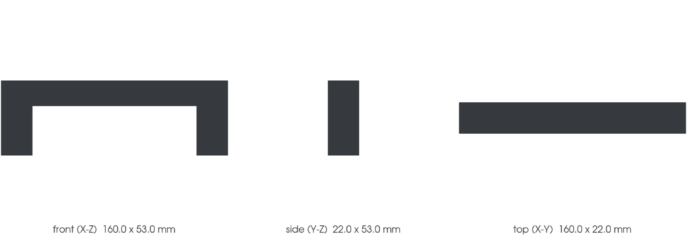

<!-- generated by scripts/render_part_pages.py - do not edit by hand -->

# Interior door pull handle

**Status: functional. No part is released; see [SAFETY.md](../../SAFETY.md).**

Handle gripped by hand to close the door from the inside. An ergonomic shape that calipers alone cannot describe, retained as the pilot of the phase 2 organic category, to be acquired by photogrammetry.

*Validation ladder of `catalog/schemas/part.schema.json`; this record is at `concept`.*

Catalogue record: [`catalog/parts/993-int-door-pull-0001.json`](../../catalog/parts/993-int-door-pull-0001.json)

## Identity

| field | value |
|---|---|
| identifier | 993-INT-DOOR-PULL-0001 |
| generation | 993 |
| variants | to_confirm_on_vehicle |
| model years | 1994 to 1998 |
| Porsche part numbers | not recorded |
| category | interior_trim |
| safety class | functional |
| intended use | Closing the door from the inside, repeated manual loading |

## Material and manufacturing

| field | value |
|---|---|
| preferred process | undecided |
| candidate processes | SLS, MJF, FFF |
| material family | polymer |
| grade | to_be_determined_after_load_test |
| standard | none |
| supplier requirements | not recorded |
| post-processing | surface smoothing, grip test |

## Geometry

| field | value |
|---|---|
| source type | estimated |
| master format | build123d |
| units | mm |
| accuracy (mm) | not recorded |

**Master file**

- [`scripts/build_993_concept_f0.py`](../../scripts/build_993_concept_f0.py)

**Derived files**

- [`parts/993-int-door-pull-0001/derived/door_pull_concept_f0.step`](../../parts/993-int-door-pull-0001/derived/door_pull_concept_f0.step)

## Images

*parts/993-int-door-pull-0001/media/preview.png*

*parts/993-int-door-pull-0001/media/views.png*

## Provenance and sources

| field | value |
|---|---|
| record license | MIT for the record, geometry not yet produced |

**Sources**

- [9xxteile - Porsche parts diagrams (PET exploded views)](https://www.9xxteile.com/en/pet/)
- [911uk - 993 interior plastics repair](https://911uk.com/porsche/993-interior-plastics-repair.134380/)

## Validation

| field | value |
|---|---|
| status | concept |
| vehicle tested | not recorded |
| reviewed by |  |
| limitations | not recorded |

**Evidence**

- none

---

*Page generated from the catalogue record by `scripts/render_part_pages.py`, checked by `make check`. Corrections go in the record, not here.*
