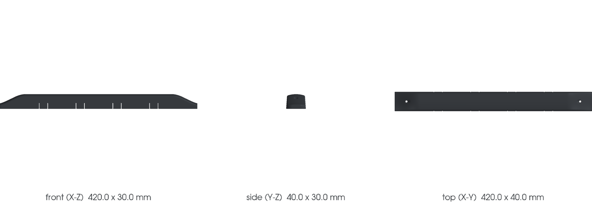

<!-- generated by scripts/render_part_pages.py - do not edit by hand -->

# Seat rail cover, outer side

**Status: non-critical. No part is released; see [SAFETY.md](../../SAFETY.md).**

Trim cover for the seat rail, existing in symmetrical left and right versions. Selected as the pilot for the symmetrical category of phase 2: a missing piece must be reconstructed from its counterpart and its surroundings.

```mermaid
flowchart LR
    L0["concept"]
    L1["dimensionally_reviewed"]
    L2["prototype_fitted"]
    L3["functionally_tested"]
    L4["engineering_reviewed"]
    L5["released"]
    L0 --> L1 --> L2 --> L3 --> L4 --> L5
    classDef here fill:#fff4d6,stroke:#b7791f,color:#1a1a1a,stroke-width:3px;
    classDef done fill:#e3f1e6,stroke:#2e7d32,color:#1a1a1a;
    classDef todo fill:#f4f4f4,stroke:#9e9e9e,color:#6b6b6b;
    classDef stop fill:#fde2e1,stroke:#c0392b,color:#1a1a1a;
    class L0 here
    class L1 todo
    class L2 todo
    class L3 todo
    class L4 todo
    class L5 todo
```

*Validation ladder of `catalog/schemas/part.schema.json`; this record is at `concept`.*

Catalogue record: [`catalog/parts/993-int-seat-rail-cover-0001.json`](../../catalog/parts/993-int-seat-rail-cover-0001.json)

## Identity

| field | value |
|---|---|
| identifier | 993-INT-SEAT-RAIL-COVER-0001 |
| generation | 993 |
| variants | to_confirm_on_vehicle |
| model years | 1994 to 1998 |
| Porsche part numbers | not recorded |
| category | interior_trim |
| safety class | non_critical |
| intended use | Trim for the seat rail, with no role in retaining the seat or the occupant |

## Material and manufacturing

| field | value |
|---|---|
| preferred process | FFF |
| candidate processes | FFF, SLS, MJF |
| material family | polymer |
| grade | to_be_determined_after_fit_test |
| standard | none |
| supplier requirements | not recorded |
| post-processing | deburring, check of the clearance with the seat rail |

## Geometry

| field | value |
|---|---|
| source type | estimated |
| master format | build123d |
| units | mm |
| accuracy (mm) | not recorded |

**Master file**

- [`scripts/build_993_concept_f0.py`](../../scripts/build_993_concept_f0.py)

**Derived files**

- [`parts/993-int-seat-rail-cover-0001/derived/seat_rail_cover_concept_f0.step`](../../parts/993-int-seat-rail-cover-0001/derived/seat_rail_cover_concept_f0.step)

## Images

*`parts/993-int-seat-rail-cover-0001/media/preview.png` — concept CAD block, **not** the original part, not a print file.*

*`parts/993-int-seat-rail-cover-0001/media/views.png` — concept CAD block, **not** the original part, not a print file.*

## Provenance and sources

| field | value |
|---|---|
| record license | All rights reserved (see LICENSE) for the record, geometry not yet produced |

**Sources**

- [9xxteile - Porsche parts diagrams (PET exploded views)](https://www.9xxteile.com/en/pet/)

## Validation

| field | value |
|---|---|
| status | concept |
| vehicle tested | not recorded |
| reviewed by |  |
| limitations | not recorded |

**Evidence**

- none

---

*Page generated from the catalogue record by `scripts/render_part_pages.py`, checked by `make check`. Corrections go in the record, not here.*
