<!-- generated by scripts/render_part_pages.py - do not edit by hand -->

# Bague aluminium de finition de commutateur, reconstruction F1

**Status: non-critical. No part is released; see [SAFETY.md](../../SAFETY.md).**

Switch trim ring, F1 reconstruction. The pilot served to validate the CAD chain, the LPBF screening and the confrontation with a real route; the latter concluded that the part must be turned in a 6xxx grade and not sintered. It is neither an OEM geometry nor a part authorized for fitting.

```mermaid
flowchart LR
    L0["concept"]
    L1["dimensionally_reviewed"]
    L2["prototype_fitted"]
    L3["functionally_tested"]
    L4["engineering_reviewed"]
    L5["released"]
    L0 --> L1 --> L2 --> L3 --> L4 --> L5
    classDef here fill:#fff4d6,stroke:#b7791f,color:#1a1a1a,stroke-width:3px;
    classDef done fill:#e3f1e6,stroke:#2e7d32,color:#1a1a1a;
    classDef todo fill:#f4f4f4,stroke:#9e9e9e,color:#6b6b6b;
    classDef stop fill:#fde2e1,stroke:#c0392b,color:#1a1a1a;
    class L0 here
    class L1 todo
    class L2 todo
    class L3 todo
    class L4 todo
    class L5 todo
```

*Validation ladder of `catalog/schemas/part.schema.json`; this record is at `concept`.*

Catalogue record: [`catalog/parts/993-int-switch-trim-ring-f1-0001.json`](../../catalog/parts/993-int-switch-trim-ring-f1-0001.json)

## Identity

| field | value |
|---|---|
| identifier | 993-INT-SWITCH-TRIM-RING-F1-0001 |
| generation | 993 |
| variants | 993_all_models_per_supplier_to_confirm |
| model years | 1994 to 1998 |
| Porsche part numbers | not recorded |
| category | interior_trim |
| safety class | non_critical |
| intended use | Reconstruction and LPBF/CNC comparison pilot, with no vehicle fitting at this stage |

## Material and manufacturing

| field | value |
|---|---|
| preferred process | CNC |
| candidate processes | LPBF, CNC |
| material family | 6000-series wrought aluminum |
| grade | EN AW-6063 T6 retained for bright anodizing; EN AW-6061 T6 as fallback if the turner refuses |
| standard | EN 755-2 for the bar; original grade still unidentified |
| supplier requirements | Material certificate and metallurgical temper of the bar, Tolerance actually held on the outer diameter, Anodizing thickness obtained and its scatter, Quote for 6061 T6 alongside, with what the appearance loses, Dimensional inspection of the four dimensions and the axial profile |
| post-processing | finish turning, target Ra 0.8 µm on visible faces, edge chamfers or radii to be decided, then added to the model, clear decorative sulfuric anodizing, layer growth to be subtracted from the fit dimension |

## Geometry

| field | value |
|---|---|
| source type | estimated |
| master format | build123d |
| units | mm |
| accuracy (mm) | not recorded |

**Master file**

- [`parts/993-int-switch-trim-ring-f1-0001/source/switch_trim_ring.py`](../../parts/993-int-switch-trim-ring-f1-0001/source/switch_trim_ring.py)

**Derived files**

- [`parts/993-int-switch-trim-ring-f1-0001/derived/switch_trim_ring_f1.step`](../../parts/993-int-switch-trim-ring-f1-0001/derived/switch_trim_ring_f1.step)
- [`parts/993-int-switch-trim-ring-f1-0001/derived/switch_trim_ring_f1.stl`](../../parts/993-int-switch-trim-ring-f1-0001/derived/switch_trim_ring_f1.stl)

## Provenance and sources

| field | value |
|---|---|
| record license | MIT for the script and the record; no third-party media or model redistributed |

**Sources**

- [Oldtimer-Ersatzteile24 - Switch trim ring 911/964/993](https://oldtimer-ersatzteile24.de/alu-zierring-decorring-fuer-porsche-911-964-993-armaturenbrett-eq850101)
- [EOS Aluminium AlSi10Mg material data sheet](https://www.eos.info/metal-solutions/metal-materials/data-sheets/mds-eos-aluminium-alsi10mg)

## Validation

| field | value |
|---|---|
| status | concept |
| vehicle tested | not recorded |
| reviewed by |  |
| limitations | not recorded |

**Evidence**

- [`catalog/sources/src-oldtimer-ersatzteile24-993-switch-ring-dimensions.json`](../../catalog/sources/src-oldtimer-ersatzteile24-993-switch-ring-dimensions.json)
- [`parts/993-int-switch-trim-ring-f1-0001/evidence/geometry-screen.json`](../../parts/993-int-switch-trim-ring-f1-0001/evidence/geometry-screen.json)
- [`twins/993-switch-trim-ring-f1/evidence/turning-f1/993-int-switch-trim-ring-f1-0001-turning-route-card.json`](../../twins/993-switch-trim-ring-f1/evidence/turning-f1/993-int-switch-trim-ring-f1-0001-turning-route-card.json)

## Design dossiers

- [993_SOURCING_CHINE_LPBF](../../docs/993/993_SOURCING_CHINE_LPBF.md)
- [993_SWITCH_TRIM_RING_F1](../../docs/993/993_SWITCH_TRIM_RING_F1.md)

---

*Page generated from the catalogue record by `scripts/render_part_pages.py`, checked by `make check`. Corrections go in the record, not here.*
