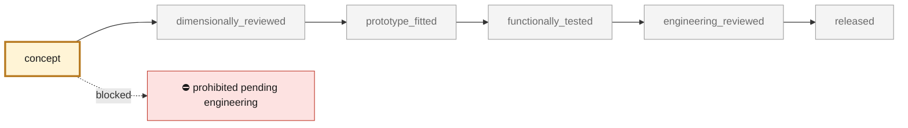

<!-- generated by scripts/render_part_pages.py - do not edit by hand -->

# Pair of K16 turbochargers of the 993 Turbo

**Status: **prohibited pending engineering**. No part is released; see [SAFETY.md](../../SAFETY.md).**

Research target of the digital twin: two K16 turbochargers mounted in parallel on the 993 Turbo. This record establishes the functional identity and the available public data; it constitutes neither a replacement geometry nor a manufacturing authorization.

*Validation ladder of `catalog/schemas/part.schema.json`; this record is at `concept`.*

Catalogue record: [`catalog/parts/993-turbocharger-k16-pair-0001.json`](../../catalog/parts/993-turbocharger-k16-pair-0001.json)

## Identity

| field | value |
|---|---|
| identifier | 993-TURBOCHARGER-K16-PAIR-0001 |
| generation | 993 |
| variants | 993_Turbo |
| model years | 1995 to 1998 |
| Porsche part numbers | 993 123 013 51, 993 123 013 52, 993 123 014 51, 993 123 014 52 |
| category | turbocharger |
| safety class | prohibited_pending_engineering |
| intended use | Research, identification, simulation and dimensional reconstruction under engineering control; no engine or road use at this stage |

## Material and manufacturing

| field | value |
|---|---|
| preferred process | undecided |
| candidate processes | LPBF, CNC, casting |
| material family | unknown per subassembly; to be identified on parts and manufacturer documentation |
| grade | undetermined |
| standard | none |
| supplier requirements | Process qualification and lot traceability, Thermal, fatigue, rotordynamics and pressure dossier, Metrology and non-destructive testing report, High-speed balancing by a qualified operator, Formal engineering review before any engine test |
| post-processing | to be defined after geometry and material, machining of the interfaces and bearing faces, balancing of the rotating assembly if a rotor is studied, dimensional and non-destructive inspection |

## Geometry

| field | value |
|---|---|
| source type | estimated |
| master format | build123d |
| units | mm |
| accuracy (mm) | not recorded |

**Master file**

- [`scripts/build_993_concept_f0.py`](../../scripts/build_993_concept_f0.py)

**Derived files**

- [`parts/993-turbocharger-k16-pair-0001/derived/k16_pair_concept_f0.step`](../../parts/993-turbocharger-k16-pair-0001/derived/k16_pair_concept_f0.step)

## Images

*parts/993-turbocharger-k16-pair-0001/media/preview.png*

*parts/993-turbocharger-k16-pair-0001/media/views.png*

## Provenance and sources

| field | value |
|---|---|
| record license | MIT for the record, no third-party geometry redistributed |

**Sources**

- [Porsche Christophorus - Technical data of the 911 Turbo (993)](https://newsroom.porsche.com/christophorus/fr/2020/394/turbo-engines.html)
- [BorgWarner - Performance Turbocharger Catalog](https://www.borgwarner.com/docs/default-source/iam/boosting-technologies/bw_turbo-performance-catalog.pdf)
- [FVD Brombacher - envelope and mass of the 993 K16s](https://www.fvd.net/de/shop/turbolader-k16-rechts-993-serie-99312301452-993123014dx~p239094)
- [Invasion Auto Products - internal catalog data of the right-hand K16](https://www.invasionautoproducts.com/94pocark16tu.html)
- [Design911 - Cross-reference of the 993 Turbo K16 turbochargers](https://www.design911.co.uk/b/borgwarner/2/)
- [TurboMaster - Exploded parts view of the BorgWarner K16 5316-988-6735](https://www.turbomaster.com/eng/turbo/borgwarner/5316-988-6735/)
- [Porsche Fanatics - PET transcription of the 993 turbo groups](https://porschefanatics.com/oem/993/202-16/)
- [Porsche Austria - PET 993, group 107-45 air cooler](https://www.porsche.at/media/Kwc_Basic_DownloadTag_Component/4740-45397-124814-downloadTag/default/f5000535/1729608718/kat017-d-911-98-katalog.pdf)

## Validation

| field | value |
|---|---|
| status | concept |
| vehicle tested | not recorded |
| reviewed by |  |
| limitations | not recorded |

**Evidence**

- none

---

*Page generated from the catalogue record by `scripts/render_part_pages.py`, checked by `make check`. Corrections go in the record, not here.*
