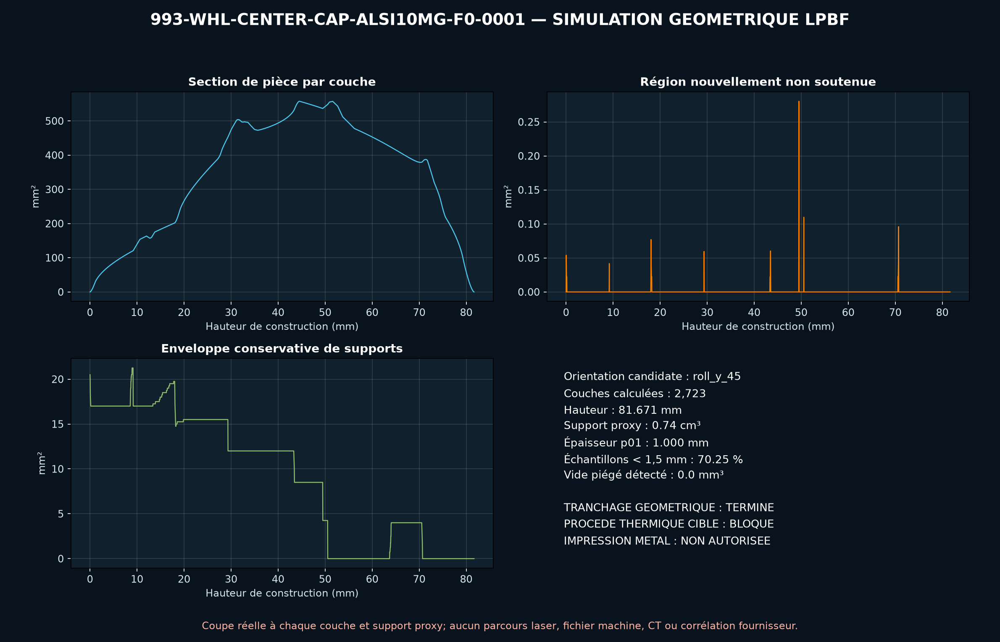

<!-- engendre par scripts/render_part_pages.py - ne pas editer a la main -->

# Cache-moyeu 993, concept AlSi10Mg F0 sans blason

**Statut : fonctionnel. Aucune pièce n'est libérée ; voir [SAFETY.md](../../SAFETY.md).**

Concept indépendant de cache-moyeu métallique à quatre languettes intégrées pour cribler une petite série LPBF. PorscheFanatics confirme l'identité et le statut PET historique ; partworks publie trois dimensions et déclare que l'original est en plastique.

Fiche du catalogue : [`catalog/parts/993-whl-center-cap-alsi10mg-f0-0001.json`](../../catalog/parts/993-whl-center-cap-alsi10mg-f0-0001.json)

## Identité

| champ | valeur |
|---|---|
| identifiant | 993-WHL-CENTER-CAP-ALSI10MG-F0-0001 |
| génération | 993 |
| variantes | 993_wheel_fitment_to_confirm |
| années | 1994 à 1998 |
| références Porsche | 99336130307, 9933613030761M |
| catégorie | wheel_center_cap |
| classe de sécurité | functional |
| usage prévu | Criblage CAO, clipsage, centrifugation, thermique et DfAM ; aucun montage routier autorisé |

## Matière et fabrication

| champ | valeur |
|---|---|
| procédé préféré | à décider |
| procédés candidats | LPBF, DMLS, MJF, SLS, CNC |
| famille de matière | aluminium LPBF candidat |
| nuance | AlSi10Mg de criblage ; original commercial déclaré en plastique |
| norme | ASTM F3318 à contractualiser si la voie métal survit aux essais |
| exigences fournisseur | poudre, machine, paramètres, orientation, lot et recyclage traçables, coupon de flexion dans l'orientation des languettes, contrôle CT ou radiographique des racines de languettes, contrôle dimensionnel de la bague et des quatre clips, rugosité, arrondis, porosité et fatigue contractualisés, essais d'insertion, arrachement, rotation, choc et cycles thermiques |
| post-traitement | retrait des supports avec volume intérieur ouvert, traitement thermique qualifié pour préserver la flexibilité des languettes, finition des surfaces de clipsage et arêtes, anodisation après contrôle dimensionnel, face avant laissée neutre sans marque Porsche |

## Géométrie

| champ | valeur |
|---|---|
| type de source | mixed |
| format du maître | build123d |
| unités | mm |
| précision (mm) | non renseigné |

**Fichier maître**

- [`parts/993-whl-center-cap-alsi10mg-f0-0001/source/wheel_center_cap.py`](../../parts/993-whl-center-cap-alsi10mg-f0-0001/source/wheel_center_cap.py)

**Fichiers dérivés**

- [`parts/993-whl-center-cap-alsi10mg-f0-0001/derived/wheel_center_cap_alsi10mg_f0.step`](../../parts/993-whl-center-cap-alsi10mg-f0-0001/derived/wheel_center_cap_alsi10mg_f0.step)

## Images

*parts/993-whl-center-cap-alsi10mg-f0-0001/evidence/lpbf-f0/993-whl-center-cap-alsi10mg-f0-0001-lpbf-geometry-screen.png*

## Provenance et sources

| champ | valeur |
|---|---|
| licence de la fiche | MIT pour le concept neutre, le script et les calculs ; aucun blason, logo, photographie ou modèle commercial redistribué |

**Sources**

- [PorscheFanatics - registre historique des références supprimées](https://porschefanatics.com/oem/discontinued/)
- [partworks - cache-moyeu original 993](https://partworks.de/1x-Radnabendeckel-ORIGINAL-fuer-PORSCHE-911-993-9933613030761M)
- [EOS Aluminium AlSi10Mg material data sheet](https://www.eos.info/metal-solutions/metal-materials/data-sheets/mds-eos-aluminium-alsi10mg)

## Validation

| champ | valeur |
|---|---|
| statut | concept |
| essais véhicule | non renseigné |
| revu par |  |
| limites | non renseigné |

**Preuves**

- [`catalog/sources/src-porschefanatics-993-wheel-center-cap-status.json`](../../catalog/sources/src-porschefanatics-993-wheel-center-cap-status.json)
- [`catalog/sources/src-partworks-993-wheel-center-cap-dimensions.json`](../../catalog/sources/src-partworks-993-wheel-center-cap-dimensions.json)
- [`catalog/sources/src-eos-alsi10mg-current-page.json`](../../catalog/sources/src-eos-alsi10mg-current-page.json)
- [`parts/993-whl-center-cap-alsi10mg-f0-0001/evidence/engineering-screen.json`](../../parts/993-whl-center-cap-alsi10mg-f0-0001/evidence/engineering-screen.json)

## Dossiers de conception

- [993_WHEEL_CENTER_CAP_ALSI10MG_F0](../../docs/993/993_WHEEL_CENTER_CAP_ALSI10MG_F0.md)

---

*Page engendrée depuis la fiche du catalogue par `scripts/render_part_pages.py`, vérifiée par `make check`. Toute correction se fait dans la fiche, pas ici.*
