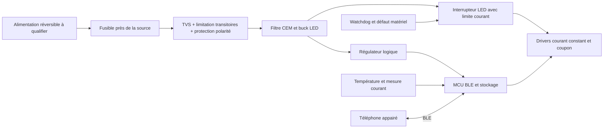

# Électronique — architecture préparatoire

**NON VALIDÉ POUR FABRICATION.** Ce document et la BOM sont des hypothèses de
conception. Aucun schéma électrique routable, PCB, Gerber ou fichier pick-and-place
n'est libéré. Le coupon précède le dessin de la carte pleine largeur.

Le dessin ne représente pas des valeurs/connexions électriques approuvées. Les
fonctions réglementaires existantes doivent rester indépendantes des messages et
d'une panne du MCU ; si le remplacement les supprime, leur reconception impose
un dossier de qualification séparé. Ne pas utiliser un driver de messages comme
substitut présumé à un feu homologué.

## Alimentation et protections

- Relever au véhicule le chemin de câble, la source disponible, les marges courant,
  les connecteurs et les conditions d'arrêt/démarrage. Un adaptateur démontable
  est l'hypothèse ; si cela impose une modification de la voiture, réviser le produit.
- Réseau automobile nominal 12 V ≠ alimentation propre 12 V. Dimensionner sous-
  tension au démarrage, surtension permanente, inversion batterie, impulsions
  négatives/positives et load dump avec le spécialiste. Protocole ISO 7637-2 et
  ISO 16750-2 à définir avec le laboratoire : niveaux, impédances et répétitions
  non prescrits ici. Ne pas appliquer des impulsions destructives sur la voiture.
- Candidat LM7480-Q1 avec MOSFETs dos à dos [S08] : ce composant ne remplace ni
  une analyse d'énergie TVS, ni les SOA MOSFET, ni un fusible correctement coordonné.
  Choisir le buck et les condensateurs **après** définition du maximum écrêté,
  avec marges de tension/température et comportement court-circuit.
- LED désactivées matériellement au reset (pull-down sur enable), limite de
  courant indépendante et coupure thermique ; brownout, watchdog et flash corrompue
  donnent écran noir. La coupure ne doit pas désactiver les feux d'origine.
- Mesurer le courant de repos véhicule arrêté, le courant de pointe PWM et les
  appels au branchement ; décider alimentation après contact ou coupure dédiée.
  Pas de promesse de veille basse consommation avant mesures.

## Puissance : exemple de banc, pas prédiction véhicule

Le module Waveshare P2,5 64×32 annonce ≤12 W [S02]. Pour **un coupon** à 12 W,
plus 1 W de logique hypothétique et rendement de conversion 85 % :
Pentrée=13/0,85=15,3 W ; à 12 V I≈1,28 A ; perte convertisseur≈2,3 W.
Ces nombres ne fixent pas le fusible ni la puissance du bandeau. Mesurer chaque
mode, tous pixels allumés et panne driver. Pour N modules, la puissance ne peut
pas être déduite de l'animation moyenne seule.

Pour un exemple abstrait de 625 pixels mono, 2 V et 2 mA **moyens** par pixel,
PLED≈2,5 W ; RGB à trois canaux de même courant demanderait une somme selon les
Vf réels de chaque couleur. Ce n'est ni un flux garanti ni un profil automobile.
En multiplexage, ne pas remultiplier un courant déjà moyen par le duty cycle ;
le courant de crête admissible doit venir de la fiche LED/driver.

Plafond logiciel configurable de luminosité + plafond matériel courant, sonde
près des LED et du convertisseur, conduction vers le dos, simulation puis mesure
boîtier fermé au soleil. La limite thermique dépend du grade optique, des joints,
du PCB et de la température de jonction ; la température d'air seule ne suffit pas.

## RF, CEM et mécanique électronique

Candidat : module BLE fondé sur nRF52840, antenne intégrée et documentation RF
fournisseur [S09]. Référence de module exact et grade thermique à sélectionner.
Une qualification de module n'homologue pas le produit final. Mono : driver SPI
courant constant ; pour HUB75 RGB, vérifier débit/refresh/RAM/DMA sur cible, puis
choisir MCU différent si nécessaire. Le simulateur ne démontre aucun de ces débits.

Prévoir plan de masse, boucles commutées courtes, filtre d'entrée amorti, placement
TVS/connecteurs, découplage et retour de courant. Mesurer émissions conduites et
rayonnées, ESD au connecteur/boîtier et immunité RF ; étudier UN R10 et RED ensemble.
Éloigner antenne, masse LED, métal et revêtement conducteur ; tester RF dans la
pièce montée. Connecteurs verrouillés, détrompage, décharge mécanique des câbles,
vis freinées par procédé compatible et support de PCB contre flexion/vibration.

## Prototype en trois livraisons

1. Coupon sur alimentation de laboratoire limitée en courant, module du commerce
   et échantillons optiques ; journal tension/courant/température/lux et photos
   contrôlées. Pas de branchement véhicule.
2. Petit PCB de protection/contrôle + coupon mono : revue indépendante schéma/BOM,
   DRC/ERC, points de test, programmation, limites courant, charge fictive puis LED.
   RFQ pour 3–5 cartes ; toutes marquées « prototype non validé ».
3. Carte/segments pleine largeur après G2 : interfaces figées, connectique entre
   segments, répartition chaleur/courant, accès réparation, PCBA puis contrôle
   100 %. AOI pour petits boîtiers, inspection complémentaire si joints cachés,
   test électrique et firmware identifié par version/hash.

Fichiers à commander au spécialiste : KiCad natif (ou format convenu éditable),
schémas PDF, BOM MPN/alternatives, stack-up, règles, Gerbers, perçages, placement,
plan de test, rapports ERC/DRC/revue, licence et transfert des sources. Les exports
fabrication restent bloqués jusqu'à revue signée et autorisation distincte.
