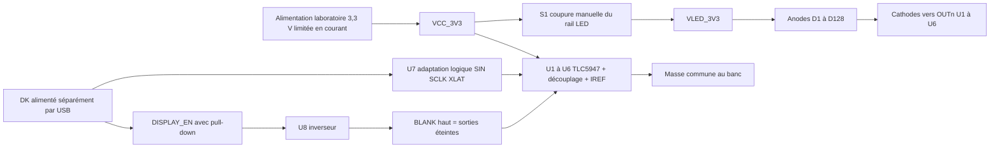

# Coupon électronique E0 — revue de conception

2 octobre 2026 — **NON VALIDÉ POUR FABRICATION. BANC UNIQUEMENT.**
Ce dossier fixe une première proposition de circuit et un ordre de mise au point.
Aucun composant acheté, PCB routé ou matériel programmé.
Le [schéma KiCad en trois feuilles](kicad/README.md) et son [PDF](coupon-e0.pdf)
transcrivent ces connexions ; ERC sans erreur ni avertissement. La revue par
l'électronicien et les essais restent nécessaires avant fabrication. Il n'existe
pas de Gerber, de placement ni de contrôle DRC PCB ; empreintes non attribuées.

## Choix pour commencer

- **128 LED rouges, 16 × 8**, identiques au format du simulateur existant.
  Deux variantes de placement : pas 2,5 et 4 mm, même circuit. Les centres extrêmes
  sont espacés respectivement de 37,5 × 17,5 et 60 × 28 mm. Ce sont des dimensions
  de coupon proposées, jamais des relevés du bandeau ; contour PCB non défini.
- LED candidate **APHHS1005LSECK/J3-PF**, boîtier 1 × 0,5 mm [S01]. Le boîtier
  miniature ne fixe pas le pas. Son empreinte et son orientation devront être
  vérifiées sur le dessin fabricant, pas déduites de l'appellation « 0402 ».
- **Six TLC5947DAP**, 24 sorties chacun : 128 utilisées, 16 inutilisées, courant
  constant et PWM matériel. Pas de multiplexage des rangées. Ce choix facilite
  les mesures optiques ; son coût et son encombrement ne sont pas extrapolés à la
  série. Une matrice multiplexée sera reconsidérée après G2 si nécessaire.
- **20,0 kΩ, 1 % sur chaque IREF** : courant idéal ≈2,46 mA, plutôt que viser
  exactement la limite basse de 2 mA du driver. Démarrer avec plafond PWM 1024/4096.
  La tolérance réelle à ce faible courant reste à mesurer ; aucune précision
  garantie extrapolée d'une spécification mesurée à un autre courant.
- **3,3 V ±3 % régulés au banc**, séparés de l'USB du contrôleur. Pas de 12 V sur
  le coupon, pas de prélèvement de courant sur une broche GPIO ou sur le DK.
- Contrôleur de développement candidat **nRF52840 DK** [S34], séparé du coupon.
  Les GPIO sont des signaux logiques proposés, sans numéro de broche DK figé avant
  identification de sa révision et de ses fonctions déjà occupées. Le portage
  firmware/BLE n'est pas livré ici.

Les sources fabricants [S01, S31–S34] sont dans [le registre](../sources.md).
Ce sont des composants de banc ; aucune qualification automobile du montage.

## Schéma de principe éditable



Le détail broche/net est dans [coupon-wiring.csv](coupon-wiring.csv), la liste
des composants dans [coupon-bom.csv](coupon-bom.csv). Les références U1–U6 utilisent
**uniquement le boîtier DAP HTSSOP-32** : ne pas appliquer ses numéros à RHB/QFN.
Le pad thermique va à GND et doit être soudé selon le land pattern du fabricant.

`SIN → U1 → U2 → … → U6`, avec SOUT d'un driver vers SIN du suivant. Les cathodes
sont affectées dans l'ordre des lignes, de gauche à droite, puis de haut en bas,
en regardant la face LED. `index = y × 16 + x`, driver `1 + index // 24`, sortie
`index % 24`. U6 OUT8–OUT23 restent non connectées, avec données PWM nulles.
Les 128 affectations et coordonnées se régénèrent par la commande ci-dessous.

U7 **SN74LVC125APW** reçoit SIN/SCLK/XLAT du DK et fournit des niveaux 3,3 V.
U8 **SN74LVC1G04DBVR** inverse DISPLAY_EN pour BLANK. Cela évite de supposer que
le DK alimenté par USB fournit des GPIO 3,3 V : son VDD usuel est 3 V [S34].
Entrées logiques de banc attendues : haut ≥2,0 V, bas ≤0,8 V. Les mesures de front,
overshoot et tension aux broches restent nécessaires. Aucun retour SOUT vers le
MCU ; seulement un point de test. Pas de connexion à chaud : sorties MCU à zéro,
sources coupées avant câblage. Le comportement des deux alimentations en séquence
doit être testé ; ces buffers ne constituent pas une isolation galvanique.

BLANK est tiré au haut par 10 kΩ ; DISPLAY_EN est tiré au bas par 100 kΩ.
Au reset/MCU débranché, U8 doit donc imposer le noir. **Un MCU bloqué avec
DISPLAY_EN haut peut laisser l'image allumée** : E0 exige présence de l'opérateur
et coupure S1 accessible. Le watchdog matériel et la coupure thermique autonome
restent une exigence de E1 avant tout fonctionnement autonome. La protection
thermique interne du TLC5947 redémarre automatiquement ; elle ne remplace pas
un verrouillage de défaut. Un reset logiciel seul n'apporte pas cette garantie.

## Puissance et marges à vérifier

Calcul reproductible dans [coupon_driver.py](../software/coupon_driver.py).
Les hypothèses d'étude sont modifiables par arguments ; elles ne sont pas des
mesures ni des garanties de fiche technique :

| Hypothèse | Valeur de départ / conséquence |
|---|---|
| Courant nominal | `41 × 1,20 / 20000` = 2,46 mA par canal allumé |
| Marge de courant totale supposée, résistance comprise | ±10 % → 2,214–2,706 mA ; à remplacer par mesures |
| Tous pixels, courant LED instantané majoré | 128 × 2,706 = 346,368 mA, indépendant du plafond PWM |
| Charge logique allouée | 45 mA par driver + 2 mA buffers ; allocation d'étude, pas maximum garanti à IREF=20 kΩ |
| Alimentation coupon majorée | ≈621,8 mA et 2,114 W à 3,399 V, résistance de décharge incluse, hors DK ; ni puissance optique ni prévision bandeau |
| Vf LED supposé pour le calcul | 1,7–2,3 V ; la fiche donne ses valeurs à 2 mA, pas une garantie pour toute température/courant |
| Headroom minimal calculé | 3,201 − 2,3 = 0,901 V ; réserve proposée 0,6 V, marge 0,301 V à vérifier en balayage |
| Dissipation d'un driver de 24 canaux | environ 0,264 W avec les hypothèses hautes ; pas de température de jonction déduite sans PCB |
| Transfert | 6 × 24 × 12 = 1728 bits = 216 octets ; 1,728 ms à 1 MHz, hors latch/blank |

Ne pas additionner la puissance LED et la dissipation aux 2,114 W : elles en sont
des composantes. Le courant moyen PWM peut baisser, le courant instantané de la
source et des pistes doit rester dimensionné pour toutes les sorties actives.
Le calcul rejette une alimentation en dehors des plages choisies ou un headroom
négatif ; un résultat accepté n'est pas une validation de circuit.

Le budget existant **250–700 CHF pour le coupon** est conservé comme enveloppe
historique d'étude, pas comme devis de cette BOM. Prix/stock/MOQ des composants,
PCB, pochoir, PCBA, contrôle et port restent à chiffrer séparément. Ne pas additionner
cette BOM au poste `coupon` une seconde fois. Les deux pas peuvent demander deux
assemblages : leur couverture par cette enveloppe est à confirmer.

## Portage et données de référence

```sh
python3 docs/projects/993-programmable-rear-panel/software/coupon_driver.py --output-dir /tmp/993-coupon-e0
python3 docs/projects/993-programmable-rear-panel/software/coupon_driver.py --pitch-mm 4 --output-dir /tmp/993-coupon-e0-p4
python3 -m unittest discover -s tests -p 'test_993_rear_panel*.py' -v
```

Sorties : `channel-map.csv` (connexions et centres LED), `frames-spi.hex` (une ligne
par trame de démonstration), `estimate.json` (calculs et hypothèses). On peut passer
`--input` pour un document mono8 du simulateur existant ; seul 16 × 8 est accepté.
**Aucune écriture SPI/USB/BLE, aucun GPIO ni ordonnanceur temps réel dans ce code.**
Les durées restent dans le document source ; le fichier hex n'est pas un format
de lecture d'animation autonome. Le code réutilise sa validation d'images.

Ordre de transmission : U6 d'abord, puis U5 jusqu'à U1 ; dans chaque driver,
OUT23 jusqu'à OUT0, bit de poids fort en premier. Initialement SPI mode 0, 1 MHz,
XLAT bas. Maintenir DISPLAY_EN bas, transmettre 216 octets nuls, puis impulsion
XLAT haute de 1 µs. Garder au moins 1 µs avant nouvelle horloge et activation.
Transférer ensuite chaque image en état blank et ne libérer BLANK qu'après latch,
authentification et armement local valides. Ces délais choisis dépassent les minima
de la fiche ; les vérifier à l'analyseur logique, pas par des temporisations Python.

L'encodage mono8→PWM12 est linéaire, limité par défaut à 1024 ; les 16 sorties
inutilisées sont toujours nulles. Pas de gamma/LUT supposée : calibrer derrière
la façade réelle. Le plafond logiciel ne remplace jamais IREF. Le simulateur
teste le noir après défaut ; l'extinction électrique exige aussi BLANK/S1.

## Mise sous tension E0 — seulement après revue du schéma natif

| Essai | Action et preuve à conserver | Critère E0 proposé avant de continuer |
|---|---|---|
| E0-01 | Revue broches DAP, LED A/K, IREF, masses, non-connexions, polarité ; ERC/DRC et contrôle assemblage | Revue signée sans erreur ouverte ; pas de câble véhicule |
| E0-02 | Sans DK ; S1 ouvert ; source 3,3 V limitée à 50 mA ; mesurer VCC et BLANK | Rail 3,201–3,399 V ; BLANK haut ; aucun échauffement ni limitation ; sinon couper et diagnostiquer |
| E0-03 | DK connecté hors tension ; séquences d'alimentation et reset | BLANK haut et absence de flash avant trame nulle ; aucune alimentation parasite mesurable hors budget convenu |
| E0-04 | Un pixel mobile, niveaux 0/64/128/255 ; analyseur logique + shunt externe | 128 positions correctes ; 216 octets par latch ; 16 canaux non utilisés à zéro ; courant crête conforme aux mesures approuvées |
| E0-05 | Damier puis tous pixels ; augmenter limite source par étapes, maximum d'étude 0,75 A | Arrêt si I total >0,65 A stabilisé, défaut de courant, Vf/headroom insuffisant ou surface ≥50 °C ; seuils de banc conservateurs à revoir |
| E0-06 | Reset, débranchement commande, blocage firmware volontaire, ouverture S1 | Reset/câble retiré : noir ; MCU bloqué : noter limite E0 et vérifier S1 ; ne pas déclarer un watchdog matériel réussi |
| E0-07 | Façade rouge, pas 2,5/4, mêmes motif/courant/exposition/ambiance | Tableau contraste/lux/courant/température et validation esthétique ; aucune promesse de visibilité solaire avant mesures |

Mesurer température driver, dos PCB et façade ; journaliser tension, courant,
temps, réglage PWM et température ambiante. L'observation au doigt ne suffit pas.
E0 n'inclut ni ESD automobile, ni vibration, ni pluie ; arrêt et analyse avant E1.

## Carte automobile E1 — décisions encore bloquantes

Le coupon est indépendant de l'étage automobile. Conserver l'architecture LM7480-Q1
à MOSFETs dos à dos comme **candidate** [S08], sans choisir prématurément une TVS
ou un buck. Fiche à compléter par l'électronicien : profil entrée (démarrage,
surtension, inversion, load dump), tension maximale écrêtée, énergie TVS, SOA des
MOSFETs, coordination fusible, tenue des condensateurs/buck et stabilité du filtre.
Le suffixe Q1 d'un contrôleur n'est pas une qualification du sous-ensemble.

Prochain livrable : revue professionnelle du schéma natif puis routage du coupon,
avant une carte E1 comprenant limites
de courant, surveillance tension/température, watchdog matériel imposant l'arrêt
et réarmement local après défaut. Distinguer cette coupure des fonctions légales
du bandeau. La source et les interfaces réversibles sur la 993 restent inconnues.
Aucun essai de transitoire sur le véhicule ; banc dédié et professionnel requis.
