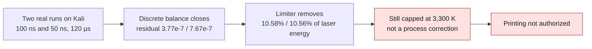

# F58 — energy balance of the AdditiveFOAM coupon



## Result of September 7, 2026

Two real runs on Kali reach 120 µs, with solver returns of zero:
1,200 steps of 100 ns (59 s wall time) and 2,400 steps of 50 ns (90 s wall
time). The spatial maximum of temperature is recorded at **every step**. Both
cases remain capped at 3,300 K: this diagnostic is not a physical correction
of the process nor an authorization to print.

The [public F58 receipt in JSON](../../twins/reference-917-engine/evidence/f58-energy-diagnostic/energy-summary.json)
contains the two time steps, the recomputed energies and residuals, the
provenance digests and the limits of the diagnostic. It reproduces exactly the
results of the private cross-check receipt; no private path, mesh, coordinate
or raw log appears in it.

| Cumulative energy over 120 µs | 100 ns step (mJ) | 50 ns step (mJ) |
|---|---:|---:|
| Absorbed laser input | 31.55219 | 31.55755 |
| Discrete sensible storage | 28.33106 | 28.34062 |
| Latent storage of melting | 3.69231 | 3.69240 |
| Net heat flux entering at boundaries | 3.80816 | 3.80693 |
| Outgoing advective transport | 0 | 0 |
| Artificial sink of the limiter | 3.33700 | 3.33147 |

The integral of the absolute value of the residual, divided by the laser
energy, is `3.77e-7` and `7.67e-7` respectively. It does not allow errors of
opposite signs to cancel out. The gaps between steps are 0.034% on sensible
storage, 0.0025% on latent and 0.166% on the numerical sink.
Two steps determine neither an order of convergence nor spatial convergence.
The clipped peaks are not proof of convergence of T.

The limiter removes **10.58% / 10.56%** of the absorbed laser energy. A large
non-physical energy intervention therefore remains in this computation, even
when the discrete equation closes very precisely. Reducing the time step does
not remove this intervention.

A second independent reading of the two logs now recomputes the residual as
`fsum(sensible, latent, -diffusion, -laser, advection, limiter)`.
The solver's residual column is only compared with this result; it no longer
feeds the integrals. For the 16 significant digits of the log, the write
consistency tolerance is explicitly
`1e-12 W + 5e-15 * sum(abs(terms in W))`. This is not a physical acceptance
threshold. A larger inconsistency causes the report to be refused.
On the 1,200 / 2,400 real lines, the maximum gaps are
`1.58e-13 W` / `1.71e-13 W`: all lines are consistent. The rounded figures of
the table and of the residual remain unchanged after reintegration.

## What is actually integrated

The copied solver keeps the explicit Euler equation of ORNL commit
`9c05c5eb54db03faa342b14b0806efe740de8c44`. The diagnostic integrates its terms
before/after each solve:

`sensible_storage + latent_storage = boundary_diffusion + laser - advection - limiter`.

- sensible: sum of `rho * Cp_old * (T_new - T_old) * V / dt`;
- latent: sum of `-rho * Lf * (alpha_solid_new - alpha_solid_old) * V / dt`;
- diffusion: volume integral of the **same conservative operator**
  `fvc::laplacian(kappa,T)` as the solver; its integral gives the net flux at
  the boundaries, with the existing thermal conditions;
- laser: integral of the real source field `sources.qDot()`;
- advection: integral of `rho*Cp*fvc::div(phi,T)`;
- limiter: integral of the implicit term `A*(T-Tmax)/dt` of the last thermal
  correction, separated from the physical losses.

The sensible storage is a term of the discretized equation using the solver's
lagged Cp. It is **neither** the pseudo-enthalpy `rho*Cp*T`, **nor** a new
calibrated caloric law. The measured closure is therefore that of the equation
actually solved, not an external thermodynamic validation.
The net boundary flux is positive here. The initial field is at 293.15 K while
the boundary reference temperatures are at 300 K; these inherited inputs were
kept, not silently harmonized.

Primary sources verified:
[ORNL thermal assembly](https://github.com/ORNL/AdditiveFOAM/blob/9c05c5eb54db03faa342b14b0806efe740de8c44/applications/solvers/additiveFoam/thermo/thermoScheme.H),
[ORNL melting and penalization](https://github.com/ORNL/AdditiveFOAM/blob/9c05c5eb54db03faa342b14b0806efe740de8c44/applications/solvers/additiveFoam/thermo/TEqn.H),
[ORNL property update](https://github.com/ORNL/AdditiveFOAM/blob/9c05c5eb54db03faa342b14b0806efe740de8c44/applications/solvers/additiveFoam/updateProperties.H).

Direct check of the files actually compiled: `additiveFoam.C` calls
`updateProperties.H` at line 97, then includes `TEqn.H` at line 136, before
the storage computation at line 141. In `updateProperties.H`, lines 22–24
assign Cp. A complete reading of `TEqn.H` and its two includes
`thermoScheme.H` and `thermoSource.H` shows that Cp is only read: the
corrections modify T, the solid fraction, dFdT and T0, not Cp. The boundary
corrector `mixedTemperature::updateCoeffs` (lines 149–175) reads kappa and
updates the coefficients of T, without modifying Cp. The storage after TEqn
therefore does use the same Cp as its assembly; no corrective copy of Cp and
no new computation were needed for these logs.
The digests of `thermoSource.H` and `updateProperties.H` are now added to the
preparer's locks, respectively
`efab43bb4cd3f05b29eb326a2b2ead2508de43ff705bdf546ab7d58295a57b4f` and
`98e6e85e1a8cd2c10ee385864280a88ff6649d45e51148eeee47fd55b136da2a`.

## Scope and fidelity of the pair

The source case is the capped layer 0 of the F55 diagnostic. It is the
rectangular AlSi10Mg coupon derived from F50, **not the STEP of a cylinder
head**, not the old oval, not the new M64 module and not a CP1 map.
The mesh has 57,600 cells and does not change during the two computations.
The Kelly model, the beam, the material map, the boundaries, the mesh,
`nOuterCorrectors=0` and `Tmax=3300` remain unchanged. The F55 source
`controlDict` does contain `adjustTimeStep yes` (line 48) and `deltaT 1e-07`
(line 28). Its SHA-256 `339fc71cc01b94df5ff746cf5082ea6a80eae06cc6c6b14de53f18bcc4e57c05`
matches the manifest established before the computations. F58 replaces this
adaptive step with `adjustTimeStep no` in both members of the comparison.
Between them, only the `deltaT` value differs in `system/controlDict`.

The diagnostic engine refuses a changing mesh, an implicit scheme or an
adaptive step. It measures the latent term but adds no model of vaporization,
vapor recoil or melt pool convection. No result on fatigue, cylinder head
strength or distortion of a complete build follows from this pair.

## Reproducibility and preservation

The new preparer `additive_energy_diagnostic_f58.py` checks the five digests
of the solver sources, copies into a new private folder and creates the `dt`
and `dt_half` variants. It refuses to overwrite an existing folder.
The original sources and the old F55 results are not modified.
The first compilation attempt failed before any computation on the log
precision call; it is kept on record. The second compiled and ran both
computations. Each had an external stop at 300 s; all diagnostic containers
are now stopped and deleted. No Vast rental.

- local image: `a233511bef9b4fbf0653ca94258061d61b3fccbd6b4e3ef6d71c669d70de1c17`;
- instrumented binary: `b13dacc72146e8df5ded9d20c4b20e7a21051dd21244f9598d441e81c871364d`;
- AlSi10Mg map: `65d464489b95dd60bffa61a30caee53e1ec951c4bd53dfed0d7d1ea0d435e3ea`;
- private report: `afabeb547951c603cfed34bf6f92e17c08bf2a67a73572aedcbe4dc30962ea6a`;
- private cross-check receipt, separate, without overwriting the first:
  `d8bbb8fd72db1f6e191614ed325e71cd6bd2f7ebf0dd6efe32463df25a4caf1d`;
- 100 ns step log: `fd95a18b51c3e252f4e92d2625e62fe21b82b5ac66abbf6abc14877a5cf1a44c`;
- 50 ns step log: `27f3733c41e8e4d448c94b6e3979a776164f43c7b01732f7bfc449b125d8f1bf`.

The complete report, inputs, fields and logs remain private. The targeted tests
check the energy terms, missing/non-finite samples, the dt/2 contract, the
absence of overwriting and the identity of the physical inputs.
The cross-check receipt distinguishes `time_series_complete` from the exit
code: reading a log alone does not verify a process return.
Its fields `solver_exit_code=null` and `solver_exit_status_verified=false` do
not replace the zero returns observed during the two initial runs.
The public receipt keeps this distinction: it does not invent an exit code in
the fields coming from the parser and states that the execution observations
come from separate evidence. It contains no standalone machine receipt of the
process returns. The added metadata are verified digests, the locked steps of
the pair and the energy ratios computed from the source values, with no new
simulation.

```sh
python3 -m unittest discover -s tests -p test_917_additive_energy_diagnostic_f58.py -v
```

## Next decision

An additional algebraic cross-check of the same 3,600 steps shows no creation
of energy by the laser source: the incident energy is
`380 W × 120 µs = 45.60 mJ`, and the absorbed integrals represent
69.1934% / 69.2051% of this incident energy. No recorded absorbed power exceeds
380 W. Recomputing Kelly from the reference depths of the logs reproduces the
integrated powers to within 1.47e-8 W at most.
The D4σ diameter of this profile is 72.51699 µm; `etaMin=0.35` is a floor,
not a constant absorption. The final computed absorption is about 0.772.
The depth used is that of a simulated isotherm: this agreement does not
calibrate the physical absorption or the laser keyhole.

The exact F55/F58 trajectory is 2 mm at 1.3 m/s; the analyzed window covers
only its first 120 µs, i.e. 0.156 mm nominal. Do not substitute for it the
0.4 mm track of the general F50 campaign. No solver was rerun for this check.
The private algebraic script has SHA256
`202815577b43b4fe7edece86b2ee6807773fb366f96089e5858bdf8f5554efa7`
and the detailed private report
`b0152123aa55a296ad468601c4e3b4dca9c5c7f157ba3730b38fba54ab4934a5`.

The diagnostic does not justify a new rental to blindly sweep power and
absorption. The absorption model, the source profile/depth and the physical
losses of the coupon must now be examined with consistent calibration data;
F55 had already shown the sensitivity to absorption.
Do not select 0.35 as the truth and do not remove the cap to get a green gate.
Any future correction must keep this balance, the peaks at every step and the
time comparison, then verify spatial convergence. Manufacturing and startup
remain unauthorized.
