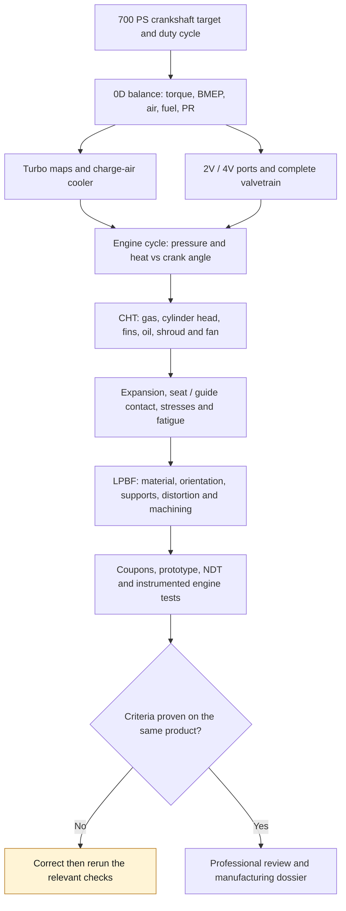

# Twin-turbo M64 at 700 hp: computable target and engine research

Follow-up of September 8: [thermodynamic cross-computation and limits of the old
2V/4V models](M64_700PS_CYCLE_MODEL_AUDIT_20260908.md). The balance below
stays frozen; the filling or combustion advantages imposed in
some historical models are not demonstrated gains for the M64.

State as of September 7, 2026: **exploratory sizing**, not power
obtained, nor thermal, mechanical or printing validation. The user target
is interpreted as **700 metric horsepower (PS) at the crankshaft**, i.e.
**514.849 kW / 690.424 mechanical hp**. The dyno correction protocol, the
duration at full load and the exact donor engine remain to be defined. A target
at the wheels would be different: no transmission efficiency is invented.

This research complements, without replacing them, the
[interface register](M64_INTERFACE_SOURCE_REGISTER.md), the
[valve references](M64_VALVE_MODULE_PRIMARY_REFERENCES_20260907.md) and the
[four-valve module](M64_FOUR_VALVE_DISTRIBUTION_MODULE_20260907.md).
It modifies neither the unknown interfaces nor the current geometry.

## Documentary basis: do not confuse the engines

| Basis | Useful primary fact | Design consequence |
| --- | --- | --- |
| 964 Turbo 3.6 | Porsche distinguishes its M64 from the M30 of the earlier 3.3; bore × stroke 100 × 76.4 mm and compression 7.5:1. [P1](https://newsroom.porsche.com/en/history/porsche-history-white-giants-991-turbo-964-turbo-3-6-993-turbo-s-13863.html) | Separate single-turbo reference; do not automatically attribute 993 parts to it. |
| 993 Turbo | Porsche confirms 3.6 L, two turbochargers and 300 kW / 408 PS in the initial version. [P3, German](https://newsroom.porsche.com/de/pressemappen/60-Jahre-Porsche-911/30-Jahre-911-Carrera-der-Generation-993-%E2%80%93-Der-letzte-seiner-Art.html) | Preferred documentary baseline for a twin-turbo M64, without claiming to have identified the donor. |
| 993 Turbo S | 100 × 76.4 mm and 8.0:1 published by Porsche. [P1](https://newsroom.porsche.com/en/history/porsche-history-white-giants-991-turbo-964-turbo-3-6-993-turbo-s-13863.html) | The bore diameter is neither that of the cylinder-head register nor a scan scale. |
| 993 GT2 | Porsche explicitly names M64/60 R: six cylinders, 3,600 cm³, 100 × 76.4 mm, 8.0:1, 316 kW / 430 PS at 5,750 rpm. [P2, German](https://newsroom.porsche.com/de/2024/szene-passion/porsche-911-993-gt2-coppa-florio-35734.html) | The R suffix must not disappear in an interface contract meant to designate any M64/60. |

The computation uses **3.600 L nominal**, not a measured displacement. Applying
the geometric formula to 100 × 76.4 mm gives about 3.6003 L: the rounding
on a commercial spec sheet is not a metrological inconsistency.
The 3.8 L case is only a sensitivity; no bore, cylinder or
case machining is selected for it.

## Four valves: real benchmark, complete mechanical assembly

Swindon does sell a 24-valve kit for the air-cooled M64 and
announces a valvetrain designed up to 12,000 rpm, using
the original drive and lubrication. This is a manufacturer statement
about its kit, not an engine speed accepted for our turbo engine.
[S1, Swindon](https://swindonpowertrain.com/products/24-valve-porsche-911-m64-cylinder-head-kit/)

The existing register keeps the values from its spec sheet: intake 40 mm,
exhaust 33 mm, lifts 11.5 / 9.6 mm, durations 255° / 245° at 1 mm.
They provide a benchmark, **not a cam law**, nor the position of
its axes. Its nominal ratios of 11.5–12:1 and its associated pistons are
not adopted as a turbo setting. Cam carriers, rocker fingers, springs, seats,
guides and oil returns are part of the problem, not just the four
openings. [Register with spec-sheet locators](M64_INTERFACE_SOURCE_REGISTER.md)

The 2V/4V comparison will have to keep displacement, fuel, load, intake
pressure and thermal protocol identical. An improvement will only be
accepted if it shows up in the flow rates, the pumping work, the
temperatures and durability, with the corresponding uncertainties.

## Gunther Werks: system cooling is the transferable lead

The official Turbo page consulted announces a 4.0 L twin-turbo, 850 bhp,
600 lb-ft and a rev limit of 7,500 rpm, with a flat fan.
These are manufacturer announcements; this page does not deliver the raw
dyno curve and its protocol. [W1](https://guntherwerks.com/programs/turbo/)

The F-26 page is **internally inconsistent** at the time of consultation:
the header shows 1,067 hp, but the spec sheet announces 1,000 horsepower at
7,600 rpm and 750 lb-ft at 5,600 rpm. Do not merge these figures.
The page describes an air-cooled engine, a flat fan, an air/water charge-air
cooler, a dry sump and the ability to run on ethanol.
It provides neither our cylinder-head loads nor a reusable 4V definition.
[W2](https://guntherwerks.com/programs/f26/)

**Inference for our project:** compare the shrouds, the distribution of
flow among the six cylinders and the charge-air cooler, in addition to the
fins. The term "air-cooled" does not rule out a separate air/water
heat exchanger. Nor does it justify adding an oil gallery without checking
flow, pressure, de-aeration, return to the dry sump and the available oil cooler.
The manufacturer's claim of a fan-flow gain is not a flow/pressure
map directly usable in our CFD.

## 0D computation executed, units and assumptions

The [700 PS contract](../../twins/m64-cylinder-head/targets/700ps-biturbo.json)
separates user target, references, assumptions, unknowns and qualifications,
all set to `false`. The [calculator](../../twins/m64-cylinder-head/targets/700ps_envelope.py)
produces a [reproducible result](../../twins/m64-cylinder-head/targets/700ps-balance-20260907.json)
tied to the SHA-256 digests of the contract and the script. No GPU required for this balance.

For a four-stroke engine, with N in rpm and Vd in m³:

```text
P [W] = PS × 735.49875
C [N m] = P / (2 pi N / 60)
BMEP [Pa] = 120 P / (Vd N) = 4 pi C / Vd
fuel flow [kg/s] = P [kW] × BSFC [kg/kWh] / 3600
AFR = lambda × stoichiometric AFR
air flow = fuel flow × AFR
p_intake_abs = air flow × R_air × T_intake / (VE × Vd × N / 120)
PR_compressor = (p_intake_abs + downstream losses) / (p_atmosphere - upstream losses)
T_out = T_in × [1 + (PR^((gamma-1)/gamma)-1) / eta_compressor]
Q_intercooler [W] = air flow × cp × (T_out - T_intake)
```

VE is referred here to the **manifold density**, not to the outside air.
Two parallel turbos share the mass flow; their pressure ratio
is not divided by two. The corrected flow provided explicitly uses
288.15 K / 101,325 Pa: check the convention of each manufacturer map
before placing it on one.

Garrett explains the power–BSFC–AFR method and gives 0.50–0.60 lb/hp/h
and more as an order of magnitude for turbo gasoline. Our range of
0.30–0.38 kg/kWh and the other axes are sensitivity choices, not a
measured M64 map. The generic stoichiometric AFR of 14.7 does not define a
real SP98/E10 fuel; 43 MJ/kg is an exploratory LHV. Ethanol requires
a new composition, stoichiometry, BSFC and materials check.
[G1, Garrett method](https://www.garrettmotion.com/news/newsroom/article/how-to-select-a-turbo-part-2-understanding-calculations-to-turbo-any-engine/)

### Exploratory central case

Assumptions: 6,500 rpm, 3.6 L, BSFC 0.34 kg/kWh, lambda 0.82,
VE 0.95, intake 60 °C, compressor air 25 °C, atmospheric pressure
1.01325 bar, upstream/downstream losses 0.03 / 0.15 bar, compressor efficiency 0.72.
Air properties are constant in this reduced model.

| Computed quantity | Result | Exact meaning |
| --- | --- | --- |
| Torque / BMEP | 756.4 N m / 26.40 bar | Required at the 700 PS point, not measured |
| Fuel | 175.05 kg/h | Depends on the assumed BSFC |
| Engine air / per turbo | 0.586 / 0.293 kg/s | Ideal parity of the two banks |
| Actual flow per turbo | 38.77 lb/min | Do not confuse with corrected flow |
| Corrected flow per turbo | 40.64 lb/min | At our reference made explicit above |
| Manifold | 3.026 bar absolute / 2.012 bar local gauge | 0D requirement, **not a boost setpoint** |
| Compressor pressure ratio | 3.230 | Losses included, not an overspeed margin |
| Compressor outlet temperature | 189.8 °C | Ideal gas, assumed efficiency |
| Charge-air cooler heat load | 76.44 kW | To reach 60 °C in this reduced case |
| Chemical power (LHV) | 2,090.9 kW | Does not all become heat in the cylinder head |

The fuel–shaft power difference of 1,576.0 kW contains in particular
the exhaust-gas energy and the other rejections. **It is not the
power to impose on the fins.** BMEP is work per swept volume:
it gives neither p_max, nor the pressure gradient, nor knock.

### Computed sensitivities

Each line below keeps the central assumptions except the engine speed. These
are alternative positions of the 700 PS peak, **not a flat curve at
700 PS**.

| Speed rpm | Torque N m | BMEP bar | Manifold bar absolute | Compressor PR |
| --- | --- | --- | --- | --- |
| 6,000 | 819.4 | 28.60 | 3.278 | 3.486 |
| 6,500 | 756.4 | 26.40 | 3.026 | 3.230 |
| 7,000 | 702.3 | 24.52 | 2.810 | 3.010 |
| 7,500 | 655.5 | 22.88 | 2.622 | 2.820 |

At 6,500 rpm, improving VE from 0.85 to 1.05 moves the manifold requirement
from 3.382 to 2.738 bar absolute in this model. This is a quantitative motivation
for comparing the ports/4V; the VE gain is not established. At an atmospheric
pressure of 0.85 bar, the same central case requires PR 3.873 and about
94.6 kW at the intercooler, instead of PR 3.230 / 76.4 kW.

The computation comprises 20 one-factor points and 128 combinations of extremes
over seven axes. The latter give 0.492–0.687 kg/s of total air and
PR 1.956–5.734. **This wide interval is neither a usable range nor a
statistical interval**: some corners will be eliminated by the turbo
maps, knock or thermal behavior. It exposes the cost of unfrozen
assumptions, rather than hiding these cases behind a single favorable result.

## Turbos: compare the maps before renting more

Two G25-550s and two EFR 6258s are candidates to examine, not purchases
nor validated selections. Garrett states that its HP capability derives from the
map's limit flow, not from a guaranteed engine result; the G25-550 has
a published limit of 185,000 rpm and water-cooling connections.
CHRA cooling and hot shutdown must therefore be part of the
architecture, even if the cylinder head stays air-cooled.
[G2, manufacturer](https://www.garrettmotion.com/de/racing-and-performance/performance-catalog/turbo/g-series-g25-550/)

BorgWarner provides the EFR maps and envelopes as well as MatchBot.
The next study will have to confront **corrected** flow, PR, surge, choke,
shaft speed, efficiency, turbine flow, back-pressure and transient
response. No point of our report has yet been qualified on these
maps; adding up two catalogue powers is not enough.
[B1, official EFR maps](https://www.borgwarner.com/aftermarket/boosting-technologies/performance-turbochargers/efr-series-turbochargers)

### Reference conversion actually computed on September 8

The Garrett Rev G instructions, **printed page 15**, give a flow convention
different from our internal reference of 288.15 K / 101,325 Pa. Its equation is
reproduced, with the Fahrenheit rounding `460` kept:

```text
W_corr = W_actual × sqrt((T_inlet_F + 460) / 545) / (p_inlet_psia / 13.95)
```

[Primary Garrett instructions](https://www.garrettmotion.com/wp-content/uploads/2023/02/737639-34_781328_Speed_Sensor_Kit_Installation_Instructions_revG.pdf).
`545` must therefore not be presented as an exact SI temperature and then
`460` silently changed to `459.67`.

The [separate computation](../../twins/m64-cylinder-head/targets/700ps_garrett_reference.py)
re-reads the frozen 700 PS balance by SHA-256. Its
[result](../../twins/m64-cylinder-head/targets/700ps-garrett-reference-20260908.json)
gives, for the **same actual flow** and the same conditions:

| Per turbo | lb/min |
|---|---:|
| Actual flow, unchanged | 38.7653 |
| Corrected flow, project internal reference | 40.6353 |
| Corrected flow, Garrett Rev G formula | **37.6410** |

The −7.369 % gap is solely a change of convention, **not a flow
or efficiency gain**. The pressure ratio stays at 3.2298. The inverse
computation restores the actual flow; six targeted tests and an independent
decimal cross-computation confirm the result. The previous balance is not replaced.

The [G25-550 map](https://www.garrettmotion.com/wp-content/uploads/2022/06/G25-550-Comp-Map-kg-sec-scaled.jpg)
was inspected, but no efficiency, shaft speed or surge margin
is digitized/qualified by this sub-batch. The numerical reference convention
for EFR is not established by the two sheets consulted: apply to it neither
the Garrett correction nor the project's by default. The choice of the two turbos,
their cooling circuit and the turbine back-pressure remain open.

## How this work feeds the cylinder-head computations





*Rendered version of the chain above; it shows the planned order of the work, not results already obtained.*

[SVG render](../media/diagrams/m64-700ps-execution.svg),
[PNG](../media/diagrams/m64-700ps-execution.png) and
[editable Excalidraw version](../media/diagrams/m64-700ps-execution.excalidraw).

The contract keeps a few independent load points (maximum pressure
80/120/160 bar, distinct gas/metal/oil temperatures) **explicitly
exploratory**, non-bounding and not derived from 700 PS. They do not constitute
a ready solver case: the pressure–angle trace, the transfers,
the clamping loads and their provenance are missing. A hypothetical study must
keep this label all the way into the Omniverse views and the conclusions.

Next data that actually change the product: flow/pressure of the
fan and shrouds, port curves at useful lifts, valve timing
law, turbine pressure, material thermal map after LPBF and
heat treatment, lubrication capacity, sourced mounting interfaces, load
cycle. Cantera/Wiebe do not by themselves create these measurements or a qualified
knock model. A gas temperature is never applied as a uniform metal
temperature to claim that heat dissipation is validated.

## Execution and checks

```sh
python3 twins/m64-cylinder-head/targets/700ps_envelope.py --output /tmp/m64-700ps-new-run.json
python3 -m unittest discover -s tests -p test_m64_700ps_envelope.py -v
```

The output path must be new; the computation refuses to overwrite a result.
**14 focused tests pass**: PS/hp units, independent
torque/BMEP identity, mass balance and ideal gas, Garrett example converted to SI,
twin-turbo split, altitude, absolute pressures, speed sensitivity,
invalid inputs, target conflicts, digests and reproduction of the report.
These are tests of the calculator, not a test of the engine.

The primary web sources above were consulted directly during
this research. The complementary reading of the 993 PET through the web service
failed: no new dimension was promoted from it. No manufacturer image,
no manual, private scan or supplier drawing is added. No Vast
cost, purchase or external contact is incurred by this research module.
