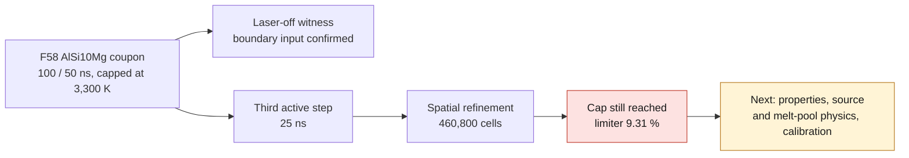

# Twin-turbo M64 at 700 hp — material, cooling and process campaign

Documentary state of September 7, 2026. This note defines **computation branches**,
not a winning alloy, a released supplier recipe or a validated cylinder head.
The [associated dataset](../../twins/m64-cylinder-head/targets/700ps-material-process-candidates.json)
separates test temperature, heat treatment, orientation and unknowns. No
interpolated curve is transferred to a solver map.

## Campaign decision

1. **AlSi10Mg: software/process witness**, to correct the existing AdditiveFOAM
   coupon with consistent data, without presenting it as the M64 cylinder head.
2. **CP1: heat-spreading branch; HT1: hot-strength branch.**
   Compare identical geometries before optimizing each one. The heat treatments
   and test conditions differ: the figures below do not by themselves
   rank complete cylinder heads.
3. **A20X and AlF357: alternatives**, respectively if the conditions of the A20X
   hot tests are obtained, and as another documented LPBF aluminum route.
4. **Machined 2618: conventional benchmark**, without presuming an LPBF recipe.
   **718: mass/conduction comparison**, not a proposal for a whole cylinder head
   by default. A valve or insert material is not automatically a
   good cylinder-head body material.

The 700 metric horsepower at the crankshaft (PS) give neither the thermal power
transmitted to the cylinder head, nor its maximum pressure. The loads must come from the engine
campaign: cylinder pressure versus crank angle, local fluxes, air temperature and
flow, oil circuit, mixture richness, ignition advance and transient scenarios.

## What is actually measured

`YS` denotes the yield strength as labeled by the source; a 0.2 % offset
is not invented. A treatment at 400 °C is not a test at 400 °C.

| Candidate | Useful data and exact state | Limit for our computation |
|---|---|---|
| AlSi10Mg | An experimental study on M290, 60 µm layers, vertical specimens with unmachined surface, after 350 °C/2 h, gives UTS 280.2 MPa at room temperature, 162.8 at 250 °C and 34.4 at 450 °C. | These points are **not** those of the EOS 30 µm/T6 route. No curve transfer between states. |
| Aheadd CP1 | At 200 °C: YS 126, UTS 149 MPa, elongation 17 %, after 400 °C/1 h, vertical, M290/60 µm. The sheet gives k = 187 W/(m·K) after 400 °C/4 h, but without stating the temperature of that measurement. | The 1 h hot point does not qualify the 4 h state. A consistent map of k(T), Cp(T), E(T), plasticity and fatigue for the same state is missing. |
| Aheadd HT1 | Treatment #2: at 200 °C YS 270/UTS 293 MPa; at 250 °C YS 216/UTS 265 MPa. Treatment #1: 238/268 and 188/225 MPa respectively. | Recipes #1/#2 not published. No k(T), Cp(T), expansion, creep or thermomechanical fatigue qualified here. |
| A20X | Hot table: YS/UTS 311/331 MPa at 200 °C and 215/224 at 250 °C. Announced density 2.85 g/cm³. | The hot table does not state treatment, orientation, hold time or sample size. **Do not label it T7** by proximity to another table. |
| AlF357 | EOS M290/30 µm route: after T6, vertical, YS 265/UTS 330 MPa at room temperature; k announced 150 W/(m·K), measurement temperature not stated. | A good room-temperature sheet does not constitute a hot law. |
| 2618 | NASA: curves for extruded 2618-T6511, including hot tests after 100 h at the test temperature. | Neither FVD billet identified, nor forged 2618-T61, nor LPBF state. Do not convert into M64 allowables. |
| INCONEL 718 | Material bulletin: Cp 435 J/(kg·K) at 21 °C; annealed/aged state, k ≈ 11.39 at 21.1 °C and 14.42 W/(m·K) at 204.4 °C; density ≈ 8.22 g/cm³. | Conventional data, not an LPBF map. At equal volume, about three times the mass of an aluminum at 2.73 g/cm³; much lower conduction in these states, not a computed cylinder-head thermal resistance. |

Original sources: [Lehmhus et al., Materials 2022, 15, 7386, pp. 1, 5–6](https://mdpi-res.com/d_attachment/materials/materials-15-07386/article_deploy/materials-15-07386.pdf),
[Constellium CP1, 2021 sheet, p. 2](https://assets.foleon.com/eu-central-1/de-uploads-7e3kk3/41170/product_sheet_aheadd_cp1_nov_2021docx.e81a7d073ebf.pdf),
[Constellium, Formnext 2021 presentation, p. 9](https://assets.foleon.com/eu-central-1/de-uploads-7e3kk3/41170/2021-11-8_constellium_aheadd_formnext_final.a0a8c4307e76.pdf),
[Constellium HT1, p. 1](https://assets.foleon.com/eu-central-1/de-uploads-7e3kk3/41170/aheadd_ht1_fact_sheet_230620.ccac52e244fb.pdf),
[ECKART A20X, pp. 4–5](https://www.eckart.net/en/download/document/view/id/519),
[EOS AlF357 M290 30 µm](https://www.eos.info/metal-solutions/data-sheets/aluminium/pds-eos-aluminium-alf357-eos-m-290-30um),
[NASA CR-4517, figure 3, printed p. 64 / PDF 68](https://ntrs.nasa.gov/api/citations/19930022454/downloads/19930022454.pdf),
[Special Metals SMC-045, September 2007, pp. 1–2](https://www.specialmetals.com/documents/technical-bulletins/inconel/inconel-alloy-718.pdf).

The PDF figures/tables used were inspected visually; no
illustration or proprietary copy is added to the repository. The 718 bulletin
computes k from the electrical resistivity; its unit conversion is
made explicit in the JSON. The NASA figure separates **hot** tests and tests
**at room temperature after exposure**: they are not interchangeable.
The available mean CP1 expansion coefficients are averages over
intervals, not a local function alpha(T). See also the
[corrected earlier material transcriptions](M64_HOT_MATERIAL_SOURCE_REVIEW.md).

For HT1, the specimens are machined, Z direction, M290/60 µm, NF EN ISO 6892,
with a hot test rate of 5×10⁻³ min⁻¹. Hot plastic strain levels,
creep and fatigue therefore cannot be deduced from a simple ultimate
tensile test. A vendor sheet does not replace coupons of the selected lot/process.

## Modern machine and recipe: three distinct levels

| Level | Documentary reference | What remains to be verified |
|---|---|---|
| Published CP1 coupon example | 370 W, speed 1,400 mm/s, nominal spot 100 µm, hatch 0.13 mm, layer 60 µm, build plate 150 °C; treatment 400 °C/4 h. | Optical definition of the spot, complete atmosphere, sequence, contours, powder/lot and validation on the chosen machine. |
| Current EOS route | M400-4, parameter set `AlCP1_060_M404`, 60 µm, build plate 150 °C, argon, HSS blade, Aerospike Nozzle, EOSPRINT ≥ 2.13; treatment 400 °C/4 h; TRL 3 stated. | Power, speed and hatch of the EOS set not published on this page: **do not silently replace them** with the 2021 example. |
| Representative Chinese machine | Eplus3D EP-M400: volume 400×400×450 mm, height including the build plate; options of 1 to 6 lasers, 500 W in particular; spot 70–120 µm, layers 20–120 µm, argon or nitrogen. | The supplier does not publish here a CP1 qualification, a guaranteed 150 °C preheat or a recipe equivalent to EOS. |

Sources: [Constellium example](https://assets.foleon.com/eu-central-1/de-uploads-7e3kk3/41170/product_sheet_aheadd_cp1_nov_2021docx.e81a7d073ebf.pdf),
[EOS M400-4 route](https://www.eos.info/metal-solutions/data-sheets/aluminium/pds-eos-aluminium-constellium-cp1-eos-m-400-4-60um),
[EP-M400 specifications](https://www.eplus3d.com/products/ep-m400-metal-3d-printer/).

**Choice for the virtual campaign, not an order:** EP-M400 envelope and one
active laser for the first coupons, with the CP1 example as the documentary
starting point. The simulation must stop at "recipe to be transferred" as long as
preheat, real profile, material and calibration are not available.
The use of several lasers and their overlaps will be a later variant.
No purchase, supply or factory parameters were obtained by this study.

## Cooling: forced air, then measured oil assistance

Keep the non-oval reference outer envelope and the proven
interfaces. Evaluate at identical outer geometry and loads:

- **A — forced air only:** fins, deflectors and circulation paths;
  conjugate solid/air computation, pressure losses, flow actually delivered by the
  fan, temperature of the exhaust/spark-plug bridges and gradients at the seats.
- **B — air + localized oil:** same base, with an accessible passage near the
  hot zones and a drainable return. Compare thermal gain, mass, stiffness,
  flow, pump power, reservoir heating and lubrication margin.

This is not an idea to impose without comparison: the current manufacturer page
FVD 104 993 02 already describes an upper pocket and drilling for oil
cooling from the 993 cam carrier. It gives neither dimensions nor flow rates. It
announces **a 7000-series aluminum**, unlike the 930/2618 benchmark provided
by the user: do not confuse these references. [FVD, 993 GT2/Turbo cylinder head](https://www.fvd.net/us-en/FVD10499302/billet-993gt2-993-turbo-cylinder-head.html).

The geometric benefit of additive manufacturing is demonstrated on another component by the
internal channels of the Porsche/Mahle/Trumpf GT2 RS pistons. The results
announced for these pistons are not transferable to our M64 cylinder head.
[Porsche, Christophorus 397](https://christophorus.porsche.com/fr/2020/397/technique-3d-print.html).

Balance to be filled in, without an invented coefficient:
`Q_oil = mass_flow × integral(Cp_oil(T) dT)` and
`P_pump = pressure_loss × volume_flow / efficiency`.
Measure in the model the share rejected by the air, the oil, the contacts and
transient storage; do not count twice a heat passed from the solid
to the oil. Gas temperatures do not automatically become those of the
metal. The boundary conditions must include hot state, start-up, shutdown
after load and partial loss of ventilation/lubrication according to the safety
plan. No available oil flow is presumed.

For the CAD: preserve the load paths between cylinder seating face, seats and
studs; require cleaning access, inspection and mechanically
defined plugs. Check oil pressure, differential expansion, hot interference of the
inserts, sealing and absence of retention. A gallery that cools
but weakens a bridge or starves the bearings of oil is not an improvement.

## Thicknesses, supports and depowdering

The **1.5 mm threshold remains a provisional DfAM filter of the project**, not a
universal limit nor evidence of strength. EOS for example announces a 0.4 mm
minimum wall for a given AlSi10Mg/M290 route; this process capability
does not release a 0.4 mm engine wall. [EOS AlSi10Mg 30 µm](https://www.eos.info/metal-solutions/data-sheets/aluminium/pds-eos-aluminium-alsi10mg-eos-m-290-30um).

Evaluate separately fins, pressure walls, bridges between seats, guide
bores and fastening zones. The useful thickness is the one **after machining**,
admissible defects and tolerances, with a minimum coming from the mechanical and
thermal computation in addition to the LPBF capability. A measurement along a few rays does
not qualify a whole solid.

Each cavity must have a truly connected powder exit, passable
sections and an orientation/cleaning sequence. Prohibit
internal supports that cannot be removed. Check channels near the
seats, purge holes and tool access. Simulating connectivity and
rotation is not evidence that a cohesive powder will flow out; residual
checks, inspection and cleaning tests remain necessary before
heat treatment. [Solukon, depowdering FAQ](https://www.solukon.de/en/faq/),
[EOS/Solukon, design and depowdering](https://www.eos.info/content/blog/2025/solukon-on-automated-depowdering-for-am-production).

## F58: scientific correction to execute next

The [F58 energy receipt](../../twins/reference-917-engine/evidence/f58-energy-diagnostic/energy-summary.json)
concerns **a rectangular AlSi10Mg coupon of 57,600 cells**, neither the oval,
nor a cylinder-head STEP, nor CP1. Two real 120 µs computations use 100 and
50 ns. Algebraic cross-computation re-verified on September 7, without a new simulation:

| Quantity | 100 ns | 50 ns |
|---|---:|---:|
| Incident: 380 W × 120 µs | 45.600 mJ | 45.600 mJ |
| Integrated absorbed laser | 31.55219 mJ | 31.55755 mJ |
| Absorbed / incident | 69.1934 % | 69.2051 % |
| Artificial limiter sink | 3.33700 mJ | 3.33147 mJ |
| Sink / absorbed laser | 10.5761 % | 10.5568 % |
| Capped peak | 3,300 K | 3,300 K |

The recomputation of Kelly does not reveal a source creating more than 380 W.
The floor `etaMin=0.35` is not the constant absorption; the simulated
isotherm feeds back on the absorption. The precise closure of the equation
**including the artificial sink** validates neither a physical temperature nor a process.

Reading of the exact inputs: initial interior T 293.15 K, bottom/sides
imposed at 300 K; the net incoming flux of about 3.8 mJ is therefore not, by
itself, evidence of a sign error. `nOuterCorrectors=0` does not resolve the
full convection of the melt pool. The existing map uses the same k/Cp coefficients
for powder and solid; check their relevance and the powder fraction,
not import these properties into CP1. No complete model of vapor recoil
or free surface has been added to the coupon.

Order of the next trials, with inputs and witness results kept:

1. **Laser off, the only change being power = 0**: same ICs/BCs, duration,
   material, mesh, cap; integrate sensible/latent storage and fluxes.
   This isolates the effect of the boundaries in a witness case, without authorizing a
   linear subtraction of the two nonlinear melt pools.
2. **Third time step and a distinct spatial refinement**, with physics
   unchanged: conservative fluxes, source profile, molten volume, unclipped
   temperatures where they exist, and limiter energy. Peaks that are all
   capped are not physical convergence.
3. **Correct the physics, not the verdict**: check the validity domain of the
   properties and the optical definition, then convection/Marangoni if documented.
   If the vaporization regime is outside the model's domain, acknowledge this gap and
   use a tested formulation; do not tune absorption or Tmax to
   get through the gate.
4. **Independent calibration** on a measured melt-pool geometry and a comparable
   process. The documented ORNL tool `calibrateHeatSource` targets the `projected`
   model and repeated measured depths; it is not a direct calibration
   without measurement of the SuperGaussian/Kelly currently used.

### Laser-off witness actually executed

After the documentary review, the step-1 witness was run on Kali on
September 7 at 19:33–19:34 UTC: 2 CPUs, 4 GiB, external stop set at 300 s,
actual duration 37.9 s. The zero exit code is verified from the final state of the
container, separately from the completeness of the log. The container was deleted
after its state was retrieved; no earlier result was overwritten.

Only `constant/scanPath` differs from the F58 100 ns case: power 380 W → 0 W.
The other input digests are identical, notably Tmax = 3,300 K,
the ICs/BCs, the Kelly model, the mesh and the AlSi10Mg map. The 1,200 steps
reach 120 µs. The results with the same discrete balance are:

| Laser-off witness | Result |
|---|---:|
| Maximum temperature recorded | 299.99702 K |
| Net boundary input | 4.040712916 mJ |
| Sensible storage | 4.040712929 mJ |
| Laser / latent / advection / limiter | 0 / 0 / 0 / 0 mJ |
| Integral of absolute residual / net boundary input | 3.166×10⁻⁹ |

Normalization by the laser energy is undefined in this witness and is
not used. The heat input through the boundaries is thus confirmed without
laser. **This witness does not correct the active-laser case**, whose limiter
remains significant; the two responses are not subtracted linearly.
Spatial refinement and calibration are not executed in this sub-batch.
A third active step was then run separately, as described below.

Digests of the repatriated private receipt: result
`3acf16c293c77fb0aa7f5f89dbc98fe76613b5844c33c0346d8f679f57650c57`,
input manifest
`b7218c6908e94e7bb72ed7ecb7435df901981fe0f10d4f36086f55ccc57ee222`,
process exit evidence
`85f0f21987aeb682ec3c695187163f8603a92ab890e0c1c20a98224eb43ced79`.
The associated JSON takes over only the aggregates; logs and fields
remain private. The image and binary digests are those of the F58 receipt.

### Third active-laser step: 25 ns

A new copy of the **active 100 ns** case was run after the Kali slot was freed
by the geometry work. Only `deltaT 1e-07` becomes `2.5e-08`
in `system/controlDict`; power 380 W, Tmax 3,300 K, absorption, material,
ICs/BCs and mesh remain unchanged. The receipt verifies the absence of any other
difference, as well as the integrity of the original inputs after execution.

The 4,800 steps reach 120 µs in **131.7 s**, with process return 0,
no OOM or timeout, under 2 CPUs/4 GiB and an external limit of 300 s. The container is
deleted after the evidence is retrieved; the old results are kept.
The [numerical receipt for the three levels](../../twins/reference-917-engine/evidence/f58-energy-diagnostic/time-refinement-three-levels.json)
contains the full integrals, digests and difference computations.
In its version 3, the canonical status of the 25 ns case alone is
`solver_exit_code=0`, `solver_exit_status_verified=true`, tied to the Docker
evidence; the parser-only `null/false` values are kept under
`log_parser_process_status`. The codes of the old 100/50 ns cases remain
unknown in this receipt. The enrichment modifies no balance or difference
computation. Digest of the enriched receipt:
`610465cc2a68bd81464d7e5d8f619a7102be791d11e052de92e4c52b90b83cbb`.
The field `strictly_monotonic_three_values` describes strict monotonicity:
it stays false for the constant advection. Its renaming changes no
criterion, figure or formula; the earlier receipts are kept.

| Energy over 120 µs | 100 ns (mJ) | 50 ns (mJ) | 25 ns (mJ) |
|---|---:|---:|---:|
| Sensible storage | 28.331056 | 28.340616 | 28.346910 |
| Latent storage | 3.692310 | 3.692401 | 3.692608 |
| Boundaries, net incoming | 3.808165 | 3.806926 | 3.806254 |
| Absorbed laser | 31.552192 | 31.557546 | 31.562272 |
| Artificial limiter | 3.336999 | 3.331473 | 3.329043 |

Advection remains zero. At 25 ns, the limiter removes **10.5475 %** of the
absorbed laser energy. The three peaks are still capped at 3,300 K: **no
order of convergence is computed for the maximum temperature**.

For the integrals that are not directly capped, the simple estimator
`p = log2(abs((Q100-Q50)/(Q50-Q25)))` is evaluated only when the
successive differences have the same sign and decrease. It gives **apparent
orders of the discrete model still subject to the limiter**: 0.603 for
sensible storage, 0.880 for the boundaries, 0.180 for the laser and 1.186 for the
numerical sink. These are neither proven orders of the solver nor a
physical extrapolation. The latent gap increases between the last two
resolutions: no positive order is kept for this quantity; the
identically zero advective transport provides no order either.

The relative gap 50→25 ns is 0.0222 % for sensible storage and 0.0730 % for the
limiter. Despite these small differences, the disparate orders and the latent term
demonstrate **no common asymptotic regime**. The integral of the absolute
residual normalized by the laser goes from 3.77×10⁻⁷ to 7.67×10⁻⁷ then
1.52×10⁻⁶: it is not announced as improving. The columns are
cross-checked by the same independent sum as F58.

**Decision:** stop temporal refinement alone as a remedy for the cap.
The steps still useful are the spatial check and the physical verification/calibration
of the source and the melt pool. Neither the smaller step nor the clean process
return releases manufacturing.

### Spatial refinement executed next: 460,800 cells

On September 8, the grid was halved in each direction at an
unchanged 25 ns. The 4,800 steps reach 120 µs in 1,282.135 s on Kali,
with no Vast rental. The [spatial report and its evidence](M64_F58_SPATIAL_REFINEMENT_20260908.md)
distinguish native exit 0, a strict refusal by the launcher caused by four
added metadata fields, and a separate cross-check of the preserved inputs.

The artificial sink goes from 3.329043 to 2.964055 mJ, i.e. from 10.54754 % to
9.30932 % of the absorbed energy. **The cap is still reached: spatial
refinement alone did not resolve the physical defect.** Two meshes do not give
an order of convergence; two parsers of the same logs are not
two independent physical models. Verification of the properties, of the
source and of the melt-pool physics, then their calibration, remain necessary.

Sources: [AdditiveFOAM theory](https://ornl.github.io/AdditiveFOAM/docs/theory/),
[boundary conditions](https://ornl.github.io/AdditiveFOAM/docs/boundary-conditions/),
[ORNL calibration](https://ornl.github.io/AdditiveFOAM/docs/heat-source-calibration/).

The global build computation comes **afterward**: deposition history, supports,
build-plate contacts, hot plasticity/relaxation, removal, heat treatment and
machining. It must produce distortion and stresses with verified convergence.
A layer animation or an Omniverse render demonstrates none of these
properties. As of this date, none of these branches releases manufacturing or
engine start-up.
