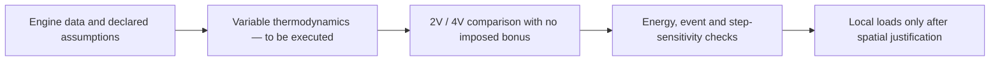

# M64 700 PS — thermodynamic cross-check and limits of the inherited models

The cross-check verifies equations and their integration, **not a validated engine load**. It demonstrates neither a 4V gain, nor thermal or mechanical integrity, nor the manufacturability of the cylinder head. The 700 PS balance is unchanged.

## What the old models do not demonstrate

- [F33](../../twins/reference-917-engine/source/run_integrated_virtual_validation_f33.py) imposes on the 4V a volumetric efficiency multiplied by `1.035` and a distinct combustion duration factor. These advantages are model inputs, not improvements established by the ports or the valves.
- [F46](../../twins/reference-917-engine/source/run_cantera_2v_4v_crank_cycle_f46.py) concerns another engine: 90 × 70.4 mm, 12 cylinders, 9,000 rpm and compression ratio 9.5. Its kinetic branch uses n-dodecane and autoignition, not a qualified spark-ignited 98 RON gasoline.
- In F46, mass capture at intake closing remains hard-coded at `230°`. Changing only the valve timing contract is therefore not enough for a correct M64 adaptation.
- Its global heat transfer, called "Woschni-like", is an uncalibrated screening coefficient. The area adds two piston areas and the exposed liner: it is not the local cylinder head flux.

The [official Cantera engine example](https://cantera.org/3.2/examples/python/reactors/ic_engine.html) is itself a simplified diesel illustration. Its availability does not validate its transfer to our engine.

## Data taken over and declared assumptions

The [frozen balance](../../twins/m64-cylinder-head/targets/700ps-balance-20260907.json) describes a scenario, not a dyno measurement:

| Quantity | Value and scope |
|---|---|
| Engine target | 700 metric PS at the crankshaft, 514.849 kW; 6 cylinders, 6,500 rpm, 3.6 L nominal |
| Consumption and fuel | BSFC 0.34 kg/kWh, LHV 43 MJ/kg, stoichiometric AFR 14.7: balance assumptions |
| Mixture | λ = 0.82; φ = 1/λ = 1.219512; the chemical composition remains to be defined |
| Mass per combustion event and per cylinder | Air 1.803450 g; fuel 0.149614 g, derived from the balance at 325 events/s |
| Documentary geometric reference | 100 × 76.4 mm and compression ratio 8:1 for the 993 Turbo S; not a certification of the interfaces or of the 4V chamber |
| Assumptions specific to the control case | Rod/crank ratio 3.5; intake closing −130°, exhaust opening +140°, zero residuals; angles referenced to combustion TDC |

The documentary geometry comes from [Porsche](https://newsroom.porsche.com/en/history/porsche-history-white-giants-991-turbo-964-turbo-3-6-993-turbo-s-13863.html). It gives a computed 3.600265 L, distinct from the nominal 3.6 L rounding used in the balance.

## Cross-check actually executed

A standalone local script integrated only the closed stroke, with no new CAD, rental or Cantera installation. The fluid is a **constant-property ideal gas** (`R = 287.05 J/kg/K`, `γ = 1.35`), with no species conversion. The air + fuel mass is assumed trapped; `T_IVC = 333.15 K` and `p_IVC = mRT/V`, without forcing this pressure to equal the manifold pressure.

The prescribed heat release is a normalized Wiebe law:

```text
x_b = [1 − exp(−a z^(m+1))] / [1 − exp(−a)],  z = (θ − θ0)/Δθ, limité à [0,1]
Q_prescrit = η_comb × m_carburant × PCI
dU/dθ = dQ_prescrit/dθ − p dV/dθ − dQ_parois/dθ
```

(`limité à [0,1]` = clamped to [0,1]; `Q_prescrit` = prescribed heat; `m_carburant` = fuel mass; `PCI` = LHV; `Q_parois` = wall heat.)

Assumptions: `a = 6.908`, `m = 2`, `Δθ = 65°`, `CA50 = +12°`, `η_comb = 0.94`. Two branches were executed: adiabatic, and the global heat transfer coefficient inherited from F46 with a wall at 475 K. Each uses steps of 1°, 0.5° and 0.25°; these are neither two independent physics nor two cylinder head architectures.

Six assertions passed. On the adiabatic motored control case at 0.25°, the maximum relative deviation from the analytic invariant `pV^γ` is `2.92544 × 10⁻¹²`; the net work of the symmetric stroke is `7.66 × 10⁻¹² J`. The first-law residual checks the integrator's bookkeeping, separate from this analytic control case.

This does not prove physical convergence: the prescribed heat integral varies non-monotonically with the step, notably at the end of combustion, which is not aligned with the grid. Events will have to be aligned, or their increments integrated exactly, before concluding on an order of convergence. No pressure computed here is transferred as an FEA/CHT load.

## Next scientific contract, not yet executed

The next computation must use variable thermodynamic properties and an explicitly chosen composition, with the same combustion assumptions for 2V and 4V. No filling or burn-rate bonus may be attributed to the number of valves alone.

The [Cantera reactor equations](https://www.cantera.org/3.2/reference/reactors/ideal-gas-reactor.html) allow `U = m ΣY_k u_k(T)`. The first law must include incoming and outgoing enthalpies when the valves are open; a closed stroke covers neither pumping, nor friction, nor crankshaft power.



The [Cantera wall exchange](https://www.cantera.org/stable/reference/reactors/interactions.html) prescribes, among others, a transfer `hA(T_g − T_w)`; it does not solve conduction in our cylinder head. Distributing the flux over native surfaces, qualifying the coefficients and building the solid interfaces remain necessary before a CHT comparison. The difference fuel power − crankshaft power is not the cylinder head heat.

## Traceability and status

- Frozen balance, SHA-256: `db181428b99fdf23dea0cd7725e9b6ff3fa37dd6ec752eb2db9fd0f68c3a67ac`; input verified unchanged.
- Standalone script, SHA-256: `c5b78586e52f2ed8d7efbf46dfe31279a52c93b288c394f7bd9808d27553585c`.
- Private report kept, SHA-256: `597d6542433cd7ae34a9e6dc032b67a1922525af7180e947157ea246a2797e06`.
- F46 inspected, SHA-256: `29f5cf4984e7cba754c3427f1f6ff974a5677673d27110f8b7a17f9bd4a81045`.

Status: local numerical cross-check complete; 2V/4V performance comparison not performed; FEA/CHT transfer not authorized; physical validation and manufacturing not authorized.
