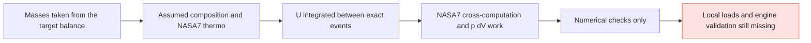

# M64 700 PS — first computation with variable thermodynamics

The closed 0D computation was actually run with Cantera 3.2.0: properties and composition vary, the prescribed events are integrated at their exact angles, and five independent energy cross-audits pass. This is progress in method, not the validation of a cylinder head, of a 700 PS engine or of a four-valve gain.

This checkpoint extends [the audit of the inherited models](M64_700PS_CYCLE_MODEL_AUDIT_20260908.md). Sources and detailed trajectories remain private; the digests and measurements are in the [evidence capsule](../../twins/m64-cylinder-head/evidence/variable-thermo-cycle-20260908.json).

## What changed

Cantera provides the NASA7 properties; SciPy integrates the total energy. The new computation takes over neither a constant γ, nor an imposed 4V filling gain, nor diesel auto-ignition with n-dodecane. The [NASA coefficients shipped with Cantera v3.2.0](https://raw.githubusercontent.com/Cantera/cantera/v3.2.0/data/nasa_gas.yaml) were compared exactly with the six records used.

The model uses `U = m Σ Yk uk(T)` and, for this closed adiabatic witness case, `dU/dθ = −p dV/dθ`. Formation energies are included: no LHV or additional heat release is added. The composition follows `Y = (1−xb)Yreactants + xbYproducts`; `xb` is a normalized Wiebe law, not a computed kinetics. The [Cantera conservation equations](https://cantera.org/3.2/reference/reactors/ideal-gas-reactor.html) make this dependence on composition explicit.

## Assumptions kept visible

- Air/fuel masses taken from the target balance at 6,500 rpm, with an assumed BSFC: they are not an independent prediction of 700 PS.
- Documentary geometry 100 × 76.4 mm, compression 8:1; connecting-rod/crank ratio of 3.5 assumed. This is not the CAD geometry of the cylinder head nor evidence of 4V compatibility.
- Homogeneous initial charge at 333.15 K, all fuel gaseous, no residual gases. Pure iso-octane is a declared thermodynamic surrogate, not the real RON98 gasoline.
- Prescribed rich products: CO₂, CO, H₂O and N₂, with conservation of elements and mass. No H₂, dissociation, NOx, soot, chemical equilibrium or flame speed computed.
- The real air/fuel ratio kept gives `λsurrogate = 0.802124`. The historical `λ = 0.82` used a stoichiometric AFR of 14.7; that of the surrogate is 15.027602. These two values are not conflated.
- IVC −130°, EVO +140°, CA50 +12°, Wiebe duration 65°, `a=6.908`, `m=2`, angles relative to combustion TDC. Wiebe start/end: −18.189938°/+46.810062°. These angles are assumed, not measured.

IVC and EVO are the effective bounds of the integration. Wiebe start/end, TDC and CA50 are also bounds, even when they do not coincide with a regular step. This does not mean that exchanges through open valves are simulated. The motored witness case without combustion stops at +130°, symmetric to its initial point.

## Numerical evidence obtained

One local run of five cases: 1.804 s, about 96.4 MB peak memory, no new Vast rental. Limits: 120 s CPU and 120 s wall-clock. Inputs and sources remained unchanged.

Cantera uses the [NASA7 polynomials](https://cantera.org/3.2/reference/thermo/species-thermo.html#the-nasa-7-coefficient-polynomial-parameterization). The states returned by `UVY` and checked at right-hand-side evaluations and at the outputs are refused outside 200–6,000 K; this does not attest to every internal evaluation of the inversion algorithm. The range actually sampled with combustion is 333.15–2,521.776 K; `cv` varies from 803.986 to 1,214.301 J/(kg·K). These are states of the assumed model, not validated cylinder-head temperatures.

The cross-auditor imports neither Cantera nor the producer. It re-evaluates the raw coefficients, the equation of state, the geometry and the composition, then separately integrates `p dV` by Simpson's rule on the recorded intermediate states. It does not reuse a work integrated with the producer's energy state.

| Case | Maximum cumulative energy residual |
|---|---:|
| Motored, no combustion | 2.670902 × 10⁻⁹ J |
| Prescribed combustion, max step 1° | 4.110507 × 10⁻⁶ J |
| Same model, 0.5° | 2.467864 × 10⁻⁷ J |
| Same model, 0.25°, 2V and 4V labels | 7.114585 × 10⁻⁸ J each |

Numerical threshold unchanged: `10⁻⁶ × 4,866.232173 J = 0.004866232 J`. This scale is the reference drop in internal energy of the prescribed products; it is neither an injected external heat nor the heat received by the cylinder head. The entropy drift of the motored witness case is 2.665729 × 10⁻⁹ J/(kg·K), below the fixed threshold of 10⁻⁴.

The three levels show a decrease in the balance error, without demonstrating a global order of convergence of the adaptive solver [DOP853](https://docs.scipy.org/doc/scipy-1.14.1/reference/generated/scipy.integrate.solve_ivp.html). The CSV files labeled 2V and 4V have exactly the same digest: this is a check for the absence of an artificial bonus, not a comparison of two real geometries.

Verification: 13 producer tests and 11 auditor tests, all passing. A SciPy 1.15.3 preflight had failed at native loading before the computation; it is kept as a failure. The official SciPy 1.14.1 macOS12 wheel was then used in a fresh isolated environment. The six wheels and the upstream coefficients are verified by digest. The Newton refinement of the `UVY` inversion uses the same native `cv`, without changing the thermodynamic data or relaxing the energy check.

## What still blocks transfer to the product

Missing: full gas exchange, residuals, losses and shaft power, a calibrated combustion and the real effects of the 2V and 4V ports/valves. The wall is adiabatic: no distribution of flux toward the cylinder head, the cylinders, the air or the oil is computed here.

The pressures of this model are not validated FEA loads; they are not compared as a gain with the old constant-γ values, since the composition and the chemical balance have also changed. The next local loads will have to be built and checked separately before a strength or cooling analysis. No FEA/CHT transfer, no 700 PS target reached and no manufacturing authorization result from this checkpoint.
