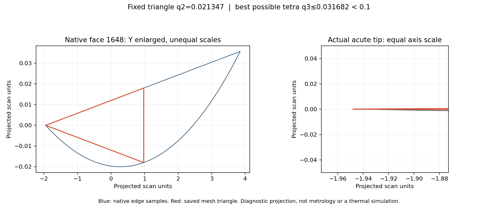
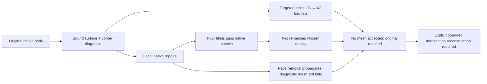

# M64 — adaptive meshing and acute-face diagnosis, 28 September 2026

## Result and limits

**The best new defect count is 47, down from 86; no mesh is accepted.**
This is a 45.3% reduction in below-threshold tetrahedra, not a percentage of
head completion. Minimum quality gets slightly worse in that trial. The
acceptance limit remains `minSICN >= 0.1` for every tetrahedron.

Following the [57-trial campaign](M64_PARALLEL_CAD_CAMPAIGN_20260928.md), this
continuation executes six more volume-mesh attempts, eleven distinct local
CAD repair recipes, native BOP checks, a fixed-face mathematical bound, and
native corner measurements. All calculations run on the existing 64 GiB Mac
using OCP 7.9.3.1 and Gmsh 4.15.2. **No new rental or cloud expense is incurred.**

The source remains the pinned, scan-derived 935 research body, not certified
M64 interfaces. Coordinates are provisional scan units. A result expressed
in those units is not evidence of physical 0.040 mm accuracy. No master,
catalogue release, anatomical boundary condition or installed assembly changes.



*Blue: sampled native edges; red: an actual rejected surface triangle. The
left panel deliberately enlarges the vertical scale; the right uses equal
axis scales. This is a numerical diagnostic, not a product photograph,
thermal field, dimensional certificate or printing simulation.*

Scan provenance: [Wolfe Classics source record](../../catalog/sources/src-wolfe-classics-935-billet-cylinder-head-scan.json).
The native body, meshes and raw coordinates remain private. The requested
documentation figure is the only geometric illustration published here.

## 1. Adaptive meshing on unchanged CAD

The [adaptive runner](../../twins/m64-cylinder-head/source/wholebody/trial_adaptive_native_mesh.py)
reuses the frozen native mesh helper, its face-binding check and every
existing volume/quality gate. Surface meshing is MeshAdapt; volume meshing
is Delaunay followed by Netgen optimization. Each process is limited to
600 seconds, with parent cleanup at 610 seconds and a 1.5-million-tetrahedron
audit ceiling. Source and input hashes must remain unchanged.

The three recipes are:

- `low-minimum`: reduce the mesh-size lower clamp from 0.5 to 0.005, retaining
  the 3-unit upper clamp; no point sizes.
- `short-edges`: additionally size the endpoints of curves shorter than
  0.25 on diagnosed poor surface faces. The target is
  `max(0.005, min(0.05, 0.75 * curve_length))`; 34 points are selected.
- `short-edges-smooth`: the same sizing plus five `Relocate2D` iterations
  before volume generation.

The effective overrides and selected points are recorded in `recipe.json`.
The frozen helper's initial `explicit_options` are not a substitute for this
companion receipt. This use of size clamps, point sizing and surface relocation
follows the [Gmsh manual](https://gmsh.info/doc/texinfo/#gmsh_002fmodel_002fmesh_002foptimize).

| Trial | Tetrahedra | Below 0.1 | Minimum minSICN | Outcome |
|---|---:|---:|---:|---|
| Previous original, 0.5–3 | 538,968 | 86 | 0.025680802 | Reference, rejected |
| Original, lower clamp 0.005 | 1,303,773 | 81 | 0.027964333 | Rejected |
| Original, short-edge sizing | 1,341,461 | 47 | 0.023337771 | Rejected |
| Original, sizing + Relocate2D | — | — | — | Volume meshing fails |
| Fillet 141/142, radius 0.020, original recipe | 533,623 | 109 | 0.009304677 | Rejected |
| Fillet 142/143, radius 0.020, original recipe | 533,478 | 136 | 0.009341649 | Rejected |
| Face-1648 removal, original recipe | 533,590 | 87 | 0.030083787 | Diagnostic only, rejected |

The [machine-readable table](../media/m64-adaptive-mesh-20260928/mesh-trials.csv)
includes the SHA-256 of each private mesh report. The original row is reused
evidence, not an additional run. All five completed new meshes have positive
Jacobians, one connected region, complete boundary, all native faces covered,
unchanged CAD during meshing and coarse volume agreement within 1%. All five
fail the quality limit and quality-aware export/readback acceptance.

Short-edge sizing reduces pre-volume surface triangles below quality 0.1
from 44 to 23. Surface relocation reduces this count to 20 but triggers
`PLC Error: A segment and a facet intersect at point` during volume generation.
That failure is retained; no colliding mesh is accepted. More tetrahedra alone
are not a reliable improvement: the 47-defect case has 2.49 times the reference
element count and a worse minimum quality.

## 2. Why interior optimization alone cannot close the gate

The [fixed-face audit](../../twins/m64-cylinder-head/source/wholebody/audit_fixed_face_quality.py)
checks the saved reference surface triangulation. The SICN metric uses the
Frobenius condition number of the map from an ideal simplex; see Appendix A.4
of Marot and Remacle's [HXT paper](https://spec.cs.miami.edu/cpu2026/docs/benchmarks/737.gmsh_r/hxt-2020.pdf).
The following bound is a derivation for this audit, not a claim quoted from
that paper.

For a fixed triangular base with ideal-map singular values `a, b > 0`, let
`A = a² + b²` and `q2 = 2ab/A`. For a tetrahedron with no tangential shear,
and third singular value `c`,

```text
q3 = 3 / sqrt((A + c²) * (A/(a²b²) + 1/c²)).
```

Tangential shear increases both factors in this product. Its optimum is zero.
Minimizing the remaining product gives `c² = ab`, hence

```text
q3 <= 3ab/(A + ab) = 3*q2/(2 + q2).
```

Thus `q3 >= 0.1` requires `q2 >= 0.06896551724` for a retained fixed face.
The reference mesh has **27 incompatible fixed triangles on 17 surfaces**.
The worst triangle is on bound surface 1648: `q2 = 0.02134670874`, so even
the optimal free apex cannot exceed `q3 = 0.03168191085`.

Twenty synthetic tetrahedra test the formula against Gmsh's actual metric:
four base shapes, each with an optimal apex and four displaced/scaled apices.
The optimum attains the bound to `1e-12`; other tested apices remain below it.
The algebra is exact; the input measurements and native metric evaluation use
floating point, not certified interval arithmetic.

**Scope matters:** the bound applies to these fixed linear triangles. Surface
remeshing can remove that restriction. It is not proof that every future mesh
of the CAD body, or every solver discretization, must fail.

## 3. Native acute corners and repair trials

The [native audit and renderer](../../twins/m64-cylinder-head/source/wholebody/audit_native_acute_faces.py)
match native curve endpoints within `1e-7` and measure their inward tangent
rays. These are geometric identifiers, not inferred valve-seat or port roles.

| Native face | Minimum measured ray angle |
|---|---:|
| 141 | 1.995711° |
| 143 | 1.995711° |
| 1411 | 1.444691° |
| 1413 | 1.371396° |
| 1648 | 1.371396° |

The short side of the worst saved triangle is about 0.0360 scan unit; the
other sides are about 2.92. This is an acute cylindrical patch bounded by
long curves, so the short-native-edge sizing rule does not remove its cause.

The [bounded repair runner](../../twins/m64-cylinder-head/source/wholebody/trial_acute_cylinder_blend.py)
tests separate copies. Fillets and chamfers may affect only the selected edge
and its endpoint-incident faces, at most eight. Contour propagation, increased
maximum native tolerances, changed protected serializations, invalid geometry,
multiple solids or input mutation reject the result. A locally admitted body
is still pending BOP, deviation, independent volume checks and remeshing.

| Native operation | Result |
|---|---|
| Fillet 141/142 at 0.020 and 0.050 | Both valid; four-face patch; unchanged protected data and maximum tolerances; BOP passes |
| Fillet 142/143 at 0.020 and 0.050 | Both valid; four-face patch; same checks pass |
| Fillet 1647/1648 at 0.005 and 0.020 | Builder completes, but body is invalid and tolerances increase; rejected without candidate export |
| Fillet 1647/1648 at 0.050 | Native build fails (`ChFiDS_StartsolFailure`) |
| Chamfer 1647/1648 at 0.005 and 0.020 | Invalid native body and increased tolerances; rejected |
| Chamfer 1647/1648 at 0.050 | Native build does not complete |
| Remove face 1648 and extend neighbors | Valid body, but locality/protected-data checks fail; retained only as a rejected diagnostic |

The four good fillets pass the full selected BOP modes: self-intersection,
small edges, rebuild-face, continuity and curve-on-surface, with no reported
faults, errors or warnings. That does **not** make them good mesh repairs:
the two 0.020 variants worsen both the defect count and minimum quality in
the same recipe as the reference. Neither replaces the original. The two
0.050 variants remain unmeshed local candidates, not accepted improvements.

### Rejected face-removal diagnostic

The [OCCT defeaturing API](https://occt3d.com/dev/doc/refman/html/class_b_rep_algo_a_p_i___defeaturing.html)
is designed to remove selected features and rebuild neighboring geometry.
The current web reference is OCCT 8.0.1; execution uses the installed OCP
7.9.3.1 binding and its available methods. The latter does not expose the
defeaturing error/warning accessors. This limitation is explicitly recorded,
and the independent BOP audit remains mandatory.

The selected six-face neighborhood expands to **21 changed face identities**.
The result is one valid solid, without increased maximum stored tolerances,
and its saved-file BOP audit passes. The in-memory input and protected-face
serializations change, however; the on-disk original remains hash-identical.
The result therefore remains **rejected**, under a private filename
`rejected-native.brep`, not a nominated master.

History/area diagnostics show that several changed identities retain the same
surface type and area, and two cylindrical faces merge. Those observations
are not a proof of geometric equivalence. Face 1647 expands; face 1648 is
removed. On 20 sampled original edge points from faces 1648 and 1412,
native point-to-candidate-shell distance reaches **0.03563368196 scan unit**.
These one-way samples do not bound the unsampled surface or the reverse
distance, and cannot certify 0.040 mm.

Adaptive whole-solid volume differences at requested relative epsilons
`1e-6`, `1e-9`, `1e-12` are respectively `−0.012764712`, `−0.013727281`,
`−0.013720761` scan units³. The native returned error estimates are larger
than the finest requested epsilon. This is not independent local-volume
closure; no tight error bound is claimed from the requested epsilon alone.

A diagnostic remesh is allowed solely to test this rejected construction's
usefulness; it does not bypass CAD admission. It produces 87 bad tetrahedra
versus the original 86. This result does not justify adopting the broader
topology change. No thermal or mechanical solver is run on it.

## 4. Decision, reproducibility and remaining work



This continuation identifies a constrained-surface cause and rejects specific
automatic repairs. It does not finish the head. Next work must reconstruct
the acute trimmed intersections explicitly, preserve or prove equivalence
of protected interfaces, establish bidirectional continuous deviation and an
independent local volume check, then rerun comparable full-body meshes.
Repeatedly refining the same incompatible fixed faces, increasing rented RAM
or lowering the quality threshold is not that reconstruction.

The head still requires validated interfaces/scale, material/process data and
the subsequent engine/thermal/structural/LPBF validation program. PhysicsNeMo,
PicoGK, OpenFOAM/CHT, Cantera, CalculiX, AdditiveFOAM and Omniverse are not
falsely credited with new execution in this CAD/mesh continuation. Simulation
alone cannot establish physical qualification of an unmeasured printed part.

### Reproduction entry points

Use the existing pinned native Python environment. All paths below are
operator-provided private inputs; never commit those geometric files.

```bash
python twins/m64-cylinder-head/source/wholebody/trial_adaptive_native_mesh.py \
  --body ORIGINAL.brep --baseline ORIGINAL_BASELINE.json \
  --diagnostic ORIGINAL_FINE_QUALITY.json --recipe short-edges --output FRESH_DIR

python twins/m64-cylinder-head/source/wholebody/audit_fixed_face_quality.py \
  --mesh ORIGINAL_FINE.msh --output FRESH_CEILING.json

python twins/m64-cylinder-head/source/wholebody/trial_acute_cylinder_blend.py \
  --body ORIGINAL.brep --pair 141 142 --radius 0.02 --output FRESH_DIR

python twins/m64-cylinder-head/source/wholebody/trial_acute_cylinder_blend.py \
  --body ORIGINAL.brep --pair 1647 1648 --defeature --output FRESH_DIR

python twins/m64-cylinder-head/source/wholebody/audit_native_acute_faces.py \
  --body ORIGINAL.brep --mesh ORIGINAL_FINE.msh --binding ORIGINAL_MESH_REPORT.json \
  --output FRESH_DIR
```

The two fillet remeshes and the rejected removal control use
`run_parallel_cad_trials.py --mode mesh --recipe 6`, with a freshly computed
native baseline bound to each exact body. BOP checks use
`audit_native_bop.py --input BODY --sha256 SHA --output FRESH_REPORT`.

Private campaign directory: `work/m64-private-20260907/adaptive-mesh-20260928.DciuywPe`.
Selected historical source versions are preserved as `source-v1.tar.gz`
through `source-v6.tar.gz`; receipts identify the specific source hash used.
The final source is committed and archived separately. One removal attempt stopped on an
unavailable API accessor; a later history-extraction run was interrupted and
replaced by indexed native lookups. Neither incomplete execution is counted
as an accepted result. An initial BOP invocation used the wrong CLI argument;
the corrected completed audit is the evidence, not that parser error.

| Private evidence | SHA-256 |
|---|---|
| Original BRep | `b2b48fe40edd1a20c8e6c0d20d77e6045931189f18330b441b09bcbf4618fc0a` |
| Original fine mesh | `6f68a0afd2a07d163bdda07500f36727fce62768046b48abcea369bbccc89dcd` |
| Frozen native mesher | `7171d7b1da250d63086b7fac1e5e1617190ec26f45f2928e729d60582a1d1c04` |
| Fixed-face ceiling report | `deda1a9eba82592aa88956eb8fb97312eed57cd6163da7925ffd1a68a9c43963` |
| Native corner / figure report (`acute-diagnostic-v3`) | `5f9bc9eec672d5ed309edcb7b1172b46db8ae2032cd4f01ef629f353b0ffb40b` |
| Rejected removal BRep | `017ea1f5c0c7140e10c18206d478ef86631c4048f4a5c7a508e712aa30ece413` |
| Removal distance samples | `7d708a8499461b7ae5a8e3aafffa80885099e76f731ae2f4e1c287073b5f0970` |
| Removal area / volume diagnostic | `0f8a0a0bf45c52acc1acde3249ba773060a433f18f531a660e9544fb93635dca` |
| Removal independent BOP report | `11c9ffe8fcc76e25bac21d9d22b6ec477df116ace0e49f548abd03f612233374` |
| Published figure | `303a73068c928fe646ba17a2bcd635420460c4f90bfd5756a4e7f8cd4f9ecf9d` |

Five focused native-environment tests pass, including the 20-tetrahedron
metric witness. They test the new code and algebra, not head qualification.
Full `make check` also passes: 3,194 main-suite tests, 152 skips, followed by
the repository's additional checks. Documentation has zero broken links in
568 Markdown files. Every row of the public CSV was rechecked against its
private report bytes and metrics; the published figure matches the archived
render byte-for-byte. No numerical worker from this continuation remains running.
