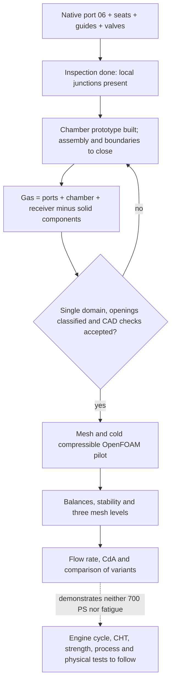

# M64 — intake, chamber and next useful computation

## Geometric result of this follow-up

A **two-facet chamber prototype was built**, starting from the lips of the four
seats of the current module, without reinventing its external envelope.
It is neither an OEM geometry, nor a chosen volumetric ratio, nor an assembled
and validated chamber. The earlier master remains intact.
The [execution receipt](../../twins/m64-cylinder-head/evidence/intake-chamber-candidate-20260908.json)
links the scripts, the inputs, the private exports and the real CAD images by
their digests. The views are not photos of a manufactured part.

The cutting tool is a connected solid of 27,001.825 units³. It removes
9,578.631 units³ of material from the master. These two volumes are distinct
from the closed combustion volume, which still requires the valves, the seats
and the piston position. The eight inserts (seats and guides) are not recut in
volume. The candidate remains a valid B-Rep solid before and after STEP
re-read; this is not a complete BOP check of the body.

The bottom surface outside the documentary Ø100 cylinder is not cut away in
the boolean check. The bounding box varies by only 2.2e−14 unit. Re-reading
the STEP of the removed volume alone changes its volume by 0.01158 unit³; this
gap is kept, not presented as exact metrology. No spark plug bore or oil
circuit is invented.

## Initial inspection, before building this chamber

The inspection concerns the **four-pocket master before the ports are
hollowed out**, the native intake negative 06 and the components of the V2
module. These are not yet the boundaries of a single complete gas domain.
The hypothesis `1 scan unit = 1 mm` is not M64 metrology.

- The two Ø35.6 throat collars, between axial positions 5.99 and 6.00, are
  covered by the port within the recorded integration precision.
  This local test does not on its own establish the sealing of the assembly.
- The raw negative still intersects each intake valve open at 6
  (735.415 units³) and each guide (797.705 units³). These parts must be
  subtracted from the gas, not ignored in a CFD.
- The center of the master is solid at the axial points tested between
  Z=0.001 and 10. This initial master did not contain a chamber roof designed
  for this four-valve M64; the prototype described above is a separate
  operation.
- The coverage of the bottom face under the documentary Ø100 disk is
  2,870.071 out of 7,853.982 units². The complement **is not a leak rate**:
  seats, closed valves and other boundaries must be assembled and classified
  before this interpretation.

Native OCP 7.9.3.1 inspection: 11.294 s, exit 0, 2 CPUs/4 GiB, network
disabled, container deleted. The local image is identified by
`sha256:49979f46f421459dae4bf21aaa898e2253b07301c3e5b2cabaa6eaf06f54d696`.
The private inspection receipt has SHA-256
`e435eb2cd991e55401dc37c27c1baa00765552cd8df2cb677e8e85d66b9e4cec`.
The exact digests of the five inputs are linked to the
[inspection controller](../../twins/m64-cylinder-head/source/flowbench-intake/inspect_pilot.py).
The large files and the private geometries are not redistributed here.

## Intake junction: distinguishing CAD budget and physical precision

Preparing the real port reveals that radii 1 and 0.5 do not fit entirely in
the computation mask protecting the external contour.
Radius 0.25 fits within the conservative bound of this region; this proves
neither a flow benefit nor a sufficient voxel resolution.

A native R0.25 fillet was built and re-read. Its **v1 rejection is kept**:
the historical rule required that no maximum topological tolerance increase,
even on newly approximated surfaces. This rule alone does not allow concluding
that there is a mechanical defect.

The [explicit v2 counter-audit](../../twins/m64-cylinder-head/evidence/local-junction-cad-budget-20260908.json)
modifies no tolerance produced by the kernel and does not replace v1.
It distinguishes unchanged entities from new/locally modified entities, with a
**numerical** budget of 1e−4 unit for the latter, tied to the parameters of the
[OCCT 7.9.3 builder](https://raw.githubusercontent.com/Open-Cascade-SAS/OCCT/V7_9_3/src/ChFi3d/ChFi3d_Builder_1.cxx).
This is not an engine fit tolerance or a measured precision of the scan.

The replayed candidate has the same digest as the v1 one. The 70 3D curve/
p-curve checks, the 66 vertex/curve checks, the four protected external edges,
the nine sections examined outside the authorized region and the BOP after
re-read pass the declared checks. The section changes **within** the junction
zone are quantified: requiring their absence would contradict the intended
shape change.

Local qualification is nevertheless not closed: the volume gain by
before/after difference is 1.784650 unit³, against 1.777202 by boolean
differences, i.e. a residual of 0.007448. It exceeds the cumulative quadrature
estimates of 0.001628 unit³. The OCCT relative estimates were converted to
volume; they are not rigorous bounds of geometric error.
The disagreement remains published. No junction is yet integrated into the
master and no final wall thickness is deduced from a distance to the old body.

## Preregistered virtual flow bench, not yet run

The [pilot contract](../../twins/m64-cylinder-head/targets/intake-flowbench-pilot.json)
sets a cold air flow, intake open at 6, exhaust closed, with a documentary
bore-100 receiver. Lifts 2 and 11.5 will be subsequent cases, not results
interpolated without computation.

The protocol imposes the same fixture, sealing, inlet radius and conditions to
compare the variants. The chosen condition of **28 conventional inches of
water = 6,974.48948 Pa** is a bench depression; it is not forced induction or
a cylinder pressure. This preparation relies on the
[SuperFlow guidelines](https://superflow.com/tech-corner/understanding-and-working-with-superflow-flowbenches/).

The chosen conditions are `p0 inlet = 101,325 Pa`, `T0 inlet = 293.15 K` and
`static p outlet = 94,350.51052 Pa`. These are laboratory hypotheses, not
engine measurements. The reference ideal isentropic flux is
124.730079 kg/(m²·s), with an ideal Mach of 0.320820: compressibility will
therefore not be excluded without verification. **This is not the cylinder
head's flow rate.**
The [NASA formulation](https://www.grc.nasa.gov/www/k-12/airplane/mflchk.html)
provides the normalization and the sonic limit of the ideal gas.

The [reproducible analytic calculation](../../twins/m64-cylinder-head/targets/flowbench_reference.py)
explicitly leaves the real flow rate and the discharge coefficient at `null`.
After an admissible CFD, `CdA = mass flow rate / ideal flux`, then
`Cd = CdA / total area of the two throats`. This area is a declared reference,
not a purported measurement of the minimum passage section at each lift. No
coefficient is converted directly into engine horsepower.

Exploratory guards set before the pilot: relative mass imbalance ≤0.1%,
variation of the mean flow rate between two final windows ≤0.5%, at least
three spatial levels and medium/fine gap ≤2%. The size of the windows and the
treatment of turbulence must be set in the meshed case's manifest before
execution. An unsteady separation invalidates the steady hypothesis; it
requires a transient computation and suitable statistics.
These thresholds are not a certification standard or a bench correlation.

## Resources actually verified

OpenFOAM 14, `foamRun`, `checkMesh`, `snappyHexMesh`, the compressible `fluid`
module and Cantera 3.2.0 are available on Kali. This preflight is a reading of
the existing runtime, **not a computation of this cylinder head**. Exact local
image:
`sha256:a233511bef9b4fbf0653ca94258061d61b3fccbd6b4e3ef6d71c669d70de1c17`.
It has no registry digest in this check: do not confuse it with an image
already qualified for a new Vast rental.

The user ceiling is 44 USD, with no automatic top-up. No new server was rented
for this inspection and this preparation.
Before a rental: concrete job, amd64 image by digest, verified SSH pair, key
association with the instance, batch ceiling and external deletion guard.
The availability of software or of a budget does not make a geometry ready.

## Delivery limits

Neither the proposed roof nor a future intake pilot closes the donor
interfaces, the pressure/heat flux conditions, the hot material maps, the
preloads, the oil circuits, the valvetrain or the LPBF process. The power of
700 PS remains a target. The complete path remains that of the
[multiphysics plan](M64_MULTIPHYSICS_EXECUTION.md).

## Software verification of the batch

After freezing the sources, `make check` finished with exit code 0.
The main suite ran 2,211 tests in 174.406 s, of which 92 were skipped;
the additional targets also finished, with one more OCP test skipped. This
result therefore does not mean that all optional runtimes were exercised by
this command.

The 44 targeted tests of this batch were run separately in the native CAD and
QA runtimes that have the necessary dependencies: all passed, none skipped.
The private global log has SHA-256
`0c80a7b5fc15658695a52508b642e7bb35fbef88b3ac88d3b8e73748eab383be`.
These tests check the scripts and the declared safeguards, not a physically
tested cylinder head, a qualified material or a validated printing process.
