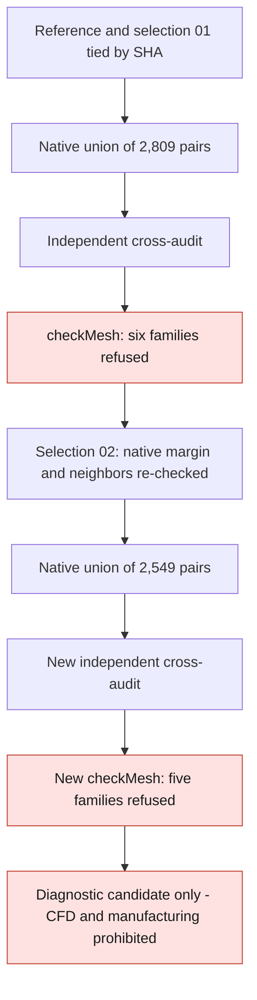

# M64 — local tetrahedron agglomeration trial

## Final result: concavity corrected, five families still refused

Trial 03 had added **260 cells flagged as concave** and raised the
refusals from five to six families: it is not adopted. Trial 04, after
correcting the selection, finds **zero cells flagged as concave**.
Low determinants go from **5,442 to 2,886**, about 47 %
fewer than the reference, but **five families remain refused**.
Trial 04 is kept as a diagnostic candidate, **not as a mesh
qualified for CFD or as a cylinder head authorized for manufacturing**.

Trial 04 merges 2,549 disjoint pairs: 399,412 cells, of which 396,863
unchanged tetrahedra and 2,549 six-faced polyhedra. The independent
cross-audit verifies the preservation of the 112,649 points, of the 186,370 boundary
triangles and of the total volume under the contracts made explicit below.
This transformation evidence is not enough to accept CFD quality.

The scope is only the intake gas domain of the virtual bench,
not the complete metal cylinder head nor a running twin-turbo engine.
The source is a 935 reference scan, not measured M64 interfaces.
This work demonstrates no thermal, mechanical or LPBF improvement.

The [evidence capsule](../../twins/m64-cylinder-head/evidence/agglomeration-local-trial-20260908.json)
complements the [reference mesh and the rejected subdivision trial](M64_MAILLAGE_PARTITION_UNIFIEE_20260908.md).
The earlier private receipts are kept, without rewriting their result.

## Limited selection, then a real OpenFOAM operation

The preflight `185535cc…`, in 2.787 s, selects 2,809 pairs among 4,013
individually admissible pairs. It is greedy, **not a demonstrated maximum
matching**. The pairs touch 2,901 cells initially flagged
with a low determinant; 2,411 pairs touch a native annular boundary.

The preflight requires in particular a convex union of the represented points,
`D ≥ 0.001`, an aspect ratio of at most 1,000, interpolation weights
of at least 0.05, volume ratios of at least 0.01 and a skewness
of at most 4. It re-checks the neighbors already selected. These estimates
are neither the native result of `checkMesh` nor a continuous conformity to the CAD.

The [native agglomeration utility](../../twins/m64-cylinder-head/source/flowbench-intake/agglomerate_tet_pairs/agglomerateTetPairs.C)
uses `polyTopoChange`: it removes only the shared face of each
pair and reassigns the cells. It does not merge the other triangles,
does not move points and does not widen any functional clearance. The reference
is the domain `fab1338a…`, from the MSH `c0cbb257…` converted earlier.

| Trial kept | Result observed |
| --- | --- |
| 01, source `13d6f77a…` | Compilation refused: `fvMesh.boundaryMesh` call incompatible with this API. No candidate produced. |
| 02, source `0cdb836e…` | Compilation succeeded, but writing of `m64FaceMap` interrupted in the full temporary storage. Incomplete candidate rejected. |
| 03, same source `0cdb836e…` | Fresh directory on `/var/tmp` disk; native operation succeeded, code 0, 3 s wall-clock. |
| 04, same source `0cdb836e…` | Corrected subset of 2,549 pairs; native operation succeeded, code 0, 4 s. |

The old `input.msh`, `log.checkMesh` and diagnostics copied with the case
are **not** the results of this new mesh. The inherited `topoSets`
are not remapped; only the remapped `cellZone air` is authoritative.
The copied solver fields have not been audited for a simulation.

## Trial 03: two distinct audit receipts, without erasing the first refusal

The [independent auditor](../../twins/m64-cylinder-head/source/flowbench-intake/audit_tet_pair_agglomeration.py)
reconstructs the groupings from the source `faceSet` and the
owner/neighbour relations; the producer's four maps are assertions to be verified.

The initial receipt `797ac0fe…`, source `3c0eb455…`, **refuses** the transformation
in 11.347 s because of a patch metadata difference. The native file adds
`inGroups List<word> 1(wall)` to the wall. The official constructor of
[`wallPolyPatch`, commit `7b05503f…`](https://github.com/OpenFOAM/OpenFOAM-14/blob/7b05503f98a85be88af930df48623b4d152bfc35/src/OpenFOAM/meshes/polyMesh/polyPatches/derived/wall/wallPolyPatch.C#L54-L69)
does add the `wall` group when it is missing: it was
therefore already present in the native in-memory representation of the reference.

The distinct receipt `d779d628…`, source `a16ec0eb…`, passes in **12.231 s** on
the **same unchanged candidate**. For the exact type `wall` only, it compares
the effective groups `explicit groups ∪ {wall}`. Any other group
added/removed, type, property or triangle membership remains checked.
The auditor's 34 tests include adversarial mutations of these fields.
The initial refusal is neither deleted nor retroactively turned into a success.

The second audit proves the preserved point and face bijections,
the independently reproduced cell maps, the orientations and the
six exact faces of each union. The pairs are disjoint and cover
exactly their parents; the untargeted cells remain identical.
Each merged volume exactly equals the sum of its two parent volumes,
in rationals derived from the **binary64 values read**, which preserves the total
volume by partition. The global absence of self-intersection of the source mesh
is not proved by this audit.

Writing at 17 digits preserves the binary64 bits of the coordinates: it
does **not** prove the identity of the decimal strings before/after. Nor does it replace
the earlier 12-digit MSH–OpenFOAM matching. The boundaries
remain 184,917 wall triangles, 1,191 outlet and 262 inlet.
The earlier conversion of 0.001 m per scan unit remains an assumption,
not a certified M64 scale or fit. No new CAD is created.

## New native diagnostic — partial improvements and a regression

| Indicator | Reference | Trial 03 | Trial 04 |
| --- | ---: | ---: | ---: |
| Cells | 401,961 | 399,152 | 399,412 |
| Low determinant | 5,442 | 2,541 | 2,886 |
| Excessive aspect ratio | 3 | 3 | 3 |
| Excessive skewness | 10 | 10 | 10 |
| Cells flagged as concave | 0 | **260** | 0 |
| Low interpolation weight | 519 | 464 | 466 |
| Low volume ratio | 149 | 146 | 146 |
| Faces with non-orthogonality above 70° | 262,008 | 259,587 | 259,686 |
| Quality families refused | 5 | **6** | **5** |

Each diagnostic ran on a copy whose digests match the
audited candidate, with no new conversion or rescaling.
The log **specific to trial 03** `e2559952…` contains `Failed 6 mesh checks`, without
`Mesh OK`; the supervisor returns 2, in 5 s. The maximum aspect ratio
stays at 2,011.04 and the maximum skewness at 13.1054. Topology,
single-region connectivity and cell volumes pass separately.
These successes do not offset the six refusals; the criteria remain unchanged.
The convexity announced by the preflight is therefore not sufficient according to the
native test. The complementary diagnostic below clarifies this gap,
without modifying the candidate or turning this refusal into an acceptance.

A possible future meshing success would not be enough to validate CFD,
thermal, strength, fatigue, material, printing, M64 fit or engine.

## Predicate gap reproduced — no label identity claimed

The independent diagnostic `bb797ce6…`, in 2.477 s, reproduces **the count
of 260 cells** flagged by OpenFOAM. Its 260 computed cells are
selected unions and remain convex in the sense of the closed half-spaces
tested in rationals on the binary64 points: 89 include an exact
coplanarity, the other 171 are near-coplanar.

The native test compares the normalized direction between face centers with
the outward normal. It also flags planar or nearly
planar situations when their dot product exceeds `−10⁻⁶`: **weak mathematical
convexity and native admissibility are not equivalent**.
See [`checkConcaveCells`, same official commit](https://github.com/OpenFOAM/OpenFOAM-14/blob/7b05503f98a85be88af930df48623b4d152bfc35/src/meshCheck/primitiveMeshCheck/primitiveMeshCheck.C#L1069-L1174).
The per-cell maxima computed lie between `−4.881×10⁻¹⁰` and
`+7.859×10⁻¹⁴`, hence within the refused band. Three adversarial witnesses
separating coplanarity, near-coplanarity and convex margin pass.

The 260 native labels were not exported for comparison: only the
**reproduction of the count**, not the identity of the native list, is proved.
The initial selection therefore covered the native predicate insufficiently.
This finding motivated subset 04 below: built-in margin,
re-checked neighbors, new union, cross-audit and `checkMesh`. Neither threshold,
nor geometry, nor historical receipt is modified by this diagnostic.

## Trial 04: corrected selection, partial improvement only

The preflight `18450384…` removes the 260 pairs computed as inadmissible,
then re-checks the neighbors: **2,549 pairs**, all from the initial
selection, no new pair. It requires the same native margin `≤ −10⁻⁶`
in addition to the earlier criteria, without relaxing them. It finishes in
2.969 s and remains a proposal, distinct from the executed OpenFOAM result.

The native operation restarts from a copy of the reference, not from trial 03.
It finishes in 4 s, code 0. The cross-audit `45785366…`, with the same
source `a16ec0eb…`, passes in 12.231 s: 399,412 cells, 894,558 faces,
2,549 internal faces removed, binary64 coordinates and boundary unchanged,
volumes preserved by the exact unions. The six checked `polyMesh`
files keep their digests after the quality diagnostic.

The **new** log `46bd09e6…` confirms zero cells flagged as concave,
but contains **`Failed 5 mesh checks`**, without `Mesh OK`; the supervisor
returns 2, in 6 s. Aspect ratio, skewness, low determinant, interpolation
weight and volume ratio remain refused. The counts are
in the comparison table; they prove neither CFD convergence nor accuracy.

**Decision:** keep trial 04 as a diagnostic candidate, preserve
the reference and the rejected trial 03, launch no solver. The next
step is to relocalize the five remaining families on this new
mesh and to choose a verifiable targeted correction. No other trial
is run in this sequence and no future result is anticipated.

## Resources and limited next steps

The trial uses Kali x86, four CPUs and 4 GiB, with no container network.
The wall-clock limit is 300 s; the native-operation container is removed
and its absence verified, as is that of the quality diagnostic.
No GPU is needed for this transformation. The containers of
trials 03 and 04 and of their two diagnostics are deleted; their absence
is verified. No CFD solver and no manufacturing computation were run.

The software check `make check` ends with code 0: **2,425 main
tests** in 174.433 s, **84 skipped**, then all complementary
suites pass. It includes the auditor's 34 tests; this is
not a physical acceptance or a cancellation of the `checkMesh` refusal.

No Vast job was created for these trials: **0 USD of new Vast
spending**, against an authorized project budget of 44 USD. Account
information and other projects' activities are not published in this evidence.
