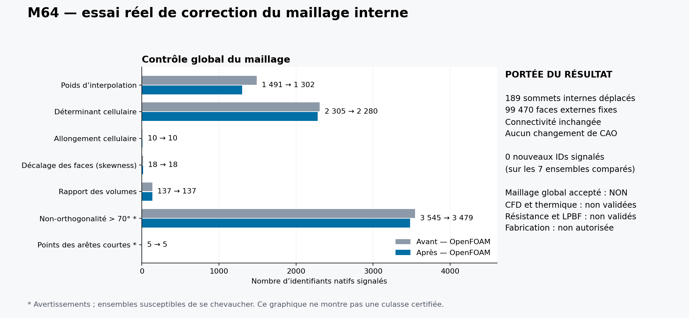
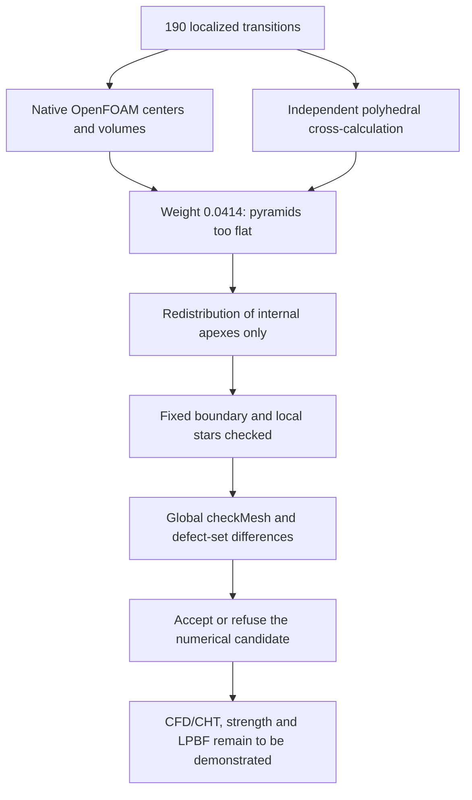

# M64 — targeted correction of the hexahedron/pyramid transitions

The [previous diagnostic](M64_DEFECT_LOCALISATION_20260909.md) isolated
190 transitions with a low interpolation weight. **189 are now corrected,
with 25 fewer low-determinant cells and 66 fewer excessively non-orthogonal faces,
and no new defective identifier in the compared sets. The five quality
families nevertheless remain refused.** These are
cells of the air domain, not a change to the metal cylinder head.
The CAD, the Porsche contour and the engine interfaces do not change in this batch.

## Measurement actually executed

A C++ reader is compiled and run with **OpenFOAM Foundation
14-7b05503f98a8**, on the original case of 785,883 cells. It reads the native
face/cell centers, oriented areas, volumes and interpolation weights.
It moves no point, does not re-stitch the mesh, does not convert the
geometry and launches no solver. The source case is mounted read-only.

The 190 faces correspond exactly to 190 hexes, 190 pyramids and
190 distinct pyramid apexes. These apexes are all internal to the domain;
their stars comprise **1,142 tetrahedra**, with no tet shared between stars.
The 99,470 external faces are counted separately.

| Measurement | Result over the 190 interfaces |
|---|---|
| Minimum interpolation weight on both sides | 0.041395602449 to 0.041395602756; native threshold 0.05 |
| Normal distance hex center / face | About 1.0000 × 10⁻⁴ |
| Normal distance pyramid center / face | About 4.3183 × 10⁻⁶ |
| Normal height of the pyramid apex | About 1.7273 × 10⁻⁵ |
| Normal thickness of the hex | About 2.0000 × 10⁻⁴ |
| Hex / pyramid volume ratio | About 34.736 |

The lengths are those of the **already scaled numerical frame**;
they are not certified physical dimensions. All signed projections
of centers are positive. The defect is therefore not explained here
by centers lying on the wrong side of the face.

Compilation and measurement take 1.781 s and 1.618 s respectively;
the whole process, cleanup included, **4.314 s**. The 29 files of the source
case remain identical. No timeout, OOM or native warning.
The exact container is deleted and its absence re-verified. Kali is enough for
this diagnostic; no new Vast rental or spending in this batch.

## Independent cross-calculation

The second calculation re-reads the `polyMesh` and applies the formulas of the
pinned commit: [face centers/areas](https://github.com/OpenFOAM/OpenFOAM-14/blob/7b05503f98a85be88af930df48623b4d152bfc35/src/OpenFOAM/meshes/meshShapes/face/faceTemplates.C#L72-L138),
[cell centers/volumes](https://github.com/OpenFOAM/OpenFOAM-14/blob/7b05503f98a85be88af930df48623b4d152bfc35/src/OpenFOAM/meshes/primitiveMesh/primitiveMeshCellCentresAndVols.C#L65-L144)
and [check weights](https://github.com/OpenFOAM/OpenFOAM-14/blob/7b05503f98a85be88af930df48623b4d152bfc35/src/meshCheck/polyMeshCheck/polyMeshCheck.C#L163-L214).
It does not substitute a vertex average for the native center of a polyhedron.

Over the 190 interfaces, centers, areas, volumes, signed distances and
heights agree **bit for bit** with the C++. The maximum deviation of the weights
is 1.249 × 10⁻¹⁶. This verifies a numerical implementation on the same
data; it is not an independent validation of the engine physics.
The pure calculation takes 7.865 s and finds 1,142 strictly positive tetrahedral
half-spaces with rational arithmetic on the stored coordinates.

## First candidate: real gain, but a regression detected

A candidate moves the 190 apexes toward a recomputed weight of 0.055.
Generation takes 13.418 s. After serialization at 17 digits and re-reading,
the 1,142 tetrahedral inequalities remain strictly positive; the exact
volumes of the 190 stars are preserved. The other lines of the points file
remain unchanged. External coordinates and connectivity are preserved.

The global `checkMesh` is actually rerun on a copy, in 11.097 s
(13.764 s with preparation and cleanup). It removes the 190 weight defects,
25 low-determinant cells and 67 excessively non-orthogonal faces, **but adds
one new excessively non-orthogonal face**. The net balance for this last family
is therefore −66, not a disappearance without regression. The 190-move
candidate is not retained as is. The five quality families remain refused.

This regression concerns a single star: the new face is shared
by two tets of that same star. A second, conservative candidate
restored that apex exactly to its source position and kept the other 189
moves, before rerunning the global check. This operation was executed
in 5.931 s and independently cross-checked in 2.051 s. Both candidates and their
logs are kept: the first result is not overwritten.

## Second candidate executed: 189 corrections kept

*Native checkMesh defect counts before and after the second candidate; it shows counts only, not geometry, and proves no admission of the mesh.*

The second `checkMesh` takes **10.947 s**, i.e. **13.557 s** for the whole
process. It checks the points file actually produced, not a merely computed
target position. The five other `polyMesh` files are identical
to the source case, as are the coordinates of the 99,470 external faces.

| Native set | Before | Second candidate | New IDs |
|---|---:|---:|---:|
| Low interpolation weight | 1,491 | **1,302** | 0 |
| Low cell determinant | 2,305 | **2,280** | 0 |
| Non-orthogonality > 70° | 3,545 | **3,479** | 0 |
| Excessive aspect ratio | 10 | 10 | 0 |
| Excessive skewness | 18 | 18 | 0 |
| Low volume ratio | 137 | 137 | 0 |
| Points flagged for short edges | 5 | 5 | 0 |

The two sets of cells with one/two internal faces also keep
their exact files: 2 and 465 cells respectively. The groups
overlap; they do not add up to a number of defective cells.
The extreme and total volumes remain identical to the precision of the log.
The mean non-orthogonality improves from 21.555279° to 21.555015°; on the other hand,
the mean weight and mean volume ratio decrease slightly
(0.434790 → 0.434744 and 0.787716 → 0.787637). **This is therefore not an improvement
of every metric everywhere**, despite the absence of new threshold
crossings in the compared sets.

This version is a partial improvement retained to continue the
mesh checks. It receives **no CFD admission**: there remain
1 low-weight hex/pyramid transition, 1,301 other low-weight faces
between tets, as well as the other defects in the table. The next piece of work
must treat this remaining junction and the core/wall defects, keeping
the native criteria and the neighborhood checks. No thermal,
structural or LPBF solver is launched on this still-refused mesh.

## Correction criterion

The local target is a weight of **0.055**, with the native acceptance threshold
unchanged at 0.05. Only the identified internal apexes may move,
along the normal to their base. All other coordinates and all
connectivity must remain exact. The internal lateral faces of the
pyramids therefore change consistently on both sides: they can no longer
be declared identical to the old geometric interfaces.

The local checks must cover the coordinates actually rewritten,
the pyramids and the 1,142 neighboring tets, not only the targeted weight.
A second global `checkMesh` must then compare the defect identifiers
before/after, in order to detect new defects elsewhere in the
stars. A successful program run is not an acceptance of the mesh.

**No power, cooling, strength or printing validation
is inferred from these mesh checks.** The detailed data and
digests remain traceable; the meshes, coordinates and geometric
derivatives remain private under the repository's rules. The targeted software
tests pass (inventory 9, measurement/supervision 19, cross-calculation 8,
comparator 2, candidate 13, global check 20, conservative rollback 7;
the 20 check tests are also rerun for V2).
`make check` finishes with exit code 0; some optional native tests remain
skipped depending on the dependencies present. The digests and counts are in
the [evidence register](../../twins/m64-cylinder-head/evidence/geometry-checkpoint-20260908.json),
entry `gas_hybrid_apex_correction`.
