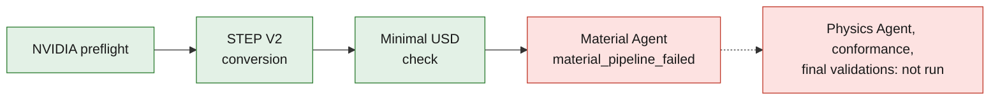

# M64 turbo 4V — state of the evidence as of September 7, 2026

Evening update: [real PicoGK computations on Kali and Vast](M64_PICOGK_EXECUTION.md),
[full chain and Mermaid diagrams](M64_MULTIPHYSICS_EXECUTION.md).
This state keeps the evidence from the previous batches; their results do
not automatically qualify the new geometric derivatives.

**The project has not yet delivered a functional cylinder head, nor one that is
qualified or authorized for printing.** The software checks, the geometry
checks and the physical computations below concern different objects. They do
not add up to an overall validation of the engine.

*The last GPU trial on the remote NVIDIA chain, as stated below: three steps
passed, then Material Agent failed and the later stages never ran.*

## Delivered results

| Exact object | Demonstrated result | What does not follow from it |
|---|---|---|
| [Private F43 body with four seat pockets](M64_FOUR_SEAT_BODY_CAD_AUDIT.md) | Closed single-piece STEP, BRep/BOP checks run without defect after a local correction of the p-curves; eight discrete valve/body positions without volume intersection. | M64 interfaces, ports, final chamber, valvetrain, strength, cooling or printability. |
| [Independent four-valve module V2](M64_FOUR_VALVE_DISTRIBUTION_MODULE_20260907.md) | Twelve separate components: four valves, four seats and four guides; geometry and packaging checks documented. | Hot interference fits, springs, cam laws, piston, fatigue or engine performance. |
| [AdditiveFOAM F58 coupon](917_F58_COUPON_ENERGY_DIAGNOSTIC.md) | Two thermal computations at 100 and 50 ns up to 120 µs; discrete balance recomputed. The limiter removes about 10.6% of the absorbed laser energy. | Print simulation of the complete cylinder head, supplier LPBF recipe, global distortion or material qualification. |
| [Remote NVIDIA chain](../../twins/m64-cylinder-head/remote-simready/README.md) | The operations actually executed and their failures are recorded separately in the receipts of this chain. | An assignment of visual materials or rigid bodies is not a CFD/CHT simulation or a stress computation. |

The last GPU trial did pass the NVIDIA preflight, the conversion of the V2
STEP and the minimal USD check. A local cross-check of the composed instances
confirms twelve components, mm units and Z-up, with a maximum bounding-box
deviation from the STEP of 1.804e-6 mm. This is neither a full surface
deviation check nor a manufacturing tolerance. The
[retained converted USD](../../twins/m64-cylinder-head/evidence/omniverse-static-v2-20260907/converted-assembly.usd)
does not contain the cylinder head body and has not received a successful
material or physics assignment.

Material Agent failed with `material_pipeline_failed`, exact step not
identified. Its status reports 60 renders and the preparation of twelve inputs,
but no final USD and no downloadable artifact was delivered. The 60 images are
not in the collection; they are therefore not presented as inspected visual
evidence. Physics Agent, conformance and final validations were not run. The
rental was deleted and its absence verified independently; the operator
collection contains 29 files.

The body keeps the silhouette from scan 935 as its reference; it is not
renamed OEM M64 geometry. The scale of 1 unit/mm and the Z −90° / Z+3
registration remain assumptions. The bores have measured local effects on the
skin: no substitute oval shape was introduced, but no strict identity of the
whole outer skin is claimed.

The scan, the derived body and its detailed images remain private. The public
receipts contain our numerical checks and the file digests, not the
proprietary sources. The STEP of the independent V2 module is a separate
artifact; its results do not qualify the private body.

## Remaining critical path

1. Define the ports and the chamber on this geometry, then the camshaft
   carrier, springs and actuation, oil galleries, threads and machining
   features. Record the chosen interfaces and dimensions as assumptions when
   their M64 provenance is not established.
2. Verify the whole mechanical cycle with the piston and thermal expansion;
   choose and justify the seat/guide interference fits, the materials and their
   hot property maps. A nominal fit without intersection is neither a feasible
   assembly nor a qualified heat transfer.
3. Build the real gas, solid and cooling-air domains of this complete version
   for CFD/CHT and strength. Earlier computations on coupons, simplified
   volumes or other iterations do not transfer automatically to its SHA256.
4. Correct and calibrate the LPBF model on consistent process data, then check
   supports, powder removal, build distortion, machining and inspection on the
   final geometry. The small F58 residual does not make the identified
   artificial energy sink physical.

Missing data will not be replaced by values presented as measured. Without
evidence of engine compatibility, material / process qualification and a
documented professional review, no authorization to print for engine operation
or to start the engine will be issued.

## Batch verification

`make check` passed after integrating the F58 diagnostic and the SSH selection
fix: general discovery ran 1,989 tests, then the repository's additional
targets passed. This count is of software tests, not engine tests. The full
log is kept locally; the specialized reports linked above define the scope of
each result.

The documentation deliberately separates source, assumption, executed
operation, numerical result and manufacturing authorization. The NVIDIA
workflow also enforces explicit USD checks rather than treating an image or a
return code as evidence of engine physics.
