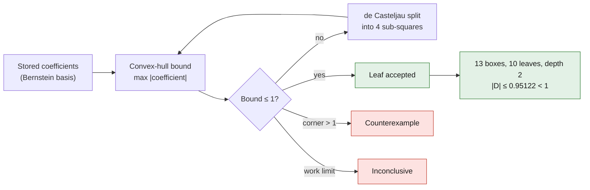

# Local repair: displacement bound over the whole surface

September 7, 2026. Geometric reference from scan 935, future target M64.
This independent check concerns the local blend of degree **10 × 11**,
not a manufacturing authorization nor a cylinder head validation.

## A result not limited to a grid of points

The stored scalar displacement field satisfies, over **the whole normalized
UV square [0,1] × [0,1]**, including the area not kept by the trim contour:

```text
|D(u,v)| ≤ 0.9512202009568349 scan unit < 1 scan unit
```

The bound is obtained in **exact rational arithmetic** for the floating-point
numbers recorded in the NPZ, with 13 boxes examined, 10 leaves accepted and a
maximum depth of 2. No unresolved subdomain. The decimal display of the bound
is rounded outward.

The report also keeps its exact value:

```text
4710214291766205820975108389 / 4951760157141521099596496896
```

The maximum value found earlier on a grid, about 0.934757, remains a sampled
observation. It is not used as a bound.



## Method and proof

The field is represented in a tensor-product Bernstein basis. On the
parameter square, the basis functions are nonnegative and sum to 1: every
value of the field is a convex combination of the coefficients. The maximum
of the absolute values of these coefficients therefore bounds |D|.
The convex hull principle is also used by
[OCCT to bound B-Splines](https://dev.opencascade.org/doc/refman/html/class_geom_bnd_lib___b_spline_surface.html).

The initial hull is too loose. De Casteljau subdivision at 1/2 produces four
representations of the same polynomial on four sub-squares covering the domain
exactly. Only the sub-squares whose bound exceeds 1 are subdivided again. Each
average is a computation on fractions, without floating-point rounding. An
exceedance at a corner provides a counterexample on the full square; a work
limit produces **inconclusive**, never "passed". No change to the CAD is made
by this tool.

The 9 main tests and 6 independent tests verify, among other things, the
polynomial identities of the four quadrants and then of 16 sub-squares,
asymmetric grids, interior and non-dyadic maxima, resource limits, outward
rounding and provenance. The independent hash test replaces the NPZ during the
computation: the receipt must stay bound to the bytes actually read, kept in
memory.

## Traceability

- Source STEP F53: `700baea66bc72cdb6aee529e21b167270ebde11db94b06f8e1e55ee08bdd9bf2`.
- STEP of the local candidate: `42057011e25ecc48b215a58e979a0d9bcf4769f2f96f9690b751a81a7bde2cd8`.
- Private coefficients: `48447c3d5a65e9a4cde06cf946b8c4bd1ade835b404d6d0f36ff405f1ad9ad12`.
- The receipt includes the hash of the implementation actually reread for this computation.

[Redacted numerical receipt](../../twins/m64-cylinder-head/evidence/bernstein-global-bound-20260907.json)
and [reproducible script](../../twins/m64-cylinder-head/bound_bernstein_displacement.py).
The NPZ, the surfaces and the part coordinates remain private.

## Limits that remain open

The proof concerns the **scalar polynomial represented by the stored
coefficients**, not a rounding bound on each native OCCT evaluation. It proves
neither the injectivity of the surface, nor the absence of interference with
any other part, nor a global minimum thickness. The blend, topology and radius
checks remain separate evidence.

The scan unit is not certified in millimeters. The displacement threshold of
this local search is therefore not an M64 functional clearance. No conclusion
on cooling, strength, fatigue or LPBF printability is drawn from this
geometric bound. The number of boxes and the depth bound the algorithm's
traversal, not an absolute CPU time or memory.
