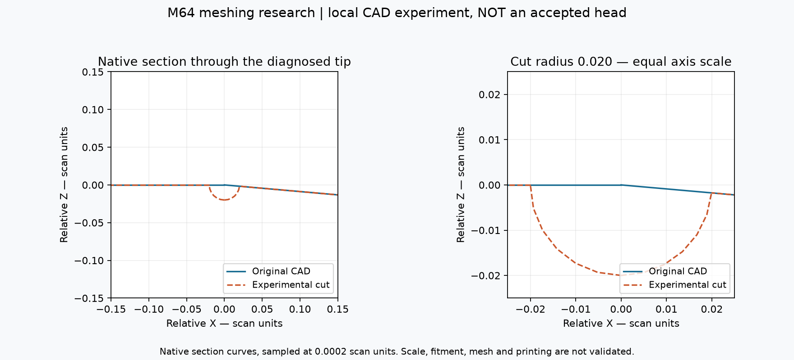
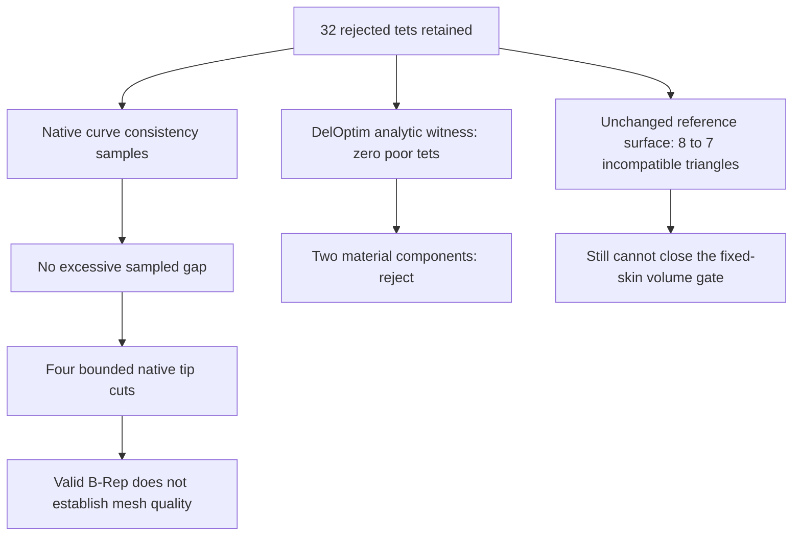

# M64 — bounded chamfer and native tip-cut experiments, 28 September 2026

## Retained result

Follow-up: the [local native reconstruction](M64_LOCAL_RECONSTRUCTION_20260928.md)
passes six-face locality and BOP checks, but its surface quality is worse;
the retained 32-tetrahedron result is unchanged.

**Zero rejected tetrahedra has not been demonstrated on the head.** The retained
volume mesh still has **32 elements below minSICN 0.1, out of 1,341,461**.
This continuation implements the [research-backed experiments](M64_ZERO_DEFECT_RESEARCH_20260928.md)
and rejects a misleading zero-quality-defect result on a synthetic witness.
Neither that witness nor a valid Boolean operation is a validated cylinder head.

A new **unchanged-CAD surface screen** has **seven incompatible triangles on
five faces**, versus eight on six faces in the retained mesh's boundary. It is
a different surface discretisation, **not** a new volume mesh or a reduction
of the retained 32-tetrahedron count. No CAD master, quality threshold,
functional-interface designation or manufacturing authorisation changes.

The private reference is still the scan-derived **935 research body**, not
certified M64 engine interfaces. Coordinates remain provisional scan units;
0.020 below is not a validated millimetre allowance and is unrelated to the
0.040 mm carrier-displacement target. Scan attribution and rights are recorded
under [Wolfe Classics](../../catalog/sources/src-wolfe-classics-935-billet-cylinder-head-scan.json).
Only this diagnostic figure, code and aggregate results are published; native
geometry, raw coordinates, volume meshes and detailed receipts stay private.



*Blue: original native section; orange: an experimental spherical cut of radius
0.020. The equal-scale section exposes the new notch; it is not an adopted
cooling feature, product photograph, thermal simulation or printing approval.*

## Tests and findings

| Experiment | Measured result | Decision |
|---|---|---|
| Shared curve/parametric-curve consistency on six obstructing faces | 19 edge/face uses, 129 samples each; maximum sampled gap **1.40088e-7**; none exceeds its recorded edge tolerance | No measured justification for a simple shared-curve repair. Sampling does not certify unsampled extrema. |
| Bounded DelOptim intermediate stage, unit tetrahedron, epsilon 0.020 | **4,182 inner tets; zero below 0.1; minimum 0.126104875** | **Rejected:** two material components and two boundary edges without incidence two. |
| Independent distance bounds on that witness | Two directed upper bounds **0.01970484492** and **0.00679892761**, below 0.020; interval gap tolerance 1e-4 | Small distance does not rescue failed topology. These are floating-point polygon comparisons, not a native-CAD or rounding-error certificate. |
| Acute tetrahedron witness, same bounded safe mode | Mesher stopped after **120 s**, no completed exported mesh | Nonconverged; no quality result. |
| One native spherical cut at face 1648, radius 0.020 | Exactly five source faces affected in memory; one valid solid and shell, unchanged maximum tolerances, valid reread; **BOP audit passes** without faults/errors/warnings in **261.75 s** | CAD candidate only; does not establish useful geometry or a passing mesh. |
| Four distinct acute tips on five selected faces, radius 0.020 | Exactly ten source faces affected in memory; **4,922 faces**, one valid solid/shell, unchanged maximum tolerances, valid reread | Local CAD construction succeeds; full candidate BOP and mesh/volume/deviation qualification remain open. |
| First surface recipe, single-tip candidate | 86,606 triangles, **105 incompatible**, minimum 0 | Rejected. This exploratory recipe also differs outside the cut; do not attribute every new bad triangle to the cut. |
| First surface recipe, four-tip candidate | Native process exits **139**, no completed surface result | Failed process; incomplete receipt is not a pass. |
| Curvature-aware matched recipe, unchanged reference | **441,650 triangles; seven incompatible; minimum 0.02134670874**, **260.69 s** | Surface-only improvement; still incompatible with zero rejected tets on that fixed skin. |
| Same recipe, four-tip candidate | CPU limit reached, exit **152**, before a completed surface result | No completed original/candidate comparison. |
| Extended Mac retry, same candidate and recipe | Native **SIGSEGV**, child exit **-11** after **360.38 s**, before the extended limit | Failed, not a timeout or completed surface. |
| Linux/x86 countercheck on Kali, same candidate and recipe | Native **SIGSEGV**, child exit **-11** after **90.66 s** | Failure is reproduced outside the Mac runtime; no completed mesh. |
| Requested Frontal-Delaunay, four-tip candidate, expanded diagnostic cap | **5,334,226 generated triangles**, **702 incompatible**, minimum **0.0006461863**, no nonfinite qualities; **147.15 s** | Rejected on quality as well as resource size. No surface export or volume job. |

The Mac crash report identifies `libgmsh.4.15.dylib` on the triggered stack.
This locates the failing library, not the exact defect or a proven root cause.
No failed child's zero-exit *dispatcher* is confused with solver success.
Frontal-Delaunay avoids the observed crash in this trial, but produces an
oversized, still-incompatible surface. Internal algorithm fallbacks were not
instrumented; this identifies the requested algorithm, not every internal
meshing decision. Its first run reached a combined size/finiteness guard that
did not record enough detail. The repeated diagnostic records counts before
the guard and raises only the **resource cap** from 500,000 to 2,000,000
triangles; the quality threshold is unchanged. The 702 incompatible triangles
mean that simply raising the resource cap again cannot make this result pass.

Remaining incompatible source faces in the completed reference screen are
**141 (1 triangle), 143 (1), 1411 (2), 1413 (1), 1648 (2)**. The previous
face-686 obstruction is absent in this screen. The necessary condition remains
`q2 >= 2*0.1/(3-0.1) = 0.06896551724`, derived and checked in the
[fixed-skin report](M64_FIXED_SKIN_PROGRESS_20260928.md). Passing it would still
not be sufficient to pass a volume mesh.



## Implementation and safeguards

The [DelOptim research patch](../../twins/m64-cylinder-head/source/wholebody/delmesher-bounded-intermediate.patch)
targets upstream commit `761eaa4ac23168567e06a3ce64f2061af1ec190c`.
It adds explicit finite `-E` and optional safe-mode `-S`; `-a` now refuses to
run without `-E`. It does **not** reinterpret upstream `-e` as epsilon.
Eight malformed/missing/duplicate epsilon invocations are rejected with exit 2.
Use `git apply --ignore-whitespace` for the upstream mixed line endings;
reverse applicability was checked against the compiled source.

The intermediate exporter previously mixed inner/outer cells under one count
and used six decimal places. The patch emits separate counts, groups cells by
the existing classifier and writes 17 significant digits. It does not alter
that classifier or delete the four-cell island. The original final-stage
exporter retains the earlier full-precision correction.

Inspection of upstream `src/interfaces.h` shows that intermediate internal
cells are selected by barycentre location in the **original** constrained
mesh. That explains why intermediate angle quality alone is not a guarantee
of a closed, faithful material domain; it is not proof that every upstream
configuration fails. The full head is deliberately not submitted to a route
whose simple witness already fails our topology checks.

The [bounded runner](../../twins/m64-cylinder-head/source/wholebody/run_bounded_chamfer.py)
reuses existing classification, mesh readback, signed-volume, connectivity and
boundary-edge auditors. CPU distance checks use `cascading-upper-bounds 1.0.0`
in both directions. A four-times-input subdivision cap initially exhausted
the four-triangle witness; a bounded allocation of approximately two million
subdivision entries completes it. Open intervals and exhaustion fail closed.

The [native cut experiment](../../twins/m64-cylinder-head/source/wholebody/trial_bounded_tip_cut.py)
uses non-destructive serial Boolean cuts, zero added fuzzy tolerance, and
only balls at measured acute vertices. Protected-face identity and bytes are
checked **in memory**; export/reread separately checks validity and one solid,
not exact byte identity of every exported surface. A ball's support does not
by itself certify bidirectional boundary distance, wall thickness, stress
concentration, passage preservation or functional compatibility.

Default OCCT whole-body volume sums also disagree with the tiny intended cut
scale: original **1,111,796.9160222246**, single cut **1,111,796.9178343436**,
four cuts **1,111,796.923158352** cubic scan units. A material subtraction
cannot physically increase volume. These default integrals therefore cannot
serve as removal-volume proof; adaptive/local independent integration is
required before any candidate admission. Do not explain away this discrepancy
as a certified harmless error.

An additional adaptive `BRepGProp.VolumeProperties_s` diagnostic requests
relative tolerances 1e-9 and 1e-12. It first reproduces the analytic 2×3×4 box
volume. The single-cut volume differences are **-1.93070155e-5** and
**-1.96357723e-5**; four-cut differences are **-7.66343437e-5** and
**-7.73444772e-5** cubic scan units. Thus this calculation recovers the expected
subtraction sign, unlike default integration. However, reported relative error
estimates remain around **3e-8**, above both requests; this is not an independent
certified enclosure. The last refinements differ by about 3.29e-7 and 7.10e-7
respectively. Volume qualification remains open.

The [surface screen](../../twins/m64-cylinder-head/source/wholebody/screen_tip_cut_surface.py)
checks a fresh native baseline, face-descriptor bijection and imported mass.
Its matched recipe disables automatic OCC repairs, uses MeshAdapt, curvature
sizing 12, maximum size 3, minimum size 0.00002, seed 1 and two threads.
Short-curve endpoint sizing is explicit. These are numerical experiment
settings, not manufacturing tolerances. No volume job starts from a known
incompatible boundary, and no surface-only result closes a mesh gate.
The [official Gmsh page](https://gmsh.info/) still lists 4.15.2 as stable at this
check; the [development manual](https://www.gmsh.info/dev/doc/texinfo/gmsh.html)
identifies 5.0.0 as development. No verified upstream fix for this exact
private candidate was located, and no untested nightly is presented as one.

## Reproduction and evidence

The Mac has 64 GiB RAM. An isolated Python 3.13.15 environment supplies
NumPy 2.2.6, SciPy 1.16.2, Gmsh 4.15.2, OCP 7.9.3.1 and the distance package.
The patched ARM Release binary SHA-256 is
`5fe144e4350df0f7299b572f3429e51866d88e480c0940b465a46ac0f39f262c`.
Upstream describes its default build as LGPL; the README says 3-or-later while
its bundled `lgpl.txt` contains 2.1. No upstream binary is redistributed here;
retain notices and resolve that packaging discrepancy before binary distribution.
No new Vast instance or paid cloud expense is incurred by these trials.

```sh
python -m unittest discover -s tests -p test_m64_bounded_chamfer.py -v
python twins/m64-cylinder-head/source/wholebody/trial_bounded_tip_cut.py \
  --body /private/original.brep --output /private/fresh-tip-candidate \
  --face 141 143 1411 1413 1648 --radius .020
python twins/m64-cylinder-head/source/wholebody/screen_tip_cut_surface.py \
  --candidate /private/fresh-tip-candidate --output /private/fresh-surface \
  --cpu-seconds 540
make check
```

Private source snapshots preserve the exact earlier producer revisions;
receipts are not rewritten after code changes. Exit 0 from a diagnostic runner
means the diagnostic completed, **not** that geometry or quality passed.

| Private receipt | SHA-256 |
|---|---|
| Shared-curve samples | `3e639e7dbfb924adff1ff01204c2eb95f4b3e65d0a41cc7c5205d26ace911f55` |
| Completed unit-tetrahedron witness | `717a6d5997a668b49b28e51746cb59ff7c7c3feb245b4958552a48a88d4345f6` |
| Acute witness timeout | `a74da3431e9cf94d7f24de894f2a1a2ef8ec3ae7e92753499ca6d6a59080841d` |
| Single native cut | `c9d08c9298e06d0a994699abc7659ecf78b282fae49c7734c3f3a96e4ab90d33` |
| Single-cut BOP check | `82f097b670b2f4cbe521a2406f152b23b2cb50ae03a4782b06e574295757faa6` |
| Four-tip native cut | `33fff162359bb27529db5ea6cfd7d8e5b3e55ff4c04de2112dc909dad8ff7c62` |
| Completed unchanged-reference surface screen | `b3e09d4485c30306a7555cec50252ec35043ea0aa82a80dc865956680f3db6a9` |
| Adaptive native volume diagnostic | `698c6610b7c18662946832cb6726f16f38bc1354d0cbe706a8464cac63efef8b` |
| Extended Mac process outcome | `4cf59049897dc293fe78bae5bb113dac2412e9dd57ce8d5f2c74ac6ebfe47cf1` |
| Linux process outcome | `acde66b1e73758314b2690fd1e5d834297922a1ee223a9839fda950ecdb1afe8` |
| Expanded Frontal-Delaunay diagnostic | `be5c4ef948a4cd0a2dad6c79280017757ebac8f149dde6a4a3d8c31f4148b1f4` |
| Final full repository-check log | `06e67ee17da20876cfb43d54682f86b5524f18b646def71583bc1fc2a2bbc73f` |

Four focused tests pass in the isolated CAD/numerical runtime. They check
finite bounds and failure cases, known-offset distance including translation,
curve consistency on an analytic box, and a cut's known one-eighth-ball volume.
The first full repository check exposed an unnecessary SciPy import in the
new command-only test on the older system environment. Moving that import to
the actual numerical run fixes the cause without modifying the shared runtime.
The repeated main suite passes **3,200 tests, 155 optional/environment skips**.
Its later link check initially rejected the new, not-yet-indexed report; after
staging the documentation, `make -o test check` passed the remaining gates.
A final **full `make check` then exits 0**, including the main suite, supplemental
checks and **zero broken links in 571 Markdown files**; its dispatcher records
237.41 seconds. The four numerical-native tests also pass separately in the
isolated runtime with no skips. None of these software tests validates
manufacturing or engine operation.

All numerical workers from these trials have ended on both Mac and Kali. The
native master and retained volume mesh are unchanged. The local spherical-cut
route is **not selected** for the head: valid CAD, approximate proximity and
additional compute have not delivered an admissible surface, let alone a
qualified volume mesh or printable part.

## Remaining engineering decision

Do not promote the spherical cuts as a solution merely because OCCT accepts
them. The next admissible route must produce a controlled local surface with
consistent volume, preserved protected geometry and no incompatible triangles,
then a complete passing volume mesh. Anatomical roles and acceptable local
shape changes remain unverified. Thermal, mechanical, fatigue, valve dynamics,
material, physical-scale and print-process qualification remain separate gates.
