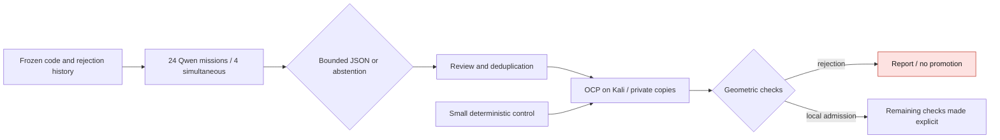

# M64 — CAD pilot with Qwen agents on Vast

## Result and scope

**24 missions run on Qwen/Vast in 80.134 s**, with at most four simultaneous
requests. They only propose a radius and an existing construction
mode, or abstain. They do not correct the cylinder head directly
and produce neither certification nor new measurements.

The previous batch performed documentary reads. This pilot connects
inference to a schema of checkable CAD proposals; native execution
remains independent. The trials concern a **local blend of the intake
negative**, not the complete reconstruction or optimization of the cylinder head.

## Machine, access and budget

- User authorization: **5 USD maximum for this batch**, not per agent.
- One L40S, 32 effective CPUs, **193,475 MB of RAM allocated according to the offer**,
  100 GB of disk; Slovenian offer 29679192, instance 50796709.
- The GPU exposes 46,068 MiB. The later RAM field of the instance describes the whole
  host; it is not used as the available allocation.
- Price reread: **0.827778 USD/h**, storage included. Attempt ceiling 2.50 USD,
  forecast cost with transfers and reserve: **2.321094 USD**.
- Overall deadline: 90 minutes, loading and cleanup included; the machine
  was destroyed as soon as the responses and the log had been collected.
- Public vLLM 0.19.0 image, linux/amd64 manifest
  `sha256:7a0f0fdd2771464b6976625c2b2d5dd46f566aa00fbc53eceab86ef50883da90`.
- Model `Qwen/Qwen3-Coder-30B-A3B-Instruct-FP8`, revision
  `dcaee4d4dfc5ee71ad501f01f530e5652438fde0`, context 16,384 tokens.
- SSH key pair cryptographically verified, association with the instance verified,
  real BatchMode connection. API only on 127.0.0.1:8000, local tunnel.
- No Hugging Face/GitHub secret transmitted; no scan or BRep sent to the LLM.
  The inputs are three excerpts of the authorized code and a summary of the trials.

Shutdown is confirmed by the wrapper, the external guard and an empty inventory.
The tunnel is closed. Credit before: 37.996967 USD; at the 20:41:05 UTC reading:
37.914869 USD, i.e. **0.082099 USD of observed decrease**. The final invoice remains
unconfirmed; the charge may be deferred. The safeguards are not a bank limit:
a provider outage or a lasting loss of the controller can delay
deletion. The [public receipt](../../twins/m64-cylinder-head/evidence/cad-proposal-pilot-20260912.json)
keeps budgets, versions, digests and statuses.

## Delegated work and control



The [dispatcher](../../twins/m64-cylinder-head/source/run_cad_proposal_agents.py)
has no tools, no right to execute LLM code and no access to secrets.
Maximum 900 tokens per response, 120 s per request, 1,200 s for the batch, with no
automatic retry. The model identity and the context are
checked; the client alone cannot attest the remote weights, hence the
separate verification of the server and its revision.

SHA of the private context:
`5e1309cca6bc96106b9b141d5b8ec4b5fc88bdc36fff87b18855d87390da87f3`.
Each request and response is kept with digest, duration and consumption.
The raw reports remain private and unapproved.

| Proposal | Count | Handling |
|---|---:|---|
| R0.1 / default | 14 | Parameter retained for a diagnostic trial, no benefit established |
| R0.25 / default | 6 | Already tried; not replayed as a new design |
| R0.25 / strict | 2 | Not retained in this small batch |
| Abstention | 2 | Kept; volume inconsistency to be addressed |

The radii are in **scan units**, not certified millimeters.
The 24 responses conform to the schema, but that does not verify their content.
Several texts invent earlier trials under R0.25 or promise
geometric conservation that was not computed: these claims are rejected.
The number of identical proposals does not constitute independent evidence.

Consumption: **100,847 input tokens + 6,827 output = 107,674 tokens
processed on Vast**. No OpenAI savings percentage is inferred:
preparation and review also consumed tokens, and there is no
end-to-end comparison at equal quality.

## Native trials

The existing synthetic control passes on Kali: **5 tests, none skipped**,
OCP 7.9.3.1, Python 3.12.3, pinned local image
`sha256:49979f46f421459dae4bf21aaa898e2253b07301c3e5b2cabaa6eaf06f54d696`.
Two CPUs, 4 GiB, network disabled, sources read-only, external timeout 300 s.
The container was removed and its absence verified. No real cylinder-head
file was used in this control.

SHA of its process receipt:
`0bd891fa9179725f30329b960ca660bb449ec8e94eb438a9e6d517164c4346fa`.

The first transfer was rejected before container creation because of
AppleDouble metadata added by tar on macOS. The exact package was
recreated without this metadata; the sources and their digests are unchanged.

**Three real trials run on copies** of the intake negative:

| Radius / mode | Supervised time | Observed result |
|---|---:|---|
| R0.1 / default — Qwen proposal | 5.589 s | One valid BRep solid, BOP checks without defect before/after reread; v1 rejection for increased tolerances |
| R0.1 / strict — crossing chosen by the controller | 300.278 s | 300 s limit reached, exit 137, no OOM; BRep written, final check incomplete |
| R0.125 / default — deterministic control | 5.445 s | One valid BRep solid, BOP checks without defect before/after reread; same v1 rejection reason |
| R0.125 / strict | Not launched | This branch stopped after the first strict case overran |

The LLM did not literally propose R0.1/strict: the controller crossed its
radius with the existing mode. The raw receipts keep the execution steps;
this distinction avoids attributing the whole grid to the LLM.

For the two standard modes, the maximum **sampled** tangency angles
are 0.00026177° and 0.00017517°. Vertex tolerances rise respectively
to 1e-4 and 1.00353e-4 scan unit, against at most 5.100001e-6 on the source.
These are kernel parameters/precisions, not physical machining
tolerances. An unchanged bounding box does not by itself prove the identity of the
outer contour; no global G1 check is claimed.

The complete v2 audits of ROI, outer wire and volume reconciliation were
not run on these new candidates. No STEP was requested:
the outputs are private diagnostic BReps, one of them incomplete. **No
candidate is promoted.** All containers were removed, sources and
inputs are unchanged by digest; no threshold relaxation.

This pilot demonstrates no quality advantage of the radius proposed by Qwen over
the small deterministic grid, nor any GPU acceleration of OCP operations.
It demonstrates bounded remote inference and native filtering of proposals.
The next work must address volume reconciliation and locate the
slow phase of the strict check, before a new radius search.

## Software verification and reproduction

**52 targeted software tests pass**: 11 new proposal tests,
12 of the reused transport/reader and 29 of the Vast profile. They are distinct from the
five native geometric tests. `git diff --check` passes.

```sh
python3 -m unittest discover -s tests -p 'test_*research*.py' -q
python3 -m unittest discover -s tests -p 'test_m64_cad_proposal_agents.py' -q

# Only after verifying the server, the tunnel and the private context:
python3 twins/m64-cylinder-head/source/run_cad_proposal_agents.py \
  --context /chemin/prive/context.json \
  --endpoint http://127.0.0.1:18000/v1 \
  --model Qwen/Qwen3-Coder-30B-A3B-Instruct-FP8 \
  --output /chemin/prive/nouveau-lot \
  --limit 24 --concurrency 4
```

No merge proposed. The historical global check F46 remains to be distinguished
from these targeted tests; its old evidence was not regenerated.
See the [execution plan](M64_RESEARCH_EXECUTION_20260912.md), the
[Vast readers](../../deploy/vast/research/README.md) and the
[geometry checkpoint](M64_GEOMETRY_CHECKPOINT_20260908.md).
