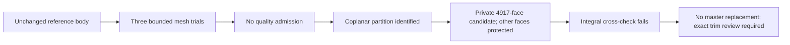

# M64 — CAD-constrained mesh and partition trials, 28 September 2026

## Outcome

Three further full-body meshing trials were executed without changing the
reference BRep. **None passes the unchanged `minSICN >= 0.1` gate.** Lower bad
element counts are not promoted when the worst element becomes worse. The
previous [145-element PhysicsNeMo result](M64_NEMO_PICOGK_CONTINUATION_20260928.md)
remains the retained diagnostic, itself not accepted for CAE.

A separate native CAD candidate removes five partition edges between two
coincident planes. It preserves all other faces and edges in memory and passes
exact BRep readback, but **fails the numerical integral qualification** below.
It does not replace the reference body or the 13-solid valve assembly.

All work ran on the existing Mac; no Vast machine was rented. No thermal,
structural, combustion, fatigue or print-process result is asserted here.

## Surface and volume experiments

The [bounded runner](../../twins/m64-cylinder-head/source/wholebody/run_cad_surface_trial.py)
reuses the frozen native importer, descriptor bijection and full-mesh auditor.
The union of the original 155 poor faces and the 30 residual poor faces contains
159 native faces. MeshAdapt is applied to this union; other surfaces retain
the original algorithm. Sizes remain 1–6 provisional scan units in the control.

| Trial | Tetrahedra | Below 0.1 | Worst minSICN | Decision |
|---|---:|---:|---:|---|
| Prior 155-face remesh, before PhysicsNeMo | 241,299 | 160 | 0.01734060 | Rejected |
| New 159-face control | 241,330 | 129 | 0.01572423 | Rejected; worse minimum |
| Same control + five Relocate2D iterations | Not generated | — | — | Rejected: segment/facet intersection in 3D |
| 159-face algorithm + size 0.5 on the 30 residual faces and their edges/vertices | 1,254,571 | 128 | 0.01593514 | Rejected; worse minimum than retained mesh |

The completed new volume meshes have zero nonpositive Jacobians, one connected
tetrahedral region, all CAD faces meshed and complete boundary matching. Their
saved mesh connectivity survives readback, but their quality still fails after
readback. The frozen helper's combined export gate therefore correctly remains
false; that verdict does not mean the connectivity serialization failed.

The 0.5 trial raises surface triangles from 91,030 to 308,328 and improves
the worst **surface** minSICN from 0.01460028 to 0.03816906. This does **not**
improve the worst **volume** element enough. Runtimes are 37.4 s for the control
and 219.0 s for the refined trial. Further whole-face refinement at 0.25 was
not run: the 0.5 trial already generated 1,468,756 tetrahedra before Netgen,
close to the explicit 1.5-million-element audit ceiling, for little benefit.

The temporary hooks are recorded in mandatory companion receipts. In particular,
the local size callback overrides the frozen helper's minimum size on selected
entities; the helper report alone is **not** the complete runtime configuration.
The original floor of 1 is retained outside those entities. The
[Gmsh API manual](https://gmsh.info/doc/texinfo/#gmsh_002fmodel_002fmesh_002fsetSizeCallback)
documents the callback and optimization operations. Installed libraries were
not edited.

Interior surface-node coordinates were checked against their CAD parametrization
on all 159 selected surfaces: maximum residuals were 1.95e-14 for the control
and 5.91e-14 for the refined trial. This is neither a continuous deviation bound
nor a trim-domain/nonintersection proof. The failed Relocate2D trial demonstrates
why that node-on-support check alone is insufficient: it passed while the later
3D mesher detected an intersection. Its failure is retained, not repaired silently.

## Native topology candidate

The [partition producer](../../twins/m64-cylinder-head/source/wholebody/unify_coplanar_mesh_partition.py)
targets only source faces **1243 and 1481** of the pinned body. They are planes
with identical orientations, zero measured plane separation and a normal angle
of 1.15e-17 rad. Their five shared edges have no other face owner. These are
native identifiers, not an anatomical classification or measurement of M64 fit.

The existing repository's protected `ShapeUpgrade_UnifySameDomain` pattern was
reused: safe-input mode, no edge merging, no B-spline concatenation, no tolerance
setter, and every nonselected edge protected. The
[OCCT reference](https://occt3d.com/dev/doc/refman/html/class_shape_upgrade___unify_same_domain.html)
describes these same-domain operations; the actual execution uses OCP 7.9.3.1,
not the newer version displayed by the online manual.

Observed candidate:

- 4,918 → **4,917 faces**, 10,210 → **10,205 edges**;
- only original edges 2869–2873 disappear; all other native edges are retained
  by identity, as are the other 4,916 faces;
- the merged plane retains its four outer native edges and orientation;
- source in-memory serialization and source file hash remain unchanged;
- saved candidate rereads as one exact-valid solid and one shell.

The existing [error-aware native BOP auditor](../../twins/m64-cylinder-head/source/wholebody/audit_native_bop.py)
was separately run on the saved candidate. All five selected modes complete
without faults, errors or warnings in 117.7 s. This includes self-intersection,
small-edge, face-rebuild, continuity and curve-on-surface checks. It does not
establish equivalence to the reference or qualify the 13-solid assembly.

The producer nevertheless returns failure: its nonadaptive volume comparison
differs by **1.67878e-9 relative**, beyond the predefined 1e-10 limit. Total
area is unchanged in that calculation. A native validity result is not an
excuse to ignore the failed numerical guard.

## Independent integral follow-up

The [follow-up auditor](../../twins/m64-cylinder-head/source/wholebody/audit_partition_integrals.py)
keeps that failed receipt and uses adaptive Gauss and Gauss–Kronrod integrations,
each at requested epsilons 1e-10 and 1e-12, on both source and candidate.
These are two integration methods in **one OCCT kernel**, not two independent
geometry engines. All eight results and the kernel's error estimates are saved.

| Method, requested epsilon 1e-12 | Source volume | Candidate volume | Estimated relative error, source |
|---|---:|---:|---:|
| Adaptive Gauss | 1,111,779.373543864 | 1,111,779.373544035 | 3.01e-8 |
| Adaptive Gauss–Kronrod, B-spline spans enabled | 1,111,779.150504044 | 1,111,779.150554835 | 5.99e-11 |

Volumes are in **uncalibrated scan units cubed**. The source/candidate pair
differences within each method are small, but cross-method disagreement is
about 2.01e-7 relative and Gauss's estimated error exceeds the 1e-10 gate.
The independent integral gate therefore **fails**. Requesting a smaller epsilon
is not proof that the returned integral reaches it. These results motivate a
support/trim equivalence audit; they do not establish that material was added
or removed, or that the five-edge partition caused every remaining bad element.

## Traceability and verification

Raw geometry, face coordinates and mesh files remain private. Public code and
aggregates do not grant reuse rights to the underlying scan.

| Artifact | SHA-256 |
|---|---|
| Unchanged native reference | `b2b48fe40edd1a20c8e6c0d20d77e6045931189f18330b441b09bcbf4618fc0a` |
| Control companion | `ad61cf1a12d4abaf9f3e8ac0211e58530d604ec12a75841f6d1f2c0ce92fbc4e` |
| Relocation companion, failed | `d257f988a51e3f19156ca776d7957e00dc2fd4f681bfb40baa0236e9352263da` |
| Refined companion | `c4f485451e6c5d9494cd85345f59d9bce4df17385cf3db7e105b6f1f5df46cb6` |
| Refined mesh | `1a9dcb31ff662e3efbcbc7380a0ea2f46b8480977440a9aeb3c8e82b83efe6cb` |
| Partition producer receipt, failed | `787ecd39509c4e1124d56e7fcb8f075aca5a2b0352272341f2295c953074f0f8` |
| Unadopted candidate BRep | `2c7483776c8ca618e122f4c5c0d08069cdd45005ebb5d975c0618f34f383f94a` |
| Candidate native BOP receipt, passed | `d0e9bb137ed08b55a36dbb6e0648e78f1086a8a0dbab1aca5fbf8e923fbbdeda` |
| Adaptive integral receipt, failed gate | `9e134de381c04a2571c250ba6dcfb73cc0c4fe7643e8551dc941ef596f57c3ba` |

Producer hashes: meshing `ee9b000de202cb86ca3dbed4d222c173bd54aa835b65eb6bd186f2803eb2f5b3`,
partition `431c1eaa5fddb0f2eb580fc68b651f04e25dfad7ec1947f2a6e8df52b2589035`,
integrals `76c0b2e45e4127f7cd47f5f8b8ac4b89873aa00b229f1890765ba954ca750a0d`.

The three focused tests pass: complete face selection, rejection of unrelated
topology changes, and strict dual-method integral admission including NaN refusal.
`make check` also completes successfully: 3,170 tests in the main suite, with
143 skipped, followed by the complementary repository checks. Documentation
validation finds zero broken links across 560 Markdown files. The private log
SHA-256 is `56d3cf3553e471ce432b7462972df716dbb98134f4f968a2c7ae27de9a713263`.
These are software checks, not physical qualification of the cylinder head.

## Remaining engineering boundary

The immediate gate is exact support/trim preservation for the topology candidate,
then its own remeshing; its native BOP check is now complete. Old mesh, assembly or physics
receipts cannot be transferred automatically. The full project still requires
actuator integration, continuous valve motion, hot-material/thermal/structural
convergence, LPBF qualification and professional engineering review. The lack
of physical interface metrology remains explicit. **No perfect-part claim,
0.040 mm certificate, 700 hp qualification or print authorization is issued.**
