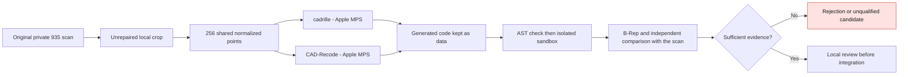

# Targeted trial of cadrille and CAD-Recode — September 12, 2026

**Both models actually generated CAD, which was then checked separately.
Both candidates are excluded from the master model: missing details and deviations from the scan.**

## Purpose and limits

Compare two specialized models on **the same input**, before correcting the cylinder head.
This pilot simulates neither thermal behavior, nor strength, nor printing, and qualifies no 700 hp engine.
A generative model proposes a hypothesis; it does not by itself justify a change to the Porsche outline.



## Input actually prepared

- Source: supplied **935** reference scan, not a certified M64; port mouth and local flange `low_B`.
- 90,185 original triangles kept, 46,844 exact unique vertices; no
  invented surface, repair or closure added.
- Open crop: 3,651 boundary edges, 2 non-manifold edges and 2 zero-area
  triangles. A closure produced by a model will therefore be a hypothesis.
- Main input: 256 `float32` points, shape `(256, 3)`, float32 FPS from
  8,192 area-weighted surface points, PCG64 seed `20260912`, start 0.
  This strategy follows the authors, with no bit-for-bit identity claimed with their
  random generator or PyTorch3D kernel. The initial uniform input is kept.
- Normalization by box center and half of the largest dimension; inverse
  transformation recorded privately. The absolute scale in millimeters is not attested.
- Separate check references: 32,768 points, seeds `20260913` and `20260914`.

SHA-256 of the main FPS input `points.npy`:
`e2791955d76a2f2e27c39b4db61d71ff252c1953de9ac3a849f37111a20abd9c`.
The geometric data remain private; 256 points do not necessarily preserve every detail.

## Frozen models and provenance

| Item | cadrille | CAD-Recode v1.5 |
| --- | --- | --- |
| Weights | `maksimko123/cadrille` | `filapro/cad-recode-v1.5` |
| Weights revision | `2f422d1169e4362e2288b0e0f54bb3a2b504e0f9` | `765e8cc315a1a77bd8c69ccd0b403bad20ce35e8` |
| Code repository | `col14m/cadrille` | `filaPro/cad-recode` |
| Code revision | `d72acc687273d31d62afe62eb9ded8b66b835321` | `03e3262119b38939feaa44b8368ad8db99243d47` |

The loader verifies the official SHA before import. CAD-Recode: only the two classes
from the first notebook cell are extracted; demos, renders and `exec` are excluded.
The processor/tokenizer revisions are also frozen.

The **weights of both models are CC-BY-NC-4.0**: non-commercial research trial
only, with no commercial authorization inferred from this trial. The Apache-2.0
cadrille code does not lift the restriction on the weights. Sources:
[cadrille, official model card](https://huggingface.co/maksimko123/cadrille),
[CAD-Recode v1.5, official model card](https://huggingface.co/filapro/cad-recode-v1.5),
[cadrille code](https://github.com/col14m/cadrille),
[CAD-Recode code](https://github.com/filaPro/cad-recode).

## Bounded execution and reproducibility

The [loader](../../twins/m64-cylinder-head/source/run_cad_specialist_inference.py) uses
Transformers, Safetensors and SDPA, without `trust_remote_code` or an implicit token.
Real local run on Apple MPS: PyTorch 2.5.1, torchvision 0.20.1, Transformers 4.50.3,
float32 parameters, eight CPU threads, embedding cast adapted and traced, no silent CPU fallback.
The first MPS attempt failed on the memory thresholds, not on the geometry.
Both successes use high/low 0.5/0.4; the loader now checks their order before download.
Vast `50801707`: image not loaded in 15 min, instance deleted and absence verified; no remote inference.
Observed credit debit: **0.0073427022 USD**, provisional, with no guarantee on final billing.

```bash
python run_cad_specialist_inference.py --model cadrille --device mps \
  --points points.npy --output cadrille-run --noncommercial-research \
  --seed 42 --max-tokens 1536 --generation-seconds 120 --timeout-seconds 900
```

Repeat with `--model cad-recode` and a new folder. The two sequential runs
use greedy generation, seed 42, a real cap of 1,536 tokens, a soft limit of
120 s and a 900 s supervisor. No bit-for-bit guarantee across GPU architectures.

Private outputs: inert code, `generation.json`, `supervision.json`, logs and audits.
The separate check applies ×0.01 to the CAD coordinates, without ICP registration or scale fitting.
CAD-Recode driver archived and hashed; cadrille-v2 driver hash unavailable, not reconstructed after the fact.

The generated code was read before execution: both outputs contain only
simple CadQuery constructions. Execution and then native audit in **two separate
containers** on Kali: network cut, unprivileged user, read-only root,
two CPUs, 4 GiB, 128 processes and 120 s per step. AST analysis is not
a security boundary. **Remaining limit:** the cumulative volume of the output
directory and the host logs are not capped; the per-file limit is not
enough. This supervised pilot therefore does not authorize an autonomous service running
arbitrary LLM code. Quota-bound outputs and bounded logs will be needed.

The [redacted public receipt](../../twins/m64-cylinder-head/evidence/cad-specialists-20260912.json)
keeps identities, digests, durations, results and limits. Scan, generated code,
B-Rep and derived comparison images remain private as long as the redistribution
rights of the scan are not established.

## Checks and results

The [10 loader tests](../../tests/test_m64_cad_specialist_inference.py) pass;
the results below come from the runs and audits, not from these software tests.
In total, **77 targeted tests pass, none skipped**: 50 checks of the
rental/search profile, 10 of the loader and 17 of geometry/containment. The comparisons
were replayed with SHA verification of the two reference arrays actually
consumed. Both native runs were also replayed with positive evidence
that the containers were gone; B-Rep and distances are identical to the first trials.

`make check` was run: it stops on the historical F46 preparation report,
which differs from its sources. The same failure was reproduced on the branch published
before this batch, commit `3c00c0f08a96b9fca07e1b86f6483c78c357be9e`.
This report was not regenerated to hide the discrepancy; the global suite is not
presented as green and no merge into the main branch is proposed.

| Observed measurement | cadrille | CAD-Recode v1.5 |
| --- | --- | --- |
| Generation only | 32.279 s | 33.795 s |
| New tokens / EOS end | 185 / yes | 257 / yes |
| Measured loading, different caches | 5.078 s | 68.441 s |
| Current MPS / driver memory, decimal GB, not peaks | 8.879 / 9.757 | 6.209 / 7.776 |
| CadQuery 2.8.0 / OCP 7.9.3.1 audit | 1 valid solid, 19 faces | 1 valid solid, 26 faces |
| p95 distance scan → candidate, normalized | 0.326215 | 0.352646 |
| p95 distance candidate → scan, normalized | 0.123551 | 0.197387 |

Distances between two samples of 32,768 points, not exact distances to the
surfaces nor a Hausdorff bound. Resampling of the scan alone: p95 **0.012359**,
a comparison benchmark, not a predefined acceptance tolerance. The largest dimension is 2.
Both reconstructions omit four small drillings; their closures are
not observed in the open crop. B-Rep validity alone ≠ independently verified self-intersections.
Cadrille has smaller p95 values on **this single crop**: no general ranking follows from it.

## Next step adopted

Do not integrate these generative reconstructions. Resume a scan-guided
parametric reconstruction: observed drillings and outlines, provenance of the
reconstructed surfaces, local comparison, then a check of the known interfaces.
Invent neither M64 dimensions nor hidden geometry. No material, thermal,
pressure, fatigue, engine operation or LPBF validation is provided by this pilot.
