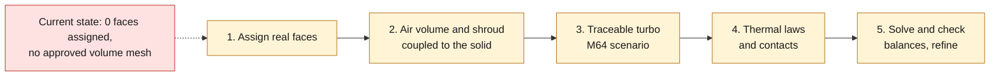

# M64 — preparing the full cylinder-head thermal analysis

Audit of September 7, 2026. **No M64 cylinder-head thermal computation completed.**
The next computation must contain the real solid and its thermal interfaces,
not just a flow in the ports or a control disk.



## Current state — update of September 7, 2026

The current private master is `four-seat-candidate.step`, **5,130 faces**, SHA-256
`92640fd2ce03b1ffedf35b47063c50d150057ff2fdbac181b640236a0b5f596f`.
It takes over the F43 envelope with the four counterbores and V2 guides; this
reconstruction does not yet establish the interfaces of a functional M64 cylinder head.
**No approved thermal assignment and no computational volume mesh is
available for this current body.** The face indices, group proposals
and F53/F54 meshes cannot be transferred to it.

A [native CAD and meshing sequence](M64_NATIVE_CAD_CONTACTS_AND_MESH_20260907.md)
has since computed the nominal contact surfaces of the eight inserts on the
port-05 candidate and generated a tetrahedral mesh of that candidate.
The mesh is **rejected for quality**, with no thermal computation. The contacts
remain geometric at native tolerance, with no conductance or hot interference fit.
The integrated candidate C1 06 is also rejected by its BOP check; none
of these trials replaces the master or closes the physical inputs below.

The F53 audit below and its command are kept as **history of that
other geometry**, not as preprocessing of the current master. The next
steady-state computation under assumptions must wait for the functional CAD, its verified
boundary groups and its mesh. The 700 PS crankshaft target does not set
the heat flux entering the cylinder head.

## Work executed on the available geometry

The script `twins/m64-cylinder-head/inventory_thermal_boundaries.py` was
run on Kali with OCP 7.9.3.1, on the private four-valve F53 STEP:
SHA-256 `700baea66bc72cdb6aee529e21b167270ebde11db94b06f8e1e55ee08bdd9bf2`.
This is still a reference derived from the 935 scan, **not a fitted
M64 cylinder head or a new substitute shape**.

- 4,929 faces: 3,051 B-Splines, 1,845 planes and 33 cylinders.
- Total area 144,617.7772 square scan units; not a certified physical
  area in m². The relative error between the per-face sum and the global integral
  is 3.82 × 10⁻¹⁵.
- Area, center, bounding box and topological neighborhood recorded for
  each face; no geometry is modified or repaired by this inventory.
- **0 faces thermally assigned** at this stage. A face without an assignment
  remains unknown; it does not automatically become adiabatic.

The coordinates remain private under
`/tmp/917-f50/out/m64-thermal-boundary-inventory-20260907c/` on Kali.
The inventory uses OCCT face indices starting at 1, tied to the hash
of the STEP and to the import version. It refuses assignments coming from
another digest/version, double assignments, nonexistent faces and
roles without a review reference. The 12 targeted tests pass.

The area integration uses the B-Rep surfaces, not the render triangles.
This operation follows the [OCCT BRepGProp](https://occt3d.com/dev/doc/refman/html/class_b_rep_g_prop.html) API.
It certifies neither the topology nor the thickness; the F54 defects remain
open. A complete inventory is not a complete CHT case.

## What the repository can actually provide

| Input | Available | Limit for the next computation |
| --- | --- | --- |
| F53 reference solid | Private STEP, hash, 4,929 faces inventoried | Not yet the M64 interfaces; known weak walls |
| F48/F50 gas regions | Patches `intake`, `exhaust`, `valve`, `chamber`, `deck`, `bore`, `walls` | Separate fluid domain; names not transferable to F53 faces |
| OpenFOAM 14 CHT runtime | Gas/solid tutorial run, energy solved on 2,000 + 800 cells | Neither a cylinder head nor global convergence; do not rerun this witness case as a part result |
| F46/F50 pressure/flux | Historical traces from the 917 project | Not applicable to the turbo M64 without an explicitly redefined engine case |
| CP1 material | Manufacturer reference data and 400 °C / 4 h treatment | No complete map of k(T), Cp(T), expansion and hot mechanical properties |

The [Constellium CP1 sheet, page 2](https://assets.foleon.com/eu-central-1/de-uploads-7e3kk3/41170/product_sheet_aheadd_cp1_nov_2021docx.e81a7d073ebf.pdf)
provides in particular 187 W/(m·K) and tensile tests at 25 °C for its
400 °C / 4 h condition. The stability announced at 250–300 °C is not a hot tensile
or conductivity law. The
[ECKART A20X sheet, page 5](https://www.eckart.net/en/download/document/view/id/519)
contains tensile points up to 250 °C; it does not complete the CP1 thermal
map and its treatment is specific. These sources were reviewed,
but **no property is assigned to the M64 by this audit**.

## Minimum to prepare before the first part CHT case

1. Assign the real faces: chamber/intake/exhaust, fins and
   exterior exposed to air, seats/guides/spark plug, cylinder seating face,
   cam carriers and fasteners. Inheritance from F43 does not by itself mean
   "air-cooled": it also contains functional surfaces.
2. Build the air volume and its shroud, define the openings, then
   connect its boundaries to the faces of the solid. Check coverage and
   geometric continuity of the interfaces; do not pair by name alone.
3. Define a traceable turbo M64 scenario: speed/load, fuel,
   forced induction, cooling-air inlet and pressure losses.
   For a first steady-state study, averaged loads declared
   as assumptions are possible; they do not become measurements.
4. Provide the thermal laws over the computed range and the thermal contacts.
   Add hot mechanical properties, preloads and interference fits for the
   strength computation. A rendering library is not this map.
5. Solve then check incoming/outgoing energy, opposite interface fluxes,
   finite temperatures, residuals and stability of the quantities of interest; then
   refine space/time and compare air only against air + oil at identical
   loads. The oil circuit remains a design variant, not a cooling
   implicitly available.

OpenFOAM distinguishes thermodynamic models, transport and equation of state in
`physicalProperties`; the choice must match the fluid/solid and the
thermal range. See [OpenFOAM 14 guide, thermophysical models](https://doc.cfd.direct/openfoam/user-guide-v14/thermophysical).
The inventory script generates no incomplete dictionary ready to run:
it provides the identifiers and checks needed for its assignment.

## Reproducing the preprocessing

From the private container that has OCP and the existing helpers:

```sh
python inventory_thermal_boundaries.py \
  --input /f50/out/f53-4v-adaptive-bspline/candidate.step \
  --sha256 700baea66bc72cdb6aee529e21b167270ebde11db94b06f8e1e55ee08bdd9bf2 \
  --helpers /f50 --output /f50/out/new-private-boundary-inventory
```

The output directory must be new. The optional assignment JSON contains
`source_sha256`, `ocp_version` and an `assignments` list; each group carries
`role`, `face_ids` and `evidence`. A complete partition of the faces proves neither the
physical validity of its boundary conditions nor manufacturability.
