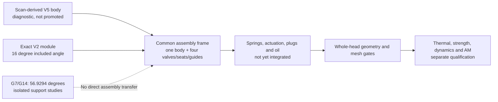

# M64 — complete-head integration gate, 27 September 2026

## Target and geometry identities

The [user's product target](../../twins/m64-cylinder-head/README.md#product-target--complete-finned-four-valve-head)
is a complete finned M64 head with two intake valves, two exhaust valves and
twin ignition, using the FVD reference 99310401188BF as a visual reference.
The private photographs are not dimensional evidence or licensed publication
assets. The 700 hp turbo target is a study requirement, not demonstrated output.

Three different objects must not be conflated:

| Object | What actually exists | Boundary |
|---|---|---|
| Private 935 scan → F43 → four-pocket body | Scan-derived exterior; four seat counterbores and four guide bores. The corrected STEP has one solid and passed the recorded BRep/BOP checks. | Uncertified scale and M64 registration; not a complete head. |
| Independent V2 module | Twelve separate solids: four valves, four seats, four guides, defined in a new millimetre design frame. | No scan read by its builder; no springs, cams or body in this module. |
| G7 mechanism and G14 supports | Synthetic head, distribution parts and local support experiments. | The head starts with `makeBox` in `fourvalve/cad/head.py`; it is not the F43 body. Its support results do not establish a complete head. |

Sources: [four-pocket audit](M64_FOUR_SEAT_BODY_CAD_AUDIT.md),
[V2 build receipt](../../twins/m64-cylinder-head/evidence/four-valve-design-v2-20260907/build-report.json),
[G7 receipt](../../twins/m64-cylinder-head/evidence/g7-local-supports-cooling-20260925/native-audit.json),
[synthetic head constructor](../../twins/m64-cylinder-head/source/fourvalve/cad/head.py).

The existing F43/V2 registration assumes one scan unit per module mm,
rotation about Z of −90° and translation along Z of +3 scan units. These are
explicit design hypotheses, not calibration. On this date the private build
and comparison receipts, final body and V2 STEP were rehashed against the
[public audit](../../twins/m64-cylinder-head/evidence/four-seat-body-cad-audit-20260907.json):

- Final pocketed body: `92640fd2ce03b1ffedf35b47063c50d150057ff2fdbac181b640236a0b5f596f`.
- Exact closed V2 module: `fac380b277add2e3d265d7fa8265baeb0ce460b9f69075730d14ece555e76a76`.
- Private build / comparison receipts: `ca2d8656f343f5e61d124d511e6a446190b24fb010ef484ce3c8bc5fb8bb3eb2` / `389ad32984bdf7fd3dc2ca0d4eae28e5aa549911e6515bdf400cc790d1e4e9a1`.

## Independently checked incompatibility

For the unit stem axes defined by [V2](../../twins/m64-cylinder-head/source/build_four_valve_distribution.py)
and [G7 layout](../../twins/m64-cylinder-head/source/fourvalve/layout.py),
the angle between banks is `acos(u_intake · u_exhaust)`:

| Invariant or dimension | Retained V2 | Retained G7 |
|---|---:|---:|
| Intake / exhaust outward inclination | 8° / 8° | 29.3758° / 27.5536° |
| Included angle | 16° | 56.9294° |
| Unit-axis dot product | 0.9612616959383189 | 0.5456720332147813 |
| Intake / exhaust pair pitch | 45 / 45 mm | 43.1875 / 36.1875 mm |
| Stem diameter generated by the source | 6 mm | 7.96 mm |
| Guide outer diameter | 11 mm | 13.06 mm |
| Seat outer diameter, intake / exhaust | 43 / 36 mm | 44 / 37 mm |

A rigid transform preserves dot products and distances. It cannot remove the
40.9294° included-angle difference; even balancing the two axis errors leaves
at least 20.4647° on one bank. One uniform scale cannot reconcile both unequal
pair pitches either. Thus a rigidly repositioned G7 assembly cannot fit the
existing V2 axes and pockets. This is a geometric incompatibility, not a claim
that either architecture is physically validated. G7 dimensions and profiles
come from its exact receipt and [valve/guide/seat constructor](../../twins/m64-cylinder-head/source/fourvalve/cad/valve.py).

## Reuse without transferring validation

Both branches retain 40/33 mm valve-head diameters and 11.5/9.6 mm maximum
lifts. These can remain common candidate requirements. V2 additionally defines
45° seat faces, 6 mm stems, 0.030/0.040 mm **chosen cold diametral** guide gaps,
11 mm guide OD and 35 mm guide length. Preserve the retained component geometry
when continuing its pocketed body; do not substitute the incompatible G7 parts.
The current V2 builder is not byte-identical to the implementation fingerprint
in the historical audit, so its present source is not proof of exact replay.

The [GSC5092 spring study](M64_VALVE_SPRING_SELECTION_20260914.md) supplies a
candidate force/height basis, not a fitted spring assembly: installed height
40 mm, coil-bind height 24.18 mm and published maximum lift 14.25 mm. Nominal
bind reserves at the candidate lifts are 4.32/6.22 mm. Its outer diameter and
wire diameter remain unpublished in that record; G7's 30 mm conical envelope
and 32 mm pocket are assumptions. Spring seats, retainers, locks, stem lengths,
rocker/cam axes and support locations must be redetermined together for V2.

## Smallest common architecture gate

The pocketed body above is an ancestor, not the latest whole-body diagnostic.
The [later geometry checkpoint](M64_GEOMETRY_CHECKPOINT_20260908.md#independent-bop-of-the-saved-candidate-five-modes-passed)
already records the exhaust-equipped V5 candidate
`450ba0816bf355f350b45e1878e3327f2070cd10b405f885afb3ef2c026bff0e`:
one solid, one shell and 4,900 faces. Its five selected BOP modes passed.
Its Linux reserialization differences have already been attributed, with
local representation bounds; global solid equivalence is not established.
The historical master `21c9c40b…` and its rejection remain unchanged.
Neither those passed BOP tests nor the byte-attribution work need repeating
on unchanged inputs. The later solid-mesh result still has 283 tetrahedra
below its quality threshold; it is not admitted to structural analysis.

Use this explicitly **diagnostic V5 body** and the exact V2 module for the
next coherent assembly/visualization, with their recorded registration and
all historical reservations. Do not present the older intake-only body as
the latest full-head candidate. Missing or changed inputs must block the job:
**no fallback to `components.head(p)`,
G7 `assembly.parts(p)` or a replacement block/oval envelope.** Any deliberate
geometry revision needs a new identity and new checks; existing masters remain
unchanged. This selects a coherent exploratory starting point, not an OEM master.

Before a complete-head claim, one assembly must explicitly account for:

- Chamber, two intake and two exhaust paths, port mouths, exterior fins and
  preserved/changed skin regions; no transfer of acceptance from rejected port trials.
- Four valves, seats, guides, springs, spring seats, retainers and locks;
  cold/hot fits, guide engagement and mechanical clearances.
- Cams/actuation, followers or rockers, shafts, journals, carriers, fasteners,
  covers and seals, with a common layout and continuous-motion checks.
- Two spark-plug installations and service access; oil feeds, returns,
  closures and any proposed internal cooling passages.
- Cylinder register, sealing plane, studs, piston/chamber/valve clearances
  and timing, with measured interface provenance and remaining unknowns.

The [existing continuous exclusions](../../twins/m64-cylinder-head/evidence/continuous-valve-envelopes-20260907.json)
cover rigid nominal V2 valve motion against the exact pocketed body only.
They contain no piston, spring, cam, hot growth or deflection margin. Material,
thermal, lubrication, structural, fatigue, manufacturing and professional-review
gates remain separate from geometric completeness.

## September 27 execution — scope kept separate

### New native assembly and actual views

A new private native compound now combines **the V5 body and the twelve exact
V2 components** in their common frame: 13 solids, exact BRep-valid before and
after native save/readback. The old pocketed and intake-only bodies are excluded.
Both valve banks are closed. No Boolean operation, smoothing, contour change
or replacement of the historical masters was performed.

The full view and display half-cut are rendered from the actual 13 parts,
with 130,064 triangles. The half-cut is uncapped display clipping, not a
manufacturing section or a CAD modification. Colours identify components,
not materials, temperatures or stresses. Source and all five inputs stayed
unchanged. The run completed in 12.264 seconds; maximum RSS was 899,280 KiB.

This is an **integration checkpoint, not a complete head**. Springs, seats
for the springs, retainers, locks, plugs, actuation, carriers, covers, seals,
fasteners and oil circuits still require integration. The image's missing-part
list gives examples, not a complete bill of materials. Thirteen valid solids
do not establish collisions, running clearances, hot retention, global
geometric equivalence or engine fitment.

| Private artifact | SHA-256 |
|---|---|
| New 13-solid native assembly, 5,252,491 bytes | `655a95e1d0006eec045a058e4a0838bdad798650ea02e2328935c0246c805265` |
| Assembly/tessellation receipt | `83b96494309050bdd90924124b7b5f48f6ad88b4cc9db3f518fa10fa841fdeaf` |
| Full view + display half-cut image | `a4bc59a50698b0772314ccda87d8cba161779e8cae9df0adf96864224d5102f6` |
| Render receipt | `a6817de01be785e3a568247b787c8afec2d63138ade7ae601a7ea3aa6b31b1e9` |
| Independent collection/scope review | `2474f14da85c2a4e74d082430a8c34d3c5be1a3dba97f596c504384b324f6a41` |

The [frozen producer](../../twins/m64-cylinder-head/source/wholebody/render_v5_v2.py)
and [four pure tests](../../twins/m64-cylinder-head/source/wholebody/test_render_v5_v2.py)
are public. Their SHA-256 digests are respectively `63ccd3df8f07997a1bbeb6d7ba1434732622c7fc41106483ace0155ff00c3947`
and `0b41dc4da11f5ff8e25e392b6634a9ed20ebcb85547de543d319a008fcab2dcc`.
The tests passed again from this published source copy. The producer requires
the five exact private inputs named in `PINS`; no substitute geometry is used
when they are absent. Its extra dependency list extends the tested Linux/OCP
7.9.3.1 runtime; it is not a standalone full environment lock.

Geometry and images remain private under the
[scan source policy](../../catalog/sources/src-wolfe-classics-935-billet-cylinder-head-scan.json).
The user can inspect the local images; they are not silently republished on GitHub.

### Solver and translator controls

The rented Linux host passed the native CCX build, analytical cube and three
reference runs: two repeated −Z runs and one +X control. This qualifies that
solver path only: no fine G14
solve and no whole-head structural or thermal solve were launched. The
priority changed to the complete head. A successful runtime test is not an
engineering validation of the assembly.

A separate STEP-translator comparison uses the older **intake-only** native
body `33375e12…`, not V5. OCP 7.9.3.1 reproduces the invalid default STEP.
The explicit `write.surfacecurve.mode=0` variant also fails and increases
the curve-on-surface error occurrences from 8 to 51. It is rejected, not a
repair. The geometry, stored tolerances and historical outputs were not
overwritten. This writer option omits p-curves; it does not disable the
translator's internal shape processing. See the
[OCCT writer documentation](https://github.com/Open-Cascade-SAS/OCCT/blob/master/dox/user_guides/step/step.md).

OCP 8.0.1.0.0 requires separate binding adapters. Its writer eventually runs,
but the exported STEP is also invalid. Failed API-only cube trials remain
recorded separately; they are not physical failures of the head. None of
these older-body export experiments promotes or replaces the more advanced
V5 diagnostic. The independent 7.9 reread finds the same 31 invalid records
as the historical STEP: 23 faces and 8 edges. Its self-intersection BOP
check passes, but does not cancel those BRep failures.

The unchanged native exhaust subtraction was also replayed once. It produces
the **same bytes** `21c9c40b…` and reproduces the two C0 faults. This is a
reproducibility control, not a new correction or a replacement for the later
V5 evidence. Its requested fuzzy value of zero does not mean exact arithmetic:
the historical helper did not record OCCT's effective numerical floor.

### Closed-run fingerprints and collection

All geometry and coordinate-bearing receipts remain private. These SHA-256
digests identify the actual closed runs, not forecasts:

| Receipt | SHA-256 |
|---|---|
| Linux CCX build, cube and three references | `7818cec3cb842f90c603c8c2afc089176f56ae85dacdf690da55670760b8d216` |
| OCP 7.9 default STEP control | `48ac820252af6c479702b1a130feb3321a585a842fa520067031c28aed22de0a` |
| OCP 7.9 surface-curve mode 0 | `6f21d2d416bfdb431e58cdbb5fff10475c3593daea0e5d98778c3a1d533291fd` |
| OCP 8 writer | `dd083e0ac928215133601f0132620f2e7e80596578e4db07d122fd29528738aa` |
| Independent OCP 7.9 checker of that export | `85acdb1433387d5ef8d68abceff737741635e5a9e3603610ea9a7a816c321aac` |
| Native exhaust-cut comparison | `5c76a9ac72fbe04b4fa9ccd15421031454f17df09f202c4ff01fb0387422b818` |

The private CCX archive is 145,765,071 bytes, SHA
`57bd8504d68b96b00309e13e9a5164181fae23bcc4d443d0dfec66065b05aaeb`.
All 106 retained files were verified on Linux and again locally. Four matrix
files are fingerprinted but omitted; the archive is not directly resumable
without regenerating and matching them. Build intermediates are omitted,
with the exact binary, resolved libraries, input recipes and licences kept.
An initial collection guard correctly stopped on CCX's changed source hash:
its Makefile runs `date.pl` after the pre-build licence fingerprint. The only
observed difference in `ccx_2.21.c` is the build-date string. The corrected
collection preserves both the pinned original licence source and the actual
post-build source; the original numerical summary was not rewritten.

The separate OCP 8 collection is 6,662,990 bytes, SHA
`bec2a6a5dc0ae0bd0d0c6828b5373b2d14211b1f7ce957d46563e9a2f6139be3`.
Its 46 artifact files and manifest were independently verified, including
four failed compatibility attempts. No failed trial is relabelled as a pass.

### Rental closure

The one owned instance `52832401` was destroyed after local collection;
the wrapper returned `verified_absent=true`, followed by an independent
inventory check and the deadline guard's own absence confirmation. The
separate task's VM was not a destruction target. No ongoing paid computation
for this checkpoint is implied after closure.

The host provided 104 logical CPUs, more than 512 GB usable RAM and an RTX
3090. GPU presence is not proof that CAD Boolean work, CCX or the viewport
used CUDA. The recorded all-in hourly rate was USD 0.9859259259. About
3,101 seconds from the manifest to confirmed cleanup imply USD 0.849 in
time charges; even using all 8 GB of reserved image/input/output traffic
adds USD 0.03125 at the quoted tariffs. **Approximately USD 0.89 is a
conservative estimate, not a provider invoice**, below the separately
authorized USD 5 cap. The earlier full-balance figure is not treated as
spending authority for another attempt.

### Software verification

`make check` passed after updating the generated reports index: 3,127 tests
in the main discovery, 136 skipped for optional dependencies, followed by the
additional Makefile checks. The four new producer tests also pass separately.
An earlier full check stopped on the stale reports index; that failure is
retained in the private log. These software checks do not exercise every
native solver and do not validate a manufactured cylinder head.
