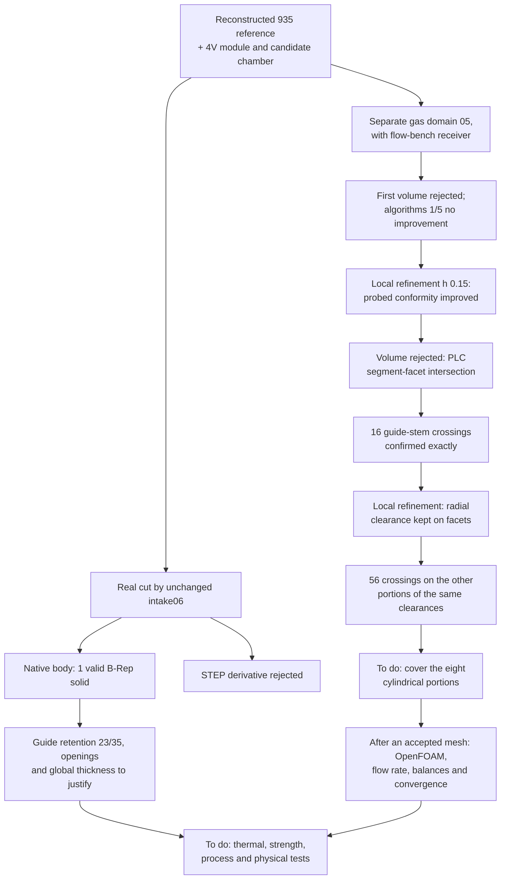

# M64 — hollowed body and intake meshing

## Result and scope

**Published follow-up:** the [next batch](M64_VOLUME_REEL_CONTROLES_20260908.md)
covers the eight guide–stem portions and obtains a volume mesh of 481,189
tetrahedra. OpenFOAM still rejects its quality. This document keeps the
chronology of the earlier trials, without turning their local checks into a
validation of the later result.

The intake ports are now **actually subtracted from the body that already
carries the candidate chamber**. The new native export is a valid B-Rep
solid; its STEP derivative is rejected. In parallel, a local refinement improves
the representation of one face of the air domain, without yet constituting an
accepted volume mesh or a CFD result.

The target remains a four-valve cylinder head for a **twin-turbo M64 at 700 PS
at the crankshaft**, not a demonstrated power output. The envelope comes from the
[reconstructed 935 scanned reference](M64_FOUR_SEAT_BODY_CAD_AUDIT.md), with
the uncalibrated hypothesis `1 scan unit = 1 mm`. Neither the M64 interfaces
nor the thermal loads follow from this hypothesis or from the 700 PS.
The earlier masters are preserved; no change of silhouette is justified by
the mere success of a CAD operation.

## Body: one effective cut, two read-only checks

The [builder](../../twins/m64-cylinder-head/source/flowbench-intake/build_ported_chamber_candidate.py)
subtracts only the unchanged native negative `intake06`. Body and port were
already in the same frame: no second registration, no flow-bench receiver and
no valve-stem-seal extension is used as a tool.
The [body receipt](../../twins/m64-cylinder-head/evidence/ported-chamber-intake-candidate-20260908.json)
keeps the digests of the input, of the source actually executed and of the results.

| Check | Finding |
| --- | --- |
| Material actually removed | 173,194.170 units³; distinct from the tool volume |
| Native body obtained | 1 solid, volume 1,244,303.586 units³; valid B-Rep before and after native read-back |
| STEP exchange | Invalid B-Rep read-back: derivative rejected, not used for rendering |
| Bounding box | Zero maximum deviation; this is not complete proof of a preserved silhouette |
| Exhaust seats and guides | Nominal cylindrical contact areas kept |
| Two intake guides | Each keeps **23 units out of 35**, on a complete 360° cylindrical band |
| New port wall | 24 rays resolved on **8 of the 11** new faces; sampled minimum **2 units**, none below the exploratory threshold of 1.5 |

The end of a guide exposed to the port is not automatically a mechanical
defect. The remaining 23 units do, however, require a justification of
retention, loads and heat transfer: the measured surfaces are neither an
interference-fit pressure nor hot strength. The status kept is therefore
"guide support review required", without arbitrarily demanding zero loss of
contact as a manufacturer rule.

The rays cross the material of the **new** body up to its first native exit,
verified by a read-only replay. Three faces are not sampled: neither a global
minimum, nor a fraction of too-thin surface, nor a print qualification is
established. Likewise, the 182 contacts with the old skin include walls of
internal voids; the zero residual outside the intake/chamber/bore masks does
not by itself prove the absence of any unwanted opening to the outside. The
BOP check of the new body had not been run at this stage; the supplement below
documents it.

The single cut finished in 75.94 s, exit 3 corresponding to the design-review
status; both diagnostics finished with exit 0.
Native execution limited to 2 CPU/4 GiB/300 s, without network or rental.
The [three targeted tests](../../tests/test_m64_ported_chamber_candidate.py)
check the software rules; they do not replace these CAD findings.

The private render `render-02/corps-admission-coupe.png` shows the body in gray,
the port in blue and a section of the module. Its digest and that of the
render receipt are linked in the body receipt. It comes from the native B-Rep
`33375e12…`, not from the rejected STEP; it is neither a manufacturing
photograph nor a temperature field. The second version only corrects the
wording of guide retention to "to be verified", without modifying the geometry.

### Supplement: independent BOP check of the same body

The B-Rep `33375e12…` was then read back **without redoing the cut**. The
[new geometric receipt](../../twins/m64-cylinder-head/evidence/ported-chamber-native-bop-20260908.json)
confirms one solid and one shell, 5,056 faces, exact BRepCheck valid.
The project's five single-body modes — self-intersections, small edges,
face rebuilding, continuity and curves on surfaces — finish without defect,
error or warning. No stop at the first defect.

The BOP takes 107.69 s; the supervised process finishes in 113.58 s, exit 0,
peak memory 2,691,440 KiB, process absent after completion. The ordered
tolerances and the input digests are identical before/after. A first
preflight, stopped on an incompatibility of the Python hashing API before any
CAD read, is kept separately; the resumption only replaces that hashing.

**This PASS does not lift the mechanical review of the 23/35 guides.** It does
not repair the STEP, does not create the exhaust ports and qualifies neither
thicknesses, nor interfaces, nor CHT. No radius, contour, frame, bore or
material is modified. It is now evidence of native geometric cleanliness of
the chamber + intake body, not a released cylinder head.

## Meshing: measured local improvement, not global acceptance

This work concerns the **separate gas domain** `gas-domain-05`, B-Rep
`3f20f4c5…`, comprising the chamber, components and flow-bench receiver. It is
not a conduction mesh of the new solid body. The first
[volume attempt](../../twins/m64-cylinder-head/evidence/native-gas-mesh-pilot-20260908.json)
was rejected on facets of face 38 (`walls_port`); no usable volume came out of it.

The [trials of algorithms 1 and 5](../../twins/m64-cylinder-head/evidence/native-gas-face38-algorithm-comparison-20260908.json)
at unchanged sizes reproduce the same 25 triangles on this face, without
improvement. Choice 5 and the initial choice 6 fall back to MeshAdapt:
they are not three independent final methods. The exit 0 of these trials
only means that the diagnostic surfaces were saved.

A local refinement at `h = 0.15 units`, with no change of CAD or tolerance,
produces 523 triangles on this face. The
[CAD conformity counter-audit](../../twins/m64-cylinder-head/evidence/independent-surface-cad-conformity-20260908.json)
measures the following improvement:

| Measurement on face 38 | Initial surface and trials 1/5 | Refinement h = 0.15 |
| --- | ---: | ---: |
| Relative deviation of the sum of areas from the native CAD area | +493.818 % | +0.733 % |
| Maximum **probed** distance from triangle points to the native face, units | 0.0745316 | 0.000173771 |

The area covers all the triangles of the face. The second distance audit
covers 96 of the 523 triangles, with four points per triangle: it is neither a
worst-case search nor a Hausdorff bound. A nearly coincident sliver remains,
with sampled normals sometimes nearly orthogonal; the improvement does not
qualify the 88 faces of the domain.

**The normal/UV conclusions of auditor v1 are revoked.** Its filter could
assign to a point near an edge the normal of a distant corner. The corrected
audit v2 attaches the normal to the native support that is actually nearest;
it finds no opposite normal in the refined sample.
The old reports remain archived, without being used as evidence of
inversion. This correction of the checker changed neither the CAD nor its tolerances.

## Volume trial

The [volume attempt after the h = 0.15 refinement](../../twins/m64-cylinder-head/evidence/native-gas-h015-volume-attempt-20260908.json)
was actually run: **2.267 s, 4 CPU/4 GiB, exit 2**. The
50,526 triangles and 25,263 surface nodes are kept, but recovery of the PLC
boundary fails with the diagnostic
`A segment and a facet intersect at point`. No volume MSH is produced
and no CFD computation is started. The native B-Rep remains unchanged.

The digest of the surface MSH of this attempt (`0e04f190…`) differs from
that of the standalone h = 0.15 surface trial (`7dc65967…`), despite the same
counts. Bit-for-bit identity is therefore not established: the earlier
conformity diagnostics do not automatically become an audit of every facet of
this new save.

The [next diagnostic](../../twins/m64-cylinder-head/evidence/native-gas-guide-chord-diagnostic-20260908.json)
located **16 strict crossings**, confirmed in exact rational arithmetic on
the MSH coordinates: four between guide/stem faces 55/63, twelve between
58/62. These are the crossings found by the diagnostic, not an exhaustive
count. None of these sixteen involves face 38; the log does not say which one
triggered its first rejection.

The nodes do lie on the native cylinders, of radii 3.015 and 3 units.
But the guide chords sink in by 0.0181 to 0.0208 units: more than their radial
clearance of 0.015. This finding motivates a **numerical** refinement at
h = 0.20 on these four cylinders, without changing the diameters or their
clearance. The `Min` field combines this size with the h = 0.15 of face 38;
the shared boundaries take part in the refinement. The
[Gmsh documentation](https://gmsh.info/doc/texinfo/) describes the size fields
used (`MathEval`, `Restrict`, `Min`). The target size is not a guaranteed
ceiling: one transverse chord produced actually reaches 0.2471.

A surface of 129,322 triangles then passes a conservative check of **the whole
area of each radially projected facet**, and not only of its edges. The sum of
the errors of both cylinders and the frames must stay below 0.0075 units, half
the clearance. This check is recomputed on the surface actually used just
before the new 3D attempt: the remaining radial margins are at least 0.01038
and 0.009934 units, numerically.

**The new volume attempt is nevertheless rejected**, in 7.289 s,
with the same PLC segment–facet message. Its surface `891eba2a…` is kept;
no volume MSH and no CFD result is produced. The local radial check passed,
not the global mesh. The attempt receipt keeps both runs and the differing
digests.

Exact examination of the last MSH then found **56 strict crossings** on the
other cylindrical portions of the same clearances: faces 56/64 (four) and
57/61 (fifty-two). None of these crossings involves the four faces already
refined. The scope of the correction was therefore incomplete: the Boolean
operations had split each functional surface into several faces. The next
modification must inventory and cover **all eight cylindrical portions**, with
the same radial check on the mesh actually produced, without changing the
diameters or the tolerances.

## Validation boundary

The new [OpenFOAM history auditor](../../twins/m64-cylinder-head/evidence/intake-openfoam-flow-audit-20260908.json)
was run read-only on the existing smoke test: its 20 iterations do not satisfy
the two planned 100-iteration windows. It therefore validates neither a
stabilized balance nor convergence, even if the last balance looks balanced.
It also checks zero flux at the fixed walls; two identical averages are not
enough to qualify an oscillating signal. No new smoke-test computation was
started to manufacture a flow-rate result.

No physical computation has yet been run on this new body or on this real gas
domain. The [OpenFOAM smoke test](M64_DOMAINE_GAZ_OPENFOAM_20260908.md)
checks a software chain on a separate port, not the cylinder-head flow rate.
The 700 PS, heat-rejection, fatigue and printing objectives remain to be
demonstrated with the loads and the [material/process to be selected](M64_700CH_MATERIAL_COOLING_LPBF.md).
**No authorization for manufacture or engine start.**

## Compute and budget

The user ceiling is **44 USD, with no top-up**. The reading of the approved
OpenBao wrapper during this batch returns **43.9166429608502 USD of available
credit and no instance**. This is an observed state, not a guaranteed balance
for a later date. No Vast rental was committed in this batch: the short jobs
used the existing native runtimes. A rental still requires a useful job, its
`linux/amd64` image qualified by digest, the verified SSH identity and the
budget and shutdown safeguards.

## Software verification of this batch

`make check` completed with an observed exit of 0. The main suite counts
2,283 cases, 108 of them skipped for lack of optional dependencies; the target's
other checks also finish without failure. The private log carries the digest
`0642264d19613b176344214a300d941d361c85a3829c1fd05e59db75e5a9334c`.
The targeted tests were also run in the native OCP runtime: **42 passed,
none skipped** (16 meshing, 8 CAD conformity, 5 chords/intersections,
10 OpenFOAM balances, 3 hollowed body). The Mermaid diagram is reviewed in its
source; no executed Mermaid rendering is claimed.

The test strategy separates software regressions from runs on the private
geometry. The documentation keeps the rejected trials and links the digests;
the colors of the render identify the parts and not a computed physical
performance.
