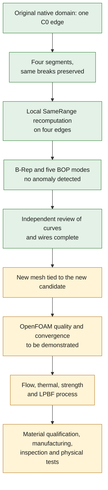

# M64 — correcting the C0 representation and repair trials

## Verified progress

The new native candidate of the **gas domain**, `7fc114c1…`, passes the
exact B-Rep check after re-reading as well as the five BOP modes used:
self-intersections, small edges, face rebuild, continuity and
curve-on-surface consistency. The previous domain `3f20f4c5…`
kept a C0 continuity anomaly.

The [reproducible script](../../twins/m64-cylinder-head/source/flowbench-intake/split_gas_c0_edge.py)
recreates **the same native file, identical SHA-256 digest**, in 9.39 s.
The [aggregated receipt](../../twins/m64-cylinder-head/evidence/native-gas-c0-segmentation-20260908.json)
ties this result to the inputs, the intermediate steps and the checks.

This is a CAD representation fix, not a new cylinder-head
shape. The target remains the M64 twin-turbo four-valve, with 700 PS at the crankshaft
as an unmet objective. The scan scale and the M64 interfaces remain
uncertified. No flow, thermal, strength or LPBF computation is
validated by this result.

## What changed

Native edge 97 carried three tangent breaks within a single
B-spline. The candidate represents these four segments as four edges.
The breaks remain junctions: their disappearance from the continuity diagnosis
*internal to each edge* does not mean they were smoothed.

The [OCCT mechanism](https://dev.opencascade.org/doc/refman/html/class_shape_upgrade___shape_divide_continuity.html)
can either simplify knots or split a curve. The first
experiment with the native tolerance of 5×10⁻⁶ had simplified a knot: it
is not kept. The next candidate requests a zero removal tolerance
and keeps the three cuts. This setting alone is, however, not
a proof of geometric equivalence; the representations must be
compared independently.

After the split, four `SameRange` flags remained false, although
the recorded ranges of the 3D curves and of the curves on the two adjacent
faces were already equal. The local recomputation by `BRepLib.SameRange`
restores their consistency. No flag is forced directly, no
edge tolerance is increased and no `SameParameter` call is
made in this fix.

| State | Faces | Edges | Vertices | Exact B-Rep |
| --- | ---: | ---: | ---: | --- |
| Original domain | 88 | 192 | 117 | Valid, C0 anomaly in BOP |
| Split before parameter consistency | 88 | 195 | 120 | Rejected |
| Candidate after local consistency | 88 | 195 | 120 | Valid after re-reading |

The 5×10⁻⁶ tolerance is a **numerical tolerance in scan units**,
not a certified manufacturing tolerance. The original native files
remain unchanged. The rejected intermediate candidates are kept.

## Independent cross-check

A second program compares the native representations, without reusing
the generator. The degrees, poles, weights, knots and multiplicities of the four
B-splines are identical to those of four copies of the original curve
segmented at the same bounds. The 117 existing vertices keep their
coordinates and tolerances; three shared vertices materialize the cuts.

The audit examines the surfaces of the 88 faces, 388 parametric curves and the
191 other edges. No incompatibility is detected. A few
axis descriptors show rounding differences, which rules out
describing all descriptors as strictly identical. The orientations,
edge occurrences and vertex graphs of the wires are preserved.
This comparison goes beyond simple point sampling on the
surfaces, without becoming a metrological or physical proof.

The independent log, linked in the receipt, finishes in 0.42 s. The incomplete
preparatory trials are kept; a `WireExplorer` traversal that did not
cover all occurrences was not presented as exhaustive.

## Limits and next use

The [next remeshing pass](M64_REMAILLAGE_NATIF_20260908.md)
has now been run on this candidate: new volume of 469,985
tetrahedra, boundary counter-audits and OpenFOAM check. Volume
integrity passes, but six quality families remain rejected; no
CFD authorization follows from it.

The candidate can now serve as the basis for a **new diagnostic meshing
attempt**, with its own boundary and quality checks. This does not
waive the guards of the meshing program.

The earlier mesh of 481,189 tetrahedra belongs to domain
`3f20f4c5…`, **not** to candidate `7fc114c1…`. Its six OpenFOAM rejections remain
in the [previous batch](M64_VOLUME_REEL_CONTROLES_20260908.md). They are
neither erased nor automatically resolved by the new CAD checks.

The [Netgen/OpenFOAM counter-check](M64_NETGEN_CONTRECONTROLE_20260908.md)
separately measures an optimization of this historical mesh: generation
recovered with integrity preserved, but six quality families still
rejected. No result from this old domain is attributed to the C0 candidate.

## Software verification and resources

`make check` ends with code 0: 2,293 cases in the main suite,
of which 108 skipped, no failure; the complementary targets also finish.
The full log carries the digest
`498cbac74a1eec13839aaee3c65c5e198ffdf423fcd3a7500f9b78d899d86239`.
The two new tests check in particular incomplete parameter partitions
and the refusal of the invalid intermediate candidate. The rounding
witness uses a synthetic value, with no parameter extracted from the scan.

These CAD computations ran on the Mac with explicit CPU limits. No
Vast spending in this batch; the instance check returns an empty list.

## Metal body: two STEP repairs rejected

The metal body is distinct from this gas domain. The
[two STEP experiments](../../twins/m64-cylinder-head/evidence/ported-body-step-repair-attempts-20260908.json)
did not repair its exchange:

- `FixSameParameter` on the eight edges concerned returns success,
  but the B-Rep before/after is strictly identical. 23 faulty faces
  and eight faulty edges remain; after a new STEP exchange, the counts
  become 25 and nine. This version is rejected.
- Removing and then explicitly reprojecting a single parametric curve
  leaves a numerical gap of about 1.3946×10⁻⁵ unit, above the native
  budget of 5×10⁻⁶. No tolerance is raised, and no extension to the
  other edges nor new STEP is launched from this rejected candidate.

The original files are unchanged. These failures rule out presenting
a software `true` return as an effective repair; the degradation of the
representation during the STEP exchange remains to be explained.

**The cylinder head is not yet authorized to be printed for engine use.**
