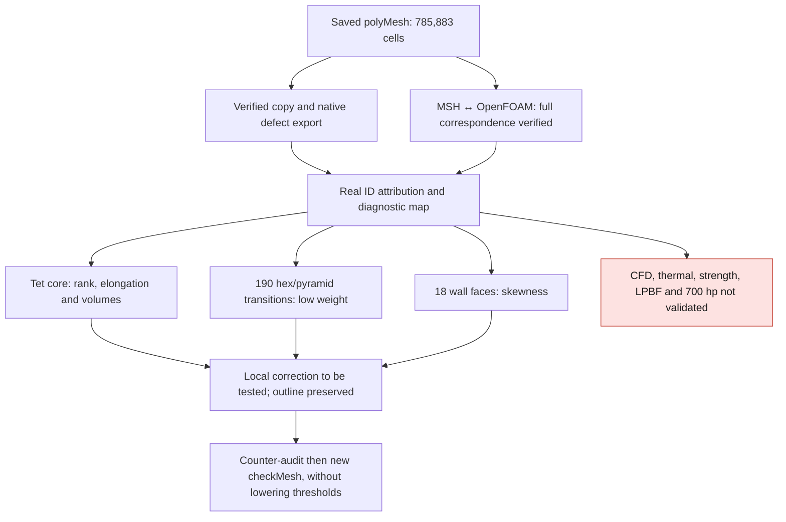

# M64 — OpenFOAM defects localized, without modifying the outline

**The native export of the defects and their attribution to the source cells are
complete. The five quality families remain rejected. This batch corrects the
correspondence reader, not the cylinder head or its mesh.**

The gas domain of [785,883 cells](M64_HYBRID_OPENFOAM_20260909.md)
is taken over exactly as saved. No `gmshToFoam`, rescaling,
CFD solver, thermal computation or print computation is rerun.
The CAD master and the Porsche silhouette do not change.

## Result useful for choosing the correction

| Native set | Attribution actually verified |
|---|---|
| 2,305 low-determinant cells | All tetrahedral; 2 have one internal face, 465 have two, 867 three and 971 four. |
| 10 highly elongated cells | All tetrahedral; all also belong to the preceding 2,305. |
| 18 faces with excessive skewness | All on `walls`, adjacent to tetrahedra. |
| 1,491 faces with low interpolation weight | 1,301 between tetrahedra; **190 between hexahedron and pyramid**. |
| 137 faces with low volume ratio | All between tetrahedra; all also low-weight. |
| 3,545 faces beyond 70° non-orthogonality | 3,126 between tetrahedra; **419 among the 1,536 tetrahedron/pyramid junctions**. |
| `shortEdges` set | **5 point identifiers**, incident to 15 tetrahedra. This file is not a list of five edge identifiers. |

The sets can overlap and do not add up to a total number
of defective cells. None of the low-weight faces lies on
a tetrahedron/pyramid junction; this junction must not be confused with
the hexahedron/pyramid base. Among the low-determinant cells,
416 touch 446 tetrahedron/pyramid junction faces.

The [OpenFOAM determinant](https://github.com/OpenFOAM/OpenFOAM-14/blob/7b05503f98a85be88af930df48623b4d152bfc35/src/meshCheck/primitiveMeshCheck/primitiveMeshCheck.C)
is built from the normals of the internal or coupled faces, not from the
volumetric Jacobian of the tetrahedron. Here the patches are uncoupled: the
**467 cells with only one or two internal faces** cannot provide
three independent directions. This explains a rank deficiency for
this subset, but **not the 1,838 other cells**, nor the four other
rejected families. The native tensor is not recomputed by this attribution.
The positive volumes observed earlier are not enough to accept the CFD.

## Native export executed on a copy, in 12.148 seconds

The only native command is:

```sh
checkMesh -allTopology -allGeometry -writeSurfaces -writeSets -surfaceFormat vtk
```

The version is **OpenFOAM Foundation 14-7b05503f98a8**, pinned local x86
image. The container on Kali is limited to four CPUs and 4 GiB, without network,
with the source case read-only. The tool remains serial (`nProcs: 1`).
The seven expected sets are found with their classes and counts.
The identifiers come from the ASCII `cellSet`, `faceSet` and `pointSet`,
**not from the VTK envelopes**, which do not by themselves prove the source IDs.

`checkMesh` takes 10.896 s; the complete process, cleanup included, 12.148 s.
It finishes without timeout or OOM. The export succeeded, but the log keeps
`Failed 5 mesh checks`. The supervisor's exit code 0 means here
**export complete and container cleaned up**, not mesh accepted. The 29 original
files, including the six `polyMesh` files, are unchanged. The 19 files
added are exports and a new log. The exact container is removed
and its absence rechecked. **No new Vast spending.**

## MSH → OpenFOAM correspondence: first assumption corrected

The first reader rejects at OpenFOAM point 1029 / MSH 1030, axis 2, in
2.693 s. It assumed a 12-digit write before and after scaling.
Its script and its rejection receipt are kept; the mesh is not modified.

The official code forces a higher precision when writing points
through [polyMesh](https://github.com/OpenFOAM/OpenFOAM-14/blob/7b05503f98a85be88af930df48623b4d152bfc35/src/OpenFOAM/meshes/polyMesh/polyMeshIO.C#L553-L561).
The [fullPrecision/highPrecision](https://github.com/OpenFOAM/OpenFOAM-14/blob/7b05503f98a85be88af930df48623b4d152bfc35/src/OpenFOAM/db/IOstreams/IOstreams/IOstream.C#L82-L95)
functions and the direct write of [transformPoints](https://github.com/OpenFOAM/OpenFOAM-14/blob/7b05503f98a85be88af930df48623b4d152bfc35/applications/utilities/mesh/manipulation/transformPoints/transformPoints.C)
justify, for this double-precision case, the sequence **15 → binary64
multiplication by 0.001 → 12 → rewrite at 15**.

The correction is limited to this numerical model. **No matching
tolerance or approximate geometric search is added.** The second
reader finds the 223,155 points in source order, the complete faces
of the 785,883 cells by bijection, and the owner/neighbour orientations.
The 99,470 external faces and their roles agree; the 1,536
tetrahedron/pyramid interfaces are internal. The check takes 28.895 s.

The maximum deviation from a direct multiplication without serialization is
5.003 × 10⁻¹³ in the scaled numerical frame. This number characterizes
the write chain, **not the accuracy of the scan**. The OpenFOAM `cellZones`,
the UV parameters/node classes, the CAD identity and the global absence of
overlap are not certified by this reader.

## Diagnostic map and targeted next step

The independent attribution takes 8.449 s. It rereads all native IDs,
recounts the internal faces and cross-checks the 1,536 interfaces. The private
outputs provide all markers and the real boundary, without
subsampling the defects. The visualization uses two orthographic
projections with identical scales across rows; it shows **the air
domain**, not the metal cylinder head. The face/cell markers are
the means of the unique vertices, not the weighted native centroids.
The axes remain in scan units, not certified. Neither thermal colors
nor engine performance are invented. The meshes, coordinates and
geometric derivatives remain private in accordance with the repository rules.

The correction must distinguish the core tetrahedra, the wall faces and
the hexahedron/pyramid transitions. A simple merge of tetrahedra does not change
the two cells adjacent to the 190 hexahedron/pyramid transitions.
The next computation must measure their projected face-center distances,
their volumes and the layer geometry before choosing a redistribution.
For the rank-deficient tets, a local agglomeration remains an option
to be tried, with a check of the neighbors and of the
[native concavity predicate](M64_AGGLOMERATION_LOCALE_20260908.md).
No new selection or corrective transformation is executed here.



The software stack in the photo remains relevant with the
separate roles documented in the [hybrid OpenFOAM report](M64_HYBRID_OPENFOAM_20260909.md)
(section on the role of the software in the photo).
Ditto/MQTT do not correct a mesh; PhysicsNeMo does not constitute an
independent cross-check when it learns the same unqualified results.

The targeted tests pass: 20 for export/supervision, 18 for the corrected
reader and 13 for the attribution, i.e. **51 tests**. The 17 tests of the first
version of the reader had also passed: the real case was therefore essential
to uncover its false assumption. `make check` finishes with exit code 0;
some optional native tests are skipped depending on the dependencies present.
These software checks are not strength or print tests.
The digests are in the
[evidence register](../../twins/m64-cylinder-head/evidence/geometry-checkpoint-20260908.json),
entry `gas_hybrid_defect_localization`. No result of this batch releases
a cylinder head for printing or for fitting to an engine.
