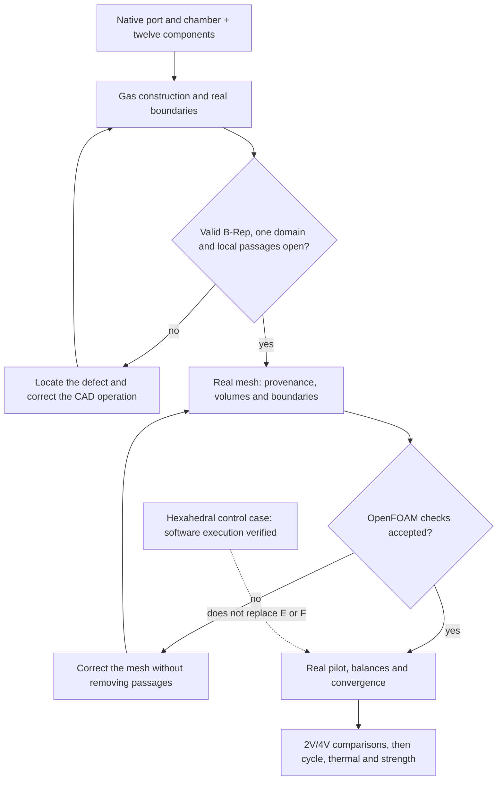

# M64 — air volume and OpenFOAM execution

Documented follow-up: [actually hollowed body and local mesh refinement](M64_CORPS_ADMISSION_MAILLAGE_20260908.md).
The historical CAD normal diagnostics below are not retained evidence: a
projection matching error was corrected and explicitly traced in the new
receipt. The area and distance results obtained independently of this
matching remain separate.

## What actually works

The chain **Gmsh → OpenFOAM Foundation 14 → compressible solver `fluid`**
ran 20 iterations on a rectangular control duct. The import, the unit
conversion, the three boundaries and `checkMesh -allTopology -allGeometry`
pass on its 325 hexahedra. Each command ended with an observed exit code of 0.

**This control case is not the cylinder head.** It verifies the software
interfaces and the prepared bench conditions, not the flow rate of the part.
The flow rate is still changing at the stop; no convergence is claimed. The 20
steady iterations do not represent 20 seconds of engine operation.
The [execution receipt](../../twins/m64-cylinder-head/evidence/intake-openfoam-runtime-smoke-20260908.json)
keeps the digests of the sources, of the logs and the rejected trials.

The conditions are those of the [intake pilot](M64_ADMISSION_CHAMBRE_20260908.md):
total inlet pressure 101,325 Pa, total temperature 293.15 K and static outlet
pressure 94,350.51052 Pa. The gas is ideal, the computation solves energy and
uses k–ω SST. The turbulence intensity of 5% and the mixing length of 3 mm are
assumptions to be studied, not measurements. The adiabatic walls of this cold
bench **do not compute the heat rejection of the cylinder head**.

## Why the first tetrahedral mesh was not accepted

The 1,768 tetrahedra of the first control case had positive volumes, a single
component and complete oriented boundaries. Nevertheless, OpenFOAM reported 92
cells with a bad determinant for its finite-volume operators. A tetrahedron
Jacobian and this finite-volume stencil check do not measure the same quality.
The exit code 0 of `checkMesh` is not enough: the pilot explicitly requires
`Mesh OK.` and the absence of any failed check.

The dual conversion was tried and then rejected: one bad face decomposition
and 139 concave cells remain. No threshold was loosened to make this test
pass. The hexahedral control case qualifies the execution of the software,
**not a meshing method ready for the real passages of the cylinder head**.

Two incompatibilities of version 14 were also corrected and tested: the type
of the imported wall group (`patch` to `wall`, without touching coordinates or
connectivity), and the native `volFieldValue` monitoring objects in place of
`fieldMinMax`, which is absent from this image.

## Real domain: operations and expected evidence

The gas domain must join the ports, the chamber and the receiver, then
exclude the **twelve real components** of the module: valves, seats and
guides. The Ø100 × 100 receiver is an assumed bench fixture, not the piston.
The module transformation is applied only once; the assumption
`1 scan unit = 1 mm` still does not certify the M64 interfaces.

The independent inspection of the components identified the two closed
exhaust seat contacts and the guide/stem clearances. Each intake guide annulus
has a radial clearance of 0.015 unit over 35 units. Only part of it is
included in the raw port: truncating this passage where it leaves the port
would create a fictitious wall. The full extension is therefore kept. Its top
closure will be an **idealized bench condition**, identified in the
boundaries, not a new part nor a qualified physical seal.

Version `gas-domain-04` is rejected: the volume before subtraction is a valid
solid; after subtraction, it contains a micro-shell sharing faces with its
main boundary. The native defect is `BRepCheck_InvalidImbricationOfShells`,
with no individual face, edge or wire defect. This result is not a
demonstrated physical cavity. The diagnostic of the constituents before
fusion finds no volume intersection with the seats. The defect is thus
located in the Boolean assembly, not justified as a new mechanical shape.

The `gas-domain-05` correction uses the set identity
`(union Ai) minus B = union (Ai minus B)`: subtract the same components from
the constituents before their union. It does not justify omitting a seat,
deleting a shell by hand, or changing a dimension. It restored a valid B-Rep
solid, including after native and STEP rereading, in 45.81 s.
The [construction receipt](../../twins/m64-cylinder-head/evidence/gas-domain-construction-20260908.json)
keeps the rejected versions and the separate results. The four coplanar faces
were attributed to the real seats, whose surfaces they cover completely; the
chamber negative is not a material.

The native BOP check still reports a C0 B-spline edge: three positions are
continuous, with tangent angles of 0.622°, 6.964° and 16.764°. This is not
only an angle between two faces. Two small segments have numerical lengths of
0.000239 and 0.000049 unit, far below the minimum mesh size of this pilot.
They are neither removed nor smoothed. Their representation by the mesh must
be measured without imposing an unjustified nanometric precision on an
uncalibrated scan.

The STEP adds 31 `InvalidCurveOnSurface` anomalies to the BOP check, although
its B-Rep topology passes. **This STEP is not qualified for computation.** Any
meshing attempt will use the exact native B-Rep, with an explicit C0 review,
and will not turn the earlier false checks into passed checks. The independent
review `advisory-audit-02`, completed in 8.07 s, authorizes only this
diagnostic attempt: continuous positions, fully covering seats and opposite
normals. Its private receipt carries the digest
`936846c6a1d5f3b0765eb30b75e6cf1003fa6052cb5717487292dde7c3fec8cd`.

## Import preflight: comparing the same integrators

The first real preflight `pilot-01` stopped **before generating a single
element**. The 88 faces, their areas and their centers were preserved, but
the check compared two different volume integrators:

| Call on the same native B-Rep | Numerical volume, units³ |
| --- | ---: |
| OCCT non-adaptive | 995,961.8505977857 |
| Gmsh `getMass` observed | 995,961.8505977859 |
| OCCT adaptive, epsilon 1e−9 | 995,964.5870880088 |

The [cross-computation](../../twins/m64-cylinder-head/evidence/gas-domain05-volume-integrators-20260908.json)
thus explains the gap that had exceeded the import guard. The check must
compare the Gmsh result with the **corresponding non-adaptive** OCCT call,
keeping the relative threshold of 1e−6. The adaptive value remains separate
and the integration gap is kept. This changes neither the surfaces, nor the
CAD tolerances, nor the element quality thresholds. This rejected preflight is
therefore not presented as a failure of an already produced mesh.
The [reading of the official Gmsh 4.15.2 source](../../twins/m64-cylinder-head/evidence/gas-domain05-gmsh-mass-source-20260908.json)
also confirms the non-adaptive call used for `getMass` in dimension 3.

## First actual generation: local rejection kept

With this comparison fix, the import passes: one volume, 88 faces and a
relative volume gap of 2.22e−16 between corresponding integrators. Gmsh
produces **44,774 surface triangles and 22,387 nodes**, then rejects the
volume reconstruction. The log points to two facets of the same face 38,
classified `walls_port` and coming from `raw_intake_face_8`, with an angle of
0.0324048° compared with its criterion of 0.1°.

This rejection concerns the triangulation: it **does not by itself
demonstrate a self-intersection of the CAD**. The angle criterion was not
lowered. No volume mesh was exported or qualified and no flow computation was
launched. The run lasted two seconds on the local CPU, without running out of
memory; renting a bigger machine would not fix this geometric condition.

The three C0 nodes examined are 0.000428–0.000563 unit from the nearest
boundary node. These distances are recorded as diagnostics, not as evidence
that the whole boundary conforms. The private run log keeps the two triplets
of faulty facets. The first helper saved the MSH only after 3D generation;
this historical surface was therefore not kept and cannot be rebuilt
identically from its log alone.

## Saved surface and local diagnostic

The helper now keeps the surface before any 3D attempt. A 2D-only run saved
**44,776 triangles, 22,388 nodes and 88 faces**, without tetrahedra or a new
volume generation. The MSH rereading preserves the oriented triangles and the
boundary groups; the maximum coordinate gap is 5.70e−14 unit. The edge
incidences are closed and consistent, with no duplicated triangle. These
topological checks prove neither the absence of intersection nor conformity
with the CAD surface.

This run lasted 1.42 s. Despite the same explicit options, it contains two
triangles and one node more than the historical surface: it is **not a
bit-for-bit reproduction** of the previous rejection. The two reported node
triplets exist on the current face 38. Their oriented normals are 179.9676°
apart and are nearly orthogonal to the CAD normals evaluated at the projected
barycenters. The barycenter–CAD distances are 0.02824 and 0.04973 unit. This
gives a local diagnostic target, without demonstrating a real intersection, a
global inversion or geometric identity with the earlier pair.

The [mesh receipt](../../twins/m64-cylinder-head/evidence/native-gas-mesh-pilot-20260908.json)
links the three runs, the unchanged parameters and their digests. The
coordinates, full normals and connectivities remain private. The next action
is to correct and check the triangulation of this port face, then retry the
volume and the OpenFOAM checks. No change to the cylinder head shape and no
lowering of the rejection threshold is justified by this diagnostic alone.

## Rerunning without losing traceability

The [pilot sources](../../twins/m64-cylinder-head/source/flowbench-intake/prepare_openfoam_case.py)
create a fresh directory and a file manifest. The
[launcher](../../twins/m64-cylinder-head/source/flowbench-intake/run_openfoam_pilot.py)
verifies these digests, refuses to reimport or rescale a case that has already
run, and keeps the exit codes and logs of each step. For `head_pilot`, it
requires an independent review bound to the native domain and to the exact
digest of the mesh. Preparation alone is not an execution. Large files and
private geometries are not published.

The sequence runs on the existing local x86 runtime. No Vast rental was
committed for these control cases. The user cap remains 44 USD, with no
automatic top-up. Rereading the wrapper approved on September 8 returns
43.9166429608502 USD of available credit and no instance; this is an observed
state, not a guarantee of a future balance. The local OpenFOAM image does not
yet have a qualified registry digest for this new batch: this point, the job,
the SSH pair and the key association must be verified before a rental.

Primary references for the configuration:
[OpenFOAM 14 modules](https://doc.cfd.direct/openfoam/user-guide-v14/solvers-modules),
[boundary conditions](https://doc.cfd.direct/openfoam/user-guide-v14/derived-boundary-conditions).
The commands and dictionaries were also verified in the sources and tutorials
of the image actually executed.

The documentation guide structured this note around observed results,
rejections and a reproducible procedure. Neither these software checks nor the
future cold-bench computation release the cylinder head for manufacturing or
starting; the [multiphysics plan](M64_MULTIPHYSICS_EXECUTION.md) still applies.

## Software verification of the published batch

On the final sources of the batch, `make check` ended with an observed exit
code of 0. The main suite counts 2,253 tests in 177.854 s, of which 102 were
skipped; the additional targets also complete, with one more OCP test
skipped. The private global log carries the digest
`abd35d512c8d131cff05e099ee7c6d4a1335f73597b8604fcc17455d0ce18905`.

The **42 targeted tests** of the builders, the diagnostics, the mesh and the
OpenFOAM pilot pass separately in the runtime containing OCP, with no test
skipped. The surface mesh, the volume mesh, the solver execution and
convergence remain four separate results: a passed software test does not
make a rejected physical computation pass.
