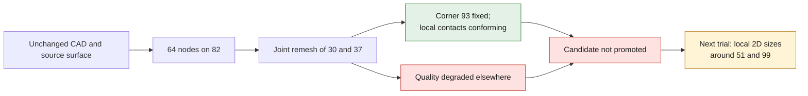

# M64 — edge redistribution and joint remeshing

**The targeted defect at corner 93 is fixed on the copy, but the candidate stays
rejected: mesh quality degrades elsewhere.** No change to the Porsche contour
and no promotion of the reference volume mesh.

This batch follows the [diagonal audit](M64_SURFACE_DIAGONAL_AUDIT_20260909.md).
It uses the MeshAdapt surface `7af7f207…`, not a new cylinder-head design.
The physical scale and the M64 interfaces remain unqualified.

## Trial actually run

A Linux x86 container on Kali runs a temporary 1D generation of
edge 82: 64 nodes instead of 13, requested progression `1/1.1` toward
native vertex 51. The temporary mesh is cleared before the exact reinjection
of the reference. Only edge 82 and faces 30/37 are then remeshed.
The CAD is mounted read-only; no 3D volume is generated.

The reports measure an actual chord progression from 0.909090 to
0.909355. The last segment is 0.96736 times the neighboring segment of edge 93,
below the trial limit of 2. This ratio is a numerical grading criterion,
not a dimension nor a manufacturing tolerance.

The nine native preservation checks pass. The counter-computation finds
the classes, coordinates and ordered elements outside the target unchanged, including
the 72 faces carrying 71,152 quadrilaterals. The shared boundaries 82 and 93
remain conforming. The native parameters of the new edge 82 are kept
during 2D generation; the final MSH does not serialize these parameters.

## Quantified result: local improvement, global rejection of the candidate

| Indicator | Source | Rejected candidate |
|---|---:|---:|
| Triangles face 30 | 107 | 268 |
| Triangles face 37 | 2,299 | 2,478 |
| Obstructions face 30 | 0 | 1 |
| Obstructions face 37 | 22 | 20 |
| Obstructions, both faces | 22 | 21 |
| Minimum bound, both faces | 0.0032268884 | 0.0010824348 |
| Minimum angle, both faces, degrees | 0.085767353 | 0.023879723 |

An obstruction here means the mathematical quality-bound marker
below 0.1 for a tetrahedron sharing the facet. It is neither the SICN
of an actually generated volume nor a universal CFD admission threshold.
The independent comparisons use exact fractions of the binary64
coordinates; the decimals in the table are rounded displays.

The facet at corner 93 no longer shows this obstruction. However,
face 30 gains a problematic triangle and face 37 sees its extrema
degrade. The drop in the total count is therefore not enough to keep the
candidate. The saved candidate mesh carries the digest `2de5fd52…`.

The exact contact check with face 36 processes **503 pairs before and
550 after**: no non-conforming contact in either case. It does not cover
all pairs of the model nor the continuous coverage of the CAD.

## Consequence for the next trial

The degraded triangle of face 30 is attached to the last segment of 82, near
vertex 51. The two worst triangles of 37 rest on very small
segments of edge 99, which is distinct from 82. The next lead is therefore a local
2D size field around these two zones, with a check of the neighboring faces,
rather than another progression coefficient on 82 alone. This field is not
applied yet; this diagnosis alone does not prove the internal cause
of the mesher's behavior. The CAD curves stay fixed.

Reading the Gmsh 4.15.2 code clarifies the next trial:
`src/mesh/BackgroundMeshTools.cpp`, lines 244–268, queries the size
callback then applies `Mesh.MeshSizeMin`. The current floor of 0.005
can therefore raise a small requested size. It is not an absolute bound
on all existing elements: `src/mesh/meshGFaceBDS.cpp`, lines 603–624,
also initializes sizes from the incident 1D segments. The next
case must test the floor and the local field together, counting the
calls per face; a callback added on its own is not a demonstrated fix.
This code inspection does not run the next case.

## Execution, evidence and limits

- Native computation: 16.344 s; 17.014 s with cleanup.
- Independent counter-computation: 5.933 s.
- Caps: four CPUs, 4 GiB, five minutes with a cleanup reserve.
- 38 targeted software tests pass: 15 worker, 10 launcher, 13 counter-computation.
- `make check` ends with code 0; optional tests are skipped
  depending on the available dependencies. This repository check does not validate the part.
- Process ended with quality-refusal code 2, with no generation error,
  timeout or out-of-memory reported.
- Container deleted and its absence re-verified; input files unchanged.
- No new Vast spending, no CFD, thermal, mechanical, LPBF or engine-power
  qualification.

The launcher's historical boolean `process_completed_and_cleaned` stays false
because it also requires code 0: here it does not mean a container left running.
The raw output, the candidate and the receipts are kept private; their digests
appear in the [evidence register](../../twins/m64-cylinder-head/evidence/geometry-checkpoint-20260908.json),
entry `gas_curve82_joint_remesh`. No manufacturing authorization is opened.

