# M64 — endpoint reconstruction and local mesh sizing, 29 September 2026

## Retained engineering state

Continuation of the [local reconstruction trials](M64_LOCAL_RECONSTRUCTION_20260928.md).
The retained volume result is **32 tetrahedra below minSICN 0.1 / 1,341,461**.
The reference CAD has not been replaced. This remains a 935 scan-derived
research body, not a metrologically qualified M64 head. All geometric lengths
below are provisional scan units, not certified millimetres or a printer
specification. No physical, material or manufacturing gate is closed.

**Dernier passage au volume, 2 octobre : HXT exporte 1 852 069 tétraèdres sur
sa propre surface auditée et exactement conservée.** Mais 668 417 éléments
bruts échouent au seuil volumique ; ce volume ne remplace pas la référence.
La [reprise et la localisation](#2-octobre--audit-de-la-surface-dans-la-session-volumique)
distinguent ce résultat refusé d’une validation physique ou de fabrication.

**Essai surfacique précédent, 2 octobre — partitions cylindriques : zéro triangle de
surface rejeté sur 1 081 206.** Contrôles natifs, fermeture et intersections
passent. Cela ne valide pas encore le volume ni la culasse pour fabrication.
Voir [la correction et ses limites](#2-octobre--regroupement-des-partitions-cylindriques).

**Earlier experiment, 1 October:** local conforming surface subdivision reduces
the maximum sampled shape error from **0.0948743 to 0.0723482 scan unit**, with
zero incompatible surface triangles. It still fails the 0.040-unit screen;
the CAD master and retained volume are unchanged. Details and rejected controls
are recorded below.

**Earlier result, 2 October:** native-curve-aware refinement and one local
error-driven pass produce **933,562 surface triangles**, zero incompatible
triangles and a maximum sampled deviation of **0.0665857 scan unit**. The
0.040-unit shape screen still fails. A second local pass is rejected because
one child fails the orientation guard relative to its parent; it is not promoted.

**Earlier continuation, 2 October:** the fixed-diagonal defect is corrected and
three further passes finish without orientation or quality rejections. The
best sampled maximum is now **0.0642802 scan unit**, with **938,982 surface
triangles**. It still fails 0.040; the retained volume and physical gates remain
unchanged. The frozen-code full `make check` now passes on Kali2, including
the previously blocked pinned Docker test. See the final section below.

**Earlier result, 2 October:** all-exceedance selection and guarded polygon
triangulation lower the sampled maximum to **0.04959299 scan unit**, about 23%
below 0.0642802. The lower patch passes both sampled directions; the upper
patch retains **56 native samples above 0.040**. A subsequent pass is rejected
for one orientation failure. This remains a surface experiment, not the
physical 0.040 mm goal or a manufacturing release. The retained volume still
has 32 rejected tetrahedra.

**Latest result, 2 October:** native-feature-constrained projection removes
the remaining orientation rejection. Both reconstructed patches now pass
the **sampled 0.040 scan-unit screen**, with a maximum of
**0.03984823204**, 992,724 triangles and zero necessary surface rejections.
This is not a continuous error bound, the physical 0.040 mm requirement, or
volume/printing qualification. The retained volume is still unchanged. See
the final native-feature section for the measured result and remaining gates.

**Latest topology continuation, 2 October:** an exact-coordinate array export
now passes vertex-link, connected-shell, consistent-winding and CGAL
intersection checks. Two face groups require orientation permutations;
no point or triangle geometry changes. **2,565 stored 1D segments still need
reconciliation** with the subdivided surface. There is no new accepted volume
or printing release. The topology section at the end records the distinction.

**Latest curve continuation, 2 October:** 2,240 stale exterior segments on
26 curves are now reconciled with 4,480 existing surface edges. No surface
point moves; the new MSH reads back exactly to the previously oriented array.
The remaining 325 stored segments are six internal compound curves, not holes.
Their native-face partition remains unresolved, and the volume is not replaced.
The owner's perforated-fin paper is reviewed in the
[air/oil research supplement](../research/M64_LPBF_OIL_REVIEW_20260912.md#2-october-supplement-the-owners-perforated-fin-paper).

**Internal-feature audit, 2 October:** all six remaining native junctions are
sharp at the sampled points: oriented face normals differ by **81.55–98.45°**.
They cannot be treated as disposable smooth CAD partitions. The sampled
0.040-unit distance and watertight surface checks do not certify these native
creases. A separate, explicitly faceted volume diagnostic is recorded below;
it cannot replace the native reference or close the physical gates.

**Cache recovery and localisation, 2 October:** the Gmsh element-lookup failure
is reproduced on a cube and corrected by rebuilding the element cache after
optimisation. The recovered standard-optimiser diagnostic finishes but fails
quality with **45,091 rejected tetrahedra**. Actual rejected cells are now
[localised and rendered below](#2-october-cache-recovery-and-rejected-cell-localisation).
Neither this result nor Netgen's 16,261 rejections replaces the retained volume.

**Native repair follow-up, 2 October:** bounded planar tip truncations are
tested and rejected, rather than adopted as notches. The lower patch exposes
five cutter faces; the upper patch fails the forward-edge direction guard.
The [final section](#2-october-native-tip-truncation-is-not-a-junction-reconstruction)
records the witnesses, unchanged reference and next construction constraint.

**G1/contact follow-up, 2 October:** both bounded compound-meshing trials time
out without a mesh. A new all-internal-edge guard prevents sharp seams from
being hidden. Native intersections confirm that both nominal exhaust-seat
outer cylinders retain their full coincidence area in the five-edge candidate.
The [contact diagnostic and actual CAD view](#2-october-g1-compounds-and-exhaust-seat-contact)
do not qualify hot retention, thermal performance or manufacturing.

**Corner-grading follow-up, 2 October:** without modifying that candidate's
CAD, local size grading removes all 12 chamber/seat surface rejections:
**17 → 5 incompatible triangles** overall. Indexed topology, winding, all
stored curve segments and a separate CGAL intersection screen pass. The
[measured before/after result](#2-october-native-corner-grading-removes-the-chamber-rejections)
does not replace the retained volume or qualify printing.

**Later recovery, 1 October:** both authorised Linux hosts are reachable again.
The previously uncollected size-0.1 run completed but has **5 incompatible
triangles / 976,144**; the curvature-64 run ended at its 1,800-second alarm.
Neither result replaces the retained geometry. See the recovery record below.

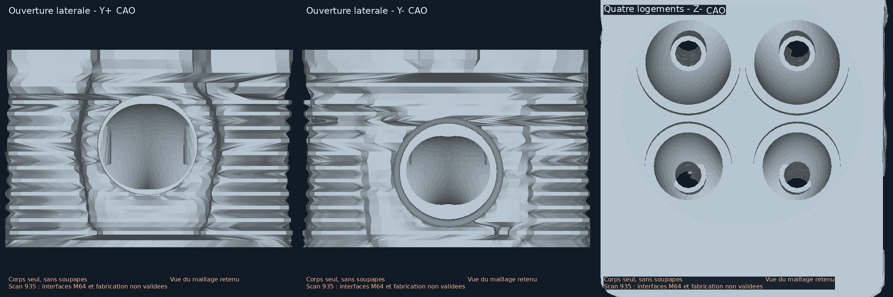

The requested close-up is rendered from the exact retained mesh, without
smoothing, decimation, invented internal channels or generative imaging.
Left and centre: opposite lateral openings. Right: four visible recesses,
with separate valves absent. These openings are not the 32 rejected volume
elements. The displayed facets and irregularities have not been cosmetically
removed. Geometric views alone do not establish their functional qualification.
The [source licence and provenance](../../catalog/sources/src-wolfe-classics-935-billet-cylinder-head-scan.json)
remain attached; the image is research documentation, not a released product.

## Fix the construction contract before adding compute

The previous filling helper supplied exterior edges in map order. A new
regression test demonstrates that consecutive edges did not form the continuous
oriented wire required by the [OCCT filling API](https://occt3d.com/dev/doc/refman/html/class_b_rep_offset_a_p_i___make_filling.html).
The test failed before the correction and passes afterwards.

The corrected shared helper traverses exact topological vertices, requires
degree two and one closed loop, or rejects the input. It uses no coordinate
welding, relaxed tolerance or deleted edge. The boundary is copied together
so its shared vertices survive; original constraints remain untouched. The
real lower and upper patches have respectively 18 and 13 ordered edges.
A disconnected two-loop witness is now rejected.

This is a real software-contract fix, **not the cause of the head's entire
reconstruction failure**: four repeats still fail with the same native results.
An additional initialization uses the original plane (142 below, 1412 above).
Only a plane is admitted, ensuring orthogonal local coordinates as required by
the same API; this is an initial surface, not permission to flatten the part.

| Trial | Maximum reported G0 error | Decision |
|---|---:|---|
| Lower, ordered boundary only | 0.1981524648 | Invalid patch; reject |
| Lower, ordered boundary + 33 interior constraints | 0.0710922485 | Invalid patch; reject |
| Upper, ordered boundary only / interior constraints | No completed patch | Both rejected |
| Lower, native plane initialization, boundary only | 0.1552171844 | Invalid patch; reject |
| Lower, native plane initialization + 33 interior constraints | 0.0206819153 | Invalid patch; reject |
| Upper, native plane initialization, both settings | Native `Standard_Failure` | Both rejected |

The lower error reduction does not meet the unchanged **1e-7 boundary
construction guard**. It is not a 0.020 or 0.040 engineering result. No patch
above reaches sewing, volume meshing or thermal testing. All eight execution
receipts finish without a timeout and preserve their input file hashes.

## Meshing experiments

The previous finer-curvature run ended at its 540-second alarm. A fresh Linux
run keeps the same geometric recipe (curvature 64, junction size 0.020,
compound factor 1, reclassification 1) with an explicit 1,800-second wall limit.
This is a new calculation, not a checkpoint resume. An initial packaging
attempt failed at import because a helper dependency was missing; it produced
no mesh. The retry includes the tracked Python dependency tree.

Two other runs use the documented [Gmsh restricted sizing field](https://gmsh.info/doc/texinfo/#Gmsh-mesh-size-fields)
on the eight original compound faces and their boundaries: size 0.2 or 0.1,
curvature 12, factor 1. This differs from refining only within a narrow distance
of six internal curves. Geometry, minSICN thresholds and admissibility checks
are unchanged. A two-square numerical witness checks that the selected square
is refined while a separate control is not, and checks actual triangle edge
lengths; API option assignment alone is not counted as a test.

The size-0.2 Linux run completes in **490.37 s**: **587,912 triangles**, zero
incompatible triangles, minimum q2 **0.07085403530**, no duplicate triangles
and no edges without incidence two. This is not a complete manifold or
intersection check. The unchanged bidirectional shape audit rejects it:

| Patch | Mesh to native, sampled maximum | Native to mesh, sampled maximum |
|---|---:|---:|
| Lower | 0.06544985810 (319,421 samples) | 0.08310593681 (1,781 samples) |
| Upper | 0.06037308328 (25,787 samples) | 0.09487428993 (1,987 samples) |

The largest observed error exceeds the exploratory **0.040 scan-unit** screen.
This is neither a certified Hausdorff bound nor physical millimetres. No
volume is generated from this rejected approximation.

Initially on 1 October the two remaining Linux outcomes (size 0.1 and curvature
64) could not be collected: the known SSH host returned `No route to host`.
They were recorded as **uncollected**, without assuming completion or continued
execution. The later recovery below supersedes that collection status.

## Reproduction

Use the existing isolated OCP 7.9.3.1 / Gmsh 4.15.2 environment and private
inputs; the compound jobs use the existing authorized Linux host.

```sh
python twins/m64-cylinder-head/source/wholebody/trial_constrained_patch.py \
  --body /private/original.brep --patch lower --grid 5 --initial-plane \
  --output /private/fresh-plane-trial
python twins/m64-cylinder-head/source/wholebody/trial_compound_junction_mesh.py \
  --body /private/original.brep --classify 1 --factor 1 --patch-size .2 \
  --curvature 12 --wall-seconds 1800 --output /private/fresh-patch-mesh
python twins/m64-cylinder-head/source/wholebody/trial_project_compound_surface.py \
  --body /private/original.brep --mesh /private/fresh-patch-mesh/surface-private.msh \
  --receipt /private/fresh-patch-mesh/report.json --split-interior-edges \
  --output /private/fresh-refinement
python twins/m64-cylinder-head/source/wholebody/audit_compound_shape.py \
  --body /private/original.brep --mesh /private/fresh-refinement/surface-private.msh \
  --receipt /private/fresh-refinement/report.json --wall-seconds 1200 \
  --output /private/fresh-refinement-shape.json
python -m unittest discover -s tests -p test_m64_constrained_patch.py -v
make check
```

Original/rejected private geometry and historical receipts are not overwritten.
Producer snapshots preserve revisions used before subsequent code changes.
No new paid instance is rented, no catalogue release is edited, and no site is
deployed by this continuation.

The six focused numerical tests pass without skips in the qualified runtime.
The initial repository check passes its **3,206-test main suite (161 optional
skips)** but stops at the report-index check because this new report was added
during execution. After regenerating the index, the final 29 September
`make check` completes with exit **0** in **232.87 s**.

## 1 October: correct the approximation without moving the master

The Mac runs a fresh bounded size-0.1 experiment. It is not a recovered Linux
result. One initial local attempt is explicitly stopped after 143.07 s (exit
-15) because a source helper was edited during execution. It is not accepted
as evidence. The replacement uses a separate frozen copy of the producer.

The [local projection trial](../../twins/m64-cylinder-head/source/wholebody/trial_project_compound_surface.py)
loads the completed size-0.2 surface and its hash-bound face correspondence.
For each of the two compounds, it selects only nodes unused by every other
surface. Those interior nodes are projected to the closest point of the
original **trimmed** CAD patch. Shared boundaries and every other node stay
exactly fixed. No native surface, mesh connectivity, element count, threshold
or original file is modified. Each displacement must remain at most 0.1
provisional scan unit; this is a bounded experimental guard, not an approved
design tolerance. No smoothing, welding or triangle deletion is used.

The first complete projection takes **53.82 s**:

| Patch | Projected interior nodes | Maximum displacement in scan units |
|---|---:|---:|
| Lower | 51,761 | 0.000124994187 |
| Upper | 3,968 | 0.000355636954 |

All **587,912 triangles** remain, with zero below the necessary q2 limit and
the same minimum **0.07085403530**. No triangle has a nonpositive old/new normal
dot product. Protected node coordinates, native in-memory geometry, source
hashes and binary mesh readback pass their exact checks. These are necessary
checks only: vertex links, self-intersections and physical face roles remain
unqualified. No full-volume or physics run is authorised by this result.

The separate bidirectional audit **rejects** this projection-only surface:

| Patch | Mesh to native, sampled maximum | Native to mesh, sampled maximum |
|---|---:|---:|
| Lower | 0.06544737408 | 0.08308649403 |
| Upper | 0.06037322241 | 0.09490790456 |

The native-side maxima occur on source faces **141** and **1411**. Moving
existing nodes leaves the excessive error essentially intact. This supports
the diagnosis of facets bridging the local shape between nodes, rather than
material drift or a physically measured displacement. The original and
projection-only audits complete in 157.05 and 143.44 s respectively, with
unchanged bound inputs. Their native sample sets and mesh connectivity match;
the mesh-side sample coordinates change with projection. Neither passes the
unchanged 0.040-unit screen.

A second bounded option splits **interior** patch edges once and projects
their new midpoints onto the same trimmed native patches. Exterior edges
remain unsplit and fixed. Conforming 1/2/3-edge subdivision patterns avoid
T-junctions without moving neighbouring surfaces or dropping a region. This
is surface-discretisation repair, **not a new editable B-Rep**. The full
exported surface remains capped at two million triangles.

It completes in **61.50 s** and produces **927,696 triangles**, still zero
below the necessary q2 limit and minimum **0.07085403530**. Lower/upper patches
grow to **420,725 / 33,224 triangles**, adding **157,495 / 12,397 nodes**.
There are no flipped normal-dot checks, duplicate triangles or edges without
incidence two; binary readback is exact and bound inputs remain unchanged.
The denser bidirectional shape audit completes in **127.27 s**:

| Refined patch | Mesh to native, sampled maximum | Native to mesh, sampled maximum |
|---|---:|---:|
| Lower | 0.04556742862 (1,264,391 samples) | 0.06168744117 (1,781 samples) |
| Upper | 0.05012542051 (100,169 samples) | 0.07234822226 (1,987 samples) |

The largest recorded deviation decreases from **0.0948743 to 0.0723482 scan
unit**, about **23.7%**. Native sample locations are unchanged; mesh-side
sampling is denser, so its sets are not identical. The exploratory
0.040-unit screen still **fails**. The original retained volume remains
**32 rejected tetrahedra**, and no volume is generated from this candidate.

The new worst native-side witnesses lie on faces **142** and **1411**. The
upper witness's nearest triangle includes an **unsplit compound-exterior
edge**, length 0.1961929 scan unit (patch edge incidence one); its other two
edges have incidence two. All three edges of the lower witness triangle
have incidence two. This identifies a boundary-resolution limitation for
the next experiment; it does not prove that one edge is the unique cause.
Further work must cover the shared curve and its neighbouring surface
conformingly, not repeatedly refine the interior while silently moving a
fixed interface. Native CAD, functional-face roles, vertex-link topology,
self-intersections and physical tests remain separate gates.

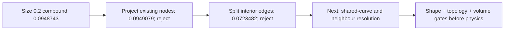

These labels are sampled scan-unit deviations, not millimetres or certification.

The fresh Mac size-0.1 run is stopped after **989.32 s**, exit **-15**, when
available disk space drops to approximately **120 MiB**. It has no completed
mesh or quality result. No unrelated files or processes are removed. The
first 1 October `make check` exits **2** after **283.69 s** with actual
`OSError: [Errno 28] No space left on device` failures in temporary-file
creation. This environmental failure is not hidden by the passing targeted
tests; repository-wide success still needs a completed retry.

The shape auditor now retains the actual worst sampled point and its closest
counterpart in the **private** receipt, including the native source-face
index in the native-to-mesh direction. This supports locating a defect instead
of only quoting one maximum. It retains the original sampling density and
0.040-unit screen. It also binds its helper hashes and writes an explicitly
incomplete progress receipt. A first 300-second local audit reaches its child
alarm (exit -14); a frozen retry uses a 1,200-second bound. The native target
is loaded once into the closest-point solver for each batch; the distances
are still native closest-point calculations, not an AI surrogate.

Eight focused tests pass in the actual OCP/Gmsh/VTK runtime. They include a
trimmed-plane projection witness with fixed boundary, unchanged input,
oversized-shift rejection, and a triangle-interior closest-point witness.
Subdivision witnesses cover all four split patterns, positive orientation,
area conservation, exact exterior edges and non-manifold-edge rejection.

The final 1 October retry passes the **3,208-test main suite (163 optional
skips)** and the subsequent Python checks, then stops because the Docker daemon
socket is unavailable at the pinned F37 LPBF audit target. Thus the **whole
`make check` is not green**, despite the passing main suite and eight separate
CAD-runtime checks. Strict documentation validation reports **zero broken links
across 573 Markdown files**; diff whitespace checks pass. No new Vast spending,
automatic Docker restart, main-branch merge, catalogue release or site deployment
is performed. All local numerical workers from this continuation have ended
or been explicitly stopped; Linux outcomes were still unknown at that checkpoint.

## 1 October: Linux result recovery after network restoration

Both authorised x86_64 hosts now answer authenticated SSH. Kali1 is reached
through Wi-Fi, checked against its existing trusted host key; host-key checking
is not disabled and no trusted key is replaced. Each host reports 12 logical
CPUs and about 15 GiB RAM, not a large-memory GPU workstation. Kali1 has about
379 GiB free disk and Kali2 about 302 GiB at collection time.

The nine existing result, baseline and log files are copied into fresh private
storage. All nine local SHA-256 values match their remote originals. These are
recovered 29 September calculations, **not new 1 October simulation runs**.

| Recovered trial | Execution | Result and decision |
|---|---|---|
| Patch size 0.1, curvature 12 | Exit 0; 1,760.64 s | 976,144 triangles; 5 incompatible; minimum q2 0.035495665. Reject. |
| Curvature 64, junction 0.020 | Exit -14; 1,800.19 s | Child SIGALRM; incomplete receipt; no final mesh. Reject. |

The second launcher receipt says `timed_out: false`: its outer timeout did not
fire, but the child reached its own alarm. This is not a completed calculation.
The first receipt binds the unchanged original CAD and copied surface hash;
it reports no duplicates and no edges without incidence two. Vertex-link and
self-intersection checks remain absent. No shape-screen pass or new volume
result is inferred. The retained volume remains **32 rejected tetrahedra**.

Recovered report hashes are
`b4b626537e3ca0f04c4a3cc12be3b6e2036f21d7141f030f2d7df1061ee9c136`
(size 0.1) and
`1879938033a74fcc33a8b6e2bce0df8317517e1ea0945fbe8719ec9b3c8f8957`
(incomplete curvature 64). The size-0.1 surface hash is
`77c2f3641ea63a7bb740877f33883a72fe6bd96c349e35d6a39586eaa8e1f91c`.
Raw geometry and coordinate-bearing receipts stay private. The next geometric
experiment still needs conforming shared-curve and neighbouring-face correction;
repeating the global size-0.1 recipe is not justified by this rejected result.
No new calculation, rental, manufacturing release or master replacement is
claimed by this recovery.

## 2 October: shared native curves, neighbour control and local error refinement

The [projection tool](../../twins/m64-cylinder-head/source/wholebody/trial_project_compound_surface.py)
now supports `--split-interior-edges --split-shared-boundaries`. One midpoint
per selected shared mesh edge is used on **both** incident surface triangles.
The midpoint is projected to the common native **edge**, identified by OCCT
topological identity, not independently to either face. Existing edge endpoints
must already lie within 1e-6 scan unit of that common curve; measured maximum
here is **9.27e-14**. Original nodes are retained at this boundary stage.

Four frozen-source experiments run on the existing Kali1 CPU, with the pinned
OCP 7.9.3.1 / Gmsh 4.15.2 runtime. No GPU surrogate or rental is involved.
Each projection run has a 600-second child alarm, and each separate shape
audit a 1,200-second alarm. The original native body remains hash-identical.

| Experiment | Surface triangles | Incompatible triangles | Minimum q2 | Outcome |
|---|---:|---:|---:|---|
| Split every shared boundary | 933,118 | 4 | 0.05084775103 | Reject: quality and shape |
| Retain exact straight shared curves | 932,176 | 0 | 0.07085403530 | Necessary surface screen passes; shape fails |
| Refine around measured worst samples | 933,562 | 0 | 0.07085403530 | Necessary surface screen passes; shape still fails |
| Repeat at newly measured worst samples | 935,576 | 0 | 0.07085403530 | Reject: one nonpositive normal-dot check; no further shape audit |

The first run splits **2,711 shared edges** and finishes in **83.28 s** including
the supervisor. Four degraded triangles occur on neighbour faces 136, 273 and
276. Their common native curves are single exact `GeomAbs_Line` edges: extra
chord subdivision brings no curvature benefit. The revised rule retains those
straight boundaries after the same endpoint check; it does not relax any quality
threshold or move a native feature. The second run splits **2,240 curved edges**,
retains **471 straight edges** and finishes in **44.82 s**.

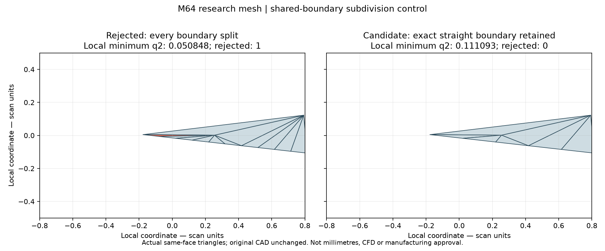

This is a local planar projection of the same actual neighbouring face in the
two experimental meshes, not a new whole-head product rendering. The displayed
minimum is **local**, not the whole-surface minimum in the table. The original
[scan provenance and non-commercial research licence](../../catalog/sources/src-wolfe-classics-935-billet-cylinder-head-scan.json)
apply. The [renderer](../../twins/m64-cylinder-head/source/wholebody/render_boundary_refinement.py)
checks input hashes; no smoothing or generative geometry is used. Image SHA-256:
`353a9678f16ed43bd89064c01847f94c2019e2d6121d8b1d08b29b99056c0027`.

**The boundary experiment does not solve shape fidelity.** Both completed shape
audits give lower-patch mesh/native maxima **0.04556742862 / 0.06168744117** and
upper-patch maxima **0.05012542051 / 0.07235533342**. These are essentially the
previous result (0.07234822226 maximum), not an improvement to advertise.
The two audits finish in **298.95 s** and **202.25 s**, with unchanged inputs.

Consequently, the third experiment uses `--local-shape-witnesses` with the
completed, hash-bound parent audit. It selects triangles with a vertex within
**0.4 scan unit** (two original 0.2 edge sizes) of either directional worst
sample, then splits only edges interior to that local selection. Local-selection
and compound-exterior polygons stay fixed; both incident triangles use each
new midpoint. It selects **275 lower / 226 upper triangles**, adds **384 / 309
nodes**, and finishes in **27.26 s**. This is adaptive surface approximation,
not native CAD reconstruction. Its complete shape audit finishes in **162.11 s**:

| After one local pass | Mesh to native, sampled maximum | Native to mesh, sampled maximum |
|---|---:|---:|
| Lower | 0.04549009729 | 0.05906187524 |
| Upper | 0.04847518443 | 0.06658567954 |

The maximum decreases about **8.0%** from the curved-boundary parent, while the
necessary quality screen remains unchanged. It still fails the exploratory
0.040-unit screen. This motivates a bounded follow-up on the newly measured
worst samples, not an extrapolated success or a physical millimetre claim.

The follow-up allows at most three further passes, but **stops after its first
attempt**, in 27.17 s: one child has a nonpositive normal dot product relative
to its parent, in the upper patch. Quality q2 alone does not detect this failure. The rejection
is retained and neither its shape audit nor the two unused passes are launched.
The best shape-audited candidate therefore remains the first local pass above.
The next correction must control projection across the native crease/patch
charts and preserve orientation, instead of blindly adding more subdivisions.

The first three completed mesh exports preserve edge incidence two, have no duplicate
triangles or nonpositive old/new normal dot products, and read back exactly.
These checks still do **not** establish vertex-link manifoldness, absence of
geometric intersections, functional facewise boundary conditions or a volume.
The modified 2D boundary is not a regenerated native 1D curve-element mesh.
**No candidate is passed to volume meshing or physical solvers.** The retained
volume still has **32 rejected tetrahedra / 1,341,461**.

Ten focused tests pass on Mac and Kali1, including a curved cylinder/cap edge
shared by two surfaces, an exact straight-edge control, unchanged old vertices,
two-sided edge incidence, missing-native-edge and non-manifold rejection, and
the local witness selector. The first full `make check` passes 3,209 main tests;
the final retry passes **3,210 main tests (165 optional skips)** and subsequent
Python checks, but the pinned F37 Docker target cannot connect to the Mac daemon.
Thus whole-suite success and merge readiness are **not** claimed.
The final receipt-binding guard is exercised afterwards in the focused Mac
runtime: an audit bound to the wrong parent receipt is rejected before output
creation. Frozen job sources and historical receipts are not overwritten.

Private report hashes: all boundaries
`1c10c15c723671e30db68cc8a266c0d89534e193c2ebee5fbfd025567b3f127c`;
curved boundaries
`50a4a2e3efab515a32c33183975ec4b55988f93e5448495e4345449095cbd15f`;
local witness refinement
`c4515f7ac1e3f3d2aad1856e67901911256ab8eff2f22059929af53989d84d88`.
The rejected second-local-pass report hash is
`99d5e0fa70a10cf718b2585a4d34e4fc51bd3b7ecf7b5eebf417904d9ea05853`.
Detailed geometry, coordinates and receipts stay private; the public report
records measured outcomes without a manufacturing or physical 0.040 mm claim.

## Orientation-preserving diagonal correction, 2 October

The rejected second local pass was reproduced from its hash-bound parent.
The failing parent has two split edges. The old splitter always chose the
same quadrilateral diagonal, even after the new edge midpoints were projected
onto the native surface. That fixed diagonal produces a child with a negative
normal dot product; **the other diagonal preserves orientation using exactly
the same five vertices**. This is a triangulation defect, not evidence that the
native CAD needs to be flattened or its feature removed.

The shared `split_edges` helper now tries the alternative only when the
default fails and all alternative children have positive parent-normal dot
products. Both interior and shared-boundary callers supply the projected
coordinates. No vertex moves, quality thresholds, CAD tolerance changes,
triangle deletion or post-hoc reversal are introduced by this choice. If both
diagonals fail, the original failure remains visible to the rejection gate.

The regression covers cyclic indexing, reversed parent winding, conserved
five-edge polygon boundary, signed polygon area and the case where neither
diagonal is acceptable. All **11 focused tests pass on Mac and Kali1**.

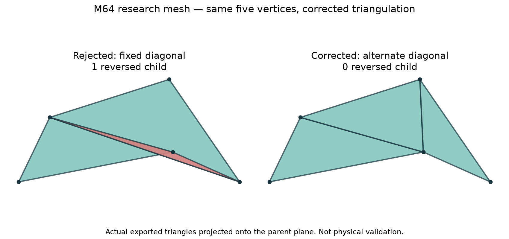

Both panels show triangles read back from the rejected and corrected exports,
projected onto the same parent plane. The five vertices match within 1e-10
scan unit. Red means negative parent-normal dot product in this local view;
this is not an independent global intersection test. The image neither changes
the head silhouette nor depicts a complete, qualified product. The research
[source licence and provenance](../../catalog/sources/src-wolfe-classics-935-billet-cylinder-head-scan.json)
still apply. Image SHA-256:
`01b6280db6983bc101af6749d85bec1a3ade5591a22d73996fb288ebab31f26c`.

The corrected second pass finishes in **27.12 s**, with **935,576 triangles**,
zero incompatible triangles and zero nonpositive normal dot products. The
necessary surface checks pass, including exact export readback, fixed protected
nodes, two-sided edge incidence and no duplicate triangles. Its completed
shape audit takes **138.85 s** and measures a maximum **0.06558267613 scan unit**.
This is still above the unchanged exploratory 0.040-unit threshold.

Two further bounded passes also complete; all three retain min q2
**0.07085403530**, zero incompatible triangles, zero nonpositive normal dot
products, exact readback, unchanged inputs and all necessary surface checks.

| Local pass | Surface triangles | Lower mesh/native maximum | Lower native/mesh maximum | Upper mesh/native maximum | Upper native/mesh maximum |
|---|---:|---:|---:|---:|---:|
| 2, corrected | 935,576 | 0.04496372435 | 0.05637440169 | 0.04723165871 | 0.06558267613 |
| 3 | 937,484 | 0.04483763451 | 0.05537201348 | 0.04348361352 | 0.06505214650 |
| 4 | 938,982 | 0.04425521458 | 0.05421935354 | 0.04214043246 | 0.06428019459 |

Passes 3 and 4 take **36.60 / 41.27 s** to build and **161.18 / 166.89 s**
to audit shape. The chain reaches its three-pass bound normally. No worker
remains running. The maximum is about **3.46% below the first local pass**;
all four directional maxima still fail 0.040. The native sample set is fixed,
but its worst sample changes on each pass (upper indices 797, 781, 1262).
The next experiment should capture and refine multiple above-threshold error
regions together, rather than assume that one worst-point neighbourhood closes
the shape gate. No unsampled-extrema or Hausdorff bound is established.

**Verification runtime:** the first Kali2 full-suite attempt exposes incomplete
user-site OCP imports and group-writable temporary source metadata. A second
attempt isolates system Python but still fails metadata guards; its restrictive
umask also invalidates a fixture that deliberately needs a public directory.
These failures are retained. Only the job's temporary checkout permissions and
process environment are corrected: sources are not group/world writable,
`umask 022`, `PYTHONNOUSERSITE=1`. No installed packages or account permissions
are changed, and no rejection check is weakened.

The resulting **`make check` exits 0**, with **3,218 main tests, 158 optional
skips**, and all subsequent Makefile checks. Native OCP coverage is supplied by
the separate 11-test qualified Mac/Kali1 runs, not claimed for skipped tests.
The F37 Docker target uses the exact project-pinned image digest and passes
15 tests (also passed in a separate run). These are software/fixture tests,
**not a printing simulation of this new candidate**. Final documentation links
and report-index checks are rerun after the report and picture are added.
Full-suite log SHA-256:
`9cc2276dc28c75a12858eee149d55744633c801b2ac32a94b4ef4537406c808a`.

No geometry is promoted to the master, and the retained volume still has
**32 rejected tetrahedra / 1,341,461**. Vertex-link manifoldness, global geometric
intersections, native 1D mesh consistency, functional boundary conditions,
accepted volumetric meshes and the subsequent physical/manufacturing campaign
are not established by this correction. No cloud rental, CFD/FEA execution,
GPU inference, thermal result or physical 0.040 mm claim is made.

The source bundle is frozen before these executions:
`63265d070f0fbd945453f4beac06067b9419d85994dea93bddf81a8b1d1bf502`.
Corrected second-pass mesh SHA-256:
`a1ed658a240723e3827df9980486ddee357af0053dfb2e832556361d95c5b0bd`;
receipt SHA-256:
`76d9db6c38ec7cc1c8312df57a4a10b6425652c870225e178f5070c57731af2c`.
Fourth-pass mesh SHA-256:
`05f4fc09970dfc02651787bc0488bcb37fc8aebf960f8c11ffa51439baa021e0`;
receipt:
`dc81056c9cc04917b27ad154b61f4fbc4542a1817a5c3b49195a42fa7b16a771`;
shape audit:
`555355ed13606d7ca6f114fb4c8c4697cd0fa574d620341fa57876d1ddc77a1a`.
The recovered result archive matches the remote SHA-256:
`094183479a1250ca57b03349b5359547ea7b7a3e2d00fce551730be4c649e2cb`.
Raw meshes, geometric witnesses and numerical job receipts remain private.

## All-exceedance refinement and concave split boundaries, 2 October

The shape audit now retains every **sampled** point above 0.040, in each
direction, rather than only its maximum. Each collection is capped at 20,000
points and exceeding that cap fails, without truncating the data. Existing
callers of the distance helpers retain their previous behaviour unless they
request this collection. A fresh baseline audit reproduces the previous
maximum **0.06428019459238127** exactly and records:

| Patch | Mesh-to-native samples above 0.040 | Native-to-mesh samples above 0.040 |
|---|---:|---:|
| Lower | 19 | 123 |
| Upper | 3 | 132 |

These are **277 sample records**, not 277 distinct physical defects. Unmeasured
points remain unbounded. `--all-shape-exceedances` requires a completed,
body/mesh/receipt-bound audit with finite, threshold-labelled collections.
An empty collection paired with a maximum above 0.040 is rejected. The existing
0.4-radius vertex-neighbourhood rule is retained. SciPy's installed `cKDTree`
replaces the dense triangle-by-witness distance array, avoiding its memory
growth when many witnesses are used. A patch with no recorded exceedance is
not subdivided. The unchanged two-million-triangle cap still applies.

### Rejected control and root cause

The first all-exceedance pass selects **7,528 lower / 4,877 upper triangles**
and adds **10,782 / 7,172 nodes**. It finishes in **36.03 s** with 974,890
triangles, but fails: **15 nonpositive child-normal dots and two triangles
below the quality threshold**, minimum q2 **0.06832676524**. It is retained
as a rejected control; no shape audit or subsequent pass is run from it.

Reproduction locates all 15 orientation failures in triangles with **three**
split edges. Their projected midpoints form a concave six-vertex boundary;
the standard central-triangle split folds despite adequate unsigned q2. The
two quality failures have two split edges. Trying alternative vertex fans on
the same polygons resolves all 17 local cases without moving any point.

The shared splitter therefore retains the standard subdivision whenever it
passes. Otherwise, for a five- or six-vertex boundary, it selects the best
admissible vertex fan by minimum q2. Every child must have a positive
parent-normal dot product. The sum of projected positive fan angles must be
less than 2π, excluding a fan that wraps around its apex. The boundary sequence,
all midpoint indices and child count are preserved. If no alternative passes,
the full-mesh rejection gates remain decisive; this is not triangle deletion,
coordinate smoothing or tolerance relaxation.

Twelve focused tests pass in the qualified Mac and Kali1 runtimes, including a concave
six-vertex witness, rotated/reversed parent indexing, signed polygon area,
boundary incidence, multi-region selection, invalid collections and exact
threshold handling. This local triangulation check does not establish global
intersection freedom, functional face labels or physical validity.

### Completed outcomes and remaining obstruction

The corrected all-exceedance pass completes in **31.89 s**, with the same
**974,890 triangles**, zero quality rejections, zero nonpositive normal dots,
minimum q2 **0.07085403530**, unchanged protected nodes and inputs, exact
readback, two-sided edge incidence and no duplicates. Its shape audit takes
**173.67 s**:

| Patch | Mesh-to-native maximum | Native-to-mesh maximum | Remaining above-threshold sample records |
|---|---:|---:|---:|
| Lower | 0.03782211596 | 0.03984823204 | 0 / 0 |
| Upper | 0.03303451901 | 0.04959299060 | 0 / 56 |

The next pass correctly skips lower-patch subdivision and selects 6,061 upper
triangles, adding 8,917 nodes. It completes in **37.24 s**, with **992,724
triangles**, no quality rejections (minimum q2 0.06913127978), but **one
nonpositive normal dot product**. It is rejected. Its shape audit and the
unused third follow-up are not launched.

Reproduction isolates a six-vertex upper-patch boundary which crosses itself
when projected onto its parent plane. The existing fan alternatives cannot
repair that boundary without changing a projected vertex. A separate,
array-only diagnostic tests intersections along averaged adjacent-triangle
normals, retaining the original CAD and the 0.1 displacement bound. All 8,917
rays intersect, but the result worsens to **28 orientation failures and four
quality failures** (minimum q2 0.03963196440). Seven nonempty subsets of the
three problematic new vertices are then tested with this ray alternative;
all still have one or two orientation failures. **Neither ray method is
added to the production helper or exported as an accepted mesh.**

The next reconstruction must constrain projection/connectivity at the actual
native feature, rather than keep subdividing a crossed local boundary. The
best complete shape-audited candidate remains the corrected pass 5. Its lower
patch result is not a continuous error bound, a whole-head dimensional
certificate or evidence that the upper patch or retained volume passes.

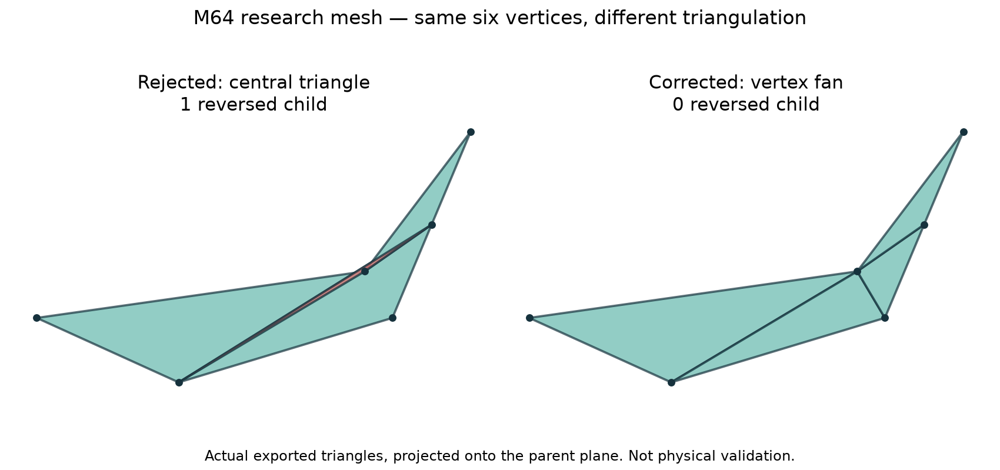

The picture reads back four actual triangles from each export, on the same
six vertices, matched within 1e-10 scan unit. It is a local projection, not a
new head design. The same [non-commercial research provenance](../../catalog/sources/src-wolfe-classics-935-billet-cylinder-head-scan.json)
applies. Image SHA-256:
`39a8d0ad27a568af2be0456e69a74eb6d22750d3031579da9521a6c77c20c239`.

The final frozen-source **`make check` exits 0 on Kali2**: 3,219 main tests,
159 optional skips, and all subsequent checks including the pinned F37 Docker
target. Twelve native tests run separately on Mac and Kali1. Documentation
links and report-index checks pass after this report and image are added.
No numerical process remains active, and no rental is used. The original CAD,
retained volume, physical qualification and manufacturing authority stay
unchanged; no CFD, thermal, mechanical or candidate printing simulation is
claimed.

Provenance:

- First all-exceedance source bundle: `7b46c39fd98bed4d4ed166b4ee00ee7e35fdf018d4aa49ae54c73346fca452db`.
- Corrected fan source bundle: `2daf2376499b8866a593acc7f0fe1e4e032cd0d5884fcfc7a24c2d4641b8c8ef`.
- Accepted necessary-surface screen, pass 5 mesh: `a73bf6d6ceb9c2be8ecb8e46e744d10531c62e67a08116ce26534f73e8883013`.
- Pass 5 receipt: `610afacb8307c22401fae92bcf7235a84db9993f7639f01b25a8a66dcf0e53c1`; shape audit: `23bab39cfa2fa67ae96346962d72cae7ea839e7d6950b6aad5fc1edfd9e56e9b`.
- Rejected pass 6 receipt: `8f650d6bd5e1a45513017ee9f997225eea5458400a7f2582fcad78542bdbf321`.
- Recovered fan-result archive: `a388d142a5d7c434a6d8f804afd7871feb411a6704df7135d4ea2b509a9174f8`.
- Full-suite log: `cae6dd9f77d3a64bdbf80167c1265821db4d1ffc6e694bca1afc9cffad10118e`.

## Native-feature projection reaches the sampled screen, 2 October

### Diagnosis and bounded correction

Native distance queries show that the rejected upper parent has two vertices
on face 1411 and one on face 1647. Those faces share exactly one topological
edge. Unrestricted nearest-point projection sends the two crossing-edge
midpoints to different faces, producing the crossed local boundary. The
nearest-face result cannot be repaired by triangulating its fixed vertices.

The existing refinement helper now attempts a bounded native-feature correction
only after child orientation or q2 fails. For each affected new point it binds
both edge endpoints to trimmed native faces, within 1e-6 scan unit:

- Shared endpoint face supports restrict projection to those faces.
- Otherwise, projection is restricted to the unique native edge common to
  their supporting faces. A missing or ambiguous shared edge is rejected.
- Only newly inserted points can change. The same new index is used by both
  incident triangles; original points and the exterior boundary stay fixed.
- Adjacent triangles are rechecked after each correction. At most eight rounds
  and 256 new points per patch are allowed; the original 0.1 displacement
  bound, q2 threshold and orientation checks are unchanged. Unresolved defects
  are not accepted when the bounded correction stops.

The private reproduction needs two rounds, considering five new points:
three common-edge projections and two shared-face projections. The first
round resolves the initial parent but exposes one neighbour; the second
resolves it. The original CAD is not edited. A synthetic box-corner regression
checks common-edge versus nearest-face projection, same-face behavior,
unchanged inputs, bad indices and bounds, off-surface endpoints, and nearby
but topologically disconnected faces. No scan coordinates are added to tests.

### Completed full-surface result

The frozen-code job on Kali1 resumes the bound, screened pass-5 candidate.
Pass 6 completes in **35.15 s**, selects 6,061 upper triangles and adds 8,917
nodes. The lower patch is not subdivided. All necessary surface checks pass:

| Check | Result |
|---|---:|
| Surface triangles | 992,724 |
| q2 below 0.06896551724 | 0 |
| Minimum q2 | 0.06913127978 |
| Nonpositive child/parent normal products | 0 |
| Edges without exactly two incident triangles | 0 / 1,489,086 |
| Duplicate triangles | 0 |
| Protected nodes, native CAD and input hashes unchanged | yes |
| Exact binary export/readback | yes |

The separate two-direction sampling audit completes in **193.85 s**:

| Patch | Mesh-to-native maximum | Native-to-mesh maximum | Samples above 0.040 |
|---|---:|---:|---:|
| Lower | 0.03782211596 | 0.03984823204 | 0 / 0 |
| Upper | 0.03303451901 | 0.03954089482 | 0 / 0 |

The maximum over these four measurements is **0.03984823203951887**.
The bounded driver stops on this sampled-screen pass; its three unused
follow-ups are not launched. This is the existing vertex/centroid/edge-midpoint
versus 17×17 trimmed-face/65-per-edge sampling, **not a continuous Hausdorff
bound or an audit of every native face**.

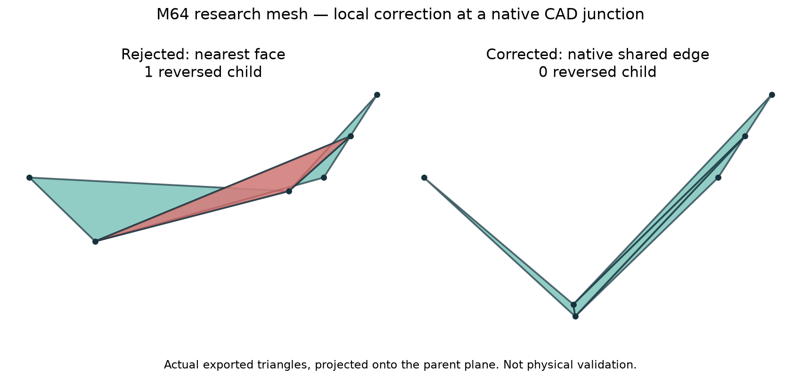

The image reads back four real triangles from each exported mesh, matches
their node tags, verifies unchanged original vertices, and uses the same
parent-plane projection and axis scales. Red marks the previous reversed
child; none is reversed in the corrected view. It is a local mesh diagnostic,
not a rendering of a finished head. The existing
[research-scan provenance](../../catalog/sources/src-wolfe-classics-935-billet-cylinder-head-scan.json)
still applies.

Thirteen native tests pass on Mac and Kali1. Full **`make check` exits 0 on
Kali2**: 3,220 main tests, 160 optional skips, and subsequent checks including
the 15 pinned F37 Docker tests. Native skips in the broad suite are not claimed
as executed coverage. Source and recovered-log hashes match the remote copies.
All numerical jobs finish; no rental, merge or deployment occurs.

### Still required before volume or physical acceptance

Vertex-link manifoldness, global geometric intersections, consistency of the
updated native 1D curve mesh and functional face labels remain unchecked.
The next stage must bind those audits to this exact export before a bounded
volume experiment. No new tetrahedral volume, CFD/CHT, material, thermal,
strength or printing result is produced here. The retained 32 rejected
tetrahedra and the M64 interface/physical-scale gates remain unresolved.

Provenance:

- Frozen source bundle: `816de272173e661a594b3c001ac4671a9fe0583d809b1483a7de5b07d35afc75`.
- Feature-projection helper: `a49383183f7fdf7e4bc03ca8d94d83c849c242a00018368c811b04679d97cb24`.
- Corrected pass-6 mesh: `7e59631d8e009107e57af7d284d6501522ed353b6d4b188492b718722ac80076`.
- Pass-6 receipt: `776442bcc2aab180b2f319370e167b1cf1457d03bd0d97a32ccab5f0e3d6e704`.
- Completed shape audit: `7d2851c46c80ff5ed8e45c7cdbc3e61a129f9b51d697f4ba42d53019569a8182`.
- Recovered result archive: `ea59cb1acec095ba3ffceffd85113b8444c7d468af4873b622b40068f5e77338`.
- Actual mesh image: `2ff9bedd667686f509d44b34353d4a1c98f5daa08519bf103285c40571d6a92a`.
- Full-suite log: `daa51e9c8163265c8fcc48bfc746fdec3cb5108c9446acadd9d50503215ce6b9`.

## Global topology, winding and intersection checks, 2 October

### A local normal guard was not a global winding certificate

The pass-6 export has 496,348 referenced vertices, and every vertex link is a
single circle. There are no duplicate used coordinates, duplicate triangles
or edges of incidence other than two. There are also 319 stored nodes unused
by the surface; they are retained, not welded or removed.

However, an independent **global edge-direction** check finds 2,180 conflicts
between face groups. The earlier zero orientation count referred only to
child-versus-parent normal dots during refinement, not global consistency.
The pass-4 parent already has 1,404 such conflicts and pass 5 has 2,180; the
last native-feature correction introduces none. All current conflicts are
between entities, not within a single entity.

Blindly applying all signed volume-boundary tags is not a valid correction
for this reclassified compound mesh: that private control reverses 80,220
triangles on 42 faces and increases the conflicts to 6,170. It is rejected.
Gmsh documents signed boundary tags in its
[model-boundary API](https://gmsh.info/doc/texinfo/#gmsh_002fmodel_002fgetBoundary);
their interpretation must still agree with the actual stored element winding.

The new auditor reuses the existing PicoGK-witness `link_type` check, retaining
indexed topology instead of merging coincident coordinates. An explicit
`--orient-entities` option solves consistent edge-direction constraints for
whole entities. It rejects inconsistent constraints, open/nonmanifold input,
and more than one edge-connected triangle component, including disconnected
components which reuse the same entity labels. It then selects positive signed
flux for this single shell. Native/material face orientation remains a separate
claim; positive flux is not used to infer arbitrary cavity nesting.

The result reverses **17,284 triangle vertex orders on faces 141 and 143**.
Coordinates, triangle labels and unordered triangle vertex sets are unchanged.
The source MSH and B-Rep remain untouched; only a separately hashed binary
array export carries the permutation. The sampled-distance result is preserved
geometrically, not presented as a newly run distance audit.

| Oriented-array check | Result |
|---|---:|
| Triangles / referenced vertices | 992,724 / 496,348 |
| Edge-connected triangle components | 1 |
| Circular vertex links | 496,348 |
| Global two-incidence orientation conflicts | 0 |
| Duplicate coordinates / triangles | 0 / 0 |
| Coordinate changes / deleted triangles | 0 / 0 |
| Signed flux | 1,113,008.6409500074 scan units cubed |
| Exact binary array readback | pass |

### MeshLab control rejected; CGAL audit completed

The existing pinned MeshLab 2025.7.post1 filter detects a transverse crossing,
but **misses the nested coplanar-triangle fixture**. Its documented
[self-intersection selection filter](https://pymeshlab.readthedocs.io/en/latest/filter_list.html#compute-selection-by-self-intersections-per-face)
is therefore not retained as the acceptance auditor. The test is not relaxed
to hide this limitation, and no full-head MeshLab pass is claimed.

A small CGAL executable uses
[`triangle_soup_self_intersections`](https://doc.cgal.org/5.6.1/Polygon_mesh_processing/group__PMP__intersection__grp.html)
with the exact-predicate/inexact-construction kernel, sequential execution and
a 100,001-pair cap. Reaching the cap is incomplete, never a passing result.
The input is little-endian binary64 coordinates and uint64 indices, not rounded
STL or decimal coordinates. The compiled reader bounds counts, rejects truncated
or trailing input, nonfinite points and out-of-range indices. No construction,
welding, repair or orientation change is performed by the intersection auditor.

The original and oriented 992,724-triangle exports both complete with **zero
intersecting pairs**. The final hash-bound oriented run takes **4.88 s**.
Tests pass for transverse crossings, coplanar containment, separated triangles,
ordinary shared-edge adjacency and a degenerate triangle. This checks the stored
polyhedral geometry, not the entire native B-Rep or the physical part.

CGAL **5.6**, Ubuntu package **5.6-1build3**, is compiled in a new private sidecar
derived from the already pinned mesh-CFD image. The existing image/lock and host
packages are not changed. Compilation uses:

```sh
g++ -std=c++20 -O2 surface_intersections_cgal.cpp \
  -o surface-intersections -lgmp -lmpfr
M64_CGAL_INTERSECTIONS=/absolute/path/surface-intersections \
  python -m unittest discover -s tests -p test_m64_projected_surface_topology.py -v
```

The Python coordinator requires the executable SHA-256 and the exact-array
receipt. Jobs run on Kali2 with no runtime network, a read-only container root,
a two-CPU quota, a 6 GiB memory limit and a 350-second supervisor limit. No GPU
or rental is required. Both focused tests execute in this runtime; the final
full Linux `make check` also exits 0: **3,222 main tests, 161 optional skips**,
and subsequent checks including the pinned F37 Docker target. The optional
CGAL test is counted separately from skipped broad-suite coverage.

### Curves are the next native-mesh consistency task

Of 52,191 stored line elements, **2,565 are no longer direct triangle edges**,
on 32 curve entities. Of these, 2,240 have both endpoints on the surface and
325 have at least one endpoint unreferenced by surface triangles. This does
**not** mean 2,565 holes or failed physical interfaces. Subdivided chains,
unused internal compound curves and genuine native-curve discrepancies still
have to be distinguished using native topology and curve parameters.

No line elements are silently removed, and no inferred functional face or
oil-channel label is introduced. The next native-volume attempt must use a
reconciled curve/face mesh; any separate faceted-boundary diagnostic must be
explicitly identified as such, without inheriting native-interface authority.
The retained volume remains **32 rejected tetrahedra / 1,341,461**. Thermal,
strength, material, printing and M64 fitment qualification remain incomplete.

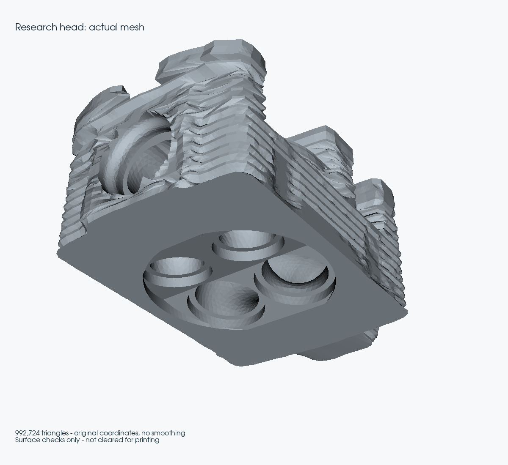

The view renders the actual oriented array export with all 992,724 triangles.
There is no smoothing, decimation or invented valve assembly. The existing
[scan licence and provenance](../../catalog/sources/src-wolfe-classics-935-billet-cylinder-head-scan.json)
apply; the image is a research-state view, not a printable-product claim.

Provenance:

- Frozen final source bundle: `a9d00e61f252e592c5ba508a8e8d45dc713ebfb860269a7a76105bb34ed2029c`.
- Connected/oriented topology receipt: `89dc417de042d0bca0ab0588b0e42d563b79284a6c6cc03b4d55322b9eb69a7b`.
- Original exact array export: `5fa2296839c9e4e4e12c3e7a7a6f668f1ea8d21cc17786a1a0e58693f36d71f4`.
- Oriented exact array export: `a599cb6c317f2559a458331444b211267d12eb77b899bbbb9b02d9d5566c3c8d`.
- CGAL executable: `8088a42e15ed42b9e124a08c3a003e2f57723ea9280bd26e54259374791740b6`.
- CGAL source: `476e056e35bb98f32d9d26ef8ba81f9c90ac7464f4af8ad5d76b92fa44f2689f`.
- Private sidecar image ID: `sha256:3800fddfa4765acaf47b875cec79167db28f905744f826fd8c6f659442de7f5d`.
- Final CGAL receipt: `c4fd77b8e758adaa7dd7e4a5d619d477e52148fb242a2afab6087bdf272434ed`.

## Exterior curve reconciliation, 2 October

### Cause and correction

The shared-boundary refinement subdivided both neighbouring triangles, but
left their stored 1D line elements unchanged. The writer now consumes the
explicit edge/midpoint mapping and splits each directed curve line in the same
operation. Every selected parent must have exactly one curve owner before any
line is changed. Ambiguous ownership, duplicate children or a missing parent
abort the update. This fixes future exports at the source of the inconsistency.

For the existing best surface, `reconcile_projected_curves.py` imports the
unchanged BRep, rechecks its 4,918-face descriptor correspondence, and verifies
curve endpoint and compound adjacency metadata. It recovers existing child
edges only along the matching patch/neighbour boundary. Each old segment must
be covered exactly by two children with one new midpoint. Evaluated native
curve points must be within 1e-6 scan unit, inside the trimmed parameter range,
with each midpoint parameter strictly between its parent endpoint parameters.
This is a node/graph check, not a continuous chord-error certificate.

| Check | Before | After |
|---|---:|---:|
| Exterior stored lines absent from surface edges | 2,240 | **0** |
| Reconciled exterior curves | 0 | **26** |
| Child lines replacing those parent lines | 0 | **4,480** |
| Total stored line elements | 52,191 | **54,431** |
| Internal compound lines absent from surface edges | 325 | **325, retained** |
| Surface triangles | 992,724 | **992,724** |
| Stored coordinates moved | — | **0** |

The six remaining curves are 438, 439, 3209, 3210, 3214 and 3735. Their two
native faces lie inside the same lower/upper compound patch. The surface
crosses those native partitions and its inherited individual face labels are
not a faithful reconstruction of the native trimmed faces. Relabelling the
boundary as a compound can support a separately named faceted diagnostic, but
cannot silently confer original face-specific boundary conditions. Conversely,
a native-face-conforming volume requires reconstruction of those partitions.
Neither route is declared complete here. No curve or unused node was deleted.

### Parameter API failure found by an independent coordinate check

The qualified Gmsh 4.15.2 runtime returned correct closest-point coordinates
but inconsistent curve parameters in `getClosestPoint`: one witness gave the
same parameter for three distinct points; another run returned zeros/tiny
values. Evaluating those parameters missed the points by about 90 scan units.
The first recovery attempt therefore failed before modifying a curve.

The recovery now separately calls `getParametrization`, bounds the result to
the native trim and evaluates it through `getValue`. Acceptance uses distance
to that evaluated trimmed point, not the untrusted returned parameter or the
infinite supporting curve. Distant adjacent-curve candidates are excluded, not
projected into the geometry. Tests inject incorrect parameters and nonfinite
evaluations. Relevant official API definitions are
[Gmsh projection, parametrisation and evaluation](https://gmsh.info/doc/texinfo/gmsh.html#gmsh_002fmodel_002fgetClosestPoint).

The accepted Mac run completes in **32.164 seconds**. Maximum accepted-node
distance is **2.32953603e-8 scan unit**; maximum accepted projection/inversion
round-trip discrepancy is **8.63065305e-8**. Neither is an error bound between
sample nodes or proof of physical scale.

The orientation export also retains the previous 17,284 triangle permutations.
Gmsh's generic reversal produced equivalent cyclic triangle rotations, which
correctly failed the stricter byte-order readback check. Rebuilding only those
two face groups with the audited vertex order achieves exact point, triangle
and element-ID readback. Earlier topology, CGAL and sampled-shape results are
preserved by exact array identity; they are not presented as new solver runs.

### Reproduction and provenance

```sh
python twins/m64-cylinder-head/source/wholebody/reconcile_projected_curves.py \
  --body /private/original.brep --mesh /private/local-6/surface-private.msh \
  --receipt /private/local-6/report.json \
  --topology /private/connected-oriented-audit/report.json \
  --arrays /private/connected-oriented-audit/surface-private.npz \
  --output /private/fresh-reconciled
```

Private Mac output: `curve-reconcile-20261002.kzfVsZUb/exact-readback`.

- Reconciled MSH: `3e217847ad1cdf2a819a3e97e0c62839da193e4386166d587bc14c6dd02f85c9`.
- Receipt: `784d4951845adbb78b57324c3bd40c54d1c458b8870b672b1a03e743a0cdb198`.
- Recovery source: `65fef9029eae5b3a04b791a55c2a8912f9c6e51ea2f300d238a4d269306a7a06`.
- Shared refinement/writer: `1c369468059733d59394186d58462344efd57935b100fd6cde873c8f192df4cf`.

Focused native Mac tests pass; the compiled CGAL fixture is separately run on
Kali2. The initial Linux test launch exposed Gmsh 4.12.1 in the older sidecar,
missing temporary Git index metadata, and group-writable temporary files.
No qualified geometry code is run with 4.12.1; tests requiring 4.15.2 explicitly
skip on that version. Temporary checkout permissions and Git metadata are
corrected without changing account/service permissions or weakening guards.
A run with an overly restrictive test umask also fails the fixture that expects
an intentionally public directory; restoring the normal 022 test umask retains
the original security assertion. These failed logs are preserved privately.

The independent Kali1 recovery uses the same frozen sources, Gmsh 4.15.2 and
OCP 7.9.3.1. It completes in **16.148 seconds** and produces the **identical MSH
SHA-256** above. Its receipt hash is
`2cf6339983596a2867d9043253fa4b43575fdb6f42aad8173532aeaf2126127f`.
Sixteen focused native tests pass there (17 discovered, the optional CGAL test
skipped); Kali2 separately executes the CGAL fixture and array tests (three
passed, the 4.15.2-only Gmsh mutation fixture explicitly skipped). The first
Kali1 staging missed an imported helper; the complete source bundle, not a
changed test, fixes that execution environment.

Final Kali2 `make check` exits **0**: **3,224 main tests**, **162 optional
skips**, 155.579 seconds for the main suite, followed by all subsequent checks,
including the 15 pinned F37 Docker tests. The exact edited source/test hashes
match the local files. Log SHA-256:
`0108479ba64691ffad76c3e853110013c4a589d5104d9372719bb952aa6c8570`.
All numerical and verification jobs from this continuation have finished.

**No volume update, CFD, thermal validation, print simulation, rental or
manufacturing release follows from this curve correction.** The retained
volume still contains 32 rejected tetrahedra.
- Actual mesh image: `bd566dfcd16efd777d1ec41c1932cea50f013731cc175d794dbe3c2c836966ee`.
- Full-suite log: `b04c52b8dbd9b9e51822d1b4cc9b9a647cbf7ba877e2190b88be29701a32155a`.

## 2 October: the six internal curves are sharp features, not smooth seams

The [native curve auditor](../../twins/m64-cylinder-head/source/wholebody/audit_shared_curve_consistency.py)
now examines every topologically shared edge inside the two compound groups.
It evaluates both original trimmed p-curves at 129 parameters, including the
endpoints, obtains surface derivatives and applies the original face
orientations. The angle uses `atan2(norm(cross(n1,n2)), dot(n1,n2))`, not an
absolute dot product that could hide an inverted normal. Surface singularities,
mismatched parameter intervals and curve/surface disagreement above 1e-6 fail
closed. No coordinate, tolerance, topology or native file changes.

| Native face pair | Minimum sampled normal angle | Maximum sampled normal angle |
|---|---:|---:|
| 141 / 142 | 82.25136° | 83.70630° |
| 142 / 143 | 82.25136° | 83.70630° |
| 1411 / 1647 | 97.47269° | 98.44766° |
| 1412 / 1648 | 90.00000° | 90.00000° |
| 1413 / 1647 | 97.47687° | 98.07230° |
| 1647 / 1648 | 81.54970° | 81.92770° |

The maximum sampled 3D-curve/p-curve gap is **3.26412e-8 scan unit**. These are
native angular observations, not an anatomical classification or continuous
tangency certificate. Synthetic controls distinguish 0°, 90° and 180° and
reject a missing second face. A second OCP 7.9.3.1 run on Kali1 provides an
independent execution of the same method, not an independent mathematical
method. This supplements, rather than repeats, the earlier acute *in-face*
corner-angle diagnosis.

**Decision:** retain the six curves in the reference. The 325 stored lines are
not holes, but removing their metadata would also not restore the omitted
creases. Any native candidate must either recover those sharp boundaries with
face-aware constraints or explicitly reconstruct a bounded local transition,
then repeat locality, CAD validity, deviation and volume audits. Renaming a
faceted surface as CAD or assigning inherited face labels is not that work.

### Separate faceted-volume experiment

The [bounded diagnostic](../../twins/m64-cylinder-head/source/wholebody/trial_audited_discrete_volume.py)
accepts only the exact oriented-array, topology and CGAL receipt hashes from
the previous section. It creates a single discrete surface bounding a built-in
Gmsh volume, following the [hybrid-model API](https://gmsh.info/doc/texinfo/#x2).
A purely discrete volume does not generate tetrahedra in the small regression
fixture; the built-in volume is necessary. No surface reparametrisation,
smoothing, native import, welding, hole filling or automatic geometric repair
is used. The 319 unreferenced stored points are excluded from this *separate*
input; no point used by a triangle is removed. Original files are retained.

The witness test requires identical binary64 surface coordinates and identical
oriented triangles, allowing only triangle row order and cyclic permutations.
It rejects coordinate drift of 1e-12 and reversed winding. These same checks
run after volume generation, after optimisation and after MSH export/readback.
The existing minSICN >= 0.1, positive-Jacobian, complete-boundary, one-region,
volume-flux and independent region audits are reused without relaxed criteria.
The process is limited to two meshing threads, ten minutes and 10 GiB of
address space on Linux; the existing three-million-tetrahedron audit cap stays.

The initial run stops at the bounded-linear-volume guard after **76.764 s**;
the initial logger does not record its element count, so that count is unknown.
No mesh from it is retained. The logger now records counts before the guard.
A second run disables only propagation of fine surface mesh sizes into the
interior (`Mesh.MeshSizeExtendFromBoundary=0`,
[documented sizing behaviour](https://gmsh.info/doc/texinfo/#Specifying-mesh-element-sizes)).
The boundary itself is not coarsened. Its raw mesh has **1,549,428 tetrahedra**,
positive Jacobians and **61,847 elements below minSICN 0.1**, before optimisation.
This is an intermediate result, not an accepted replacement volume.

The Netgen run completes in **525.830 s** with **1,519,320 tetrahedra** and
**16,261 below minSICN 0.1** (minimum **0.00001852290**). All Jacobians and
signed volumes are positive. The exact boundary survives optimisation and
export/readback, all 992,724 triangles match the tetrahedral boundary, and
both connectivity audits find one region with no duplicate-coordinate vertices.
The oriented tetrahedral sum and boundary flux both equal
**1,113,008.6409500074 scan units cubed**. These integrity successes do not
override the failed quality gate. The diagnostic is rejected; the historical
32-rejection native-volume result is not replaced. Counts on different meshes
are not a percentage of physical progress.

The final writer now saves a raw MSH checkpoint before optimisation. A bounded
control compares Gmsh's standard tetrahedral optimiser with Netgen. The Kali1
control reproduces the same raw count and quality distribution; the Mac raw
count differs slightly (1,549,324 tetrahedra and 62,169 quality rejections).
Identical input geometry does not guarantee an identical floating-point
mesher trajectory across platforms. No cross-platform bitwise volume identity
is claimed.

The standard-optimiser control on Kali1 ends after **305.438 s** with
`Unknown element 30775537` during the post-optimisation sequence, before any
accepted optimised quality report or final MSH. Its internal warning says
229 ill-shaped tetrahedra remain; that library warning is **not** the project's
minSICN rejection count. It must not be presented as an improvement from
16,261 to 229. The cause of the element lookup failure is not yet reproduced
or attributed to a cache. The Mac control reaches its **600 s SIGALRM**, exit
142, while its receipt still says `optimizing_volume`. Its incomplete receipt
is preserved, not rewritten as completed. Both raw MSH checkpoints survive;
there is no optimised Mac volume to qualify.

The next bounded diagnostic should reopen the saved raw checkpoint, reproduce
the element-lookup failure and check export/reimport or cache behaviour before
another whole-head run. Separately localise the retained poor elements and
their boundary support; neither the six omitted creases nor interior sizing
has yet been proved to account for every rejection. Native-feature-preserving
reconstruction remains distinct from this faceted mesher investigation.

Checks on the final code: eight focused tests pass on Mac (nine discovered,
CGAL skipped). Seven pass on Kali1, where CGAL and the optional distance library
are skipped; the new native-normal and volume-boundary tests do run. Three array/CGAL tests
pass in the isolated Kali2 sidecar, with both Gmsh-4.15.2-only cases skipped
in that older Gmsh image. Kali2 full `make check` exits **0**, with **3,225 main
tests**, **163 optional skips**, 163.475 seconds for that suite and all further
targets, including the 15 pinned F37 Docker tests. These are software tests,
not an additive-manufacturing simulation of the new head. An initial local
link check fails until the newly authored diagnostic is added to the Git index;
the repeated strict link check finds zero broken links in 573 Markdown files.

Private receipts/source fingerprints:

- Native-angle Mac receipt: `e8acb52c7c4f3e43fb2e6eb6d1732e0072cc7b382142b39043a62f236839aecd`.
- Native-angle Kali1 receipt: `d1e140a5913b740a669fd070471e4322aeb381e20a5963d0991f505ed90405a5`.
- Netgen volume receipt: `2ea3493b8e8ff07792469e861945bf71cb2b4f1fb42fb8342684cb25a9f9fa87`.
- Netgen producer snapshot: `5afc513f3487ecbac6b0d548d733b8f5bb9f290cc530f9f804d15d82732d5b70`.
- Netgen generated MSH: `6dbd3f1b32d142cd2618df14f4a19e4706855d13a3420ed6ee1169b8555957cc`.
- Netgen audited MSH: `7221889ad081a4faf9d00b2aaba5ba16828d2474af4b6c154aabdf4eaf20c662`.
- Final volume producer: `f35506665bcb26016a27589f57728ad968facb69b29f26e7b515e8308af1051b`.
- Final full-suite log: `d01010d2db8da4c63da9e860804c8103cd60a138c2cf0a29259bc208a44f5922`.

All numerical jobs above have ended. No paid instance is used, and no native
master, catalogue qualification, CFD/thermal/printing result, PR merge or
website deployment is changed. The reference volume remains the earlier
32-rejection result; **the requested zero-defect volume has not been achieved**.

Reproduction in the qualified Gmsh 4.15.2 / OCP 7.9.3.1 environment:

```sh
python twins/m64-cylinder-head/source/wholebody/audit_shared_curve_consistency.py \
  --body /private/original.brep --internal-compounds --output /private/junctions.json
python twins/m64-cylinder-head/source/wholebody/trial_audited_discrete_volume.py \
  --arrays /private/connected-oriented-audit/surface-private.npz \
  --topology /private/connected-oriented-audit/report.json \
  --intersections /private/cgal-connected.json --no-extend-size --optimizer netgen \
  --output /private/fresh-faceted-volume
python -m unittest discover -s tests -p test_m64_projected_surface_topology.py -v
python -m unittest discover -s tests -p test_m64_bounded_chamfer.py -v
```

## 2 octobre — audit de la surface dans la session volumique

La variation entre deux générations 2D ne doit plus conduire à transférer
l’audit d’un autre maillage. Le nouvel essai importe le même candidat natif
`9c40df1642d5eb47a3c1a1aae68c761b23b77e3f7e02e0818294e88ee0322598`,
génère sa surface, l’audite, puis demande le volume dans **le même processus
Gmsh**. Aucun résultat historique n’est réécrit, aucun seuil n’est abaissé.

Les fonctions existantes `surface_mesh_snapshot`, `indexed_topology`,
`orient_entities`, `stored_curve_edges` et `intersection_pairs` sont réutilisées.
La signature par face conserve les coordonnées binaires exactes et les
triangles orientés tout en ignorant leur ordre et les numéros de nœuds.
Le contrôle de connexité ne corrige pas les orientations : toute inversion
nécessaire provoque le refus du candidat. Le résultat CGAL est lié par SHA-256
aux tableaux, à leur audit et aux scripts réellement exécutés.

Le [nouveau témoin natif](../../tests/test_m64_native_ported_mesh.py)
construit un cube, compare la surface avant/après génération 3D, puis après
export et relecture MSH binaire. Il vérifie aussi qu’une face volontairement
inversée ne conserve pas la signature. Les **22 tests ciblés passent sur Mac**,
y compris ce témoin Gmsh ; aucune nouvelle dépendance n’est nécessaire.

### Surface propre à cette exécution

- **1 080 910 triangles, zéro rejet** au seuil q2 inchangé.
- **540 441 sommets**, tous à lien circulaire ; aucun doublon, conflit
  d’orientation, défaut d’incidence ou coordonnée utilisée dupliquée.
- Une seule composante par adjacence d’arêtes ; aucune face inversée par
  l’audit et aucune coordonnée modifiée.
- Les **66 612 segments stockés** sont tous des arêtes directes de la surface.
- Relecture exacte des tableaux binaires ; **CGAL 5.6 : zéro intersection**,
  contrôle complet en 2,83 s sur Kali2.

La collerette reste une variante numérique, pas une amélioration mécanique
ou thermique démontrée. La source sur les ailettes perforées reste dans le
[plan comparatif air/huile](../research/M64_LPBF_OIL_REVIEW_20260912.md#2-october-supplement-the-owners-perforated-fin-paper) :
elle ne justifie ni un perçage automatique de cette géométrie, ni un gain
thermique déjà acquis sur le M64.

Vérification logicielle : `make check` sur le système de fichiers Linux natif
de Kali2 termine avec le code **0** : **3 236 tests principaux, 172 sauts
optionnels**, 155,686 s, puis tous les contrôles restants. Le nouveau témoin
Gmsh est optionnel sur ce runtime Linux et exécuté séparément sur Mac. Les
empreintes du fichier de tests sont identiques sur les deux machines.

Les artefacts privés sont conservés dans
`work/m64-private-20260907/native-volume-same-skin-20261002.YhUkk1b1`.
Empreintes de la chaîne pré-volumique :

- Producteur exécuté : `4664d1b68c9a0d93903f9f684c68b8f2c2aa0cd3798831809579028cf9bb634a`.
- Adaptateur CGAL exécuté : `8f6ad2f3972f18d773cfc5aa2b0289ca7c37e3925a440840a2d65dc0a05022f3`.
- Surface MSH : `879be2a0574ee2d15a59113ab57896bf83f139b286753ccab6755ac5e91e2769`.
- Tableaux exacts : `32c4559a37b5af249c3db086f79781ce3cf5b9179afe924c8a996f3b740a109a`.
- Audit de surface : `2e34d122e920733440cd792c4946d0e86391b7ded691b12f32fc5d6374f05b35`.
- CGAL : `1271398ddf51210779a67d9360046278323c1eedf80cb91e72decd662e3b6094`.
- Suite Linux : `6d73349be2b81fa062c30ff4ed29cbc65ff344ed1081de0d3dafa017031093d0`.

### Delaunay : limite CPU, aucun volume exporté

La surface ci-dessus franchit effectivement les contrôles préalables et
la génération 3D commence. Mais l’algorithme Delaunay atteint ensuite la
limite de **780 secondes CPU**, avec sortie **152 / SIGXCPU** sur macOS,
avant le premier export volumique. Ce n’est pas un résultat à zéro défaut,
ni un manque de mémoire démontré : le dernier relevé donne environ 4,7 Gio
de mémoire résidente. Un profil ponctuel situe l’activité dans Gmsh, sans
établir à lui seul une cause interne précise.

Le reçu du producteur reste `incomplete`, étape `generating_volume` : il
n’est pas falsifié en succès ni réécrit après l’arrêt. Une observation
terminale séparée confirme le code de sortie, l’absence de point de reprise
3D et les entrées inchangées. La surface et son audit restent disponibles.

- Reçu incomplet : `21531e04378c190fd42c6844ffe6003adcfec7f29f5d8e71255cbbaf7082d3e2`.
- Observation terminale : `3782758588e1657dc4b251ae68940938f06294df318b40609866d3bb2b319dfb`.
- Journal Gmsh : `5a1aab4ef5326deba88a15a82f640204d0969e3605efdc37c977270cf0b39653`.

### HXT : volume sauvegardé, qualité brute refusée et arrêt de Netgen

HXT est disponible dans le runtime installé ; un cube témoin produit
1 147 tétraèdres. L’essai complet reprend la même CAO et les mêmes critères,
mais **pas les mêmes triangles** : il produit sa propre surface de
**1 081 040 triangles**, avec zéro rejet, 540 506 sommets et 66 612 segments
stockés. Sa topologie, sa connexité, ses orientations et son contrôle CGAL
complet passent séparément. Ce n’est donc pas un benchmark temporel des deux
algorithmes sur des tableaux d’entrée identiques.

HXT exporte **1 852 069 tétraèdres**. La surface exacte et ses groupes de faces
sont conservés pendant la génération. Le résultat brut est néanmoins refusé :
**668 417 éléments sous minSICN 0,1**, soit 36,09 % en nombre et 0,2906 % du
volume absolu des éléments. Une faible fraction volumique ne dispense pas du
seuil par élément. Le minimum minSICN est `-1.14453e-13`, alors que le minimum
`minDetJac` calculé vaut `4.65198e-21` et qu’aucune Jacobienne calculée n’est
non positive. Les deux métriques sont rapportées distinctement, sans assimiler
la première à une preuve d’inversion ni arrondir les valeurs pour faire passer
le contrôle.

L’appel Netgen s’arrête avec **139 / SIGSEGV**, sans export optimisé. Le reçu
reste incomplet à l’étape `optimizing` ; les entrées sont inchangées. Le point
de reprise brut ayant été sauvegardé **avant** l’appel, une reprise par
l’optimiseur standard peut l’utiliser après vérification de ses empreintes,
de sa surface et de sa qualité. Aucune nouvelle CAO ni génération 2D n’est
nécessaire à cette reprise.

Artefacts privés : `work/m64-private-20260907/native-volume-hxt-20261002.gOMSIjid`.

- Producteur HXT : `7493df9f8c95a875d079fc951b9db6501f7e324dd3b2822dc98b22bb2d8dd3cf`.
- Tableaux de sa surface : `49422719c3d9b373bebedb2e5f0d39e0b183b12b0020921791a14f5483590875`.
- Audit de surface : `7dca6fae7316356edb609ff0bc0115362f20946fa6290cb55bae7f11acd7b1dd`.
- CGAL : `d6a40e44e2f8edf6296cd0be9dc8a5ecf2b3e6776231ac45f37808cb903a0549`.
- Reçu incomplet : `66a492d056ae0f1bbfb73ad4814461c16d74aba7f2fa69981646671d3579ebfb`.
- Observation terminale : `c3d88c0e8a235dba25b8367c5cea4b1e2b746aab100fdcd32ae5df532f429d70`.
- Volume brut : `e64d5771c7c6a612cca4a001689733816b7d1451980c8925382c72981aef79fd`.

### Localisation réelle et reprise sans nouvelle surface

Un audit indépendant du fichier brut termine en **18,53 s** : une région
tétraédrique connectée, zéro volume signé non positif, zéro nœud répété par
cellule, zéro face non-manifold ou triangle de frontière manquant/excédentaire.
Ses **1 081 040 triangles de frontière** correspondent exactement à ceux
stockés. Le volume par somme des tétraèdres et celui par flux de surface
diffèrent de **6,66e-16 en relatif**. Il s’agit de deux intégrations du même
maillage, pas d’une preuve d’échelle physique ou de fidélité continue à la CAO.
La fermeture ne compense pas l’échec de qualité des cellules.

La relecture du volume brut retrouve les **668 417 rejets**. Le diagnostic
réutilise `quality_locations` : **439 777** de ces éléments ont au moins une
face triangulaire complète sur la frontière ; **228 640** n’en ont pas,
ce qui ne signifie pas qu’ils sont sans sommet ou arête sur la frontière.
Les incidences les plus nombreuses concernent les faces natives sources
1 (255 283), 147 (78 879), 145 (14 991) et 152 (14 435). Un élément pouvant
toucher plusieurs faces, ces incidences ne sont pas des groupes disjoints.
Aucune fonction anatomique nouvelle n’est attribuée à partir de ces numéros.

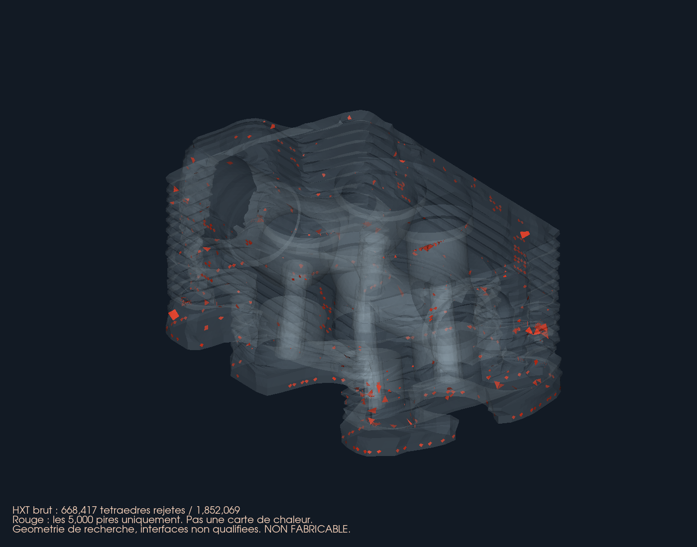

La vue VTK utilise la vraie frontière complète, sans lissage ni image
générative. Pour rester lisible, le rouge montre seulement les **5 000 pires
éléments**, pas tous les rejets ; les comptes et localisations complets restent
dans le diagnostic privé. Ce ne sont ni des fissures ni une carte thermique.
La provenance et les droits de réutilisation sont ceux du
[scan Wolfe Classics](../../catalog/sources/src-wolfe-classics-935-billet-cylinder-head-scan.json),
sans publication du scan, du B-Rep ou des tableaux de maillage.

La reprise standard sur Mac lit ce point de reprise exact et retrouve
l’intégralité de la distribution brute. Elle atteint elle aussi **780 secondes
CPU**, sortie **152**, sans export optimisé. Son reçu incomplet est conservé,
les entrées restent inchangées. Aucun échec n’est remplacé par un succès.

- Diagnostic/localisation : `3616e63c95f54e62949b3c9e4afe9d2fe187def7d8309816b375a0ee67a9c0cf`.
- Producteur de la vue : `f99c94b894b6491ddc548f0b1068b8ae9895ac4f7e709e6e53e70127a6b67b2a`.
- Image publiée : `2a10d26332b9c06fe5f80fd46b50148ca797b1e1cacac6c9cf294280dfa16d16`.
- Reprise standard Mac : `09e95a74fe8e4e4abc6290ae6214f111ed59ce9ac51f6a190f0d566228286253`.
- Reçu incomplet de cette reprise : `a75f92916f1aba4e9d76f83972e00c7bd5204f2ab18d5ee7f082d739d699f01b`.
- Observation terminale de la reprise : `815a1043f8c0630a4cfecbcefe0af91bcb13c0f644618cf19debeaa2979419ad`.
- Audit de connexité/volume brut : `4c266dbaf7a7495c4d28321c66769747a215d2ce0d07466b13228ed2710ff22c`.
- Producteur de cet audit : `bd9b2ff076f9298fa1c541c0d039e6fe26287a0fe9dcf9c066cdaaec5aca4719`.

Un environnement **isolé**, sans modification du Python système, est préparé
sur Kali2 avec Python 3.13, Gmsh **4.15.2** et NumPy **2.2.6**. Les deux images
de travail déjà présentes testées ne proposent pas Gmsh sur leur Python par
défaut ; ce constat ne signifie pas que tous leurs autres runtimes sont absents.
L’environnement isolé retrouve exactement les métriques du volume brut Mac
et ses **22 tests natifs passent**, sans saut, en 0,214 s. Aucun achat ou
nouvelle location n’est nécessaire. Une installation de bibliothèque et un
témoin sur cube ne sont pas une qualification physique de la culasse.

La reprise x86 standard ne fournit pas non plus d’export optimisé. La session
SSH termine avec **255** ; le processus n’existe plus, le reçu reste à
`optimizing`, les entrées sont inchangées. La limite CPU était également
780 s, mais le signal terminal distant n’a pas été récupéré : **la cause
exacte de cet arrêt n’est pas certifiée** à partir du seul code SSH. Il n’est
pas assimilé à une optimisation terminée ni à une simple interruption du
transport avec un travail encore actif.

- Reprise Linux : `ffc33c79c61f08a283f46d70c361ab36d06bef02da3f74525cb1db2d88c218bf`.
- Reçu incomplet Linux : `b5320171dc396b30c0617250c5c3cd07c316310f15b065f070672f62ede02330`.
- Tests natifs Linux : `f19193c32da47d378df442ea74c9100822a524493045a32306beb9f5374f1ab7`.

**Suite ciblée :** ne pas répéter l’optimisation globale identique. Tester la
gradation entre tailles de surface et de volume, puis une correction locale
des cellules les plus plates, à géométrie et seuils inchangés. La désactivation
de la propagation des tailles de frontière est une hypothèse à tester, pas
une cause démontrée. Chaque nouvelle surface devra recevoir son propre audit ;
les Jacobiennes, la qualité individuelle, la frontière, la connexité, le
volume et l’export devront tous repasser avant toute utilisation CAE.

Tous les calculs de cette continuation sont terminaux. Le volume brut est
sauvegardé, **aucun volume optimisé n’est accepté** et la référence historique
à 32 rejets reste inchangée. Pas de location Vast, de fusion de PR, de
déploiement de site, ni d’autorisation d’impression ou de fonctionnement.

## 2 octobre — regroupement des partitions cylindriques

Le [nouvel essai isolé](../../twins/m64-cylinder-head/source/wholebody/trial_isolated_cylinder_union.py)
regroupe les partitions du support cylindrique sans nouvelle suppression ou
addition de matière. **La collerette reste une variante de recherche**, pas
le master : son ajout de matière lors du tour précédent n’est pas justifié
thermiquement ou mécaniquement par cette réussite de maillage.

### Géométrie propre et représentations auxiliaires

Le contrôle antérieur des sérialisations complètes reste documenté comme
échoué. Il n’est pas transformé rétroactivement en succès. Deux lectures
natives indépendantes isolent maintenant la référence de la copie de travail.
Le regroupement modifie encore des représentations de cette copie ; le corps
de référence en mémoire et son fichier restent identiques.

Le contrôle supplémentaire compare, pour chaque face protégée, son support
natif sérialisé, sa position, son orientation, sa tolérance, ses contours et
toutes leurs occurrences d’arêtes. Il compare aussi les courbes 3D, les
p-courbes **sur cette face**, leurs domaines, indicateurs et sommets. Une
p-courbe est une représentation 2D d’une arête sur un support ; son ajout
sur un autre support peut modifier les octets partagés sans déplacer la face.
Le [test synthétique](../../tests/test_m64_isolated_cylinder_union.py) reproduit
ce cas, puis vérifie qu’un changement de la p-courbe propre est bien détecté.
Les [API OCCT de copie](https://occt3d.com/dev/doc/refman/html/class_b_rep_builder_a_p_i___copy.html)
et de [remplacement topologique](https://occt3d.com/dev/doc/refman/html/class_b_rep_tools___re_shape.html)
éclairent la démarche ; leurs pages actuelles décrivent OCCT 8.0.1, tandis
que les essais restent exécutés sur **OCP 7.9.3.1**.

Sur la collerette, six faces cylindriques connectées ont la même orientation,
des écarts de rayon et de distance entre axes nuls, et un écart angulaire
inférieur à `1.2e-17 rad`. Leur regroupement produit une face :

- 4 930 → **4 925 faces**, un solide, une coque, validité native exacte et
  relecture réussies ; maxima de tolérances non augmentés.
- Treize arêtes de partition disparaissent. Deux autres restent nécessaires
  comme coutures périodiques : chacune est fermée sur la nouvelle face,
  utilisée deux fois en sens opposés et n’appartient à aucune autre face.
  Aucun nouveau contour 3D n’est créé ; les contours extérieurs sont conservés.
- Les sérialisations complètes de trois faces protégées changent, mais
  **aucune de leurs géométries propres ne change** selon le contrôle détaillé.
- Les deux représentations des coutures sont contrôlées, avec 129 points par
  occurrence d’arête. Écart maximal p-courbe/courbe 3D : `5.82651e-8` unité
  de scan, sous le seuil inchangé `1e-6`. C’est un échantillonnage, pas une
  borne continue de Hausdorff.
- Un contrôle booléen indépendant soustrait les régions sélectionnées dans
  les deux sens : zéro face et zéro aire manquantes ou excédentaires.
- Le BOP indépendant passe sans défaut, erreur ni avertissement en 119,90 s.

Une première construction directe des contours, sans réécriture des p-courbes,
conservait les sérialisations mais créait une face `UnorientableShape` : elle
est rejetée, sans export ni maillage. La fusion partielle de l’appui sans
collerette passe la géométrie et le BOP, mais conserve trois rejets de surface.
Ces témoins évitent de confondre suppression de partitions et amélioration
effective du maillage. Les anciens tests et seuils restent inchangés ; ce
nouveau contrôle ne constitue pas à lui seul une autorisation de master.

### Surface complète et contrôle indépendant

| Variante terminée, mêmes réglages de surface | Triangles | Rejets q2 | Minimum q2 |
|---|---:|---:|---:|
| Collerette avant regroupement | 1 079 372 | 3 | 0,06331731 |
| Appui sans collerette, regroupement partiel | 1 080 692 | 3 | 0,06331731 |
| Collerette, regroupement complet | **1 081 206** | **0** | **0,07085403** |

Le seuil reste `q2 >= 0.06896551724137931`, condition nécessaire, non
suffisante, pour le seuil volumique `q3 >= 0.1`. Le dernier essai prend
130,56 s, avec Gmsh 4.15.2, MeshAdapt, deux threads et le champ de taille de
chambre déjà documenté. Aucun triangle n’est supprimé ou lissé après coup.

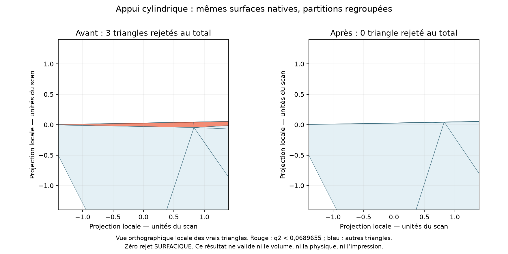

Même région, projection orthographique locale et échelles identiques.
Le rouge désigne uniquement une mauvaise qualité numérique, pas une fissure,
une contrainte ou une température. La provenance et les droits de réutilisation
du scan [Wolfe Classics](../../catalog/sources/src-wolfe-classics-935-billet-cylinder-head-scan.json)
restent ceux du dossier ; ni scan, ni B-Rep, ni maillage brut ne sont publiés.

La relecture indépendante trouve **540 589 sommets utilisés**, tous avec
liens circulaires : zéro défaut d’incidence, doublon de triangle, coordonnée
utilisée dupliquée ou conflit d’orientation. Les **66 612 segments de courbes**
stockés sont tous des arêtes directes de la surface. L’export des tableaux
binaires est relu exactement. CGAL 5.6 sur Kali2, dans le conteneur existant
limité à deux CPU et 6 Gio, trouve **zéro paire intersectante** en 2,69 s.
Ces preuves portent sur ce nouveau maillage exact, pas sur une autre version.

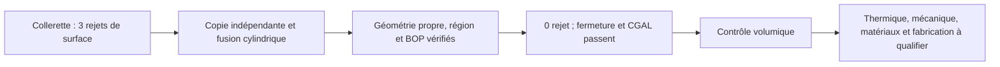

### Reproduction et vérification logicielle

```sh
python twins/m64-cylinder-head/source/wholebody/trial_isolated_cylinder_union.py \
  --body /private/collar-r175-h3/candidate-private.brep --variant collar \
  --output /private/fresh-isolated-union
python -m unittest discover -s tests -p test_m64_isolated_cylinder_union.py -v
```

L’entrée exacte est la collerette exploratoire archivée, SHA-256
`3d298c4b354b30eb22704d6ca0430de24666283461effac41710e1af1adf65bb`.
Une géométrie semblable avec d’autres octets n’est pas substituée silencieusement.
Le rejeu de l’appui simple avec la version finale du code conserve exactement
son empreinte de candidat, `7f0f5e1acc52f3300dceed650e4075770b7ed97b5dde66a2f1d11f9c8f19fe62`.

Le témoin natif passe sur Mac, y compris les deux occurrences de couture et
le refus d’une arête ordinaire comme couture. Sur Kali2, `make check` finit
avec le code **0** : **3 235 tests principaux, 171 sauts optionnels**, 155,977 s,
puis les contrôles restants. Le nouveau test CAO est un saut optionnel sur
ce runtime Linux ; son exécution native sur Mac est comptée séparément.
Les sources et tests ont les mêmes empreintes sur les deux machines.

Empreintes des artefacts privés, sans publication des géométries :

- Candidat regroupé : `9c40df1642d5eb47a3c1a1aae68c761b23b77e3f7e02e0818294e88ee0322598`.
- Construction : `eeda940838c1cd1f9d1fa5a40ca73f8e075f875387c6732b5ed835c3b96cba63`.
- Régions, différence bidirectionnelle : `8af91976851ad56767ae2b6ff9d2b991ede57c75adcb7594c62ee121ba0b9df1`.
- BOP : `48ef24983b3fa52153167d98c304f45108194af9db68a6da806f7bdbb582992c`.
- Surface : `dc223d9b4ce2d680cf415e95d97c76ace54b797efa358d3b82a15a5dbb3dbc79`.
- Audit indépendant : `219817c19e96df4652c43b63cb12bf40dd2d0c3bffcd58224979ed763f04fbab`.
- Tableaux exacts : `136b2cc1469c40435a52d68fc6f7aae7e99d6c789207bb9372f11d1ff25cf516`.
- CGAL : `5da4f69198dedb9561c1406fab3ab08fef1b58ded3dc8e872d45d89f2c02d6f3`.
- Image : `06307b7f43caf00d1d948fa4818d79269df074d1905500e3ab0a495d4f81a295`.
- Suite Linux : `8c6ba295b0cdbd2242745a798962769a66c18bddfaad50e93acb1db978c4e333`.

### Tentative volumique : arrêt avant génération 3D

La reprise par import/fusion d’un maillage sur une géométrie native est
testée sur un cube, puis écartée : les essais ne prouvent pas la conservation
de la surface **et** la production de tétraèdres. Les premiers comparateurs
bruts étaient également sensibles à la renumérotation des nœuds. Un témoin
dans un même processus passe avec un comparateur canonique qui ignore
seulement les numéros et l’ordre des éléments : les coordonnées binaires et
l’orientation sont conservées ; le contrôle négatif d’une face inversée échoue.

Sur la culasse, le rejeu natif 2D termine en 141,12 s et produit **1 081 082
triangles, zéro rejet**, avec le même minimum q2. Mais ce n’est pas le maillage
de 1 081 206 triangles audité plus haut. Le contrôle exact arrête donc le
processus **avant la génération volumique**. Aucun tétraèdre nouveau, résultat
d’optimisation 3D ou convergence volumique n’est revendiqué. Le journal est
conservé ; le résultat n’est pas un dépassement de temps.
Empreinte de ce journal d’exécution :
`83c303a31be2d8d4dadea8fd3048214d8aa8466602fcbbd2f6735a20f330005d`.

La prochaine exécution doit auditer sa propre surface — qualité, topologie
et CGAL — puis générer le volume **sans régénérer cette surface**. Elle devra
vérifier les Jacobiennes, le seuil q3, la frontière exacte, les composantes,
le volume et la relecture. La référence volumique historique à 32 rejets
reste inchangée. L’échelle physique, les interfaces M64, le dimensionnement
de la collerette, les contacts à chaud, la thermique, les matériaux, la fatigue
et l’impression ne sont pas qualifiés par le succès surfacique.

Aucun processus numérique de ce tour ne reste actif. Aucune location payante,
fusion de PR, publication de site ou autorisation de fabrication.

## 2 octobre — reprise locale de l’appui de ressort

Deux variantes additives sur l’appui nominal `exhaust_2` partent du candidat
à cinq raccordements de chambre, SHA-256
`93545442adaf0a95e741d50ef9efeef48c677ff3592dbeb637dba76bb74df6de`.
Le rayon extérieur passe de 16 à 17,5, en conservant le rayon intérieur 7
et les niveaux axiaux 55,1–58,1. La seconde variante prolonge une couronne
de rayons 16–17,5 jusqu’au niveau 61,1. Ces dimensions sont des **unités de
scan non étalonnées**, pas des cotes Porsche. L’épaisseur radiale nominale
de 1,5 n’est ni une carte d’épaisseurs complète, ni une justification mécanique.

| Essai terminé | Triangles | Rejets q2 | Minimum q2 |
|---|---:|---:|---:|
| Candidat précédent, graduation de chambre | 1 080 790 | 5 | 0,02134671 |
| Appui élargi seul, mêmes réglages | 1 081 320 | 3 | 0,06331731 |
| Même appui, graduation supérieure supplémentaire de 0,02 | 1 098 056 | 4 | 0,04157261 |
| Appui élargi avec collerette, graduation de chambre seule | 1 079 372 | 3 | 0,06331731 |

Les trois nouveaux maillages finissent en 126,75, 134,43 et 127,44 s avec
Gmsh 4.15.2, MeshAdapt et deux threads. Aucun triangle n’est supprimé.
Le seuil `q2 >= 0.06896551724137931`, nécessaire pour `q3 >= 0.1`, est
inchangé : **toutes les surfaces restent refusées**. Ce ne sont pas des
comptages de fissures ou de trous. Aucun volume n’est lancé ; les anciens
audits topologiques/CGAL ne sont pas transférés aux nouvelles surfaces.

### Contrôles natifs et contacts

- Chaque variante est un B-Rep valide à un solide et une coque : 4 929 et
  4 930 faces. Les maxima des tolérances n’augmentent pas. La boîte globale
  est inchangée, mais le contour **local** est volontairement modifié.
- Les différences booléennes ne trouvent aucun solide retiré, ni ajout
  hors de l’appui autorisé. Les volumes ajoutés par intégration CAO courante
  sont environ 71,70 et 281,55 unités³, sans conversion en grammes.
  La convergence de ces intégrales n’est pas certifiée.
- 4 904 et 4 896 faces conservent identités et sérialisations. Toutes les
  faces modifiées touchent l’appui. Chambre et portées cylindriques des
  sièges d’échappement sont conservées ; les corps sources restent inchangés.
- Les BOP indépendants passent sans défaut, erreur ni avertissement,
  en 116,99 et 117,99 s.
- Les quatre empreintes nominales de rondelle restent entièrement
  soutenues aux niveaux 58,1 et 58,099 : zéro face manquante, aire
  `pi*(16²-7²) = 650,3096793` unités². Les quatre enveloppes de ressorts
  restent libres. Aucun des douze composants nominaux n’intersecte l’ajout ;
  l’écart minimal au guide le plus proche est 1,50332964 unités.
- Les deux conduits natifs vérifiés par empreinte n’intersectent pas
  l’ajout : distances minimales 34,61737 et 11,08115 unités.

Ces vérifications à froid ne qualifient ni débit, température, serrage,
jeux fonctionnels, fatigue, ni fabricabilité.

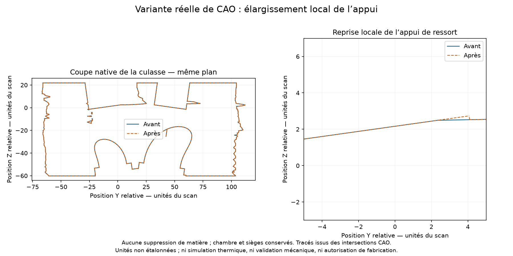

Intersections réelles du B-Rep avec un même plan, 41 points par arête pour
l’affichage, axes à échelles égales. Ni image générative ni métrologie.
Référence issue du scan Wolfe Classics ; autorisation du propriétaire
enregistrée dans la [fiche source](../../catalog/sources/src-wolfe-classics-935-billet-cylinder-head-scan.json),
sans nouvelle revendication de licence. Aucun B-Rep brut n’est publié.

### Essais rejetés et prochaine correction

La collerette ajoute davantage de matière sans gain sur les trois défauts.
Quatre de ses faces reposent sur le même cylindre analytique, avec même
orientation : différences de rayon et de distance entre axes nulles,
écart angulaire inférieur à `1.2e-17 rad` dans le noyau. Leur fusion locale
supprime trois partitions et laisse un B-Rep valide, mais **échoue** aux
contrôles de sérialisation des faces protégées et de préservation du corps
en mémoire, malgré le mode d’entrée sûr. Aucun candidat fusionné n’est
exporté ni maillé.

Le contrôle préalable p-courbe/courbe 3D échoue aussi sur une arête au seuil
`1e-6`. L’identité des cylindres est une vérification analytique distincte,
pas une réparation de cette p-courbe. Prochaine étape : travailler sur une
copie indépendante, identifier les représentations modifiées et contrôler
les surfaces et courbes natives avant une nouvelle fusion locale.

L’intégration adaptative séparée des volumes atteint son alarme de 120 s,
code 142, sans rapport final. Les coupes ont été produites séparément,
sans présenter cette intégration comme terminée.

### Reproduction

Le [constructeur borné](../../twins/m64-cylinder-head/source/wholebody/trial_upper_spring_support.py)
réutilise les opérations et contrôles existants ; seules les hauteurs 0 et
3 et les entrées exactes sont acceptées. Le [test natif](../../tests/test_m64_upper_spring_support.py)
vérifie appui, passages et refus des paramètres invalides sur une géométrie
synthétique. Les deux reconstructions complètes passent leurs contrôles
natifs. Leurs empreintes de sérialisation diffèrent des essais exploratoires :
aucun résultat de maillage ou BOP n’est automatiquement transféré à ces fichiers.

```sh
python twins/m64-cylinder-head/source/wholebody/trial_upper_spring_support.py \
  --body /private/chamber-candidate.brep \
  --registration /private/registration.json --collar-height 0 \
  --output /private/fresh-support-land
python -m unittest discover -s tests -p test_m64_upper_spring_support.py -v
```

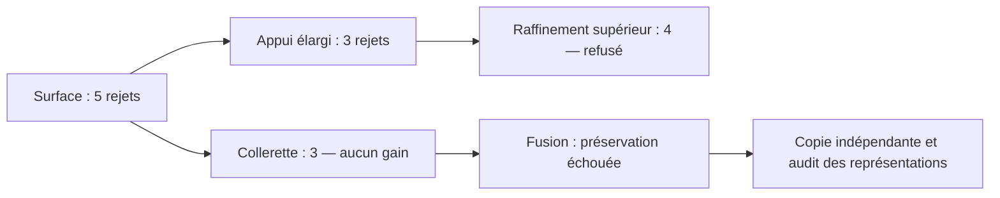

### Vérification logicielle

Dans le runtime natif du Mac, le nouveau test d’appui passe, ainsi que les
quatre tests de raccordement/graduation existants. Il s’agit de témoins
logiciels sur géométrie synthétique, pas d’une qualification de culasse.

Les premiers contrôles Linux sont conservés dans les journaux privés :
la copie initiale n’avait pas de métadonnées Git ; son extraction avec umask
002 laissait des fichiers modifiables par le groupe ; enfin quatre fichiers
AppleDouble du transfert macOS ajoutaient un faux rapport à l’index. La
copie temporaire reçoit un dépôt local, les droits d’écriture groupe/autres
sont retirés uniquement dans cette copie et les quatre métadonnées sont
déplacées hors du checkout, sans suppression. Aucun garde de sécurité, code
historique ou résultat attendu n’est modifié. Le troisième contrôle avait
déjà passé les 3 234 tests principaux avec 170 sauts optionnels, mais échouait
encore sur l’index documentaire : il n’est pas présenté comme un succès global.
Le quatrième révèle que les métadonnées déplacées restaient enregistrées
dans l’index Git temporaire ; elles en sont retirées. La liste des fichiers
suivis est alors identique à celle du vrai dépôt, et les deux contrôles
documentaires passent séparément avant de relancer la suite complète.

Le contrôle final `make check` sur le système de fichiers Linux natif de
Kali2 finit avec le code **0** : **3 234 tests principaux, 170 sauts
optionnels**, 155,903 s pour cette suite, puis tous les autres contrôles,
dont les quinze tests Docker épinglés. Les sources du constructeur et du
test ont les mêmes empreintes sur Mac et Linux. Le témoin CAO optionnel
est exécuté séparément sur Mac ; un saut Linux ne vaut pas qualification.
Les contrôles locaux de l’index et des liens passent aussi après mise à jour
du rapport : zéro lien cassé dans 573 fichiers Markdown.

Empreinte du journal complet final :
`8e9b35a15e993e07c3ac501ce68e37628834d44c6090ef4fbdc867ebb867db43`.

Empreintes des essais exploratoires, géométrie conservée hors Git :

- Appui B-Rep : `01cce1b6009b29f2755b2b86b52e572b2ca9872caf4704fb819da91004f87cc5`.
- Construction appui : `b9277c928ccfc03255b8d6f3f8101f7507692c4da26fb7ec6b72805372b5f12f`.
- Surface appui : `7a283dbf5d7d0bac49821bdf2db6e8c3fedc06d5510e8019890781007c878d2a`.
- Surface graduée : `41a5e64ff5e96cac953692b420060c18544916fddf30da13ab9e478e2c42cc35`.
- BOP appui : `3d43404e398d3178db67ebaeb236af93165265dc47b77cbf400aa80c7e6c62ed`.
- Contacts appui : `3a885e151b2680bf2d96a08fea919708699bb974fc1e50875a84cf33737d5037`.
- Collerette B-Rep : `3d298c4b354b30eb22704d6ca0430de24666283461effac41710e1af1adf65bb`.
- Surface collerette : `40e4039edd082558511eb3a3b00b83f3361a148f998750b233eb7fe06f1f63d0`.
- Fusion refusée : `06ca974ef4f4d49121ae91888d31485b88805e4de630549af3c0fdd22a523df1`.
- Coupe : `58b849f40b27173374699e6a532b057250961626591a311bedbe47b646f60ae6`.

Le volume de référence reste à **32 tétraèdres rejetés**. Le seuil physique
de 0,040 mm, les interfaces M64, propriétés à chaud, refroidissement,
fatigue et impression restent à qualifier. Aucun nouveau master, alliage,
lancement d’impression ou agrément moteur ; aucune location payante.

## 2 October: G1 compounds and exhaust-seat contact

The five-edge chamber candidate (`93545442…`) still has **17 incompatible
triangles / 1,006,116** in its completed MeshAdapt surface. The retained master
and its 32 rejected tetrahedra remain unchanged. This continuation does not
replace either with an incomplete calculation.

The [shared native audit](../../twins/m64-cylinder-head/source/wholebody/audit_shared_curve_consistency.py)
now checks **every internal edge** of a proposed two-to-eight-face compound,
not merely a connected spanning tree. It requires recorded OCCT G1-or-better
continuity, consistent oriented normals at 129 samples including endpoints,
matching p-curves, manifold internal incidence and a connected group. Duplicate
indices, disconnected groups, unannotated/sharp edges and opposed normals fail
closed. These finite samples and continuity metadata are not a continuous
tangency certificate. A native shallow-wedge regression exercises acceptance,
duplicate rejection, opposed orientation and sharp-edge rejection.

| Exact-candidate compound experiment | Internal seams screened | Outcome |
|---|---:|---|
| Faces 7, 11, 146, 147, 151, 152 | 5 G1 seams | 540-second alarm, exit 142; no mesh |
| Roof 7/146/147/151 and rim 11/152 separately | 4 G1 seams; roof/rim seam retained | 540-second alarm, exit 142; no mesh |

The first group's maximum sampled normal-angle difference is 1.22e-7 degrees;
maximum p-curve discrepancy is 4.92e-10 scan unit. Neither trial discards the
known sharp original junctions. Both receipts correctly remain `incomplete` at
`meshing_compounds`; neither has a triangle-quality result. The extended
[shape sampler](../../twins/m64-cylinder-head/source/wholebody/audit_compound_shape.py)
requires exact candidate/group/mesh bindings and repeats the G1 checks, but
**cannot run on these absent outputs**. No volume meshing follows.

### Identify contact surfaces before changing neighbouring boundaries

A native diagnostic matches original faces 131/140 and candidate faces 2/13
to the **outer cylinders of the nominal exhaust-2/exhaust-1 seats** respectively.
It uses the actual 12-solid V2 STEP module, not a photograph or guessed anatomy.
Its previously recorded placement remains a hypothesis: one scan unit per mm,
Z rotation -90 degrees, Z translation +3 scan units. This is not M64 metrology.

For each seat, before and after the candidate edit, a non-destructive native
`Common(body_face, seat_outer_face)` returns one coincident cylindrical face,
area **622.0353454106107 scan units squared**, agreeing with `2*pi*18*5.5`.
`Cut(seat_outer_face, common)` leaves **zero faces**. Source faces, seats and
file hashes remain unchanged. This is nominal coincidence at native OCCT
tolerances; it does not certify a strict zero gap below those tolerances.
Seat shoulders, conical sealing bands, interference, pressure, thermal contact
conductance, expansion and hot retention are **not checked** by this comparison.

The worst surface triangle on candidate face 147 lies near its boundary with
seat-aligned face 2; the rejected triangles on face 152 lie near its boundary
with seat-aligned face 13. Proximity is a localisation result, not proof of a
single cause. Those boundaries are outside the G1 group and must not be erased
to improve a quality statistic. The next reconstruction/meshing experiment
must preserve the measured nominal contact patches and sharp boundaries.

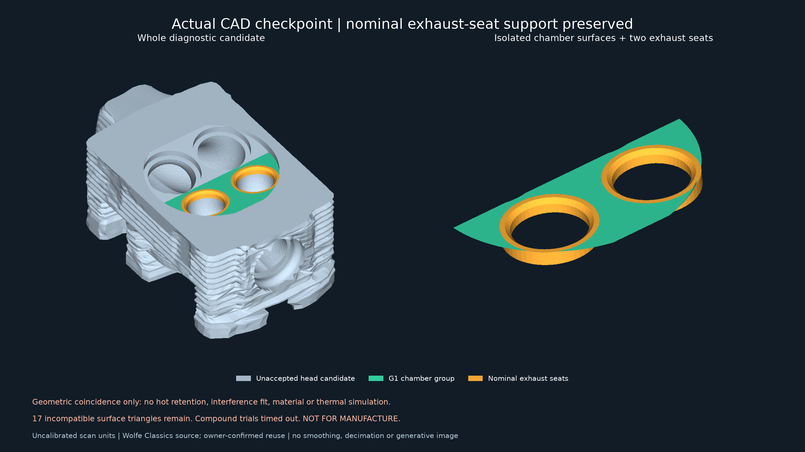

The left panel is the actual candidate skin, the right isolates the chamber
group and two existing seat components. Green and gold identify geometry,
**not materials, temperature or stress**. The seats reuse hash-checked native
tessellations with their placement applied once. No smoothing, decimation,
cosmetic hole filling or generative imaging occurs. Wolfe Classics provenance
and owner-confirmed reuse remain as recorded in the
[source record](../../catalog/sources/src-wolfe-classics-935-billet-cylinder-head-scan.json);
the exact licence identifier remains unarchived. Raw/native geometry stays private.

Verification: the qualified Mac runtime passes 3 acute-blend, 13 constrained-
patch and 6 bounded-chamfer tests. Final frozen-code Kali2 `make check` exits
**0**: 3,232 main tests, 168 optional skips, 155.451 seconds, followed by all
remaining targets. Optional native tests skipped there run on Mac instead.
The four modified code/test files have identical Mac/Linux hashes. One earlier
rerun was not launched because recursive permission normalization encountered
root-owned Docker bytecode; limiting it to the two changed source files fixed
the preparation without altering those unrelated files.

Private evidence fingerprints:

- Six-face incomplete receipt: `e8d38cf86f44caaebb7670dff3614dc97701e053ae98275bb6a5cba5d23f3dbe`.
- Partitioned incomplete receipt: `45209ddeed16c3a788a736a841f9be2ac40130003acf1613c454255e1208913d`.
- Final compound runner: `d7672dfd5ee8a001e4ed73094e88fea9e910a9be467cf29af8058169cfa561fd`.
- All-internal-edge auditor: `e4d79749e052ac572ce25ec66ba1dc5cad32738811e9c4df8fc206bd5b1502e0`.
- Native seat comparison: `f3bf42d0f898adbce545dc22ef23fca1ce2b27d3019f6e5992218edcf1ea28ca`.
- Private seat comparison source: `025c40414e623553766f9b7cd201994cca4d012b77ce9128a728d53ee68c037c`.
- Actual render receipt: `5d40f063b6fa6a31f960c2eaac443483a1e4856ee30d585bace2d703485af0cf`.
- Published PNG: `83131578ae493e3648d6906f6604af2c13bb9e71de9bb90f40d700f35ad7ffcf`.
- Final Linux check log: `cd0a319407acca28db4376fd5356427ebf016e52751a1e5b8a23dc7810ad6d5c`.

Reproduction in the qualified OCP 7.9.3.1 / Gmsh 4.15.2 runtime:

```sh
python twins/m64-cylinder-head/source/wholebody/trial_compound_junction_mesh.py \
  --body /private/network-r005-final/candidate.brep --chamber-network \
  --classify 1 --factor 1 --output /private/fresh-g1-compound
python twins/m64-cylinder-head/source/wholebody/trial_compound_junction_mesh.py \
  --body /private/network-r005-final/candidate.brep --chamber-network \
  --partitioned-chamber --classify 1 --factor 1 --output /private/fresh-g1-partitioned
python -m unittest discover -s tests -p test_m64_acute_cylinder_blend.py -v
```

Both jobs have ended. No paid instance, new accepted CAD/mesh, print simulation,
thermal/material result, manufacturing release, PR merge or site deployment
occurs in this continuation. The cooling-fin study remains research input,
not evidence of a heat-transfer gain on this head.

## 2 October: native-corner grading removes the chamber rejections

**The chamber/seat surface-meshing defect is corrected on the five-edge
candidate, without another CAD edit.** The complete head surface still fails
the necessary quality screen at five triangles in the upper region. This is
not a completed head, an accepted volume mesh or a manufacturing release.

Native corner inspection finds an 11.314697-degree outgoing-ray angle at the
worst planar chamber corner. Its existing triangle has adjacent distances
0.02616795 and 0.49692128 scan unit from that same corner: about **19:1**.
The surface's low quality is therefore investigated as a boundary/interior
size mismatch rather than corrected by removing the seat-support material.
This observation alone is not a proof of a unique cause; the controlled
remesh below demonstrates the successful correction on this candidate.

The existing [surface screener](../../twins/m64-cylinder-head/source/wholebody/screen_tip_cut_surface.py)
gains an exact-candidate-only `--chamber-corner-size` experiment. With size
0.020, a [Gmsh Distance/Threshold field](https://gmsh.info/doc/texinfo/#t10)
acts on the **19 actual boundary vertices** of mapped faces 147 and 152.
Size remains 0.020 within 0.15 scan unit and grows linearly to 3.0 at 15 scan
units. Existing short-edge limits and native curves remain; no compound,
healing, edge deletion, CAD smoothing or material edit is applied. The 0.010
option is bounded in code but **not run**, since the first experiment already
removes the diagnosed chamber failures. Both options require the exact
candidate and MeshAdapt; the Frontal override cannot be combined with them.

| Completed surface screen | Triangles | Incompatible q2 | Chamber plane 147 | Chamber cylinder 152 |
|---|---:|---:|---:|---:|
| Prior MeshAdapt control | 1,006,116 | 17 | 10 rejected | 2 rejected |
| Native-corner grading, 0.020 | 1,080,790 | **5** | **0**, minimum 0.31153922 | **0**, minimum 0.07160121 |

The unchanged necessary limit is `q2 >= 2*0.1/(3-0.1) = 0.06896551724`.
The completed run takes **129.237 seconds** and retains all input hashes.
No Gmsh warning/error is present in its progress log. Native CAD SHA-256 is
still `93545442adaf0a95e741d50ef9efeef48c677ff3592dbeb637dba76bb74df6de`;
the previous nominal seat-contact result remains applicable to that identical
CAD, not a claim that the new surface discretisation solves contact physics.

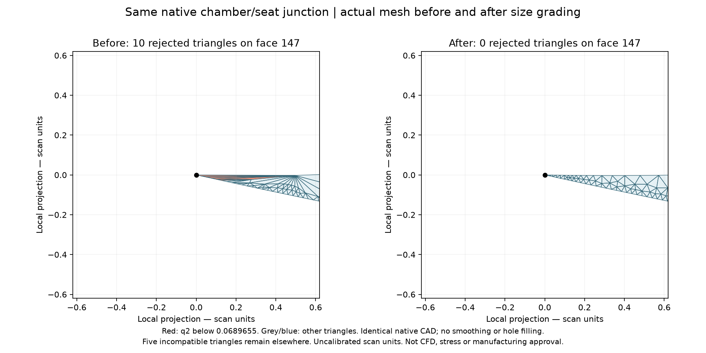

These are equal-scale projections of actual mesh triangles near the same
native vertex. Red denotes failed numerical triangle quality, not cracks or
heat. The ten-before/zero-after counts refer to the entire plane face; the
image zooms into one corner. The documented Wolfe Classics provenance and
owner-confirmed derivative use apply; private mesh/native files stay outside Git.

An independent readback recomputes quality and checks **540,381 used vertices**:
all have circular links, every surface edge has two incident triangles, and
there are zero duplicate triangles, duplicate used coordinates, unused nodes
or winding conflicts. All **66,588 stored native-curve segments** are direct
surface edges. No orientation repair, welding or line reconstruction is needed.
These checks do not by themselves prove native curve distances or a continuous
CAD-deviation bound. The binary64/uint64 array export reads back exactly.

The separately hash-bound **CGAL 5.6** auditor on Kali2 finds **zero intersecting
pairs** over all 1,080,790 triangles in **2.694 seconds**. Its executable is the
same pinned binary tested previously. The read-only, network-disabled sidecar
uses two CPUs and 6 GiB; an initial permission failure launches no audit, and
running as the verified owner UID/GID 1000:1000 fixes access without changing
file permissions. The recovered report hash matches the remote file.

The remaining faces are 1302 (two rejected triangles), 1304 (one) and 1542
(two). Their native outgoing-ray angles reach **1.444691 / 1.371396 degrees**.
A supporting-surface inspection finds coaxial radius-16 cylinders: the two
pocket faces are reversed, whereas the pad face is forward. These are the
previously traced spring-pocket/pad surfaces. Opposed orientation of different
faces is not alone proof of a cusp or interference. The next construction
must address this coupled support transition while checking the nominal spring
footprint and surrounding clearances; blindly extending the chamber size field
does not establish a solution to those different corners.

The logged partitioned-compound control is **explicitly stopped with SIGTERM,
exit 143**, after the noncompound correction succeeds. It is not another
timeout and produces no mesh; its receipt remains incomplete. The native
progress log is now enabled in both existing runners, so a stopped job retains
its last emitted meshing messages. No GPU or paid machine is used.

Verification: four focused Mac tests pass, including a real meshed rectangle
with field points taken from its native boundary, unchanged model entities,
invalid-input rejection and wrong-candidate rejection. Frozen-code Kali2
`make check` exits **0**: 3,233 main tests, 169 optional skips, 157.065 seconds,
followed by all remaining targets. The three changed code/test files match
Mac/Linux hashes; native tests skipped by the Linux base runtime run on Mac.
The pinned CGAL sidecar separately passes four topology/intersection tests;
three Gmsh-version-specific tests are explicitly skipped there.

Fingerprints:

- Surface-screen receipt: `edd53bd237fe6597080009f2674acae228f46302dde0f8c544530d88663e4422`.
- Surface screener: `ad7f7bd769118efc92ab6bf22c4d23a5909bcd45e8a074ff2eaf325e5a87ca4d`.
- Chamber corner diagnostic: `c8afbd6941ed8476360c464276e3e3db2d5ff2232aa833505ff69c71e4a17f64`.
- Remaining upper-corner diagnostic: `b95cc29f212d77acc70d57e90b77bf88ad51212e81c2181390cf567cc340e181`.
- Independent topology/curve/figure receipt: `9cac44276b4593cab70bcc8fd4387932abfadb3a8524b9e66bdcaac2386c176c`.
- Exact array export: `131973a0b96efcfa2dd2cab4111d6b6e63562ed7359f1df7fdb3baba7f22b0ac`.
- CGAL receipt: `e3c77a60754c6a46d94c28749f00064bea02be748e9ba819ea83f2105c823286`.
- Published PNG: `194748b9cbd060341c50c5c8d2c8eb2f5a5006aa12289ab2ae55926a259f260d`.
- Full Linux check log: `4f1dd16f61db0261ac7184d633bedffa1af916c45860a421d78e074e735ac744`.
- Stopped compound receipt: `cd88320a462217c7ecfafaafc366415e4e639a1c4514ab75f976090002b4b2dd`.

```sh
python twins/m64-cylinder-head/source/wholebody/screen_tip_cut_surface.py \
  --candidate /private/network-r005-final --chamber-corner-size .02 \
  --cpu-seconds 540 --output /private/fresh-corner-size-002
python -m unittest discover -s tests -p test_m64_acute_cylinder_blend.py -v
```

All numerical jobs in this continuation have ended. No volume run is launched
from a surface with five remaining quality failures. The retained 32-rejection
volume, physical 0.040 mm requirement, engine interfaces, thermal/strength/
material/printing qualification, merge and deployment statuses remain unchanged.

## 2 October: reject the cutter cusp and test a coupled chamber-edge network

**No new master or printable head is accepted.** This continuation rounds the
identified native junctions instead of hiding them inside a smooth compound.
All dimensions below are provisional **scan units**, not certified millimetres.

The first private prototype rounds the chamber cutter's entire 8-degree lower
crease at radius 0.002, intersects the recovered material with the original
pre-chamber stock, then fuses it into a disposable head. It preserves the 4,914
protected face identities/serializations in memory and passes BOP. Nevertheless,
its bottom plane and curved cavity meet with **opposed oriented normals**:
the restored lip tapers to zero thickness. Native validity alone misses this
engineering defect. Three other internal seams are merely coplanar, but merging
those seams would not remove the cusp. This construction is rejected.
Its original executable prototype and seven-test fixture are retained privately;
they are not added as another production geometry generator.

The existing [bounded blend runner](../../twins/m64-cylinder-head/source/wholebody/trial_acute_cylinder_blend.py)
now supports the original head's face pair 2/142, with an oriented seam check.
History faces must first be resolved to their orientations in the **final
solid**: using the Boolean/fillet history orientations directly initially
caused a false 180-degree rejection. The correction does not take an absolute
dot product or relax the angular threshold. The runnable shallow-wedge fixture
checks both tangent seams, unchanged input, and the removed volume
`r²[tan(turn/2) − turn/2]` for a unit extrusion, to twelve decimal places.
Sampling 129 points per seam is not a continuous G1 certificate.

| Construction and completed whole-surface screen | Triangles | Incompatible with a fixed-face tetrahedron of q3 ≥ 0.1 | Minimum q2 |
|---|---:|---:|---:|
| Archived unchanged-body MeshAdapt control | 441,650 | 7 | 0.021346709 |
| Cutter round r=0.002, Frontal on every face | 948,434 | 12,907 | 0.000221057 |
| Material crease r=0.5, MeshAdapt | 468,112 | 17 | 0.006629914 |
| Coupled five-edge network r=0.05, MeshAdapt | 1,006,116 | 17 | 0.020083135 |
| Same network, Frontal only on faces 147/152 | 992,598 | 163 | 0.009959070 |

The cutter-round MeshAdapt process exits **139** before producing a completed
mesh; its Frontal run is a different algorithm, not a matched improvement
comparison. An independent whole-body Boolean removal check exceeds its
120-second alarm and exits 142 without a result. Global default and adaptive
volume integration also disagree numerically at this tiny modification scale;
neither incomplete check proves that no material was removed.

The isolated material-crease blend has two tangent support seams, but its
cylindrical endpoint faces acquire zero unsigned tangent-ray angles. Twelve
bad triangles occur on those two endpoint faces. It is rejected.

The coupled trial explicitly includes five edges: 2/142, 2/141, 2/143, 141/142,
and 142/143. There is no contour propagation. Exactly six original faces change
(2, 131, 140, 141, 142, 143); all **4,912** other face identities and serialized
data remain intact in memory. One valid solid, 4,925 faces, unchanged maximum
tolerances, and BOP with no errors/warnings/faults are obtained. BOP takes
118.110 seconds. A metadata-only producer rerun emits the **same BRep SHA-256**.

Its twelve local bad triangles are now on candidate faces 147 and 152; the
other five lie outside the modified patch. Some endpoint boundaries remain
sharp: the principal crease's two tangent seams do **not** establish smoothness
of the entire network. The local native unsigned ray minima on the two retained
cylindrical faces are about 2.37348 degrees; these are curved boundaries, so the
earlier straight-sided planar-corner theorem must not be applied to them.

The [surface runner](../../twins/m64-cylinder-head/source/wholebody/screen_tip_cut_surface.py)
also admits this hash-bound blend receipt and offers `--chamber-frontal`:
Frontal on only those two rejected faces, MeshAdapt elsewhere, all sizes and
quality thresholds unchanged. The flag rejects every other BRep hash and a
different background algorithm before creating output. No curve is discarded
and no compound is formed. The run completes in 114.853 seconds, but worsens
the local rejection count from twelve to **158**; five other failures remain.
This recipe is also rejected, not adopted as a faster or better mesh.

Bidirectional native **patch sampling**, including native boundaries and
trimmed-face interiors, finds maxima of **0.0207106781** (11,164 original-to-new
samples) and **0.0146446609** (13,442 new-to-original samples). No sampled value
exceeds 0.040. This is neither a Hausdorff bound, a whole-head dimensional
certificate nor a physical 0.040 mm result. A separate readback face-byte lookup
matches only 4,804 of the 4,912 protected face serializations; representation
differences are **not** proof of movement, but this lookup cannot be advertised
as a protected-face export certificate. The patch audit uses the producer's
explicit result-face indices bound to the emitted BRep hash instead.

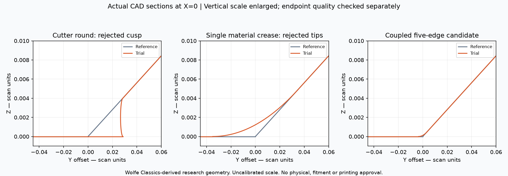

These are actual native sections at X=0, not generated product imagery. The
vertical axis is enlarged. The central section cannot establish endpoint mesh
quality. Source attribution: Wolfe Classics-derived geometry under the owner's
recorded reuse permission; the exact licence identifier remains unarchived.
No raw scan, private native CAD, mesh coordinates or third-party article image
is committed.

Private run root: `work/m64-private-20260907/chamber-blend-20261002.lHhDahOj`.
Key fingerprints:

- Coupled native candidate: `93545442adaf0a95e741d50ef9efeef48c677ff3592dbeb637dba76bb74df6de`.
- Final producer receipt: `b3f95e94e103f0f5dfb207d0c1b21349d497df176983e9200bb78406156fe060`.
- Sample/section receipt: `f4eedb7f39e2ee43db1cc64c918950b11168b4ca25fb715485139fac89c4d4c3`.
- Section PNG: `d2efd885381f82a62a8607b23f28e51e30fe64f40d12515650aea6be3281c381`.
- Local-Frontal mesh: `4790a965482088ef750bd527c3bd3c70e18049619580ce26473d4b2effd6daa5`.

Verification in the qualified Mac runtime: three blend/override tests, six
bounded-cut tests and three fixed-face quality tests pass. The added override
test rejects a different body before creating an output directory. Kali2's
first system-Python run discovers a partial user-installed OCP package and
fails imports such as `TopTools_IndexedMapOfShape` (59 errors and three
failures). This is not a passing full suite. The clean-runtime rerun disables
user-site packages with `PYTHONNOUSERSITE=1`; optional native fixtures remain
covered by the qualified Mac run, not by Linux skips. No installed package or
acceptance threshold is changed to hide these environment errors.
That rerun exits **0** for the complete `make check`: 3,232 main tests,
168 optional skips, 155.486 seconds, followed by all remaining targets. The
three changed code/test file hashes match the Mac checkout exactly. Full log:
`8c951b57076126e75806dec6ad970a65a7898a0fc03ef454b46f520e68f7837a`,
retained under Kali2 `m64-crease-check-20261002.a8yuGF0r`. Final local report-index
and strict link checks also pass; no geometry or test process remains running.

Next bounded experiment: audit every shared boundary before considering any
smooth-face compound or local retriangulation. The 90-degree and 16-degree
boundaries adjacent to face 147 must not disappear. In parallel with that
numerical work, the upper spring-pocket/pad transition still requires its own
source-based reconstruction. None of these rejected recipes justifies a volume
optimizer run, a looser quality threshold or a changed physical design envelope.

```sh
python twins/m64-cylinder-head/source/wholebody/trial_acute_cylinder_blend.py \
  --body /private/original.brep --pair 2 142 --radius .05 \
  --chamber-corner-network --output /private/fresh-network
python twins/m64-cylinder-head/source/wholebody/screen_tip_cut_surface.py \
  --candidate /private/fresh-network --cpu-seconds 540 \
  --output /private/fresh-network-surface
python twins/m64-cylinder-head/source/wholebody/screen_tip_cut_surface.py \
  --candidate /private/fresh-network --cpu-seconds 540 --chamber-frontal \
  --output /private/fresh-network-local-frontal
python -m unittest discover -s tests -p test_m64_acute_cylinder_blend.py -v
```

No volume meshing or physical simulation is warranted for an incompatible
surface. The retained reference remains **32 rejected tetrahedra**, not zero.
The source scale, M64 interfaces, loads, material-at-temperature data, oil/air
cooling, fatigue, printing and physical correlation gates remain open. No
Vast rental, release, PR merge or website deployment occurs in this run.

## 2 October: trace the cutter, then reject a valid but unmeshable restoration

**No replacement head is accepted.** A new source-based construction passes
native validity and BOP, but produces **27 incompatible surface triangles**.
The archived unchanged-body control has seven. The new construction is retained
as a rejected experiment, not as progress toward zero by changing the gate.

### The diagnosed regions are not established port-branch junctions

A read-only comparison of nine retained native stages matches the exact
serialization of their supporting surfaces. This is not a recovered Boolean
history, identical trimming, or proof that differently parameterized surfaces
are different geometries. Nevertheless, it identifies relevant construction
inputs before changing an unrelated port generator:

| Current reference region | Observed source relationship |
|---|---|
| Lower cylinder faces 141/143, radius 50 scan units | Same support as the saved chamber cutter; its faces 2/5 already have 1.995711-degree corners. Those corners persist in the chambered body and later stages. |
| Upper cylinder faces 1411/1413, radius 16 | Matching supports and 1.444691/1.371396-degree corners already occur after the spring-pocket operation, before the support-pad addition. |
| Upper support face 1647 | Its bilinear support exists in earlier chambered and ported bodies; the pad operation changes its trimming. |
| Upper cylinder face 1648, radius 16 | Exact support match occurs in the padded body; none occurs in the compared pre-pad stages. This absence alone is not an ancestry proof. |
| Retained intake/exhaust negatives | No exact support matches for these selected faces. This does not establish that ports never interact with their neighbourhood. |

The radius-50 surface belongs to the
[two-plane chamber demonstrator](../../twins/m64-cylinder-head/source/flowbench-intake/build_candidate_chamber.py),
whose 100-unit diameter is expressly a **design hypothesis, not an OEM sealing
interface**. The radius-16 operations are documented in the
[spring pockets](../../twins/m64-cylinder-head/source/wholebody/build_spring_pockets.py)
and [support pads](../../twins/m64-cylinder-head/source/wholebody/build_spring_seat_pads.py).
The bounded-C1 port trunk is therefore not modified on the unsupported
assumption that it generated these particular defects.

### Inverse construction: restore stock instead of cutting a concave cavity

The [existing native trial](../../twins/m64-cylinder-head/source/wholebody/trial_bounded_tip_cut.py)
now supports `--chamber-tool` with the hash-bound original `--stock`. It truncates
each convex tip of the simple chamber cutter with the existing one-cap guard,
extracts the removed cap, intersects it with the original pre-chamber stock,
then fuses only that intersection into a disposable copy of the current head.
This is a local material-restoration hypothesis, not an arbitrary fill of
unobserved scan cavities. Both diagnosed lower tips are processed at radius
0.020 scan unit. The upper region is untouched.

| Check | Observed result |
|---|---|
| Original faces modified | Exactly 2, 141, 142, 143 |
| Other original faces | 4,914 identities and serializations preserved in memory |
| Saved/read-back candidate | Valid, one solid, one shell, 4,922 faces |
| Original body/tool/stock | Preserved; source hashes checked |
| Maximum stored tolerances | Not increased |
| Independent error-aware BOP | Pass; no faults, errors or warnings, 198.042 s |
| Whole-surface MeshAdapt screen | 676,146 triangles; **27 incompatible**, minimum q2 **0.0009291233261** |
| Surface screen time | 153.576 s in the completed bounded run |
| Volume solve, CHT, fatigue or print simulation | Not run on this rejected candidate |

The first surface run exhausts its 270 CPU-second limit (process exit 152),
leaving an incomplete receipt, not a successful screen. A fresh run with the
same geometric and mesh settings and a 540 CPU-second limit completes.
The archived original control has 441,650 triangles, seven incompatible and
minimum q2 0.02134670874. It uses the previously documented curvature-aware
MeshAdapt recipe; this comparison is not a runtime benchmark. No new
volume-quality result replaces the retained **32 rejected tetrahedra** baseline.

### Why another volume optimizer cannot rescue these caps

The new planar cap faces 280/281 each contain two straight edges meeting at
**1.005738323 degrees**. Native point classification finds the short forward
bisector inside the face and the opposite probe outside, supporting the
convex rather than reflex interpretation. The native-to-Gmsh face binding
locates two incompatible triangles on each cap.

For a convex straight-sided planar corner of angle `theta <= 60 degrees`,
every conforming linear triangle fan contains angles no larger than `theta`.
For a fixed angle, equal adjacent sides maximize triangle SICN:

```text
q2 <= sqrt(3) * sin(theta) / (2 - cos(theta))
q3 <= 3*q2 / (2 + q2)
```

The [new small algebraic helper](../../twins/m64-cylinder-head/source/wholebody/audit_fixed_face_quality.py)
therefore gives q2 <= **0.03039721461**, q3 <= **0.04491320377**, below the existing
q3 >= 0.1 gate. The observed cap triangles give q2 0.03039721363. Their agreement
is a crosscheck, not a physical test. These evaluations use floating-point
native geometry, **not interval-certified angles or a CAD Hausdorff bound**.
The formula is not applied blindly to curved boundaries or reflex corners.
For the stated planar straight-sided case, the gate requires a corner angle
of at least about **2.283778 degrees**; merely increasing tetrahedron count
cannot repair a retained smaller corner.

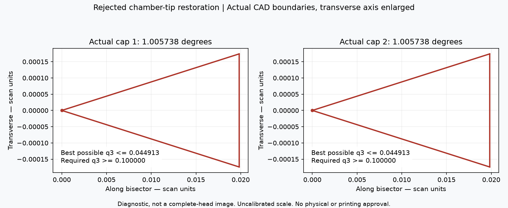

*Actual native edge samples, projected onto each cap's plane. Axis scales are
deliberately unequal and labelled; this is neither a full-head render nor a
thermal field. Image produced from the private 935-derived research candidate,
with unqualified physical scale and M64 interfaces. No source scan/CAD is
published. Original source: [Wolfe Classics, provenance and owner-confirmed
reuse rights](../../catalog/sources/src-wolfe-classics-935-billet-cylinder-head-scan.json);
the exact licence identifier is not yet archived.*

The next reconstruction must alter the **coupled chamber transition**, not
just exchange one acute tip for another; the spring-pocket/pad junction is a
separate upstream problem. Check the new corner geometry before paying for
another full volume solve. Preserve explicit boundaries, quantify added/removed
material and two-way deviation, and reject interference with assembly or
functional surfaces. No physical 0.040 mm, thermal gain, material qualification,
manufacturing release, paid rental, merge or website deployment is claimed.

Local verification: six bounded-cut/restoration tests, three fixed-face-quality
tests (including the native Gmsh witness) and thirteen constrained-patch tests
pass. The new stock-restoration fixture checks a known added volume, unchanged
inputs and rejection when the cap lies outside original stock. The angle test
checks unequal-side triangles and invalid inputs; its independent area formula
was corrected after the initial test exposed a factor-of-two error in the test.
Kali2's complete `make check` exits **0**: 3,230 main tests, 166 optional skips,
157.111 s for the main suite, followed by all remaining targets. CAD-dependent
tests are exercised in the qualified Mac runtime, not counted as executed in
the Linux skips. The first Linux attempt had one setup failure: the fresh
archive's Git index was empty, so a tracked-input test correctly rejected it.
Indexing the isolated archive fixes that setup; no production guard changes.
Final local report-index and strict link checks pass (573 Markdown files,
zero broken links). All construction/meshing jobs have ended.

Private artifacts are retained in `work/m64-private-20260907/source-face-trace-20261002.0PFo0cto`.
Fingerprints:

- Support-origin receipt: `b8618f5181477f2d3c760ff1dbf2e59730ea151c789820050243b27f1efe3d94`.
- Executed producer: `71b0681df90fe331b6eab66ff58a220f61f86d53b53c67bdd0204c56112461b4`.
- Candidate: `e2dcedb46094feb6bc7e990d396480384a74e7b6df05be1a48a6422f84e6def1`.
- Construction receipt: `97019f8117c527631b15bc33af710a8acb2add6054b4ba5f61df20c284fcf9cb`.
- BOP receipt: `2d83d01e62b2b276ee1e846cac1ce2074f082fd08c63f47f3b09c9d36d4f164c`.
- Completed surface receipt: `9bdd019c9fa44b5ee0b8b1925204a4e2237b7ac1f31b085eb6e08f2aca8953da`.
- Native cap-angle receipt: `e2382922c62a649836506b25bb38e72a9efbee42e7a74e1765b0e7a1b0ad4bb4`.
- Published diagnostic PNG: `9cef135e08189d69e34c59a614d4103662fda044b1cd385a8e6000c6f3c6d0bb`.
- Successful full-suite log: `f95c4e2cd6975e22c4687814f3b79bde004fd9f06dbbb6a5236b12ca3fd13d6a`.

```sh
python twins/m64-cylinder-head/source/wholebody/trial_bounded_tip_cut.py \
  --body /private/original.brep --face 141 143 --radius .02 \
  --chamber-tool /private/chamber-tool.brep --stock /private/four-seat-candidate.step \
  --output /private/fresh-restoration
python twins/m64-cylinder-head/source/wholebody/screen_tip_cut_surface.py \
  --candidate /private/fresh-restoration --output /private/fresh-screen \
  --minimum .00002 --cpu-seconds 540 --surface-algorithm 1
python -m unittest discover -s tests -p test_m64_fixed_face_quality.py -v
```

## 2 October: cache recovery and rejected-cell localisation

The earlier unknown-element diagnosis is now superseded by a reproducible
fixture, not by a rewrite of the failed receipts. A unit cube creates 391
tetrahedra; querying their qualities populates the element cache. Standard
optimisation replaces cells (386 remain, including 14 new tags), after which
quality lookup fails with `Unknown element 2242`. The regression test fails
before the shared optimiser helper calls
[`rebuildElementCache(False)`](https://gmsh.info/doc/texinfo/#gmsh_002fmodel_002fmesh_002frebuildElementCache),
and passes afterwards: all 386 qualities are finite. This repairs the lookup,
not the geometric quality. Both optimiser paths use the same helper.

The saved Linux raw checkpoint is reused only after its pinned hash and exact
boundary are checked; no surface regeneration occurs. Standard optimisation
then completes on Kali1 in **227.024 seconds**. Its 1,500,033 tetrahedra have
positive Jacobians, but **45,091 fail minSICN >= 0.1**, with minimum
0.00001168019. The exact boundary survives optimisation and MSH readback;
992,724 triangles match, both region checks find one region, and signed volume
and boundary flux agree within 1.2e-15 relative difference. Inputs are unchanged.
The library's warning of 229 ill-shaped cells is not this quality metric.
**The candidate is rejected.** No native crease or functional interface is
qualified by this faceted diagnostic.

The new [localiser](../../twins/m64-cylinder-head/source/wholebody/audit_faceted_volume_failures.py)
requires a completed, mesh-hash-bound diagnostic receipt, recomputes minSICN,
and checks the rejection count before rendering. Its exact-index contact
classification distinguishes a boundary vertex from an entire boundary face:

| Diagnostic | Total tetrahedra | Rejected | Touch a boundary vertex | Have a complete boundary face |
|---|---:|---:|---:|---:|
| Netgen | 1,519,320 | 16,261 | 16,250 | 9,982 |
| Standard, recovered | 1,500,033 | 45,091 | 45,091 | 34,787 |

Almost all rejected cells touch the boundary. This focuses the next local
surface/feature investigation; it does not prove that the six sharp native
curves explain every rejection. No anatomical role is inferred from the image.
The reference CAD and historical native volume with 32 rejections remain unchanged.

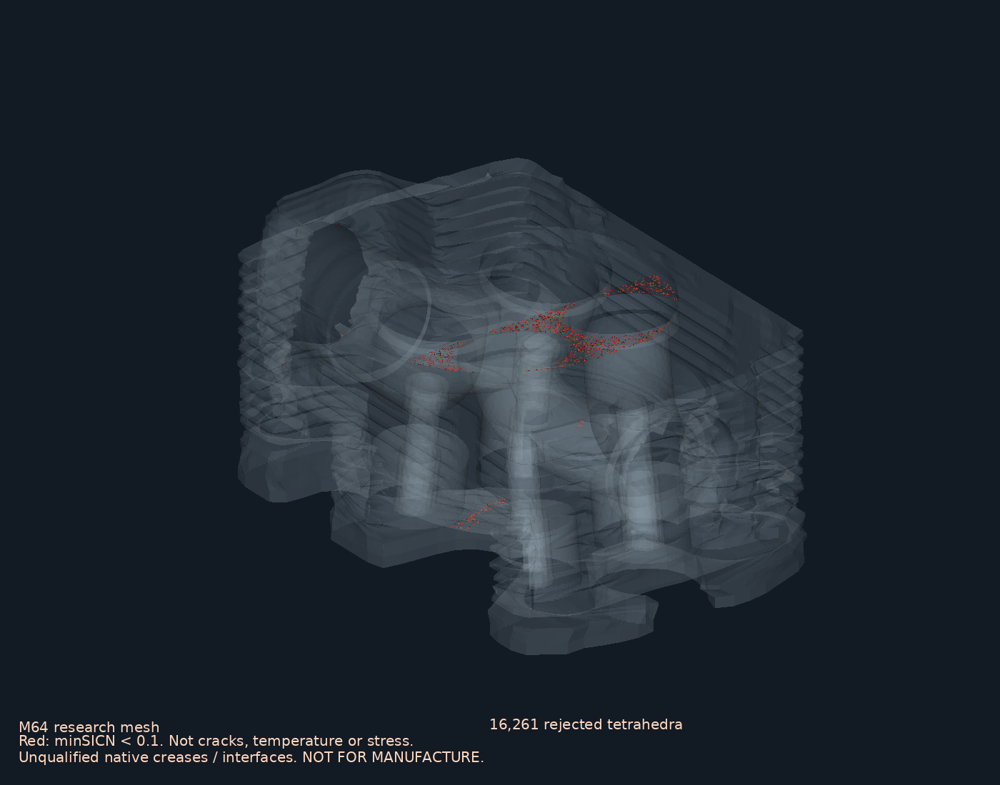

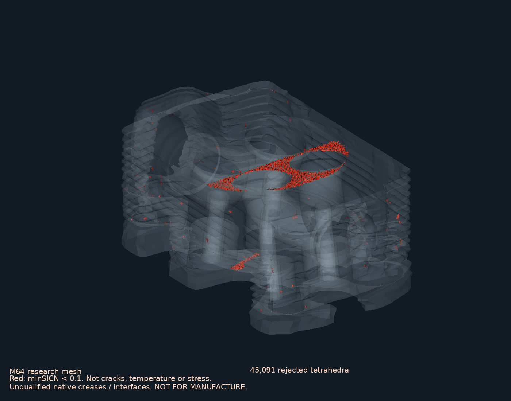

Red denotes numerical cell quality, **not cracks, heat or stress**. These VTK
renders use the full actual boundary and rejected cells, with no smoothing,
decimation or generative image. The [Wolfe Classics provenance record](../../catalog/sources/src-wolfe-classics-935-billet-cylinder-head-scan.json)
records owner-confirmed reuse rights, with the exact licence identifier not
archived. These research views fulfil the owner's documentation request;
no raw scan or mesh is published.

Verification: Mac discovers seven focused tests, six pass and the optional
CGAL test is skipped. Kali2's CGAL sidecar passes four tests and skips three
requiring Gmsh 4.15.2. The final frozen-code Kali2 `make check` exits **0**:
**3,227 main tests, 164 optional skips**, followed by all remaining targets,
including 15 pinned Docker tests. Native Gmsh tests run separately on Mac;
optional-runtime skips are not counted as numerical qualification.

Private receipt/source SHA-256 fingerprints:

- Pinned Linux raw checkpoint: `742d8a3610b2abe766e9c4b476b1110ad69cdb72ecdee718ab1d2d18be55aeb5`.
- Recovered receipt: `87365319db453656d2e9e21bf4e9b724c59b22af94347fcfa8fcd631e26e0b6e`.
- Recovered audited mesh: `4939f8aabeb34d12b2a2f5d62e8048c4ff559636662aa76589de06f480406a1f`.
- Producer: `ccf6142edf8b67c4a7cfcae73b67084b72d6c1b59782cbb67e25e6f846616318`.
- Localiser: `7407d3ab8d84d7b71a789a5043bd867df246e74fb8d87a065dab4de6ffe1f6cb`.
- Netgen location receipt: `1a969866019a95b23e94d80b32a4b945da189a7438ac811efb10e13877256204`.
- Standard location receipt: `cca34893ec276d71f952e286fec118a5404ba9b084c2822aec916510b8f2687f`.
- Netgen PNG: `37c1f49b2446f9cac2c1eecd27a72189334ca10d1d9ae9f811ce16e30683d9d7`.
- Standard PNG: `f4ae1e60ad0dcffa4599ca0db297deeb85f12f16552a356959375163e52b42d3`.
- Full-suite log: `25514df3687b4fb2f46d7fdfb63ef5a5811d290ea9aacf6b4fbf96029898738a`.

Reproduction, with the same qualified runtime and private inputs as above:

```sh
python twins/m64-cylinder-head/source/wholebody/trial_audited_discrete_volume.py \
  --arrays /private/connected-oriented-audit/surface-private.npz \
  --topology /private/connected-oriented-audit/report.json \
  --intersections /private/cgal-connected.json --no-extend-size --optimizer default \
  --raw-checkpoint /private/linux-raw-private.msh --output /private/fresh-recovery
python twins/m64-cylinder-head/source/wholebody/audit_faceted_volume_failures.py \
  --mesh /private/fresh-recovery/audited-private.msh \
  --receipt /private/fresh-recovery/report.json --output /private/fresh-location
```

All these jobs have ended. No Vast rental, physical simulation, catalogue
release, PR merge or website deployment occurs. The owner's fin-study comparison
remains a separately documented research plan; no head perforation or thermal
gain has been accepted. Zero rejected elements and printability remain unmet.

## 2 October: native tip truncation is not a junction reconstruction

The previous turn changed authoritative software and diagnostic evidence,
not the accepted CAD. This continuation tests a native design alternative
against the observed acute junctions; it does not rerun volume optimisation
on the same rejected skin.

First, the previous support-unification rejection is reproduced. Six protected
faces (1415, 1651, 1653, 1655, 1929, 1930) change their serialised curve/surface
representations after unification, but not after the preceding non-destructive
cut. The differences remain with triangulations excluded. For example, an
additional p-curve and support-surface representation are stored on an edge.
This is **not proof of physical movement**, nor a reason to discard the exact
protected-data guard. The [OCCT safe-input API contract](https://occt3d.com/dev/doc/refman/html/class_shape_upgrade___unify_same_domain.html)
does not override this observed result in installed OCP 7.9.3.1. The original
file remains unchanged; that failed fusion is not promoted.

The existing [bounded tip-cut experiment](../../twins/m64-cylinder-head/source/wholebody/trial_bounded_tip_cut.py)
now has an explicit `--planar` alternative, leaving the historical ball route
as the default. It identifies one native vertex by position, then selects
incident edges by topological identity, not proximity alone. A least-squares
direction attempts equal projections on the outgoing unit tangents; every
projection must be positive with the documented numerical margin. The plane
depth is half the radius times the minimum projection. A finite oriented box
bounds the trial. Boolean history then excludes descendants of original faces
and requires exactly **one** newly exposed face on the intended cut plane;
exposed side walls, multiple new faces, or unresolved directions fail closed.
The original locality, validity, tolerance, export and physical gates remain.

The regression witness truncates a unit-box corner with one planar cap:
seven faces, one valid solid, unchanged source and removed volume
`0.01^3 / 6` for radius 0.020. A concave-corner control is rejected rather than
turned into a bounded notch, and its input remains unchanged. Invalid radius,
nonfinite position and a non-vertex position are also rejected. This witness
verifies the construction guard; it is not evidence that the head is convex
at the diagnosed points.

| Final topology-bound head trial | Outcome | Time |
|---|---|---:|
| Lower faces 141/143, two diagnosed tips, radius 0.020 scan unit | First attempted cut exposes **five** new faces, not one cap; reject | 46.704 s |
| Upper face 1648, two diagnosed tips, same radius | First tip has no admitted strictly forward direction; reject before Boolean cutting | 5.668 s |

Neither run reaches an exported candidate or a surface/volume mesh; neither
tests all tips after its first rejection. Both preserve input hashes. A
separate floating-point tangent-cone probe finds opposed tangent pairs at the
two upper tips; it is a diagnostic on sampled native derivatives, not a global
proof that every possible junction reconstruction fails. The initial
sum-of-tangents heuristic was rejected on both patches; it is not retained as
the plane-selection method.

**Next construction constraint:** replace/retrim the coupled endpoint region
on its supporting surfaces, with explicit shared curves, rather than clipping
an isolated convex vertex or fitting one smooth surface across sharp folds.
Retain the measured sharp boundaries outside that region and recheck protected
geometry, native validity/BOP, two-direction deviation, topology and mesh
quality. A larger editing neighbourhood still needs a justified design bound;
the failed local trials do not authorise arbitrary removal or interface changes.
The physical source-scale and M64 interface gates also remain unresolved.

Verification in the qualified Mac runtime: five bounded-cut tests and thirteen
constrained-patch tests pass; six topology tests pass with one optional CGAL
skip. Frozen-code Kali2 `make check` exits **0**: 3,228 main tests, 165 optional
skips, 159.373 seconds for the main suite, followed by all remaining targets.
The new CAD fixture is among the Linux optional skips and runs on Mac instead.
Local report-index and strict link checks also pass after the documentation
update (zero broken links in 573 Markdown files).
No mesh-quality, deviation or locality acceptance threshold is relaxed;
no paid instance, master replacement, material
selection, thermal result, printing release, PR merge or deployment is claimed.

Fingerprints (private data remain outside Git):

- Final producer: `bad5c2c4d2fc381ed9fa9f6e8978fbf9c87c641992213da9b6394369723d9f75`.
- Lower receipt: `6a7fc327834e5325be3517668dc6d4ba27ac4dd9b1746624cabc0a3839861877`.
- Upper receipt: `bbeb278d944f6bae2d514bd5daad1f38060a6ed111e601b2bdcb4ddd12af2b59`.
- Unification diagnostic: `5513da2b6635709ecbad617b52852e0789cf5d9ce94009c11e057bf6aa05d107`.
- Tangent-cone diagnostic: `25b9f0f29b7fb98a43731fac1177072f723ead9b0e206d8b1ccf2514e20a22ac`.
- Full-suite log: `2a97c0ca2009217e77aad6d5cea40e83ead682342cbb3bde58bb0443ed0ac008`.

```sh
python twins/m64-cylinder-head/source/wholebody/trial_bounded_tip_cut.py \
  --body /private/original.brep --face 141 143 --radius .02 --planar \
  --output /private/fresh-lower-cap
python twins/m64-cylinder-head/source/wholebody/trial_bounded_tip_cut.py \
  --body /private/original.brep --face 1648 --radius .02 --planar \
  --output /private/fresh-upper-cap
python -m unittest discover -s tests -p test_m64_bounded_chamfer.py -v
```
