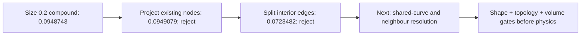

# M64 — endpoint reconstruction and local mesh sizing, 29 September 2026

## Retained engineering state

Continuation of the [local reconstruction trials](M64_LOCAL_RECONSTRUCTION_20260928.md).
The retained volume result is **32 tetrahedra below minSICN 0.1 / 1,341,461**.
The reference CAD has not been replaced. This remains a 935 scan-derived
research body, not a metrologically qualified M64 head. All geometric lengths
below are provisional scan units, not certified millimetres or a printer
specification. No physical, material or manufacturing gate is closed.

**Latest experiment, 1 October:** local conforming surface subdivision reduces
the maximum sampled shape error from **0.0948743 to 0.0723482 scan unit**, with
zero incompatible surface triangles. It still fails the 0.040-unit screen;
the CAD master and retained volume are unchanged. Details and rejected controls
are recorded below.

**Later recovery, 1 October:** both authorised Linux hosts are reachable again.
The previously uncollected size-0.1 run completed but has **5 incompatible
triangles / 976,144**; the curvature-64 run ended at its 1,800-second alarm.
Neither result replaces the retained geometry. See the recovery record below.


The requested close-up is rendered from the exact retained mesh, without
smoothing, decimation, invented internal channels or generative imaging.
Left and centre: opposite lateral openings. Right: four visible recesses,
with separate valves absent. These openings are not the 32 rejected volume
elements. The displayed facets and irregularities have not been cosmetically
removed. Geometric views alone do not establish their functional qualification.
The [source licence and provenance](../../catalog/sources/src-wolfe-classics-935-billet-cylinder-head-scan.json)
remain attached; the image is research documentation, not a released product.

## Fix the construction contract before adding compute

The previous filling helper supplied exterior edges in map order. A new
regression test demonstrates that consecutive edges did not form the continuous
oriented wire required by the [OCCT filling API](https://occt3d.com/dev/doc/refman/html/class_b_rep_offset_a_p_i___make_filling.html).
The test failed before the correction and passes afterwards.

The corrected shared helper traverses exact topological vertices, requires
degree two and one closed loop, or rejects the input. It uses no coordinate
welding, relaxed tolerance or deleted edge. The boundary is copied together
so its shared vertices survive; original constraints remain untouched. The
real lower and upper patches have respectively 18 and 13 ordered edges.
A disconnected two-loop witness is now rejected.

This is a real software-contract fix, **not the cause of the head's entire
reconstruction failure**: four repeats still fail with the same native results.
An additional initialization uses the original plane (142 below, 1412 above).
Only a plane is admitted, ensuring orthogonal local coordinates as required by
the same API; this is an initial surface, not permission to flatten the part.

| Trial | Maximum reported G0 error | Decision |
|---|---:|---|
| Lower, ordered boundary only | 0.1981524648 | Invalid patch; reject |
| Lower, ordered boundary + 33 interior constraints | 0.0710922485 | Invalid patch; reject |
| Upper, ordered boundary only / interior constraints | No completed patch | Both rejected |
| Lower, native plane initialization, boundary only | 0.1552171844 | Invalid patch; reject |
| Lower, native plane initialization + 33 interior constraints | 0.0206819153 | Invalid patch; reject |
| Upper, native plane initialization, both settings | Native `Standard_Failure` | Both rejected |

The lower error reduction does not meet the unchanged **1e-7 boundary
construction guard**. It is not a 0.020 or 0.040 engineering result. No patch
above reaches sewing, volume meshing or thermal testing. All eight execution
receipts finish without a timeout and preserve their input file hashes.

## Meshing experiments

The previous finer-curvature run ended at its 540-second alarm. A fresh Linux
run keeps the same geometric recipe (curvature 64, junction size 0.020,
compound factor 1, reclassification 1) with an explicit 1,800-second wall limit.
This is a new calculation, not a checkpoint resume. An initial packaging
attempt failed at import because a helper dependency was missing; it produced
no mesh. The retry includes the tracked Python dependency tree.

Two other runs use the documented [Gmsh restricted sizing field](https://gmsh.info/doc/texinfo/#Gmsh-mesh-size-fields)
on the eight original compound faces and their boundaries: size 0.2 or 0.1,
curvature 12, factor 1. This differs from refining only within a narrow distance
of six internal curves. Geometry, minSICN thresholds and admissibility checks
are unchanged. A two-square numerical witness checks that the selected square
is refined while a separate control is not, and checks actual triangle edge
lengths; API option assignment alone is not counted as a test.

The size-0.2 Linux run completes in **490.37 s**: **587,912 triangles**, zero
incompatible triangles, minimum q2 **0.07085403530**, no duplicate triangles
and no edges without incidence two. This is not a complete manifold or
intersection check. The unchanged bidirectional shape audit rejects it:

| Patch | Mesh to native, sampled maximum | Native to mesh, sampled maximum |
|---|---:|---:|
| Lower | 0.06544985810 (319,421 samples) | 0.08310593681 (1,781 samples) |
| Upper | 0.06037308328 (25,787 samples) | 0.09487428993 (1,987 samples) |

The largest observed error exceeds the exploratory **0.040 scan-unit** screen.
This is neither a certified Hausdorff bound nor physical millimetres. No
volume is generated from this rejected approximation.

Initially on 1 October the two remaining Linux outcomes (size 0.1 and curvature
64) could not be collected: the known SSH host returned `No route to host`.
They were recorded as **uncollected**, without assuming completion or continued
execution. The later recovery below supersedes that collection status.

## Reproduction

Use the existing isolated OCP 7.9.3.1 / Gmsh 4.15.2 environment and private
inputs; the compound jobs use the existing authorized Linux host.

```sh
python twins/m64-cylinder-head/source/wholebody/trial_constrained_patch.py \
  --body /private/original.brep --patch lower --grid 5 --initial-plane \
  --output /private/fresh-plane-trial
python twins/m64-cylinder-head/source/wholebody/trial_compound_junction_mesh.py \
  --body /private/original.brep --classify 1 --factor 1 --patch-size .2 \
  --curvature 12 --wall-seconds 1800 --output /private/fresh-patch-mesh
python twins/m64-cylinder-head/source/wholebody/trial_project_compound_surface.py \
  --body /private/original.brep --mesh /private/fresh-patch-mesh/surface-private.msh \
  --receipt /private/fresh-patch-mesh/report.json --split-interior-edges \
  --output /private/fresh-refinement
python twins/m64-cylinder-head/source/wholebody/audit_compound_shape.py \
  --body /private/original.brep --mesh /private/fresh-refinement/surface-private.msh \
  --receipt /private/fresh-refinement/report.json --wall-seconds 1200 \
  --output /private/fresh-refinement-shape.json
python -m unittest discover -s tests -p test_m64_constrained_patch.py -v
make check
```

Original/rejected private geometry and historical receipts are not overwritten.
Producer snapshots preserve revisions used before subsequent code changes.
No new paid instance is rented, no catalogue release is edited, and no site is
deployed by this continuation.

The six focused numerical tests pass without skips in the qualified runtime.
The initial repository check passes its **3,206-test main suite (161 optional
skips)** but stops at the report-index check because this new report was added
during execution. After regenerating the index, the final 29 September
`make check` completes with exit **0** in **232.87 s**.

## 1 October: correct the approximation without moving the master

The Mac runs a fresh bounded size-0.1 experiment. It is not a recovered Linux
result. One initial local attempt is explicitly stopped after 143.07 s (exit
-15) because a source helper was edited during execution. It is not accepted
as evidence. The replacement uses a separate frozen copy of the producer.

The [local projection trial](../../twins/m64-cylinder-head/source/wholebody/trial_project_compound_surface.py)
loads the completed size-0.2 surface and its hash-bound face correspondence.
For each of the two compounds, it selects only nodes unused by every other
surface. Those interior nodes are projected to the closest point of the
original **trimmed** CAD patch. Shared boundaries and every other node stay
exactly fixed. No native surface, mesh connectivity, element count, threshold
or original file is modified. Each displacement must remain at most 0.1
provisional scan unit; this is a bounded experimental guard, not an approved
design tolerance. No smoothing, welding or triangle deletion is used.

The first complete projection takes **53.82 s**:

| Patch | Projected interior nodes | Maximum displacement in scan units |
|---|---:|---:|
| Lower | 51,761 | 0.000124994187 |
| Upper | 3,968 | 0.000355636954 |

All **587,912 triangles** remain, with zero below the necessary q2 limit and
the same minimum **0.07085403530**. No triangle has a nonpositive old/new normal
dot product. Protected node coordinates, native in-memory geometry, source
hashes and binary mesh readback pass their exact checks. These are necessary
checks only: vertex links, self-intersections and physical face roles remain
unqualified. No full-volume or physics run is authorised by this result.

The separate bidirectional audit **rejects** this projection-only surface:

| Patch | Mesh to native, sampled maximum | Native to mesh, sampled maximum |
|---|---:|---:|
| Lower | 0.06544737408 | 0.08308649403 |
| Upper | 0.06037322241 | 0.09490790456 |

The native-side maxima occur on source faces **141** and **1411**. Moving
existing nodes leaves the excessive error essentially intact. This supports
the diagnosis of facets bridging the local shape between nodes, rather than
material drift or a physically measured displacement. The original and
projection-only audits complete in 157.05 and 143.44 s respectively, with
unchanged bound inputs. Their native sample sets and mesh connectivity match;
the mesh-side sample coordinates change with projection. Neither passes the
unchanged 0.040-unit screen.

A second bounded option splits **interior** patch edges once and projects
their new midpoints onto the same trimmed native patches. Exterior edges
remain unsplit and fixed. Conforming 1/2/3-edge subdivision patterns avoid
T-junctions without moving neighbouring surfaces or dropping a region. This
is surface-discretisation repair, **not a new editable B-Rep**. The full
exported surface remains capped at two million triangles.

It completes in **61.50 s** and produces **927,696 triangles**, still zero
below the necessary q2 limit and minimum **0.07085403530**. Lower/upper patches
grow to **420,725 / 33,224 triangles**, adding **157,495 / 12,397 nodes**.
There are no flipped normal-dot checks, duplicate triangles or edges without
incidence two; binary readback is exact and bound inputs remain unchanged.
The denser bidirectional shape audit completes in **127.27 s**:

| Refined patch | Mesh to native, sampled maximum | Native to mesh, sampled maximum |
|---|---:|---:|
| Lower | 0.04556742862 (1,264,391 samples) | 0.06168744117 (1,781 samples) |
| Upper | 0.05012542051 (100,169 samples) | 0.07234822226 (1,987 samples) |

The largest recorded deviation decreases from **0.0948743 to 0.0723482 scan
unit**, about **23.7%**. Native sample locations are unchanged; mesh-side
sampling is denser, so its sets are not identical. The exploratory
0.040-unit screen still **fails**. The original retained volume remains
**32 rejected tetrahedra**, and no volume is generated from this candidate.

The new worst native-side witnesses lie on faces **142** and **1411**. The
upper witness's nearest triangle includes an **unsplit compound-exterior
edge**, length 0.1961929 scan unit (patch edge incidence one); its other two
edges have incidence two. All three edges of the lower witness triangle
have incidence two. This identifies a boundary-resolution limitation for
the next experiment; it does not prove that one edge is the unique cause.
Further work must cover the shared curve and its neighbouring surface
conformingly, not repeatedly refine the interior while silently moving a
fixed interface. Native CAD, functional-face roles, vertex-link topology,
self-intersections and physical tests remain separate gates.



These labels are sampled scan-unit deviations, not millimetres or certification.

The fresh Mac size-0.1 run is stopped after **989.32 s**, exit **-15**, when
available disk space drops to approximately **120 MiB**. It has no completed
mesh or quality result. No unrelated files or processes are removed. The
first 1 October `make check` exits **2** after **283.69 s** with actual
`OSError: [Errno 28] No space left on device` failures in temporary-file
creation. This environmental failure is not hidden by the passing targeted
tests; repository-wide success still needs a completed retry.

The shape auditor now retains the actual worst sampled point and its closest
counterpart in the **private** receipt, including the native source-face
index in the native-to-mesh direction. This supports locating a defect instead
of only quoting one maximum. It retains the original sampling density and
0.040-unit screen. It also binds its helper hashes and writes an explicitly
incomplete progress receipt. A first 300-second local audit reaches its child
alarm (exit -14); a frozen retry uses a 1,200-second bound. The native target
is loaded once into the closest-point solver for each batch; the distances
are still native closest-point calculations, not an AI surrogate.

Eight focused tests pass in the actual OCP/Gmsh/VTK runtime. They include a
trimmed-plane projection witness with fixed boundary, unchanged input,
oversized-shift rejection, and a triangle-interior closest-point witness.
Subdivision witnesses cover all four split patterns, positive orientation,
area conservation, exact exterior edges and non-manifold-edge rejection.

The final 1 October retry passes the **3,208-test main suite (163 optional
skips)** and the subsequent Python checks, then stops because the Docker daemon
socket is unavailable at the pinned F37 LPBF audit target. Thus the **whole
`make check` is not green**, despite the passing main suite and eight separate
CAD-runtime checks. Strict documentation validation reports **zero broken links
across 573 Markdown files**; diff whitespace checks pass. No new Vast spending,
automatic Docker restart, main-branch merge, catalogue release or site deployment
is performed. All local numerical workers from this continuation have ended
or been explicitly stopped; Linux outcomes were still unknown at that checkpoint.

## 1 October: Linux result recovery after network restoration

Both authorised x86_64 hosts now answer authenticated SSH. Kali1 is reached
through Wi-Fi, checked against its existing trusted host key; host-key checking
is not disabled and no trusted key is replaced. Each host reports 12 logical
CPUs and about 15 GiB RAM, not a large-memory GPU workstation. Kali1 has about
379 GiB free disk and Kali2 about 302 GiB at collection time.

The nine existing result, baseline and log files are copied into fresh private
storage. All nine local SHA-256 values match their remote originals. These are
recovered 29 September calculations, **not new 1 October simulation runs**.

| Recovered trial | Execution | Result and decision |
|---|---|---|
| Patch size 0.1, curvature 12 | Exit 0; 1,760.64 s | 976,144 triangles; 5 incompatible; minimum q2 0.035495665. Reject. |
| Curvature 64, junction 0.020 | Exit -14; 1,800.19 s | Child SIGALRM; incomplete receipt; no final mesh. Reject. |

The second launcher receipt says `timed_out: false`: its outer timeout did not
fire, but the child reached its own alarm. This is not a completed calculation.
The first receipt binds the unchanged original CAD and copied surface hash;
it reports no duplicates and no edges without incidence two. Vertex-link and
self-intersection checks remain absent. No shape-screen pass or new volume
result is inferred. The retained volume remains **32 rejected tetrahedra**.

Recovered report hashes are
`b4b626537e3ca0f04c4a3cc12be3b6e2036f21d7141f030f2d7df1061ee9c136`
(size 0.1) and
`1879938033a74fcc33a8b6e2bce0df8317517e1ea0945fbe8719ec9b3c8f8957`
(incomplete curvature 64). The size-0.1 surface hash is
`77c2f3641ea63a7bb740877f33883a72fe6bd96c349e35d6a39586eaa8e1f91c`.
Raw geometry and coordinate-bearing receipts stay private. The next geometric
experiment still needs conforming shared-curve and neighbouring-face correction;
repeating the global size-0.1 recipe is not justified by this rejected result.
No new calculation, rental, manufacturing release or master replacement is
claimed by this recovery.
