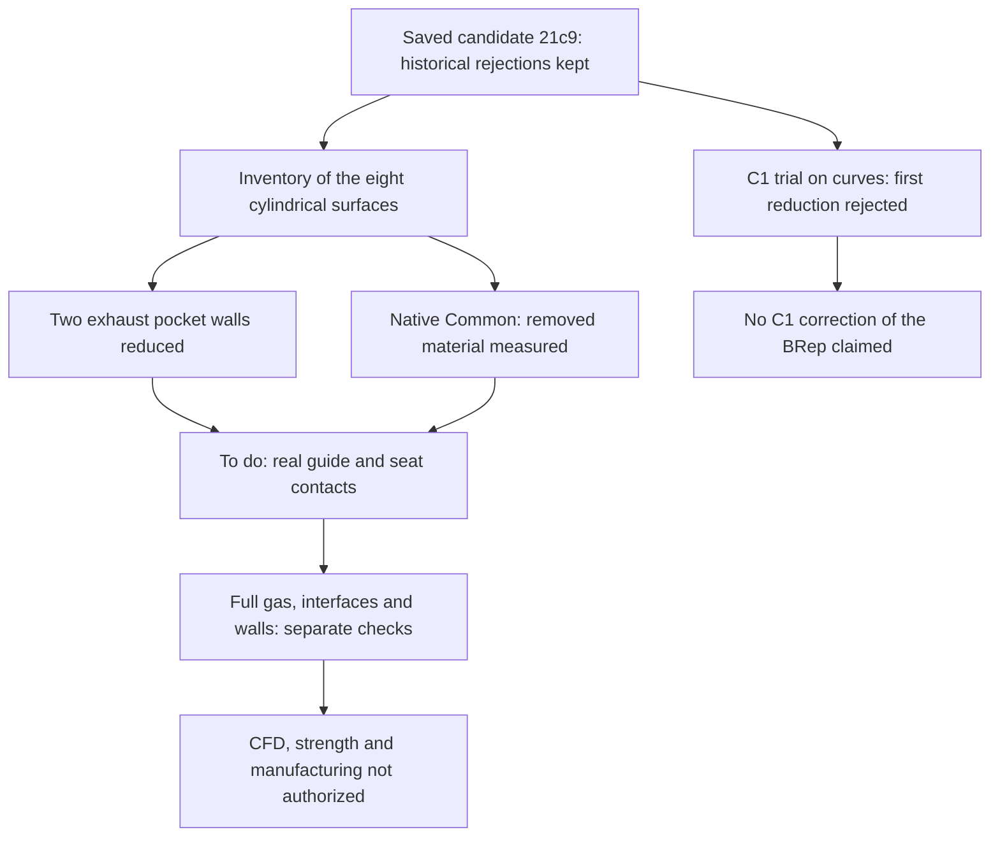

# M64 — removed material and exhaust pocket walls

The native diagnostic measured the removed material, without any new cut of
the cylinder head. Above all, it finds **a reduction of the cylindrical
surfaces associated with the two exhaust guide pockets**. This change calls
for a check of the contacts with the real guides; on its own, it proves
neither a loss of retention nor sufficient holding.

The saved candidate `21c9c40b…` remains unchanged. The rejections and the two
C0 alerts of the [previous audit](M64_EXHAUST_NATIVE_AUDIT_20260908.md) are
kept. These two new steps are linked in a
[separate capsule](../../twins/m64-cylinder-head/evidence/exhaust-material-controls-20260908.json);
they rewrite no earlier receipt and authorize neither CFD nor manufacturing.

## The pockets: measured change, real contact still to be checked

Eight cylindrical surfaces are associated with the four seats and four guides,
before and after the saved cut. The recorded axes are already in the final
frame; no additional transformation is applied to the bodies or the axes. The
full surfaces are measured, **not only their part in contact with the insert**.

| Surface associated with the guide | Area before → after, scan units² | Area lost | Axial extent of the box before → after, scan units |
|---|---:|---:|---:|
| Exhaust 1 | 2,549.528606 → 1,673.989540 | 875.539066 | 74.549353 → 51.012425 |
| Exhaust 2 | 2,272.879397 → 1,397.089473 | 875.789924 | 74.549353 → 51.003675 |

The angular extent of each box remains `6.28318530718 rad` before/after.
**A box covering about 2π does not prove a continuous contact surface over
360°**: it can enclose a trimmed face. Likewise, the axial extents above are
not the actually inserted lengths of the guides, whose nominal V2 length is
35 units under the existing scale assumption. No retention engagement is
computed by this new inventory.

The areas of the four seat surfaces and of the two intake guide surfaces do
not change in this computation. The full serialized digests of the eight faces
nevertheless differ before/after: **neither face identity inferred from the
areas, nor deformation inferred from a different digest**. The historical
intake engagement of 23/35 is neither improved nor requalified by this
observation.

## Removed material: a separate Common, not a new cut

The computation performs only the intersection `Common(body before, exhaust
tool)`, in non-destructive mode, with zero fuzzy value. The body before
`33375e12…`, the tool `9e1ab8b3…` and the saved candidate `21c9c40b…` are read
without STEP, re-registration, repair or requested tolerance change.

The material obtained is one solid, one shell, 258 faces, 563 edges and 308
vertices. Exact BRepCheck is valid before and after its native rereading. Its
volume is **89,589.078029635 scan units³**; the private BRep is bound to the
digest `08b32607…`. The volume of the body before is 1,244,303.585578462 and
that of the saved candidate 1,154,714.507690458 scan units³.

The same adaptive integration call is used with a setpoint `Eps=1e−9`. The
**returned** relative estimates, which are not certified bounds, are about
`3.15807e−8` for the body before, `3.04024e−8` for the candidate and
`1.05805e−9` for the removed material. They do not allow claiming a
convergence reached at `1e−9`.

The residual `Vbefore − Vcandidate − VCommon` is `−0.000141630750` scan unit³,
that is `1.13823e−10` of the initial volume. This is an observation of
numerical consistency, **not an independent error bound nor a proof of
geometric equivalence of the difference**. The earlier full BOP is not rerun.

On the rereading of the new Common alone, 89 vertex tolerances change exactly
as `float(format(before, '.15g'))`, with a maximum gap of
`4.235164736271502e−21` scan unit. The edge and face tolerances are
bit-for-bit identical. This separate observation replaces neither the
historical rejected guard of `21c9`, nor a full proof of geometric
preservation.

## C1 curve trial: method rejected, no corrected BRep

A separate attempt at synchronized reparameterization and multiplicity
reduction is actually executed on copies of curves, with the native budget
`5e−6` unchanged. OCP rejects the first multiplicity reduction of the 3D curve
of edge 1603, at the call tolerance `2.0000000000000004e−7`. The trial stops
immediately: **the 3D curve 1606 and the four p-curves are not tested**. No
surface and no BRep is written or modified.

This result rejects this bounded method; it is neither a general
impossibility of CAD construction nor evidence of a crack. The two C0 alerts
remain localized and uncorrected. A first local attempt, stopped before OCP
because the macOS memory limit could not be set, remains a separate runtime
failure, not an additional geometric rejection.

## Limits, execution and next steps

Functional checks 6–12 do not pass: 7–8 only have an inventory of pocket
surfaces; continuity of the full gas, real contacts of the inserts, separation
of the ports, authorized openings, protected bands and final thicknesses
remain to be checked. The next useful work is measuring the real contacts of
the exhaust guides on `21c9`, with their axial and angular extents, then the
throat–chamber communications.

The C1 trial ends with native/wrapper code 2 in 0.521 s / 0.921 s including
cleanup. The material diagnostic ends with code 0 in 10.585 s / 11.058 s. This
code 0 means the diagnostic ran, not that the part is validated. The 15 C1
preparation tests and the 14 tests of the material check pass; they do not
constitute a physical qualification.

Both runs use the existing OCP 7.9.3.1 image, without network, with read-only
inputs/sources: C1 capped at 60 s, 2 CPUs, 2 GiB memory+swap total; Common at
300 s, 2 CPUs, 4 GiB memory+swap total. No OOM and no timeout. The exact
containers are deleted, their absence verified independently. The limits are
established by the frozen commands; no live HostConfig capture of these short
runs is claimed.

Files, input shapes and tolerances remain unchanged. Geometry, coordinates,
axes, absolute bounds and CAD files remain private. The measurements use scan
units; neither the absolute scale nor the M64 interfaces are certified.
