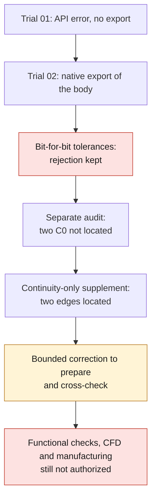

# M64 — native exhaust passage: candidate kept, not validated

**Historical checkpoint kept.** The [separate check of material and
pockets](M64_EXHAUST_MATERIAL_CONTROLS_20260908.md) has since run the
`Common` on the saved inputs; it requalifies neither this cut,
nor the guide contacts, nor the two C0 edges.

The body with intake and exhaust was exported, but **remains rejected**:
the bit-for-bit check of tolerances after serialization fails and an independent
BOP audit reports two `BOPAlgo_GeomAbs_C0`, since **located but
not corrected** by a later check limited to continuity.
No waiver, functional qualification or manufacturing authorization
is granted. The [evidence capsule](../../twins/m64-cylinder-head/evidence/exhaust-native-audit-20260908.json)
links the three initial steps and this supplement to the private receipts, without
publishing the geometry.

## Three initial steps and a separate supplement

| Step actually run | Observation | Decision kept |
|---|---|---|
| Trial 01 | API call `HasErrors` unavailable on the `BRepAlgoAPI_Cut` object; stop before export | Program error, not evidence that the part is invalid |
| Trial 02 | Native export `21c9c40b…`, one solid, one shell, 4,900 faces; exact BRepCheck valid before/after reread | Rejection `rejected_native_tolerance_integrity` |
| Independent audit | Reread of the same export, five BOP modes enabled together; two C0 reports | Rejection maintained, impact not qualified |
| Later localization | Continuity only; the two edges and three internal knots are identified | Located, not corrected; no rejection lifted |

Trial 01 ends with worker code 1 and container code 2, in
7.514 s supervised wall time. Trial 02 ends with code 2 in 12.569 s.
Its native computation takes 11.554 s; its container interval is
11:20:12.499–11:20:24.905 UTC, on 8 September 2026.

The input body `33375e12…` and the exhaust tool `9e1ab8b3…` are
pinned. No additional frame change is applied, no
STEP is used and the originals remain intact. The earlier rejection
relating to guide retention is not erased by this new cut.
The reference still comes from the 935 scan; `1 unit = 1 mm` remains an assumption,
not a certified scale nor a certified M64 interface compatibility.

## What the serialization diagnosis demonstrates — and does not demonstrate

The recorded lists show 89 differences among 5,176 vertex
tolerances. The maximum absolute deviation is `4.235164736271502e−21` scan unit.
The 10,075 edge tolerances and the 4,900 face tolerances are identical;
the extrema and the input tolerances are unchanged. The adaptive volume
computed before and after reread is equal, without constituting global evidence
of geometric identity.

On these ordered lists, `float(format(before, '.15g')) == reread`
reproduces exactly the 5,176 values, including the 89 that differ. The controls
at 16 and 17 digits reproduce none of the 89 differences. This arithmetic
receipt alone did not verify the serialization code and establishes
**no independent geometric correspondence of all vertices**.

The later primary reading of OCCT 7.9.3 shows that
[`TopTools_ShapeSet::Write`](https://github.com/Open-Cascade-SAS/OCCT/blob/V7_9_3/src/TopTools/TopTools_ShapeSet.cxx#L427-L515)
sets the precision to 15 digits, calls the geometry writer then
restores the precision. The
[vertex routine](https://github.com/Open-Cascade-SAS/OCCT/blob/V7_9_3/src/BRepTools/BRepTools_ShapeSet.cxx#L497-L508)
writes their tolerance into this stream. This is consistent with the observed rounding,
not a measured mechanical deformation nor complete evidence of invariance.
The historical rejection stands, with no general waiver and no derived
manufacturing tolerance; the two C0 remain a separate obstacle.

## Separate BOP audit, read-only

The independent receipt `09dfd5e6…` is bound to the saved candidate. Exact
BRepCheck is valid; BOP reports `HasFaulty=true`, `HasErrors=false` and
`HasWarnings=false`, with **two `BOPAlgo_GeomAbs_C0` in total**.
The modes `SelfInterMode`, `SmallEdgeMode`, `RebuildFaceMode`,
`ContinuityMode` and `CurveOnSurfaceMode` are enabled in this same audit,
with zero fuzzy, without stopping at the first defect.

This check takes 174.308 s for BOP, 177.111 s at wrapper level, and
returns 2. Tolerances and all inputs remain unchanged; no
B-Rep/STEP is written or repaired. The two reports are **not demonstrated physical
cracks**. In this snapshot, their entities are not
located and their functional impact is not qualified. This receipt remains
unchanged; the supplement below turns no rejection into a success.

## Supplement: native localization, without correction

Receipt `18dba811…` concerns exactly the same candidate `21c9c40b…`. Only
`ContinuityMode` is enabled; the other eight modes are explicitly
disabled. This check repeats neither the full BOP, nor BRepCheck, nor a
cut. The input body and the tool alone each give zero continuity
alerts; the candidate keeps exactly the two expected alerts.

The reported sub-shapes are native edges **1603 and 1606 of this
exact candidate**. Each is incident to face 678, whose complete global
B-spline support matches that of face 1 of the exhaust
tool. Their other incident faces are 881 and 884 respectively,
whose supports match faces 4408 and 4194 of the body before the cut.
These associations use native adjacency and the complete binary64
representations of the supports: degrees, poles, weights, knots, multiplicities and
periodicity. They do not rely on reused old IDs and do not prove
the identity of the trimmed faces.

At the **three internal knots examined**, the one-sided native evaluations
each give a numerical position jump of zero. The angles between tangents
are respectively **0.03993974°, 0.01033415° and 0.25917866°**. These point
observations prove neither the global absence of gap or geometric defect,
nor continuity of derivatives, nor mechanical integrity. The complete supports
of the two curves have no identical representation found in the
inputs; an absence of correspondence does not demonstrate new geometry.

The localization ends with code 0 in **1.043 s** for the reader and
**1.477 s** for the wrapper, cleanup included. Local and remote inputs,
sources and digests of the native tolerances remain unchanged. Fifteen tests
without OCP pass, including rejection of a different alert count, an empty
result, a missing shape or a native warning. Their success does not amount
to CAD qualification. No geometry is written or repaired; the
coordinates, cut parameters and poles remain private.

## What is still missing

The `Common` of the material actually removed and the producer's final BOP
were not run: they sit after the serialization guard.
The separate audit replaces neither this `Common` nor functional checks 6–12:
continuity of the complete four-valve gas path, retention of seats/guides,
walls after both ports and protected interface bands.
Thermal, strength, LPBF and print validation are not run
on this candidate. See the [material/cooling/LPBF dossier](M64_700CH_MATERIAL_COOLING_LPBF.md)
for their separate requirements.

A **private** image is actually rendered from the exported body alone:
4,900 faces, 92,118 triangles, linear deflection 0.18 and angular deflection 0.25 rad.
It shows an opaque external view and an uncapped display half-section,
without additional transformation, smoothing, decimation or AI generation.
No old twelve-component assembly and no old functional
color assignment is reused. The gray is not a material
choice. Image, derived mesh and coordinates remain private.

## Resources and scope

For the initial steps on Kali x86: two CPUs, 4 GiB of combined memory and swap,
a 300 s limit per native run, network disabled and inputs mounted
read-only. Trial
02 is bound to the frozen wrapper command; the live HostConfig inspection
missed this already finished container. For the independent audit, the limits
were also observed on the live container. The containers are
removed, absence verified; no OOM or timeout is reported.

The later localization uses the same image and OCP 7.9.3.1, but a
separate bound of **30 s CPU and wall time, two CPUs and 2 GiB memory+swap in
total**. Its limits are bound to the frozen wrapper command; no live HostConfig
capture of this short pass is claimed. The exact container
is removed and its absence is independently rechecked. No OOM or
timeout is observed.

The local render takes 3.834 s of extraction then 5.220 s of rendering, without timeout.
No new rental and no Vast spend for this batch. The authorized ceiling of
44 USD is a budget, not a measurement of the account balance. This documentation
is neither validation of the complete cylinder head nor manufacturing authorization.
