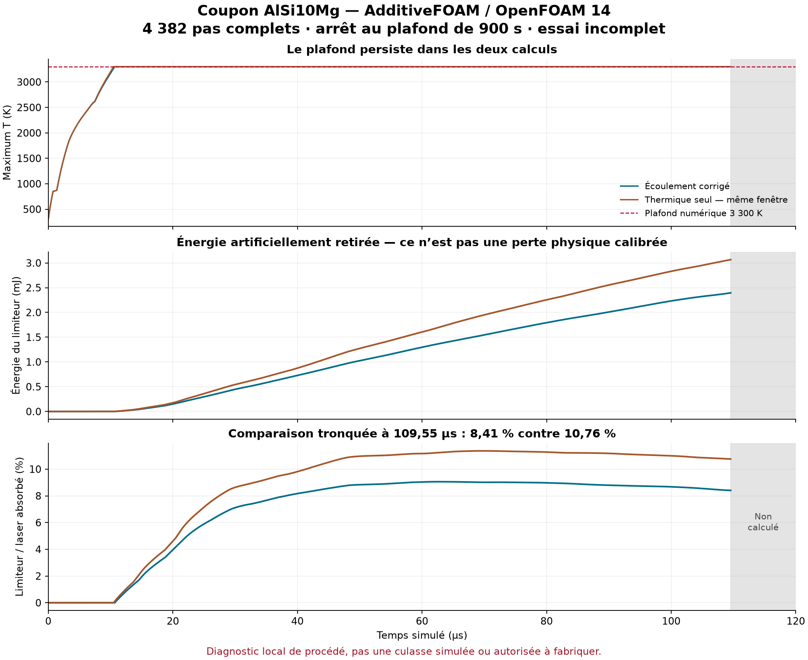

# F58 — coupon with corrected Marangoni contract: incomplete run

**The computation stopped at its 900 s limit: 4,382 complete steps out of 4,800,
i.e. 109.55 µs of the planned 120 µs. Native exit 137, no OOM.** The numerical
ceiling of 3,300 K persists. This result validates neither the printing process,
nor the cylinder head material, nor the cylinder head itself.

The fatal `adjustPhi` error of the previous run did not recur during
the computed window. This is progress in how the coupling runs, not
proof that the physical model is now sufficient.

*Corrected coupon against the thermal-only reference over 0–109.55 µs; computed values, not melt-pool measurements.*

## Actual change and execution

The [public patch](../../twins/m64-cylinder-head/source/additivefoam/marangoni-assignable-openfoam14.patch)
makes `assignable()` return `false` in the Marangoni boundary condition.
The new pinned binary keeps the other 92 checked source files.
The native call to `adjustPhi` is kept; no flux is artificially reset
to zero to get around this check. The contract had been tested in the
[native v3 witness](M64_F58_PREDICTOR_CONTRACT_20260908.md).

This new coupon reuses the coupled case: 57,600 cells, time step 25 ns,
laser 380 W, `nOuterCorrectors=1`, `momentumPredictor=no`. The mesh, the initial
powder, the material laws, the Kelly/SuperGaussian source and the limiter are
kept. Compared with the **thermal-only** reference, flow is enabled;
the comparison therefore does not isolate the effect of the patch alone.

Serial execution on the existing Kali: cap of 4 CPUs, 4 GiB total memory+swap,
read-only container root, network disabled. The watchdog stopped
the computation after **900.759 s**. The container was removed and its absence verified.
The 30 pre-existing input files are unchanged; only the two declared initial
sensor fields, `f58_Co` and `f58_divPhi`, were added.

## Balance over the same window, 0–109.55 µs

Two distinct readers in 60-digit Decimal arithmetic agree on
the six integrals below. They re-read the numerical data; they are not
two independent physical models. The secondary reader imports neither
the execution guard nor the main comparator; its nine targeted tests pass.

| Integrated term, in joules | Thermal only | Corrected coupling |
|---|---:|---:|
| S — discrete sensible | 0.025914258 | 0.026365839 |
| L — latent | 0.003278407 | 0.003471679 |
| D — net inward diffusion | 0.003749998 | 0.003743797 |
| Q — absorbed laser | 0.028509148 | 0.028492565 |
| A — discrete advection | 0 | 0.00000365236 |
| Artificial limiter | 0.003066512 | 0.002395219 |

The accounting closure is `S + L − D − Q + A + limiter`.
Term A is the discrete sum of `rho*Cp*div(phi,T)*V`: when Cp varies,
it is **not** the net physical enthalpy flux at the boundary. Term S
is likewise the instrumented discrete term, not an independent calorimetry.

The limiter amounts to **8.406% of Q**, against **10.756%** in thermal only.
Its integral drops by 21.891% over this window, but remains artificial.
The ratio of the integrated absolute residual to Q is about **1.407 × 10⁻⁶**.
A small balance error does not demonstrate that the modeled phenomena are correct.
The corrected coupon hits the ceiling on **3,956 steps**; the logged Tmax is
3,300.000000022154 K, with the very small numerical overshoot shown.

The isotherm outputs contain **4,383 instants**, from zero to the last complete
step. Dimensions at 109.55 µs, in micrometers, in length/width/depth order:

| Isotherm | Thermal only | Corrected coupling |
|---|---|---|
| 850 K | 223.97757 / 177.53197 / 157.56600 | 242.72657 / 207.06455 / 157.39672 |
| 870 K | 220.10427 / 174.05128 / 156.21747 | 239.50046 / 204.59963 / 156.15512 |

These are computed isotherm dimensions, **not melt-pool measurements**.
At 870 K, the deviations relative to thermal are +8.812% in length,
+17.551% in width and −0.0399% in depth; no industrial gain is inferred.

## Stop, history and next steps

The log contains 4,352 pressure solves, one of which is at the interrupted step
4,383: this number is not the number of complete thermal steps.
The logged sensor maxima are U = 3.565635 m/s, Co = 0.003619697,
|div(phi)| = 0.008247393 s⁻¹. The guard error is zero, but completeness
is refused. The interrupted step and the 418 missing steps are neither integrated
nor extrapolated to 120 µs.

The v1/v2 failures and the v3 witness remain in their
[history](M64_F58_PREDICTOR_CONTRACT_20260908.md). The previous coupled coupon,
stopped by `adjustPhi` at step 474, remains documented
[separately](M64_F58_COUPLED_FLOW_20260908.md); this new run does not
retroactively turn it into a success.

The nominal AlSi10Mg properties are not calibrated for the powder lot.
Powder and solid still share the same k/Cp laws; no free surface,
evaporation or mass loss has been added. The limiter is not a latent heat
of vaporization. The next step requires reviewing these gaps and the material
inputs before a new campaign, not just a longer computation time.
No second corrected run is launched in this receipt.

The [exact digests and values](../../twins/m64-cylinder-head/evidence/f58-corrected-coupon-20260908.json)
tie the result to the logs. No new Vast spending
for this coupon. No convergence, experimental correlation, LPBF
qualification or manufacturing authorization is established.
