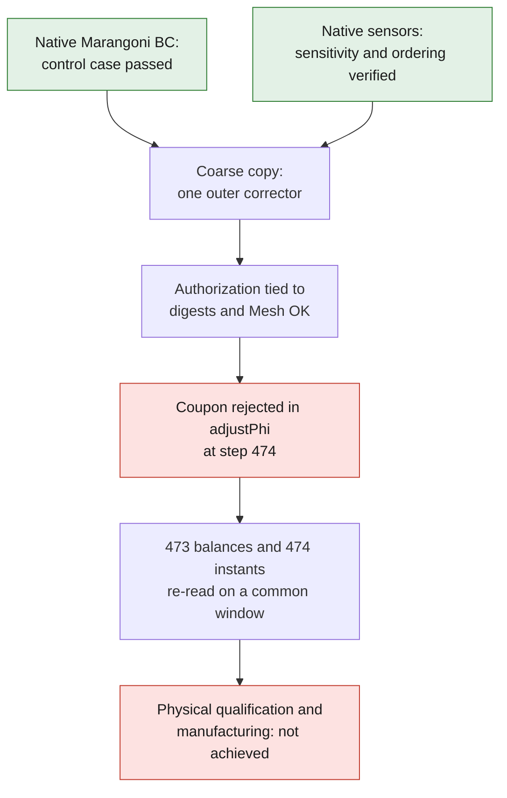

# M64 — controlled activation of flow in the F58 coupon

**The first coupled coupon is rejected after 473 complete steps, at 11.825 µs.**
The next step fails in `adjustPhi` on a continuity defect: the targeted
120 µs are not reached. The two preliminary native control cases pass, but did
not predict this rejection of the coupling. None of these runs is a cylinder
head test or a print qualification.

Separate follow-up: [predictor diagnosis and fix tested on a 32-cell native
case](M64_F58_PREDICTOR_CONTRACT_20260908.md). That control case does not
replace the interrupted coupon described here.

The [previous spatial refinement](M64_F58_SPATIAL_REFINEMENT_20260908.md)
leaves the 3,300 K cap in place. The follow-up concerns physics that is
absent from this thermal control case, not a new refinement nor a raising of
the cap. [Capsule and digests](../../twins/m64-cylinder-head/evidence/f58-coupled-flow-20260908.json).

## A single physical change tested

In the copy of the coarse 25 ns coupon, `nOuterCorrectors` goes from `0` to
`1`. `momentumPredictor no`, the pressure corrections, the material, the
Kelly/SuperGaussian source, the boundary conditions and the limiter are
unchanged. No coefficient is tuned to obtain a favorable verdict.

The [ORNL solver controls](https://ornl.github.io/AdditiveFOAM/docs/solver-controls/)
identify `nOuterCorrectors=0` as thermal-only mode. The
[upstream Marangoni control case, lines 47–49](https://github.com/ORNL/AdditiveFOAM/blob/9c05c5eb54db03faa342b14b0806efe740de8c44/test/marangoni/system/fvSolution#L47)
uses one outer corrector with the predictor disabled. The
[pressure correction code, lines 49–54](https://github.com/ORNL/AdditiveFOAM/blob/9c05c5eb54db03faa342b14b0806efe740de8c44/applications/solvers/additiveFoam/pU/pEqn.H#L49)
then updates `phi`, `U` and its boundaries. The absence of a `U/UFinal` linear
solver is not compensated by an implicit change to the predictor.

## Native Marangoni control case: executed

The `.C/.H` files of the ORNL boundary condition are copied bit for bit and
compiled into a control executable on the pinned OpenFOAM 14 image. This
condition is normally compiled into the solver; it is not assumed to be
present in a library that would not contain it.

On 32 manufactured hexahedra and 16 top faces, three temperature gradients
check the tangential traction, its reversal and the normal case with no
shear. The oracle checks `mu P dU/dn = (dSigma/dT) P grad(T)`
and `U·n = 0`, with `P = I − n⊗n`. It uses the existing nominal values
`mu=0.0013 Pa·s` and `dSigma/dT=−0.0003 N/(m·K)`. The
[upstream condition](https://github.com/ORNL/AdditiveFOAM/blob/9c05c5eb54db03faa342b14b0806efe740de8c44/applications/solvers/additiveFoam/derivedFvPatchFields/marangoni/marangoniFvPatchVectorField.C)
is actually executed, not replaced by the Python oracle.

| Native check | Observed result | Control threshold |
|---|---:|---:|
| Maximum traction error | 5.1062×10⁻¹² Pa | 10⁻⁹ Pa |
| Maximum normal velocity | 9.8608×10⁻³² m/s | 10⁻¹⁴ m/s |
| Wall time / exit | 8.923 s / 0 | 180 s |

These thresholds check the floating-point implementation, not the correctness
of the material card. No PDE transport and no laser are executed. A first
attempt had failed to compile the **driver** (`boundaryMesh()` and
`Info.precision` incompatible with this API). Its rejection, its exit 2 and
its log are kept; only those calls and the layout of the `Make/options` file
are corrected in a new attempt. The backend is unchanged.

## Native sensor control case: executed

The `flowDiagnostics` configuration tested is bit for bit the one from the
preparation. It uses `CourantNo`, `div(phi)`, `volFieldValue/maxMag` and
`surfaceFieldValue/sumMag` on the three patches `top/bottom/sides`.

A second C++ executable imposes `U=s·(1000x,2000y,3000z)` and the flux of that
velocity at the face centers. It uses the native `Time::run` loop, with
three successive states `s=1,2,−1`, without solving any PDE. The initial zero
state and **each of the three completed steps**, the last one included, are
compared with a separate algebraic oracle.

| Quantity | s=1 | s=2 | s=−1 |
|---|---:|---:|---:|
| Maximum of the norm of U, m/s | 0.298171511 | 0.596343022 | 0.298171511 |
| Maximum Courant | 0.000375 | 0.000750 | 0.000375 |
| Maximum of `abs(div(phi))`, s⁻¹ | 6,000 | 12,000 | 6,000 |
| Sum of absolute boundary fluxes, m³/s | 6×10⁻⁹ | 1.2×10⁻⁸ | 6×10⁻⁹ |

The outputs agree within the control case's relative tolerance `2×10⁻¹²` and
absolute tolerance `10⁻¹⁸`. Exit 0 in 4.922 s, with no OOM and no timeout. This
nonzero artificial flux is deliberate: it tests the sensitivity of the sensor,
not an impermeable boundary. The producer/reducer order and the absence of a
one-step lag are verified from the files actually written. The native mechanisms
are documented in [Time.C, lines 856–897](https://github.com/OpenFOAM/OpenFOAM-14/blob/7b05503f98a85be88af930df48623b4d152bfc35/src/OpenFOAM/db/Time/Time.C#L856)
and [functionObjectList.C, lines 376–390](https://github.com/OpenFOAM/OpenFOAM-14/blob/7b05503f98a85be88af930df48623b4d152bfc35/src/OpenFOAM/db/functionObjects/functionObjectList/functionObjectList.C#L376).

## Prepared coupon and criteria fixed before reading the result

The 29 pinned coarse input files are first copied exactly.
After preparation, only `fvSolution` and the sensor include in
`controlDict` change; `system/flowDiagnostics` is added. The
57,600-cell mesh and the initial powder distribution are not regenerated.

The run keeps 380 W, 25 ns and 3,300 K, with 120 µs targeted: 4,800 energy
balances and 4,801 sensor instants were expected. The launcher limits
execution to 900 s, 4 CPUs, 4 GiB **memory and swap combined**, no network,
with the backend and `system` files read-only. An explicit `Mesh OK`
is required before the laser; a mere return code from `checkMesh` is not enough.

It stops the diagnostic on NaN/Inf/FATAL, Courant >0.5, final pressure residual
>10⁻⁶ or failure of the conservative bound
`0.0508764045 + Co_max + 0.5 dt max(abs(div(phi))) < 1`.
That last bound concerns explicit transport on the grid and the pinned
properties, not a global proof of multiphysics convergence.
A stop or a timeout remains an incomplete result; there is no automatic restart.

The six terms to be cross-read separately are sensible, latent, net
boundary input, absorbed laser, advection and artificial limiter. The
dimensions of the 850/870 K isotherms also require an independent reading.
Two parsers are not two independent physics. A small or zero advection
integral does not prove the absence of internal circulation.
Precisely, the term `A = Σ rho Cp div(phi,T) V` is the instrumented discrete
operator, **not a physical net enthalpy flux at the boundary when Cp
varies**. The accounting balance is `S + L − D − Q + A + limiter`; closing it
does not turn this operator into a validated enthalpy model.

The integrity contract is fixed **before** the run: all pre-existing files
must remain identical. Only `0/f58_Co` and `0/f58_divPhi`
are admitted as new initial fields produced by the sensors, a behavior
demonstrated by the native control case. Historical F58 rejections are not rewritten.

## Actual result: coupling rejected, partial reading only

On September 8, 2026, the container starts at 11:09:10 UTC and finishes at
11:09:42 UTC: **33.001 s wall time, native and client exit 1**, with no OOM
and no timeout. `checkMesh` gives `Mesh OK`. The container is removed and its
absence verified. The solver actually solves 442 pressure corrections
and produces a nonzero flow before the rejection.

At step 474, at 11.85 µs, `adjustPhi` reports that it cannot remove the
continuity defect by adjusting the outlet. This step has **no completed balance**.
The following statistics therefore cover the **473 preceding steps**:
maximum velocity 0.684980 m/s, maximum Courant 0.000477983, maximum transport
bound 0.0513544 and maximum final pressure residual 9.92578×10⁻⁷.
These values do not lift the continuity rejection of the next step.

An independent parser, using 60-digit `Decimal` and no import
from the launcher or the old evaluator, reconstructs the six integrals.
The full thermal reference is **truncated to the same window**; no
partial integral is compared with the 120 µs of the previous campaign.

| Over 473 steps, i.e. 11.825 µs | Thermal only | Interrupted coupling |
|---|---:|---:|
| Sensible storage S, mJ | 3.035286 | 3.035648 |
| Latent storage L, mJ | 0.235353 | 0.235891 |
| Net boundary input D, mJ | 1.388299 | 1.388299 |
| Absorbed laser Q, mJ | 1.895941 | 1.895621 |
| Discrete operator A, mJ | 0 | 0.0000372153 |
| Artificial limiter, mJ | 0.0136008 | 0.0123445 |
| Limiter / absorbed laser | 0.71736 % | 0.65121 % |
| Integral of absolute residual / Q | 2.09024×10⁻⁷ | 1.84189×10⁻⁷ |
| Steps reaching the cap within 10⁻⁶ K | 54 | 51 |

The cap remains in both cases. The incident energy over this window alone
is 4.4935 mJ; no complete step exceeds 380 W absorbed. The change in the
limiter proves neither a sufficient physical correction nor a cylinder head
improvement. The balance remains that of the artificially capped model.

The 850/870 K isotherm files and the sensors contain **474 instants**,
from the initial state to step 473. At 870 K, the computed final dimensions are:

| Dimension at 11.825 µs, µm | Thermal only | Interrupted coupling |
|---|---:|---:|
| Length | 96.902884 | 96.959544 |
| Width | 108.483210 | 109.049600 |
| Depth | 52.066613 | 51.994773 |

These are outputs of the same model, not measurements of the melt pool. The sensor
files, rounded to the inherited write precision, are cross-checked against the
16-digit log, taking that rounding into account. The maximum absolute
boundary flux over the completed steps is 1.33321×10⁻²⁶ m³/s; this does not
describe the provisional flux that causes the rejection at the next step.

The **30 prepared inputs** (29 initial files, two of which were modified by
preparation, plus the sensor dictionary) are rehashed intact.
Only the two pre-announced initial fields are added. The planned integrity
contract passes; the solver's numerical rejection is kept in full.
The location of the fatal message is established; this parser does not demonstrate
the algorithmic cause of the provisional flux. No second coupled coupon is
restarted in this sub-batch.

## Limitations and delivery state

The AlSi10Mg card provides nominal coefficients for viscosity, expansion,
surface tension and thermal properties. It does not provide here a
calibration of the powder lot, its measured effective conductivity, or an
independent laser absorptivity. Powder and solid currently have the
same `k/Cp` laws. The thermal laws are evaluated within their bounded
ranges; their presence does not establish their validity at 3,300 K.

The activation tested adds melt-pool flow to the existing model.
It creates neither a free surface/keyhole, nor evaporation, nor mass loss:
the limiting term is not a latent heat of vaporization.
A defensible physical recipe still requires the missing properties and
reference measurements. See the [material/process campaign](M64_700CH_MATERIAL_COOLING_LPBF.md).

Both control cases are run on the existing Kali host, with 2 CPUs, 2 GiB of memory,
120 s of cumulative CPU monitored and 180 s wall time maximum; their containers are
removed and their absence verified. The inputs remain unchanged. The private tests
are **8 PASS for the preparer and 24 PASS for the launcher** after
tightening of the time-grid check; the sensor oracle has
**6 PASS tests**, including rejections for offset, missing last step and non-finite data.
The partial cross-parser adds **7 PASS tests**, notably exclusion of the
fatal step without a balance and rejection of offset/duplicated time grids.
These results do not replace `make check` for the publication checkpoint.
The Mermaid is provided as source; no executed rendering is claimed here.
No Vast rental in this sub-batch, no private CAD geometry published,
no authorization to print or to start an engine.
