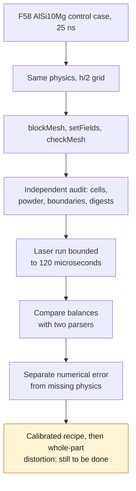

# M64 — spatial refinement of the AdditiveFOAM F58 control case

This work concerns only the **AlSi10Mg F58 software coupon**,
not a cylinder head, CP1, a qualified supplier recipe or a whole-build
distortion simulation. The
[material/process campaign](M64_700CH_MATERIAL_COOLING_LPBF.md) remains open.

**Result: the h/2 run reaches 120 µs, but the cap remains.** The
limiter still removes 9.3093 % of the absorbed laser energy. Spatial
refinement alone therefore does not resolve the model's physical defect. The native code
finishes without error; the launcher's strict integrity rejection is kept and
explained separately below.

## Question tested

After the three time steps 100/50/25 ns, the 3,300 K cap and its artificial
sink remain. This run isolates a new variable: **halving
every cell dimension**, with the 25 ns time step unchanged.
Two spatial levels do not allow a convergence order to be claimed,
and maxima that are all clipped do not demonstrate physical convergence.

| Parameter | 25 ns reference | h/2 spatial run |
|---|---:|---:|
| Grid | 120 × 20 × 24 | 240 × 40 × 48 |
| Cells | 57,600 | 460,800 |
| Cell dimensions, µm | 25 × 25 × 12.5 | 12.5 × 12.5 × 6.25 |
| Physical duration | 120 µs | 120 µs |
| Time step | 25 ns | 25 ns |
| Incident laser | 380 W | 380 W |
| Nominal incident energy | 45.60 mJ | 45.60 mJ |
| Numerical cap | 3,300 K | 3,300 K |

The instrumented binary, the libraries, the AlSi10Mg card, the
SuperGaussian/Kelly source, the path and the initial/boundary conditions are
identical. This model remains thermal: `nOuterCorrectors=0` does not solve
the full melt-pool convection. No change of absorptivity or cap
is used to artificially improve the verdict.

## Preparation and cross-audit actually executed

The mesh is regenerated; the old 57,600-value powder list is
not reused on 460,800 cells. A provisional uniform initialization
is followed by the unchanged native `setFields`, then checked independently.

- OpenFOAM: **Mesh OK**, 460,800 hexahedra, one region, zero non-orthogonality,
  aspect ratio 2; preparation in 11.288 s, exit 0, no OOM.
- Independent audit: complete bijections of points/cells onto the grid,
  six oriented quadrilateral faces per cell, boundaries verified.
- Recomputed volume: `4.4999999999999974e−10 m³`, against `4.5e−10 m³` nominal.
- Powder verified **cell by cell**: 76,800 cells in the eight
  top layers, 384,000 in the substrate. The interface at −50 µm does not
  cross any cell, up to coordinate rounding.
- A control case swapping powder/substrate while keeping the same global
  count is rejected by the auditor.

The time step is also preselected by a conservative diffusion bound
on this orthogonal grid: `alpha ≤ 169.8/(2670×900)` and
`Di ≤ 3 alpha dt Σ(1/h_i²) = 0.203506 < 1`. It includes the doubled
Dirichlet boundary coefficient; it depends on the property limits of the
current model and is not a proof of stability for any added physics.

## Bounded execution and reading criteria

Kali x86, serial, cap of 4 CPUs/4 GiB and 1,500 s. Container root read-only,
network disabled, bounded temporary space and limited Docker logs.
The authorization to fire the laser is separate from the mesh acceptance
receipt. No GPU and no Vast rental are used in this sub-batch.

The requested balance includes sensible storage, latent, boundaries, advection,
absorbed laser and artificial limiter. All 4,800 steps must be checked,
along with the log powers and the integrals, with a second independent parser.
Closing a balance **that includes an artificial removal of energy**
does not validate printing.

## Result actually executed

The native run ran on September 8, 2026 from 09:37:25 to 09:58:47 UTC:
**1,282.135 s**, exit 0, no timeout and no OOM. The final Docker state is
kept; the container is removed and its absence verified. The two
logs contain the 4,800 steps of 25 ns, up to 120 µs.

| Quantity over 120 µs | Reference h | Mesh h/2 |
|---|---:|---:|
| Sensible storage, mJ | 28.346910 | 28.948196 |
| Latent storage, mJ | 3.692608 | 3.752034 |
| Boundaries, net input, mJ | 3.806254 | 3.824625 |
| Absorbed laser, mJ | 31.562272 | 31.839641 |
| Outgoing advection, mJ | 0 | 0 |
| Artificial limiter, mJ | 3.329043 | 2.964055 |
| Limiter / absorbed laser | 10.54754 % | 9.30932 % |
| Integral of absolute residual / absorbed laser | 1.52258×10⁻⁶ | 5.84385×10⁻⁷ |
| Cap reached | 3,300 K | 3,300 K |

The integrals change by 2.12 % for the sensible term and by 10.96 % for the
limiter, in absolute value **normalized by the h reference**. This last
decrease is neither a cylinder head efficiency gain nor an established spatial
convergence. The absorbed laser remains below the 45.60 mJ incident;
none of the 4,800 steps exceeds 380 W absorbed, according to the instrumented logs.

The native isotherm outputs were also re-read independently:
4,801 instants per file, initial state included. At 870 K and 120 µs:

| Computed dimension, µm | h | h/2 | Change relative to h |
|---|---:|---:|---:|
| Length | 234.85825 | 234.14363 | −0.3043 % |
| Width | 174.82490 | 181.47350 | +3.8030 % |
| Depth | 167.34914 | 177.21333 | +5.8944 % |

The depth at 850 K also changes by +5.8097 %. These are the dimensions
returned by the post-processing objects of the capped model, **not
melt-pool measurements nor an independent validation of the molten geometry**.

### Strict launcher rejection: preserved, not bypassed

The solver creates four metadata files in `constant/polyMesh`:
`cellLevel`, `pointLevel`, `level0Edge` and `refinementHistory`. The frozen
launcher required an exactly identical file list before/after:
it therefore ends in **rejection, exit 1**, with `case_inputs_unchanged=false`,
despite the solver's exit 0. Its code and this receipt are not rewritten.

The primary review and an independent cross-audit find the 24
pre-existing files bit-for-bit unchanged and only these four additions. The cell
and point levels are zero; `level0Edge=6.25e−6 m`, no split history
is active. The 4,799 records of refinement selection and
split points are all zero. The old sources and inputs also remain
unchanged. This classification allows the energy diagnostic to be read
without declaring that the launcher's strict contract succeeded.
Final independent receipt:
`bfe6e903bc81fd9a8bcabda1a9f1d119fefdfb0f68c77608f44f46d59f1ddd84`.

**Two independent parsers are not two independent physics**:
they cross-check the same logs and the six terms of the same instrumented
model. They replace neither another qualified solver nor a measurement.

## Decision and next steps

Do not rent a bigger machine to repeat this refinement alone in the
hope of removing the cap. The two levels measure a spatial
sensitivity; they do not allow an order or an extrapolated error to be estimated.
The next priority is to check the validity domain of the source,
of the powder/solid properties and of the melt-pool model, then to qualify any
added physics on a control case and an independent calibration. The cap
will not be raised and the absorptivity will not be tuned to obtain a
favorable verdict. The distortion of the whole cylinder head has not been computed.

## Preparation traceability

The [aggregated public receipt](../../twins/m64-cylinder-head/evidence/f58-spatial-refinement-20260908.json)
links the logs, the native state, the launcher exit observation, the
primary comparison and the Decimal cross-computation. The raw logs and fields
remain private. The parsers' null/unverified keys are
not replaced by the process statuses: these pieces of evidence are distinct.

| Private artifact | SHA-256 |
|---|---|
| Launcher actually executed | `936409570698397bb50beb0bedfa97de4ee792efdc6d164b82ea58dcb7543eb2` |
| Preparation | `7448656ae19242c05e47761117df488e9b4594c12f73b62c020912d68aea75da` |
| Mesh checkpoint | `50b3c36c1154e2f4e0dfa7ece85f339d435aa7359f9814bac1dfd17b0cd11791` |
| Mesh cross-audit | `833e6efab6c9439185b814d484649caa393d53375ab1c9fb939861c7f16a8b93` |
| Cross-checked runtime observation | `8a00c6a7e37b57cc0cccda4685abf6e8e63aa166b8fdec005b8f1b1be1f8d7cb` |
| F58 binary | `b13dacc72146e8df5ded9d20c4b20e7a21051dd21244f9598d441e81c871364d` |
| AlSi10Mg card | `65d464489b95dd60bffa61a30caee53e1ec951c4bd53dfed0d7d1ea0d435e3ea` |

## Software verification and budget

The private preparation and comparator total 22 unique passing tests
(12 preparation/launcher, 10 comparator); four helpers were also
re-run against comparator v2. The Decimal parser has seven passing
synthetic control cases. These tests are distinct from the native execution and from the
audit of the mesh actually produced.

The full `make check` of the batch ends with observed exit 0: the main
suite contains 2,431 tests, 108 of which are skipped for optional dependencies.
The other targets also finish without failure. Private log:
`eed2b2a1aad81089b05d87dde8b5e6e7843a43554bd77737aa607d96f3b2e510`.
The Mermaid sources are reviewed; no executed rendering of these new
diagrams is claimed. The test strategy separates regression,
cross-reading and physics; the documentation keeps the rejections.

The user cap is 44 USD, with no top-up. **No new Vast rental
for this sub-batch**: the control case is run on the existing Kali machine.
An announced credit is not a guaranteed balance nor proof of a completed computation.

The private sources and earlier cases are kept. These diagnostics
give **no authorization to print or to start an engine**.
