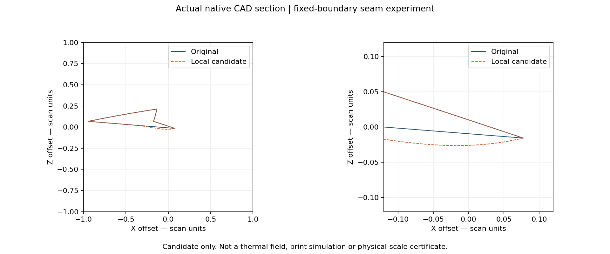
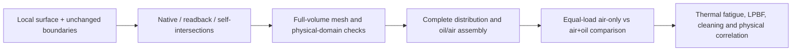

# M64 — fixed-boundary seam experiment and Swindon benchmark, 28 September 2026

## Engineering outcome

A new local surface is built on the retained scan-derived head. Unlike the
[rejected fillets and chamfers](M64_PHOTO_TOOL_SELECTION_20260928.md), it keeps
the original four boundary curves and changes the surface only near the
diagnosed air-gap corner. Native validity, protected-face serialization,
all stored entity tolerances and native-file readback pass. The seven fixed
air-gap rays increase. The full-body self-intersection check completes without
reported fault or error. A full coarse volume mesh is generated, but rejected
by the unchanged element-quality threshold. No physical cooling or printability
result is claimed. The original and installed assembly are not replaced.



This remains geometry derived from the 935 research reference within the M64
development programme, not measured M64 fitment. Provisional scan units are not
certified physical millimetres.
Source attribution: [Wolfe Classics research scan](../../catalog/sources/src-wolfe-classics-935-billet-cylinder-head-scan.json);
the image is our native CAD section, not a manufacturer illustration.

## Actual local construction

[The runner](../../twins/m64-cylinder-head/source/wholebody/trial_fixed_boundary_seam.py)
changes the bilinear face numbered 1154, on one independent read of the pinned
native body. Its four trimming edges are checked before construction. A
separate native read remains the unmodified reference. The representation
neighbourhood is declared before deformation: faces 893, 895, 1154, 1399 and
1400. Adjacent edges carry references to the modified surface, but their 3D
boundary geometry is retained. Every other face must retain its serialization.

The displacement uses two degree-four Bernstein basis functions:

`D = c B₃⁴(x) B₃⁴(y) n`, where `B₃⁴(t) = 4 t³(1−t)`.

The support occupies the final 8% of the face's U domain and final 12% of V;
it is zero outside. The maximum requested displacement is 0.020 provisional
units. Each basis peaks at 27/64, so the scalar field bound is calculated
with exact rational arithmetic as `c × 729/4096`. It is **not** a bound on
native floating-point evaluation, physical scan accuracy or manufacturing.
The displacement vanishes at the original edges; at the two lower support
boundaries its first and second derivatives also vanish. Knot reduction
retains C2 continuity inside the face. Tangency to neighbouring faces along
the original outer edges is not newly certified.

The direction is derived from the seven already classified gap witnesses;
displaced target points must lie in source material. This removes a small
amount of material to open a local void. It does not prove that this void
belongs to the cooling circuit or that the remaining material is strong enough.
See the [OCCT surface API](https://occt3d.com/dev/doc/refman/html/class_geom___b_spline_surface.html).
The executed runtime is OCP 7.9.3.1, not the newer documentation version.

An initial preflight rejected a non-identity face placement without modifying
geometry. That receipt and its source snapshot remain private. The corrected
implementation explicitly transforms between local surface and assembly
frames. Its regression includes a translated, rotated face; it does not
discard the placement or relax the geometric tolerances.

| Executed check | Result |
|---|---:|
| Native vs analytical field, sampled maximum error | 5.74e-14 scan units |
| Native displacement, sampled maximum | 0.020000 scan units |
| Boundary curve/surface discrepancy, 121 samples per edge | 5.62e-12 scan units |
| Minimum sampled orientation dot ratio | 0.972432, positive |
| Complete entity tolerance arrays | Identical |
| Protected-face serializations | Unchanged |
| Native validity, including saved-file readback | Pass |
| Full-body BOP self-intersection check | No reported fault or error |
| Fixed air-gap rays | All seven increase |

| Ray | Original width | Candidate width |
|---|---:|---:|
| 1 | 0.017971 | 0.033050 |
| 2 | 0.014822 | 0.029063 |
| 3 | 0.020854 | 0.039642 |
| 4 | 0.016873 | 0.033056 |
| 5 | 0.018563 | 0.035217 |
| 6 | 0.027057 | 0.045158 |
| 7 | 0.019939 | 0.036911 |

These are fixed native line intersections in provisional units, not minimum
wall/clearance certificates or a measured airflow gain. The other four defect
families are not repaired by this experiment.

### Independent volume check catches a misleading default

The runner's default non-adaptive native integration reports **+0.00895131**
scan units³, inconsistent with removing material to open the measured void.
That number is retained in the original receipt, not silently corrected.
[A separate audit](../../twins/m64-cylinder-head/source/wholebody/audit_fixed_boundary_volume.py)
integrates the changed rectangular face using the divergence theorem,
splitting at its B-spline knots. Gauss orders 8, 16 and 32 agree on
**−0.002957369941** scan units³. An independent adaptive native whole-solid
calculation at requested relative epsilons 1e-6, 1e-9 and 1e-12 approaches
−0.003135795938, −0.002957375254 and **−0.002957369899**, respectively.
The final discrepancy is **4.21e-11** scan units³.

The audit passes a translated-box analytical witness. This confirms the local
volume change numerically by two methods, not a rigorous whole-head volume
error bound. In particular, OCCT's returned error estimates remain about
3e-8 for the final whole-solid calls: a requested epsilon is not proof that
that accuracy was achieved globally. No incorrect default-volume increase is
used as a material or cooling benefit.

### Whole-body remeshing, not merely a local surface test

The existing [native mesh runner](../../twins/m64-cylinder-head/source/mesh_native_ported_head.py)
was executed without modification: Gmsh 4.15.2, sizes 1–6 provisional units,
Frontal-Delaunay surfaces, Delaunay volume, Netgen optimisation, two CPU
threads and a 300-second external alarm. A new native baseline is calculated
from this candidate; no old geometric baseline is misapplied.

Import preserves one solid, all 4,918 faces and a bijective face descriptor
match. The candidate run takes 40.58 seconds and generates **241,389 tetrahedra**.
It passes positive Jacobians, positive signed volumes, connectedness, complete
boundary and all-face coverage. Volume discrepancy is 0.2875%, below the
existing coarse 1% threshold. This coarse volume gate is not a surface-distance
or physical 0.040 mm gate.

The run is nevertheless **rejected**: minimum minSICN is 0.001224 versus the
unchanged project threshold 0.1, with **1,277 elements below 0.1**. Re-reading
the exported mesh preserves coordinates to 5.74e-14 units and preserves
connectivity, but the combined export acceptance remains false because the
re-read quality still fails. No export corruption is inferred from that
combined flag. No CFD, structural or LPBF calculation is launched on this mesh.

The original body was then rerun with **the same helper, runtime and mesh
parameters**, not compared to a differently tuned historical mesh:

| Same-recipe measurement | Original | Local candidate |
|---|---:|---:|
| Tetrahedra | 241,656 | 241,389 |
| Minimum minSICN, required ≥ 0.1 | 0.000213802 | 0.001223803 |
| Elements below 0.1 | 1,314 | 1,277 |
| Non-positive Jacobians | 0 | 0 |
| Coarse volume discrepancy | 0.2886% | 0.2875% |
| Connected region, complete boundary, all CAD faces covered | Pass | Pass |
| Final verdict | Rejected | Rejected |

This is a modest whole-mesh improvement for this deterministic-seed,
two-thread experiment, not a convergence study or a solved meshing problem.
Both source geometries remain unchanged on disk after meshing.

The next local diagnosis starts from boundary faces 3430, 264 and 3412,
which occur among the candidate's eight lowest-quality tetrahedra. These
are native identifiers, not yet anatomical classifications. Their incidence
does not by itself identify the cause or justify moving those faces.

## What the new Swindon photograph changes in our comparison

The photograph points to [Road & Track's October 2023 article](https://www.roadandtrack.com/news/a45467305/porsche-964-993-four-valve-heads/).
The primary reference is already registered as
[`SRC-SWINDON-M64-24V-HEAD-KIT`](../../catalog/sources/src-swindon-m64-24v-head-kit.json).
The [manufacturer's product sheet](https://swindonpowertrain.com/wp-content/uploads/2025/10/M64-24V-Cylinder-Head-Kit-Product-Sheet-0923.pdf),
re-read for this continuation, describes a complete kit, not only a head casting:

| Required assembly coverage | Our acceptance consequence |
|---|---|
| Valves, springs, caps, collets and adjustment shims | Check retention, installed preload, coil bind, contact and hot fatigue together. |
| Finger followers, shafts, camshafts and their housings | Include actual pivots, bearings, stiffness, lubrication and a continuous motion/collision sweep. |
| Timing input shaft/gears and covers | Establish drive ratio, timing, torsional loads, packaging and sealing. |
| Oil return tubes, seals and fixings | Model feed and drain connectivity, pressure, leakage and assembly access. |
| Air shrouding and engine interfaces | Couple airflow distribution and heat rejection to the assembled engine. |

These categories come from PDF page 3 and its options. The product sheet also
states use of the standard lubrication and chain-drive systems. This does
not disclose the internal cooling-gallery geometry. No manufacturer image,
manual or proprietary geometry is copied into Git.

The current 13-solid head/valve/seat/guide assembly is **not this complete kit**.
Its [producer](../../twins/m64-cylinder-head/source/wholebody/build_extended_valve_assembly_v2.py)
explicitly excludes qualified keeper/retainer interfaces and continuous motion.
The [valve sensitivity study](M64_PHYSICS_AM_CONTINUATION_20260928.md) still shows
modelled contact loss; isolated carrier, spring and rocker studies are not
silently treated as an integrated mechanism. Swindon's stated RPM and
compression figures are benchmarks, not acceptance of our turbo 700 hp target.

## Oil cooling: additive advantage, not exclusivity

Conventional manufacture does not prevent oil cooling. FVD explicitly lists an
upper pocket and drilling for oil cooling from the 993 cam carrier on its
[billet 993 GT2 head](https://www.fvd.net/en-us/shop/billet-993-gt2-cylinder-head-valves-o-8mm-fvd10499302~p274003).
That is a concrete conventional comparison, not proof of Swindon's internal
construction. The previously recorded FVD URL now returns 404; the current
product URL above identifies the same FVD10499302 reference.
The current primary-source search excerpt supplies the oil-cooling wording;
direct opening of that new page returns 403. Stock, pricing and supplied
internal geometry are not verified.

Our potential additive advantage is routing a cleanable, inspectable channel
closer to local hot zones while preserving the external shape, load paths and
insert/fastener interfaces. It is not an established performance gain.
Retain the existing [air-only versus air-plus-oil campaign](M64_700CH_MATERIAL_COOLING_LPBF.md)
instead of adding a duplicate oil solver. Compare equal gas loads, air supply
and geometry assumptions; calculate oil pressure loss, heat pickup, pumping
power, lubrication reserve and external oil-cooler rejection. Check shutdown
heat soak, coking, leakage, machining allowances and powder removal. No flow
rate, diameter, hot allowable or alloy is inferred from the photograph.

[MAHLE's conventional piston-gallery work](https://newsroom.mahle.com/press/en/press-releases/new-development-from-mahle-allows-steel-pistons-to-be-used-in-powerful-passenger-car-engines-66368)
illustrates oil-coking risk and hydraulic routing, but is not cylinder-head
validation. [EOS](https://www.eos.info/metal-solutions/metal-ecosystem)
explicitly includes residual-powder removal from internal channels in metal
AM post-processing; geometric connectivity alone does not qualify cleaning.



## Reproduction and remaining gates

```sh
python -m unittest discover -s tests -p test_m64_fixed_boundary_seam.py -v
python twins/m64-cylinder-head/source/wholebody/trial_fixed_boundary_seam.py \
  --body "$PRIVATE_BODY" --diagnostic "$PRIVATE_JUNCTION_RECEIPT" \
  --output "$NEW_PRIVATE_OUTPUT" --amplitude .02
python twins/m64-cylinder-head/source/wholebody/audit_fixed_boundary_volume.py \
  --body "$PRIVATE_BODY" --candidate "$NEW_PRIVATE_OUTPUT/diagnostic-candidate.brep" \
  --receipt "$NEW_PRIVATE_OUTPUT/report.json" --output "$NEW_PRIVATE_AUDIT"
```

Use the pinned native input and diagnostic from the preceding report, OCP
7.9.3.1 and a fresh private output directory. The analytic regression passed
in that runtime. A 300-second process alarm bounds this trial; an unfinished
receipt never counts as success. No new rental, physical test, supplier
qualification, full-head LPBF run or engine operation is performed here.

| Private artefact | SHA-256 |
|---|---|
| Native candidate, not a replacement master | `30514eb86701dcced4c6f043ac4e492a21464d616357635dfa8bfdf9e2452150` |
| Completed native trial receipt | `4a8c30a10e5268ec2dab425a3ca817f0b1791c99488d9c9a24aa0085b616091d` |
| Independent volume audit | `9c6a361c638944999a72886bd013fd984bc60a062ed15ac8362290bbc989ae4d` |
| Candidate full-mesh report | `c28f096458e75c61bb4f7d197d19f28f415cb2a989e351142675b2684452f480` |
| Original, same-recipe full-mesh report | `c726f858d9510f4111ab52c8c6b6e8165148b447eea1c511898ecae905baaacd` |

Verification: the native regression runs rather than skipping, including the
placed-face deformation and translated-box flux. Full `make check` exits 0:
3,187 tests in the main suite, 151 optional-runtime skips, followed by the
remaining repository checks. These are software checks, not engine validation.
