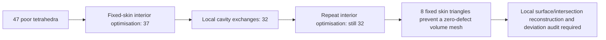

# M64 — fixed-skin optimisation: 47 to 32 poor tetrahedra, 28 September 2026

## Result and scope

The continuation reduces the count below **minSICN 0.1 from 47 to 32** on the
retained full-body mesh, without changing the native CAD or moving its surface
mesh. **Zero has not been reached.** All resulting meshes remain rejected by
the unchanged quality gate and are not authorised for CAE or manufacture.

The first optimisation is reproduced on native Linux/Kali as well as macOS.
No new Vast rental, GPU job, PhysicsNeMo inference, thermal calculation or
physical test is claimed. This follows the
[acute-face investigation](M64_ADAPTIVE_MESH_AND_ACUTE_FACES_20260928.md), not a
replacement of the head with a simplified block. The geometry remains the
scan-derived research body; physical scale and M64 fitment are not certified.



## Executed results

All rows below retain one face-connected material volume, positive Jacobians,
complete tetrahedral boundaries, and exact mesh-file coordinate/connectivity
readback. The surface has **437,042 triangles**, unchanged throughout.
The independent signed-volume sum remains **1,113,040.1757998841 scan units³**.
That equality is a polygon-volume consistency check, not a native-CAD or
physical-volume certificate.

| Trial | Tetrahedra | Below 0.1 | Minimum minSICN | Poor-element volume fraction | Seconds |
|---|---:|---:|---:|---:|---:|
| Retained short-edge input | 1,341,461 | 47 | 0.023337771 | 1.27759e-6 | prior run |
| Interior optimisation, Mac | 1,341,461 | 37 | 0.026706524 | 8.86149e-7 | 23.63 |
| Interior optimisation, Kali | 1,341,461 | 37 | 0.026706524 | 8.86149e-7 | 19.89 |
| Two/three-cell exchanges only, Mac | 1,341,462 | 35 | 0.026706524 | 8.85397e-7 | 20.45 |
| Two/three/four-cell exchanges, Mac | 1,341,461 | 32 | 0.026706524 | 8.62021e-7 | 20.57 |
| Interior optimisation after those exchanges, Mac | 1,341,461 | 32 | 0.026706524 | 8.48967e-7 | 22.69 |

The two cavity-exchange rows both start from the 37-defect mesh; the second is
not a continuation of the 35-defect row. Mac/Linux agreement is numerical,
not byte-identical output: the runtimes use different SciPy versions, and
interior coordinates differ. It is not an independent physical validation.

## Operations and safeguards

[The interior optimiser](../../twins/m64-cylinder-head/source/wholebody/optimize_fixed_skin_sicn.py)
uses NumPy to evaluate the signed ideal-tetrahedron SICN metric and SciPy
SLSQP to maximise the worst quality in each movable node's complete incident
star. Its metric agrees with Gmsh over all 1,341,461 input elements and again
after output readback (`rtol=1e-10`, `atol=1e-12`).

The initial run has 31 eligible interior nodes. Each coordinate remains within
half the original shortest incident edge length of that node's initial
position. This is an interior-node optimisation bound, **not CAD displacement**.
Six sweeps and a 600-second alarm bound the run. Each admitted move must keep
positive volumes, not worsen the star minimum, not increase either the poor
element count or its absolute volume, and improve the count or minimum. All
surface-node coordinates and all connectivity remain fixed in this stage.

[The cavity-exchange runner](../../twins/m64-cylinder-head/source/wholebody/flip_fixed_skin_tetrahedra.py)
then tries standard local 2→3, 3→2 and 4→4 tetrahedral replacements at fixed
coordinates. A proposal is rejected unless its **oriented cavity boundary**
is identical, all new cells have positive volume, relative cavity-volume
difference is at most 1e-10, and the same monotone quality checks pass with a
strictly lower poor-element count. Negative input cells are never silently
reordered. Only newly constructed candidates receive an orientation convention.
No physical region is deleted, welded or bridged.

Four exchanges are admitted: one 2→3, two 4→4, and one 3→2. Their largest
observed relative cavity-volume difference is 4.44e-16. All remaining cells
are retained. Full Gmsh quality and the frozen whole-mesh connectivity audit
are recomputed after file readback. The second interior run makes three
admitted node moves over two sweeps but does not remove another defect.

Neither local positivity nor these connectivity checks alone proves the
absence of every global geometric intersection. Native curved-boundary
deviation, physical boundary roles and downstream solver convergence remain
separate, unclosed gates. The master/assembly is not replaced automatically.

## Why a fixed skin cannot reach zero

The [existing algebra and its native witnesses](M64_ADAPTIVE_MESH_AND_ACUTE_FACES_20260928.md#2-why-interior-optimization-alone-cannot-close-the-gate)
give, for a fixed linear triangle of quality `q2`,

`q3 <= 3*q2/(2+q2)`.

Re-evaluation on the final 32-defect mesh finds **eight incompatible triangles
on six original surfaces**:

| Source face | Incompatible triangles | Lowest triangle quality | Best possible incident-tetrahedron quality |
|---|---:|---:|---:|
| 141 | 1 | 0.066788222 | 0.096944943 |
| 143 | 1 | 0.066788222 | 0.096944943 |
| 686 | 1 | 0.066858045 | 0.097043015 |
| 1411 | 2 | 0.063317311 | 0.092061426 |
| 1413 | 1 | 0.065207569 | 0.094723024 |
| 1648 | 2 | 0.021346709 | 0.031681911 |

These are triangle counts, **not eight necessarily distinct tetrahedra**.
Face numbers are bound geometric identifiers, not inferred anatomical roles.
The bound uses floating-point measured triangles and exact algebra, not an
interval certificate. It proves failure for this fixed skin, not for every
future remeshing or modified CAD surface.

Gmsh's [cross-patch meshing documentation](https://gmsh.info/doc/texinfo/#t12)
was inspected as an alternative. It parametrises a discrete patch instead of
the original individual surfaces; it cannot be treated as exact preservation
of every crease. A nine-position shared-edge normal diagnostic finds angles
of about 81.55–81.92° at 1648/1647 and 90° at 1648/1412. These are sampled
geometric diagnostics, not global extrema or functional classification.
No compound is consequently presented as an accepted crease-preserving fix.

The next needed change is the **local surface triangulation/intersection
construction**, with protected interfaces and a native deviation audit. More
interior sweeps, blind welding of the earlier fTetWild pinches, or a lower
quality threshold cannot honestly close this fixed-skin failure.

## Runtime recovery and reproducibility

SciPy 1.15.3 fails at import on the Mac in both the old Python 3.10 environment
and a fresh Python 3.13 environment: its PROPACK binary has a Mach-O zero-fill
section error. Both attempts fail before any mesh optimisation. A fresh,
isolated Python 3.13.15 environment with NumPy 2.2.6, Gmsh 4.15.2 and
SciPy **1.16.2** completes the Mac trials. No shared scientific environment is
patched in place.

The approved SSH identity also reaches Kali. A user-owned Python 3.13.15
virtual environment on ext4 uses NumPy 2.2.6, Gmsh 4.15.2 and SciPy **1.15.3**.
Package resolution succeeds through explicit public PyPI after earlier
resolution failures. No sudo, Docker permission change or secret access is
used. The same pinned 47-defect mesh yields 37 defects there too. Linux output
remains private on Kali; its completed receipt and log are recovered locally.

Reproduction with access to the private, hash-bound inputs:

```sh
python twins/m64-cylinder-head/source/wholebody/optimize_fixed_skin_sicn.py \
  --mesh /private/short-edge-input.msh --output /private/fresh-interior
python twins/m64-cylinder-head/source/wholebody/flip_fixed_skin_tetrahedra.py \
  --mesh /private/fresh-interior/interior-optimized-private.msh \
  --output /private/fresh-flips
python twins/m64-cylinder-head/source/wholebody/optimize_fixed_skin_sicn.py \
  --mesh /private/fresh-flips/flipped-private.msh --output /private/fresh-repeat
python -m unittest discover -s tests -p test_m64_fixed_skin_sicn.py -v
make check
```

Use the retained Mac mesh bytes for the subsequent input-pinned flip/repeat
stages; different platforms may not reproduce their hashes. Each numerical
stage exits **2** when quality remains insufficient, even after a completed,
integrity-preserving computation. This is intentional, not solver success.
The Mac dispatcher enforces a separate 610-second process-group timeout;
the Linux invocation uses `timeout --signal=TERM --kill-after=5s 610s`.

Only source, documentation and aggregate numerical results enter Git. Raw
geometry, mesh arrays and detailed receipts stay private. Earlier source
revisions are retained with their trial directories; their receipts are not
rewritten to match later source additions.

| Private evidence | SHA-256 |
|---|---|
| Initial mesh | `9efeecaf06da65225a1e2fc4c722ad2a8340e1079d9cf96aed252bc97c68ecb7` |
| First completed Mac interior receipt | `74ef5bbe25c43bef7dd58f52af67d56279b783043da5a8a333d49c91d48796e9` |
| Two/three-cell-only receipt | `2584b13ec6339ce0242c67c51b9e32c007c2b34fe4df62ac9b77b7c787a73e7c` |
| Two/three/four-cell receipt | `6edc60ee22ff8dc8007c4734294ecb66817b1d6676e6d9d9fe52353e1168b8a3` |
| Final repeated-interior receipt | `c8278ea706e035590afcc2e828da29dc849ddf1cd5c63087880d37122f4c26e1` |
| Final 32-defect mesh | `285d0271e6e9cc4db1f80f8e7bdb54c88578c63c55ffe1ef3e442baa1cac3424` |
| Completed Kali interior receipt | `75f3bc9cde34a6ca53f8e7741996fa7d19b7c4c4f5079a69374696716c2d1e2d` |

Two focused software tests cover ideal/inverted SICN, monotone admission,
an improving synthetic cavity, its rejected reverse, repeated/degenerate
candidate cells, and four-cell alternative enumeration. These software checks
do not replace engineering review, thermal/structural validation or printing
qualification.

Full `make check` exits 0: **3,196 main-suite tests, 152 environment-dependent
skips**, followed by the repository's additional checks. Documentation has
zero broken links across 569 Markdown files. The two new focused checks also
pass in the fresh numerical runtime. All five completed numerical trials have
ended; no numerical worker or new paid rental is left running by this turn.
