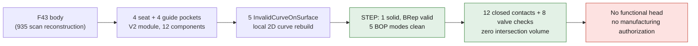

# Four-pocket body — CAD audit of September 7, 2026

The private body now has four seat counterbores and four guide bores. After
a local correction of the cutting curves, its STEP passes the BRep checks and
the five BOP modes run. **This is an incomplete geometric integration trial,
not a functional or printable M64 cylinder head.**

The [verifiable public receipt](../../twins/m64-cylinder-head/evidence/four-seat-body-cad-audit-20260907.json)
records the SHA-256 digests of the sources, of the body before/after correction,
of the assembly and of the three private reports re-read. It contains no scan,
no private CAD, no derived image, and no scan coordinates or face identifiers.

## Scope and assumptions

The F43 body comes from the reconstruction of a scanned 935 reference: it
is not a certified M64 definition. The V2 module provides the twelve actual
components: four valves, four seats, four guides. Their registration uses
**1 scan unit per module mm**, a Z rotation of −90° and a Z translation
of +3 units. These assumptions certify neither the scale nor the engine interfaces.
Both masters were left unchanged.

The pockets are nominal, with no interference chosen: Ø43 for the two intake
seats, Ø36 on the exhaust side and Ø11 for the guides, expressed in module mm
before the hypothetical registration. The conical seat faces belong to the inserts
and the valves; the pockets in the body are cylindrical.

## Verified results

| Check | Result and scope |
|---|---|
| Final body after STEP | 1 solid, 1 shell, 5,130 faces; no free or non-manifold edge. |
| BRep / BOP | BRep valid; no faulty result in the self-intersection, small edge, face rebuild, continuity and curve-on-surface modes. These checks apply to the body. |
| Private assembly | Body + 12 components, i.e. 13 solids; this count does not validate that the assembly works. |
| Closed contacts | Intersection volume between cut body and component is zero for all 12 components. The 8 seat/guide inserts are fully contained in the initial body by volume check. |
| Moving valves | 8 discrete checks on the corrected body: closed and maximum lift for each valve; zero intersection volumes. Candidate lifts: 11.5 intake and 9.6 exhaust, in scan units under the scale assumption. |

The four maximum-lift results also apply to the intersections
with the **fixed body** when all four valves are at their maximum. No
additional coupled computation, continuous sweep, valve-to-valve collision,
piston or cam law was run in this trial.

## Local correction and non-zero changes

The first STEP reported five `InvalidCurveOnSurface` defects in the specific
curve-on-surface check. Only their 2D representations on the
cylinders were rebuilt: analytic projection, 129 points and exact derivatives
at the ends. Interpolation without those constraints had been rejected.
No global healing and no tolerance increase was applied.

After a STEP round trip, the 5,286 vertices, 10,412 edges and 5,130 faces were
compared. The maximum **sampled** 3D displacement is 2.29325 × 10⁻¹² unit
on the edges; the volume changes by **+1.64399 × 10⁻⁵ unit³**. Tolerances
increase nowhere; four vertices and three edges see their tolerance
decrease. These variations are recorded, not treated as exact identity.
The check on 2,001 points per corrected curve reaches at most
5.18164 × 10⁻⁸ unit; this is not a continuous bound on the geometric error.

## Surface portions removed, not "54 holes"

Tracing the Boolean operations identifies **54 source face portions**
removed outside the extreme planar faces: 26 on the intake 1 side and 28 on the
exhaust 2 side. Their cumulative areas are 270.458 and 258.615 units² respectively.
This topological split does not count distinct physical openings.

The conservative projection of their bounding boxes onto the axes places these
54 portions above the actual guide engagement, with no overlap of the
seat/guide intervals. A lack of material at these supports is therefore **not
demonstrated**. The future valvetrain space remains to be defined before these
breakouts can be qualified. The global envelope changes only by 2.35 × 10⁻¹² unit
after drilling, but that stability does not mean the whole outer skin is unchanged.

## What remains to be established

Ports and final chamber, cam carriers and the full valvetrain, piston and
continuous kinematics, oil galleries, threads, cold/hot interference fits,
materials and M64 interfaces all remain to be defined or qualified. No
thermal, mechanical or LPBF process result is validated for this body by this audit.
**No manufacturing or engine-operation authorization follows from it.**
