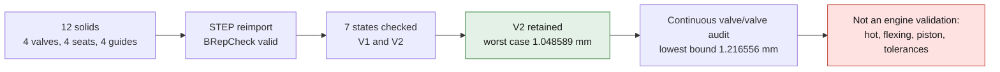

# 4V valvetrain: independent CAD sub-assembly built


*The V2 sub-assembly rendered from the reimported STEP, with native CAD sections; it does not show a cylinder head body and proves no engine fit.*

**Twelve solids were built and exported as a named-assembly STEP:**
four valves with conical seat faces, four matching annular seats and
four guides. The closed STEP and the maximum-lift STEP are valid after
reimport. Seven configurations pass the geometric checks described
below. This is not a finished cylinder head, integrated into the engine or
released for manufacture.



The module has its own design frame, **in millimeters**.
It reads neither the 935 scan nor F53 and changes no outer envelope.
Its coordinates are not measured Porsche interfaces. The 100 mm bore is a
provisional working basis, not an M64 fitting contract.

## V2: better worst case, with an explicit trade-off

Placement **V2** is retained as the packaging candidate: it translates
all components by `+1.5 mm` along X. No diameter, component profile,
inclination or lift changes. V1 remains fully available as a
control. The geometric threshold between seat envelopes is raised to **2 mm**
for the V2 check; that threshold is met.

| Native minimum distance | V1 | V2 |
|---|---:|---:|
| Valve/bore, worst case of the seven states | 0.308483 mm | **1.048589 mm** |
| Valve/valve, worst case of the seven states | 2.175732 mm | 2.175732 mm |
| Seat envelope/seat envelope | 2.000000 mm | 2.000000 mm |
| Valve/bore, intake only at maximum lift | **1.323201 mm** | **1.048589 mm** |

The improvement in the overall worst case is **0.740106 mm**. V2 therefore does
**not improve every state or every valve individually**: by moving the
exhaust closer to the cylinder, it improves the intake zone that was initially
limiting. The intake-only-open case loses `0.274612 mm` of margin.
This selection rests on the overall worst case, not on a dominance
without trade-off. The [full comparison](../../twins/m64-cylinder-head/evidence/four-valve-design-v2-20260907/placement-comparison.json)
publishes the seven states and the four valves per state. No V3 is
built in this batch.

The roughly one millimeter left cold **is still not a validation
hot, under flexing, with the real piston or with assembly tolerances**.

## Parameters and provenance

| Parameter | Intake | Exhaust | Status |
|---|---:|---:|---|
| Head diameter | 40 mm | 33 mm | Documentary comparison, Swindon |
| Maximum lift tested | 11.5 mm | 9.6 mm | Documentary comparison, Swindon |
| X position of the axes at the reference plane V1 → V2 | −19.5 → −18 mm | +22 → +23.5 mm | Design choice |
| Y position of both axes | ±22.5 mm | ±22.5 mm | V1 design choice |
| Axis inclination | −8° | +8° | Design choice, included angle 16° |
| Seat face angle relative to the transverse plane | 45° | 45° | Design choice, not the axis angle |
| Radial width of the contact band | 1 mm | 1 mm | Design choice, not qualified |
| Seat outer diameter | 43 mm | 36 mm | Design choice |
| Stem diameter | 6 mm | 6 mm | Design choice |
| Guide bore | 6.030 mm | 6.040 mm | Cold diametral choice |
| Guide outer diameter / length | 11 / 35 mm | 11 / 35 mm | Design choice |

The diameters and lifts are published in the
[Swindon primary product sheet](https://swindonpowertrain.com/wp-content/uploads/2025/10/M64-24V-Cylinder-Head-Kit-Product-Sheet-0923.pdf).
That establishes neither the internal geometry of the kit, nor its transposition
to the project's turbo engine. The other values are the module's explicit choices.

The [MAHLE primary catalogue](https://www.mahle-aftermarket.com/media/homepage/facelift/media-center/product-catalogs/mahle_valve_train_components_catalog_2025_screen_v002.pdf)
documents 45° seat faces for some M64 **2V Carrera** valves, as well as
a general stem/guide clearance table. That table does not state
literally whether its clearances are radial or diametral: the diametral
clearances of 0.030 / 0.040 mm in this module are **chosen**, not automatically
derived from or validated by that table. See the
[documentary review](M64_VALVE_MODULE_PRIMARY_REFERENCES_20260907.md).

The parts are not yet purchase references. Alloys, metallurgical
condition, treatments, interference fits of seats and guides in the body,
lubrication and hot values remain to be selected and qualified.

## Actual geometry of the contacts and of the motion

The seat and the valve use the same cone over the contact band.
For a 45° seat face, a radial change of 1 mm corresponds to an
axial change of 1 mm and a width measured along the slope of √2 mm.
The model distinguishes this conical band from the cylindrical bore of the guide.
The parts are solids of revolution, not simply stacked
disks. The valve neck is still defined by conical segments:
its fatigue fillets and the stem end/retainer details
are not finalized.

The positive local axis points toward the stem end. The stems splay
outward from the module; a positive lift applies the translation
**opposite to that axis**, toward the chamber and the piston. The positions of the
seats and guides stay fixed. The stem still covers the full length
of the guide at the candidate maximum lift.

There is **no dummy spring**, camshaft, rocker, piston or cylinder
head body added to fill in the undefined elements. The simultaneous
configurations are a packaging exploration, not a cam
law or a computed engine cycle.

## Checks executed

| Native OCCT check | V1 result |
|---|---:|
| Solids per STEP after reimport | 12 |
| BRepCheck of the components and the two reimported assemblies | Valid |
| Minimum separation between the full cylindrical seat envelopes | **2.000 mm** |
| Geometric design threshold chosen for this separation | 1.5 mm |
| Minimum separation between a seat and the neighboring guide | 21.755 mm |
| Maximum error of the shared band points on the two solids | `2.04e-14` mm |
| Band placement tests | 72 native distances per valve |
| Seat/valve volumetric intersection when closed | Below `1e-7` mm³ |
| Native radial stem/guide clearance, minimum of the four | 0.015 mm |
| Minimum valve/valve distance among the tested states | **2.176 mm** |
| Minimum valve/bore distance among the tested states | **0.308 mm** |
| STEP sections after reimport, closed / max lift | 65 / 64 edges, BRepCheck valid |

A final **read-only** audit explicitly enabled
`BRepCheck_Analyzer.SetExactMethod(True)` on the four V1/V2 assembly
STEP files, then on each of their reimported solids: all pass. The unit
`SI_UNIT(.MILLI.,.METRE.)` is also present in the STEP files. The
[V1](../../twins/m64-cylinder-head/evidence/four-valve-design-20260907/exact-integrity-report.json)
and [V2](../../twins/m64-cylinder-head/evidence/four-valve-design-v2-20260907/exact-integrity-report.json)
receipts carry their exact hashes. No geometry was rebuilt for this
additional check.

**The 0.308 mm margin to the cylinder is small.** Being positive
cold does not show the absence of contact with expansion, tolerances,
flexing, real guiding or deposits. It is not presented as sufficient
for an engine. Likewise, 2 mm between seat envelopes is the
geometric space available for a material bridge, not a bridge whose
strength or cooling has been computed.

The seven states are: closed, simultaneous lifts at 25 / 50 / 75 / 100%,
intake only at maximum and exhaust only at maximum. For each:
six valve/valve pairs, 32 valve/fixed-component pairs and four
valves against the working bore were checked. Unwanted
tangencies are rejected even when their common volume is zero; the
intentional contact of a valve's own seat face is distinguished from neighboring contacts.

The seat surfaces were also replaced, **for the packaging check
only**, by their full outer cylinders. This avoids
confusing the absence of ring collisions with the presence of space between
envelopes. No cylinder head body is implicitly created by this check.

Collisions are computed by distance and volumetric Boolean
operations on the native solids; the check cylinder contains the full
height of the valves in the states considered. These seven configurations
alone do not prove the absence of continuous collision, nor the absence of
contact with a missing piston. The following complementary audit covers only
the six valve/valve pairs over their full lift.

## Complementary continuous audit: V2 valve/valve pairs

The [complementary native report](../../twins/m64-cylinder-head/evidence/four-valve-design-v2-20260907/continuous-valve-pair-report.json)
comes from **862 OCCT distances** computed on the four valve solids
reimported from the V2 STEP. They are identified by unique volume equivalence
with the parametric profiles; the order of the solids in the STEP is not assumed.
The run on Kali finished with exit code 0, in the existing OCP runtime
`sha256:49979f46f421459dae4bf21aaa898e2253b07301c3e5b2cabaa6eaf06f54d696`.

Each valve is translated along its axis, independently of the others, between
zero and its maximum lift. For two rigid solids, the distance cannot
decrease by more than the sum of their displacements. On a grid fully covering
both intervals, this gives:

```text
continuous distance >= minimum of the sampled distances
                       - coverage radius of the first grid
                       - coverage radius of the second grid
                       - assumed numerical reserve
```

With a maximum step of 1 mm, the six bounds stay positive. The lowest
is **1.216556 mm**, after deducting both coverage radii and a
numerical reserve of `1e-5 mm`. The native sampled minimum is
`2.175732 mm`. The conservative bound must not be confused with the
geometric minimum actually reached.

**The OCCT numerical reserve is an assumption, not an error bound
certified by interval arithmetic.** This conditional conclusion
concerns only the rigid valve pairs of this cold module. It does not
cover the piston, fixed components, flexing, expansion, deposits, real guide
clearances or a cam law. It is still not an engine validation.
The [independent script](../../twins/m64-cylinder-head/source/audit_continuous_valve_clearance.py)
keeps all samples and SHA256 digests; it modifies neither STEP nor scan.

## Artifacts and reproduction

- [Parametric source](../../twins/m64-cylinder-head/source/build_four_valve_distribution.py).
- [V2 parameters](../../twins/m64-cylinder-head/source/four-valve-distribution-v2.parameters.json).
- [V2 closed STEP](../../twins/m64-cylinder-head/evidence/four-valve-design-v2-20260907/closed.step).
- [V2 STEP at simultaneous maximum lifts](../../twins/m64-cylinder-head/evidence/four-valve-design-v2-20260907/simultaneous_100pct.step).
- [V2 closed section STEP](../../twins/m64-cylinder-head/evidence/four-valve-design-v2-20260907/closed-section.step).
- [V2 section STEP at maximum lifts](../../twins/m64-cylinder-head/evidence/four-valve-design-v2-20260907/simultaneous_100pct-section.step).
- [V2 build](../../twins/m64-cylinder-head/evidence/four-valve-design-v2-20260907/build-report.json), [V2 audit](../../twins/m64-cylinder-head/evidence/four-valve-design-v2-20260907/audit-report.json), [V2 sections](../../twins/m64-cylinder-head/evidence/four-valve-design-v2-20260907/sections-report.json), [V2 render](../../twins/m64-cylinder-head/evidence/four-valve-design-v2-20260907/render-report.json).
- V1 control kept: [closed STEP](../../twins/m64-cylinder-head/evidence/four-valve-design-20260907/closed.step), [build](../../twins/m64-cylinder-head/evidence/four-valve-design-20260907/build-report.json), [full audit](../../twins/m64-cylinder-head/evidence/four-valve-design-20260907/audit-report.json).

These STEP files come exclusively from the new parametric definition,
not from a private scan. The overall render is made from the reimported STEP;
the sections in the figure are native CAD intersections. No generative
image is used. The `create-viz` skill guided the per-component colors,
the millimeter axes and the visible warnings.
In the V2 figure, the dashed lines are the intersection of the cylinder
with the plane `Y = 22.5 mm`, that is `X = ±√(50² − 22.5²) mm`. They replace
the projected limits `X = ±50 mm` of the first V1 render, without changing the
native distance-to-cylinder calculations.

On the prepared Linux OCP runtime:

```sh
timeout 300 /opt/venv/bin/python build_four_valve_distribution.py --stage build --output /chemin/nouveau/module
timeout 300 /opt/venv/bin/python build_four_valve_distribution.py --stage audit --output /chemin/nouveau/module
timeout 300 /opt/venv/bin/python build_four_valve_distribution.py --stage sections --output /chemin/nouveau/module
timeout 300 /opt/venv/bin/python build_four_valve_distribution.py --stage render --output /chemin/nouveau/module
timeout 300 /opt/venv/bin/python build_four_valve_distribution.py --stage integrity --output /chemin/nouveau/module
```

Each native stage is limited to two CPUs and 4 GiB. `--parameters` accepts
a JSON of design parameters; omitted fields take the
values of the `Parameters` class. Pre-existing outputs are protected.
For V2, pass `--parameters four-valve-distribution-v2.parameters.json`
to all five stages. `--stage compare --baseline /chemin/V1 --output /chemin/V2`
reproduces the comparison of the native reports without rebuilding the CAD.
The local Python checks cover parameters, orientation, conical
contact, clearances, selected states and the absence of promotion to engine
validation; they do not replace the recorded native runs.

The module still has to be integrated with demonstrated M64 interfaces, then completed
with the body, the ports, the mounting faces, the valvetrain and its
selected springs. Thermal behavior, turbo load, contact
pressures, hot clearances, fatigue and the manufacturing process are
not validated by this sub-assembly.

### Seat/body and guide/body interfaces: first screen executed

A [reproducible analytical screen](../../twins/m64-cylinder-head/seat-guide-thermal-screen/README.md)
now compares the **seat/body and guide/body interfaces**, with
documentary ranges and expansion assumptions kept explicitly separate.
It shows possible losses of interference under some assumptions,
without allowing an interference fit or a manufacturing material to be selected.
The two seat outer diameters and the axes are now reproducible
CAD inputs; a local contact calculation can then
constrain the thickness and the heat transfer around them. This
interface takes priority over springs chosen without a cam law, qualified moving
masses and real accelerations. It does not require
substituting a new envelope for the scan. The body and its pockets are
not yet built in this module.
