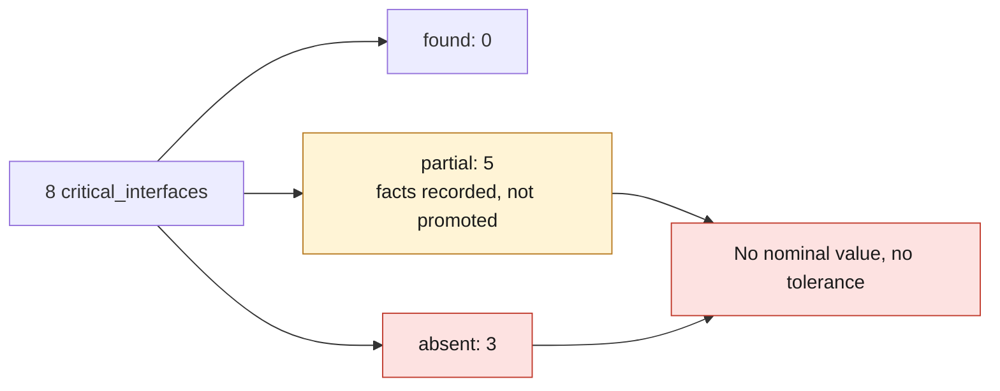

# M64 — G0, critical interface contract

September 14, 2026. Scope: the eight `critical_interfaces` of the
[M64 contract](../../twins/m64-cylinder-head/interface-contract.json), moved to
`schema_version` 2. Search limited to sources already present or cited in the
repository. Scan 935 private, SSH and Vast unavailable.

**Result: 0 interfaces found, 5 partial, 3 absent. No nominal value
or tolerance is filled in.** The partial facts are recorded in
`documented_partial_facts`, with `promoted_to_nominal: false`.

## Schema and validator extension

Each interface now carries `status` (`absent` / `partial` / `found`),
`source_locator`, `confidence` and `documented_partial_facts`. In schema v2,
`validate_interface_contract.py` rejects:

- a nominal value or tolerance without a recorded source, locator and confidence level;
- `found` without a nominal value **and** a tolerance;
- `partial` without a documented fact;
- an incomplete partial fact, one with an unrecorded source, or one promoted to a nominal value.

Two sources were recorded: M1 (993 Carrera manual, local register) and T1
(PCNA bulletin 9404). The manufacturing blockers remain unchanged.

## Table by interface

Confidence legend: *table* = structured table taken from the manual, page not reread;
*OCR* = OCR occurrence not reread; *TSB* = bulletin reread visually on September 7.

| Interface | Status | What the sources say | Source and locator | Applicability |
|---|---|---|---|---|
| main_stud_axes | partial | Studs BM 8 × 20 / BM 8 × 50; cylinder head tightening 20 Nm then 90° | P1 p.58 plate 103-00 items 5–6; M1 torques p.60 (*table*) | 964 M64.01/02/03; 993 Carrera. **No axis coordinates** |
| cylinder_register_diameter | absent | — The 100 mm bore (P3) does not define the register; the 145 mm surface (T1) is a repair dimension | — | — |
| cylinder_register_depth | absent | — | — | — |
| sealing_surface_definition | partial | Steel gasket 96410411520 placed in the groove of the **cylinder**; after repair: Ø 145 mm, removal of 0.10 ± 0.02 mm (0.20 mm maximum), 32 µin | T1 p.1, 3 and 4 fig. 4 (*TSB*) | Carrera 2/4 1989–1991 repair only; does not constitute the definition of the new sealing face |
| cam_carrier_axes | partial | Cam carriers / cylinder head in M8, 23 Nm; camshaft sprocket M12 × 1.5, 120 Nm | M1 torques p.60 (*table*) | 993 Carrera 2V; **no bearing axis or height** |
| oil_feed_and_return_interfaces | absent | Only lead: a screwed flange M24 × 1.5, on the **case** side and not the cylinder head | — | — |
| intake_and_exhaust_flange_interfaces | partial | Heat exchanger / cylinder head fastening at 28 Nm, thread not stated | M1 torques p.61 (*table*) | 993 Carrera; neither fastening pattern nor flange |
| seat_guide_and_spark_plug_interfaces | partial | Spark plug M14 × 1.25, 30 Nm; guide dimension "g" 8.00–8.015 mm; valve benchmark 40 / 33 mm | M1 torques p.60 (*table*); M1 p.153 l.17 (*OCR*); S2 p.4 | 993 Carrera 2V; Swindon 4V kit (third party). Neither axes, nor inclinations, nor interference fits |

Leads not retained: the [MAHLE register](../../twins/m64-cylinder-head/valve-module-documentary-references-20260907.json)
(Carrera 2V valves and generic seat interference tables) dimensions no
M64 Turbo cylinder head interface. Pages 152–157 of the manual remain unread
(copy not found, see the [register](M64_INTERFACE_SOURCE_REGISTER.md)).

## Physical measurements to take on a real cylinder head

Proposed datum system: **A** = cylinder head–cylinder sealing plane (3 probing
points), **B** = axis of the register/spigot of the cylinder considered, **C** = axis of the
front stud on the chain side. Measurements on a CMM at 20 ± 1 °C, part stabilized 4 h,
variant (engine number, M64.50/60) and condition (new/refaced) recorded,
3 repetitions. The target uncertainties (k = 2) are **metrology
objectives** and not design tolerances.

| Interface | Quantities | Instrument | Datum | Target uncertainty |
|---|---|---|---|---|
| main_stud_axes | XY position of each stud hole, diameter, perpendicularity to A, cylinder-to-cylinder center distances | CMM probe; plain plug gauges | A, B, C | ±0.02 mm position; ±0.01 mm Ø |
| cylinder_register_diameter | Ø of the spigot (mean, roundness, 4 heights) | CMM, or calibrated 3-point bore gauge | A, B | ±0.005 mm |
| cylinder_register_depth | Depth of the spigot relative to A; bottom radius or chamfer | CMM; dial indicator on surface plate | A | ±0.01 mm |
| sealing_surface_definition | Inner/outer Ø of the sealing face, flatness, Ra/Rz, any groove relief on the cylinder head side; cylinder groove as a complement | CMM; stylus profilometer (Lc 0.8 mm); straightedge and feeler gauges | A | Flatness ±0.005 mm; Ra ±10 %; Ø ±0.02 mm |
| cam_carrier_axes | Cam carrier seating plane (height and parallelism to A), M8 holes (position), projected bearing axis relative to B | CMM; real cam carrier fixture for the axis | A, B, C | ±0.02 mm height; ±0.02 mm axis |
| oil_feed_and_return_interfaces | Position, Ø and depth of the feed and return passages; seals | CMM; gauges; borescope; CT if accessible | A, C | ±0.05 mm position; ±0.05 mm Ø |
| intake_and_exhaust_flange_interfaces | Flange planes (orientation relative to A), stud pattern, port contour at the face | CMM; thread gauge pin; structured-light scan aligned on A/B/C for the contour | A, B, C | ±0.03 mm plane and studs; ±0.1 mm contour |
| seat_guide_and_spark_plug_interfaces | Axes and inclinations of the valves and the spark plug, seat and guide bore Ø (interference), seat height, spark plug depth and reach | CMM with pins in the guides; bore gauge; M14 × 1.25 gauge and depth gauge | A, B | ±0.05° angle; ±0.005 mm bore Ø; ±0.02 mm heights |

Each measurement will have to enter the register with instrument, calibration and
samples, in accordance with the [quality gates](../QUALITY_GATES.md). A measurement
of a production 2V cylinder head informs a mounting interface, **not** the
internal geometry of the new 4V cylinder head.
