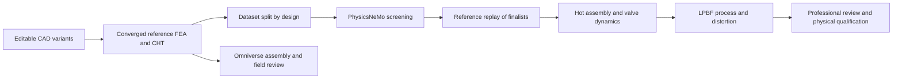

# M64 G10 — PhysicsNeMo field trial and the 0.040 mm stiffness target

This is a **fixed-geometry research pilot**, not a redesigned, hot-qualified or
print-authorized cylinder head. The trial uses the fresh G9 solutions, never the
quarantined historical carrier result.

## Result: trained and measured, not accepted as a design surrogate

**PhysicsNeMo really trained on the part's numerical fields. Both raw field
screens fail. All eight subsequent CUDA corrections pass.** No geometry was
changed and the support still exceeds 0.040 mm.

| Held-out fine-mesh load | Nodal L2 error | Maximum normalized nodal error | Worst journal vector error | Raw equation residual | Field screen |
|---|---:|---:|---:|---:|---|
| Lateral +x | 8.305% | 16.232% | 3.490% | 66.37 | Fail |
| Vertical -z | 3.353% | 13.858% | 2.220% | 31.68 | Fail |

The frozen 50,822-parameter network trained for 10,000 steps in **14.285 s**.
Prediction of both fields on 351,392 nodes took **0.0238 s**. Training used
146,174 medium-mesh nodes and checkpoint selection another 16,241 nodes on
that same mesh. No test-based retraining or threshold relaxation followed.
The cross-mesh errors combine approximation error and reference discretization
differences; they are not a measurement of physical model error.

FP64 CG then restores equation residuals <=**1.80e-10** and nodal-vector
agreement <=**3.73e-7** of maximum reference displacement. These are algebraic
checks against the same FE system, not independent physical validation.

| Load | Mean CG from zero | Mean CG from neural prediction | Observed change |
|---|---:|---:|---|
| +x | 7.403 s | 7.615 s | 2.86% slower |
| -z | 7.707 s | 7.099 s | 7.89% faster |

Each mean has two ABBA-ordered samples on the same host, not a statistical
performance qualification. One pair costs **29.02 s** including training,
inference and neural-start CG, versus **15.11 s** for zero-start CG alone;
both exclude common preprocessing. **No end-to-end acceleration is demonstrated
for this two-case lot.** For new loads on this unchanged linear system,
superposition of reference solutions is also a simpler competitor.

Decision: retain this bounded negative result; do not select a CAD change using
this model. First build and solve genuinely different braced-carrier variants,
then assess a geometry-conditioned PhysicsNeMo surrogate on held-out designs.
Changing model architecture or training schedule is a new experiment, not a
retroactive pass for this one. The 0.168073 mm reference motion is unchanged.

Evidence: [numerical receipt](../../twins/m64-cylinder-head/evidence/g10-physicsnemo-20260926/report.json),
[execution and cleanup](../../twins/m64-cylinder-head/evidence/g10-physicsnemo-20260926/execution.json),
[training/checking code](../../twins/m64-cylinder-head/source/fourvalve/g10_physicsnemo_field.py)
and [executed job shell](../../twins/m64-cylinder-head/source/fourvalve/g10_gpu_job.sh).

## What must change to reach 0.040 mm

[G9](M64_G9_REFERENCE_REQUALIFICATION_20260925.md) gives a maximum
force-weighted mean journal displacement of **0.168073 mm** for the isolated
outer carrier under the hypothetical lateral load. Reaching 0.040 mm at the
same load requires **4.2018 times its effective stiffness**. This is not the
maximum nodal displacement, and 0.040 mm is a project screening threshold, not
a sourced Porsche tolerance or a demonstrated machining capability.

1. **Define the datum and separate fits.** Distinguish journal-centre translation,
   axis rotation, shaft bending and relative alignment to the head. The current
   generic radial clearance is itself 0.040 mm. Locate/clamp the stationary
   rocker shaft; specify the rotating camshaft bearing separately with a hot
   lubrication clearance. Do not erase every clearance or sum unrelated maxima
   into a supposed engine prediction.
2. **Change the load path inside the retained envelope.** Compare a deeper bridge,
   diagonal ribs and a tied/closed carrier frame; retain access to bolts, oil
   galleries and moving rockers. Use native B-Rep interference checks before
   meshing. A pure rectangular bending beam would need a 1.614-fold increase in
   bending depth, or a span reduced to 0.620 of its former value, but these are
   scaling illustrations, not dimensions justified for this 3D carrier.
3. **Recompute the actual assembly.** Include head, caps, stationary shafts,
   screws, contact and preload. The fixed-foot G9 model omits these. Compare
   cold and hot relative motions, mesh refinement and load sensitivity; keep
   rejected cases. The G9 lateral carrier's 1.441% medium/fine journal change
   still fails its 1% mesh screen. A small equation residual does not repair it.
4. **Close the remaining physics and manufacturing gates.** Hot material cards,
   CHT, valve dynamics/contact loss, fatigue and a qualified LPBF process remain
   necessary. A support-stiffness pass alone cannot release this head.

## Actual PhysicsNeMo experiment

The official [linear-elasticity manual](https://github.com/NVIDIA/physicsnemo-sym/blob/main/docs/user_guide/foundational/linear_elasticity.rst)
describes differential/variational physics-informed methods and nondimensionalization.
The [FullyConnected API](https://github.com/NVIDIA/physicsnemo/blob/v2.2.0/physicsnemo/models/mlp/fully_connected.py)
provides the installed architecture used here. This trial deliberately selects
**supervised field approximation**, not the manual's separate PINN solver.

- Frozen G7 outer-carrier geometry, generic elastic material and fixed foot;
  two independent load directions (+x and -z).
- Train a real `physicsnemo.models.mlp.FullyConnected` on the **2 mm** G9 nodal
  fields; 10% of those nodes serve only for checkpoint selection.
- Open the **1.5 mm** mesh and its labels only after checkpoint selection.
  This is a held-out discretization of the same shape, **not** a held-out design
  or physical experiment. Coordinates and output scales use training data only.
- Four 128-wide layers, six displacement outputs, fixed seed, at most 10,000
  Adam steps/900 seconds. Multiply output by normalized height to impose zero
  displacement at the fixed foot. This does **not** impose force equilibrium.
- Predeclared field screens: nodal L2 error <=2%, maximum nodal vector error
  divided by maximum reference displacement <=5%, journal vector error <=1%.
- Measure `||Ku-f||/||f||` independently on the fine mesh. Run FP64 CUDA CG
  from both zero and the neural estimate, in ABBA order. Keep the unchanged
  reference gates: equation residual <=1e-8, nodal error <=1e-4.
- Charge inference, training and correction separately. A quick prediction is
  not a demonstrated end-to-end speedup. A failed field screen stays failed.

The reference remains numerically verified but not fully mesh-converged or
physically correlated. Even a successful interpolation cannot qualify a
geometry optimizer. The next geometry-learning campaign requires genuinely
different CAD variants, partitioned by **design** rather than by nearby nodes.

## Whole-stack execution path

| Tool | Required engineering contribution | Boundary |
|---|---|---|
| CadQuery/OCCT, editable STEP | Stiffeners, locating features, assembled keep-outs and machined surfaces | Preserve master interfaces and envelope; native solid checks |
| PicoGK/ShapeKernel | Candidate air/oil passage and local rib shapes in permitted volumes | Reconstruct/check B-Rep and voxel resolution; not a physics result |
| Gmsh + CalculiX | Reference stiffness, contact/preload, sequential thermal stress and fatigue inputs | Mesh convergence, balance checks, hot properties and load provenance |
| NVIDIA CUDA/CuPy | Independent algebraic cross-check and neural warm-start correction | Same FE assembly, not an independent physical model |
| NVIDIA PhysicsNeMo | This field trial; later design-surrogate screening of real CAE variants | Held-out designs, error gates, OOD rejection, solver replay of finalists |
| OpenFOAM CHT | Conduction into fins, external air distribution and oil passages | Mass/energy balances, fan/pump curves, thermal and flow refinement |
| ICengines/engine solver + Cantera | Valve motion, engine-cycle load scenarios, combustion thermochemistry | Verify the actual available executable; no invented `iceEngineFoam` alias |
| AdditiveFOAM + CalculiX | Local LPBF process/coupon study, then whole-build distortion/support removal | Qualified machine/material/process data; no melting-temperature cap hidden |
| NVIDIA OpenUSD/SimReady, ovstage/ovphysx/OVRTX | Units, assembly/kinematics, collision review and display of actual CAE fields | Rendering/rigid dynamics are not CHT, strength or process validation |
| ParaView/PyVista | Comparable fields, sections, error maps and traceable images | Same geometry SHA, units and load case |

## Execution receipt

The rented RTX PRO 6000 Blackwell exposes **97,887 MiB VRAM**, driver
580.95.05. The offer allocates **64 effective logical CPUs and 257,806 MB RAM**
on an AMD EPYC 7C13 host, with 500 GB disk. Host-visible memory is larger and
is not substituted for the offered allocation. The observed GPU peak is only
**1,792 MiB**, sampled every two seconds: ample capacity for this lot. This
does not size an as-yet unmeshed complete hot/contact/CFD assembly.

The first instance was automatically deleted after the 900-second image-load
limit; the same-host retry used the cache and ran successfully. A relative
guard-path invocation was also rejected before any paid creation. No security
or spending check was bypassed. The retained 34.624 GB image is pinned by digest.
The missing G8 metadata file required by the reused G9 import was added to the
private input bundle before training. CuPy 13.6.0 was installed in a separate
target directory; the image and existing packages were not rebuilt.

The first attempt's conservative elapsed-time/transfer bound is USD 0.787;
the retry's cap is USD 4: combined below the **USD 5** limit. The **observed
combined account debit is USD 0.598**, not a final provider invoice. Both
instances and both active destruction guards confirmed absence. Required
outputs were collected and SHA-256 verified before the successful worker was
deleted. No paid worker remains.

Model weights, full predicted fields and source matrices stay in private
`work/m64-g10-physicsnemo`; only code and numerical/provenance receipts are
published. The public report adds a terminal newline to the raw JSON without
changing its parsed content; both hashes are recorded. The reference archive,
software environment, executed shell and training history remain recoverable.
