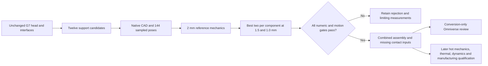

# M64 G11 — bounded support redesign toward 0.040 mm

This is a cold, generic-material, fixed-foot component study. It is not an
assembled engine, a hot-strength calculation or an additive-manufacturing release.

Execution checkpoint: native geometry and baseline replay are complete; the
bounded GPU campaign is running. No final mechanical selection is declared yet.

## Native geometry result

All **12/12** candidate supports pass the declared geometric checks, with
**144/144 sampled positions each** and no detected support-to-moving-part
interference. See the frozen [CAD receipt](../../twins/m64-cylinder-head/evidence/g11-support-stiffness-20260926/cad.json).
The two controls also reproduce the historical G7 STEP solids: symmetric B-Rep
differences are zero, with unchanged bounds; [independent comparison](../../twins/m64-cylinder-head/evidence/g11-support-stiffness-20260926/baseline-brep-comparison.json).

These are native CAD views of the baseline and the most reinforced outer candidate,
**not a selected or released design**. PNGs are rasterized from the native SVG
exports, not generated illustrations. The section crosses the intake journal;
other unsectioned features remain behind the cutting plane.

| Unchanged control | Candidate depth 30 / width 30 mm |
|---|---|
|  |  |


## Campaign definition

The reference is [G9](M64_G9_REFERENCE_REQUALIFICATION_20260925.md), not the
quarantined historical G8 field. [G10](M64_G10_PHYSICSNEMO_20260926.md) found
that the trained PhysicsNeMo field approximation was unsuitable for selecting
geometry changes. G11 therefore changes actual editable geometry and runs the
reference equations; it does not use the rejected neural model to rank designs.

The 0.040 mm screen measures the norm of the force-weighted mean journal
displacement, individually for intake/exhaust and lateral/vertical cases. It
does not mean maximum nodal motion, print resolution, physical accuracy or a
sourced Porsche tolerance. The 0.035 mm value is only a design-margin target.

| Family | Declared changes | Preserved |
|---|---|---|
| Nine positive-y outer supports | Bridge depths 18/24/30 mm × transverse widths 18/24/30 mm | Bridge top z=138 mm, 8 mm axial journals and positions |
| Three central diaphragms | Axial thickness 10/11/12 mm | Original transverse extent, journal axes and diameters |

The unchanged 18×18 outer support and 10 mm central diaphragm are the controls,
not two extra candidates. The head itself, nominal interfaces, oil tools and
moving-part geometry remain unchanged. The candidate generator does not let
outer-rib width silently widen the central diaphragm.

The 12 mm central wall leaves just **0.09375 mm nominal axial gap** on the exhaust
side. Collision-free sampling is not functional clearance qualification. The
negative-y support is not separately solved; a future combined assembly must
verify that side too, rather than silently assuming an accepted full assembly.

## Verification and acceptance

Native CAD checks cover valid connected solids, closed cavities using the B-Rep
exterior complement, unblocked connected oil-cutting tools including the return,
and static intersections. The packaging check uses the unchanged assembly's
bounding box; it is not a scan-deviation certificate or a new engine-fit claim.

The motion check tests each candidate against 27 moving parts at 144 crank
positions, from 0° to 715° in 5° steps. Cam and rocker transformations are checked
against native reconstruction. This is sampled candidate-to-moving-part collision
detection, not continuous swept-volume proof, deformable dynamics or a fresh
mobile-to-mobile clearance audit of the whole valvetrain.

The numerical campaign preserves G9's E=70,000 MPa, ν=0.33, fixed-foot restraint
and frozen forces. These are study hypotheses, not selected hot-alloy properties.
The mesher checks each declared journal's actual axial interval and area instead
of reusing the old hardcoded 10 mm central width.

- Screen all CAD-accepted designs at 2 mm with quadratic tetrahedra and both +x
  and −z loads. Rank worst journal motion, then material volume.
- Refine the two best designs per component at 1.5 and 1.0 mm; retain failures.
- Require ≤0.040 mm for every journal/case, ≤1% journal-vector change and ≤5%
  stress-p95 change between the finest two meshes. This stabilization test is
  not a quantified discretization-error bound; maximum stress remains unqualified.
- Require force/moment balance ≤1e-4, FP64 CUDA equation residual ≤1e-8 and
  CalculiX/CUDA nodal agreement ≤1e-4 of maximum reference motion. They share
  the FE stiffness system: agreement is not independent physical validation.
- Select the lowest-volume design among the refined passing candidates only.
  Missing, timed-out, numerically failed or unrefined cases never count as passing.

## Reproduction and failure handling

An [independent same-2-mm replay comparison](../../twins/m64-cylinder-head/evidence/g11-support-stiffness-20260926/baseline-replay-comparison.json)
finds a maximum journal-vector difference of **0.0754%** and stress-p95 difference
of **0.9048%** between the G11 controls and G9. Loads, material, fixed-foot planes
and bearing areas agree; independently generated mesh node counts differ. The
outer historical mesh has no previously published hash attestation: its area
check is explicitly a present-day reconstruction, corroborated against the
SHA-verified historical deck. This is a replay diagnostic, not a newly invented
acceptance threshold or a comparison with G9's finer mesh.

New sources preserve all SHA-pinned G7–G10 inputs. CAD outputs remain private;
source and compact evidence can be published without distributing raw scans.
The solver checkpoints complete cases with hashes of source, CAD, mesh identity
and solver artifacts. Resume rejects tampering or identity mismatch. Controller
interruption and timeout reap worker process groups, including solver children.

```sh
uv run --python 3.12 --no-project --with cadquery==2.6.1 python \
  twins/m64-cylinder-head/source/fourvalve/g11_cad.py --output NEW_CAD_DIRECTORY

python twins/m64-cylinder-head/source/fourvalve/g11_campaign.py \
  --cad NEW_CAD_DIRECTORY/receipt.json --output NEW_RESULTS_DIRECTORY \
  --backend cuda --deadline COLLECTION_RESERVE_EPOCH \
  --case-timeout 900 --reserve-seconds 180
```

The GPU shell bootstraps the pinned G9 numerical environment and preserved
CalculiX 2.21 runtime. A CUDA FP64 witness, native Gmsh initialization and focused
tests precede real solves. The computation deadline must precede the separately
armed billing guard, leaving time to collect and verify the private result archive.
The total user-authorized budget is USD 15; no automatic recharge is requested.

The [bounded collector](../../twins/m64-cylinder-head/source/fourvalve/g11_collect.py)
preserves the mesh, input decks, full DAT fields, DOF maps, result receipts and
logs. Only `matrix.sti` and `matrix.mas` are omitted, with their original sizes
and hashes inventoried. Lossless compression groups like file types and the
finished archive must fit **1.990 GB**, reserving 10 MB of the profile's 2 GB
outbound allowance for diagnostic traffic. Every retained file is hash-verified
from the downloaded archive without duplicating the uncompressed data locally.
The archive is **not directly checkpoint-resumable**: omitted matrices must be
regenerated and their original hashes checked before checkpoint reuse or a fresh
CUDA-residual audit. Original result fingerprints are never rewritten.

## Assembly and Omniverse handoff

[Assembly inputs](../../twins/m64-cylinder-head/source/fourvalve/g11_assembly_inputs.json)
explicitly leave contact, shaft retention, fastener preload, head restraints and
hot-property inputs unqualified. No script enlarges a shaft to close its nominal
0.040 mm radial gap. A linked-interface assembly, if later executed, is only an
optimistic hypothesis and must report its load-transfer definitions.

The installed NVIDIA CAD-to-SimReady workflow instructions were used to prepare
a **conversion-only** handoff: pinned preflight with Content Agents skipped,
official conversion reference, then minimum USD validation. This preparation is
not an executed Omniverse simulation or an automatically assigned material card.
No selected combined assembly is declared until both component gates pass and
combined geometry is checked.


