# M64 G12 — central-support FEA and rejected refinements

**Neither candidate demonstrates the 0.040 mm working displacement screen.**
Three mesh pairs pass the algebraic checks, two fail equilibrium, and the sixth
is not run because its prerequisite failed. The campaign is numerically
incomplete, no variant is selected, and the original results are preserved.
The archive and its **133 retained files are verified**. This is not a
manufacturing or engine-operation release.

## Results and decision

The [earlier CAD-only report](M64_G12_LOCAL_BUTTRESSES_20260926.md) established
geometric admissibility for two localized central supports. This campaign starts
their mechanical comparison; it does not retrospectively turn those CAD checks
into stiffness validation. Localized A is `centre_w11_local24_foot24_h40`;
localized B is `centre_w11_local28_foot30_h50`.

| Candidate | Mesh, mm | Nodes | Largest journal mean motion, +x, mm | Largest journal mean motion, −z, mm | Algebraic checks |
|---|---:|---:|---:|---:|---|
| Localized A | 2.0 | 81,341 | 0.061431 | 0.024926 | Both directions pass |
| Localized B | 2.0 | 90,695 | 0.056130 | 0.023835 | Both directions pass |
| Localized A | 1.5 | 173,496 | 0.061760 | 0.025114 | Both directions pass |
| Localized B | 1.5 | 196,914 | Not credited | Not credited | −z force and moment fail; no CUDA audit |
| Localized A | 1.0 | 529,357 | Not credited | Not credited | −z force fails; no CUDA audit |
| Localized B | 1.0 | — | Not run | Not run | Failed prerequisite |

The observable is the **norm of the load-weighted mean displacement vector of
each journal surface**, taking the larger journal for each direction. It is not
maximum nodal displacement, a printing tolerance or journal clearance. All three
available lateral-load values exceed 0.040 mm. The
[original campaign summary](../../twins/m64-cylinder-head/evidence/g12-fea-20260926/campaign.json)
has `complete: false`, no final mesh assessments and `selected_variant: null`.

Localized B at 1.5 mm is recorded as **failed, exit code 1**. Read-only inspection
locates the rejection in its −z case: relative force imbalance **0.00160025**
and normalized moment imbalance **0.000365993**, both above 0.0001. All node and
reaction records are present and finite; CalculiX reports normal completion.
The vertical force residual is −21.5002 N, far above the approximately 0.00402 N
cumulative last-printed-digit bound. Ordinary DAT rounding does not explain it.
The originating solver/assembly mechanism is still undetermined. CUDA checking
was not reached for this mesh; no result from it is credited. Its 1 mm refinement
is blocked by the failed prerequisite.

Localized A at 1 mm also fails in −z: force imbalance **0.000366881** exceeds
0.0001, while moment imbalance **0.0000576094** passes. Its vertical residual
is −4.66803 N, versus a cumulative last-digit bound of about 0.006664 N. Both
direct solves finish normally, in 568.665 and 574.980 seconds, below their
600-second limits; this is **not a timeout or missing-memory result**. Again,
the +x equilibrium check alone does not qualify this mesh pair. The two
[failed-case diagnostics](../../twins/m64-cylinder-head/evidence/g12-fea-20260926/local28-1p5-equilibrium-diagnostic.json)
[retain their exact guards and input/output fingerprints](../../twins/m64-cylinder-head/evidence/g12-fea-20260926/local24-1p0-equilibrium-diagnostic.json).

Across the six received directional cross-checks, the largest CUDA equation
residual is **1.051e-10** and the largest nodal-vector difference divided by
maximum direct displacement is **1.747e-7**. These are numerical agreement
metrics, not physical validation. The largest reported stress peak is
**215.083 MPa**; it is neither mesh-qualified nor compared with a qualified
material allowable.

### Supplemental equation diagnostic — original rejection confirmed

After verifying the original archive, a separate
[300-second bounded diagnostic](../../twins/m64-cylinder-head/source/fourvalve/g12_equilibrium_audit.sh)
copied B's rejected 1.5 mm INP/DAT files into a new directory, checked their
original SHA-256 values, and reused the unchanged G9 stiffness exporter and
CUDA audit. It did **not** rerun the static direct solution or overwrite the
original failed case. The job completed in about 40.4 seconds.

The [diagnostic receipt](../../twins/m64-cylinder-head/evidence/g12-fea-20260926/equation-diagnostic.json)
shows +x agreeing with the fresh matrix solution at **9.46e-8**, while −z
disagrees by **0.00205720 (0.2057%)**, over the 0.0001 comparison limit. The
rejected −z direct field has equation residual **0.0219487**, exceeding its
printed-DAT rounding bound **0.00944466**. CUDA solves the exported −z equations
to **9.99e-11** relative residual.

This establishes an algebraic inconsistency of the retained direct −z field
with the freshly exported matrix; it does **not** isolate the originating
assembly, solver or runtime mechanism. Neither CUDA equilibrium of the free
DOFs nor agreement for +x repairs the direct stresses/reactions or qualifies
the rejected mesh. The next numerical experiment should preserve the same
deck and compare bounded repeat direct solves and thread settings before any
new geometry selection. No corrected field has been substituted in G12.

The [independent receipt audit](../../twins/m64-cylinder-head/evidence/g12-fea-20260926/receipt-audit.json)
recomputes journal vector norms and changes using stdlib arithmetic after archive
verification. A's 2→1.5 mm maximum vector changes are **0.5335% (+x)** and
**0.7867% (−z)**; corresponding stress-p95 changes are **1.6840% / 2.1157%**.
This pair passes the selected-observable comparison but **cannot substitute
for the prescribed 1.5→1 mm comparison**, which is unavailable for both designs.

Relative to the retained G11 centre_w11 2 mm summary, the coarse maximum lateral
motions decrease from 0.068260 mm to 0.061431 / 0.056130 mm. That comparison
includes the larger ideal clamp area described below; it is not a demonstrated
gain in a real bolted assembly.

## Model and unchanged acceptance rules

The [G12 campaign](../../twins/m64-cylinder-head/source/fourvalve/g12_campaign.py)
admits only the two accepted STEP files pinned by the
[G12 CAD receipt](../../twins/m64-cylinder-head/evidence/g12-local-buttresses-20260926/cad.json).
It reuses the G11 mesher and [G9 numerical definitions](M64_G9_REFERENCE_REQUALIFICATION_20260925.md),
without changing the loads or mechanical gates:

- Generic cold isotropic elasticity: **E = 70,000 MPa, ν = 0.33**. This is not a
  selected alloy or a hot/process-qualified material card.
- Gmsh 4.12.1 quadratic tetrahedra; planned sizes **2, 1.5 and 1 mm** for each
  candidate. Journal bands remain 11 mm wide with unchanged axes and bores.
- Hypothetical central journal loads: **6,881.352 N intake and 6,702.484 N exhaust**,
  applied in separate +x and −z cases. These preserve the G7 reaction envelope,
  not measured, phase-resolved loads for a 700 hp engine.
- Force imbalance ≤1e-4; moment imbalance normalized by force ×100 mm ≤1e-4;
  CUDA residual ≤1e-8; nodal-vector difference normalized by maximum reference
  displacement ≤1e-4. The printed direct-DAT residual must remain within its
  rounding bound.
- Final comparison uses **1.5 versus 1 mm**: journal-vector change ≤1% and stress
  p95 change ≤5%, with every journal motion ≤0.040 mm. The 0.035 mm design-margin
  target stays separate. Missing or failed cases cannot satisfy these gates.

CalculiX 2.21 direct solutions are compared with CUDA/CuPy FP64 conjugate
gradient on the **same exported FE stiffness matrix**. This is another algebraic
solution method, not independently formulated physics; stresses and reactions
remain direct-solver outputs. The 1,800-second worker timeout is an execution
limit, not a relaxed physical or numerical threshold.

### Important boundary-condition limitation

The **entire widened bottom foot is fixed in XYZ**, including the inherited
approximately **0.625 mm² unsupported projected area**. The enlarged ideal clamp
therefore changes along with the geometry. Any apparent improvement cannot be
attributed solely to added material under a verified physical mounting condition.

The CAD projection places approximately 1,695.56 / 2,135.42 mm² over existing
head solid for A/B, versus 1,071.95 mm² for the 11 mm baseline. These figures come
from a 0.05 mm geometric slice, not contact-pressure analysis. Neither actual
head compliance, separation, friction, fastener preload, thread engagement,
shaft fit nor bearing load redistribution is resolved. A complete hot assembly
could behave differently. The outer supports are not recomputed in this lot.

## Where to investigate the next geometry

The [48-band displacement diagnostic](../../twins/m64-cylinder-head/evidence/g12-fea-20260926/local24-displacement-loadpath-diagnostic.json)
uses only the four qualified A displacement fields, with DAT/INP hashes checked
against the retained archive. Under +x at 1.5 mm, intake-side nodal mean Ux rises
from **0.025670 mm** at the buttress top to **0.040870 mm** just below the journal;
the same trend appears at 2 mm (0.025627→0.040480 mm). The exhaust-side increment
at 1.5 mm is approximately 0.0129 mm. The upper region also has nonzero residuals
after a least-squares small-rotation rigid fit.

These are **mesh-density-biased nodal statistics**, not area-weighted sections,
strain energy, a compliance decomposition or journal acceptance metrics. They
point to upper-wall and journal load transfer for further investigation, not
to a proven redesign. Diagnose the failed reference solutions first; then test
reinforcement only where the unchanged moving-part envelopes allow it. Further
foot enlargement alone is not an established route to 0.040 mm.

## Collected evidence

The durable supervisor ran live on owned instance 52763908, independently of
the interactive session and of the billing guard. It saved immutable JSON
snapshots, required a clean producer terminal marker and quiescence, then
downloaded and verified the archive before any deletion. Producer exit zero
means the bounded campaign ended cleanly, **not** that its designs passed.

The [verification receipt](../../twins/m64-cylinder-head/evidence/g12-fea-20260926/collection-verified.json)
records **133 verified retained files**, six omitted matrix files, and archive
SHA-256 `fe62eee7cbd3bc65cd30fd2acfea5d63b3468290d2a26f234e865a2513ee2df6`.
The archive is **319,028,560 bytes**. Only `matrix.sti` / `matrix.mas` are omitted;
their original hashes and sizes remain inventoried. DAT, INP, meshes, DOF maps,
available FRD, logs and producer provenance are retained privately. This is
**not directly checkpoint-resumable**, nor sufficient for a fresh matrix
residual calculation without regenerating and checking the omitted matrices.

The independent audit matches original result-level **and case-level** artifact
hashes to that verified inventory. A further 24 diagnostic artifact references
also match it. No scan, STEP, raw solver field, credential or account-balance
record is published. Compact unchanged receipts are linked here:
[A / 2 mm](../../twins/m64-cylinder-head/evidence/g12-fea-20260926/local24-2mm.json),
[B / 2 mm](../../twins/m64-cylinder-head/evidence/g12-fea-20260926/local28-2mm.json),
[A / 1.5 mm](../../twins/m64-cylinder-head/evidence/g12-fea-20260926/local24-1p5mm.json).

The supplemental [collection verification](../../twins/m64-cylinder-head/evidence/g12-fea-20260926/equation-collection-verified.json)
adds 16 retained files in 46,151,244 bytes, with two matrix files omitted under
the same explicit rule. Its [execution receipt](../../twins/m64-cylinder-head/evidence/g12-fea-20260926/equation-execution.json)
pins the script and generated artifacts. Both archives total **365,179,804
bytes**, below the cumulative 1.99 GB archive allocation. All diagnostic
artifact hashes were checked against the second verified inventory. Both
archives were verified **before** the owned worker was deleted.

## Compute, cost and cleanup

The [lifecycle receipt](../../twins/m64-cylinder-head/evidence/g12-fea-20260926/lifecycle.json)
records a Ryzen 9 5950X / 32 logical CPU allocation, approximately 128 GB RAM,
RTX PRO 4000 Blackwell 24 GB and 100 GB disk. CPU solve helpers stay at four
threads. CuPy 13.6.0 reports runtime 12090; the pinned CUDA wheel versions are
retained separately in the private environment record. No end-to-end speedup
claim is inferred from GPU kernel timings.

The displayed owned rate was **USD 0.317111/hour**. From manifest creation to
verified provider absence, plus the full declared transfer allocations, the
rounded conservative charge bound is **USD 0.26**; including the independent
USD 1 safety reserve gives **USD 1.26**, below the unchanged **USD 4 attempt
cap**. These are bounds, **not an invoice** or a shared-account balance delta.
The broader plan reserved USD 8.66 for prior attempts and USD 4 here, within
its USD 15 ceiling; this does not retroactively establish missing G11 billing.

Deletion and provider absence were verified at **15:24:32 UTC, 26 September
2026**. The independent guard also confirmed absence. Both exact temporary
launchd services were removed; the final provider inventory was empty.
`launchctl submit` restarted completed one-shot services before removal,
producing fail-closed rearming warnings preserved in the lifecycle receipt.
Those warnings are not hidden or confused with the successful absence proof.
No instance remains running for this campaign.

```mermaid
flowchart LR
    A[Two SHA-bound G12 STEP supports] --> B[Quadratic FE meshes]
    B --> C[CalculiX direct solution and stiffness export]
    C --> D[CUDA FP64 algebraic cross-check]
    D --> E[Mesh and 0.040 mm gates]
    E --> F[3 mesh pairs checked; 2 rejected; 1 not run]
    F --> G[Archive verified; no candidate selected]
    G --> H[Diagnose reference solver before further selection]
```



No PhysicsNeMo training, Omniverse validation, air/oil CHT, fatigue,
material-strength, LPBF or 700 hp performance test is claimed by this mechanical
lot. Printing and engine operation remain unauthorized.

Reproduce the receipt audit, with the verified private archive and snapshots:

```sh
python3 twins/m64-cylinder-head/source/fourvalve/g12_receipt_audit.py \
  --collection work/m64-g12-fea/supervisor --output NEW_AUDIT.json
```

Software verification: `make check` passes with **3,093 tests and 135 optional
skips** in the main suite, plus repository checks. The three G12 campaign tests
pass in the pinned numerical environment; four stdlib receipt/publication tests
pass, including exact-byte supplemental evidence hashes and preserved failures.
All 517 Markdown files have zero broken local links. These checks establish
software and evidence consistency, not physical qualification.
