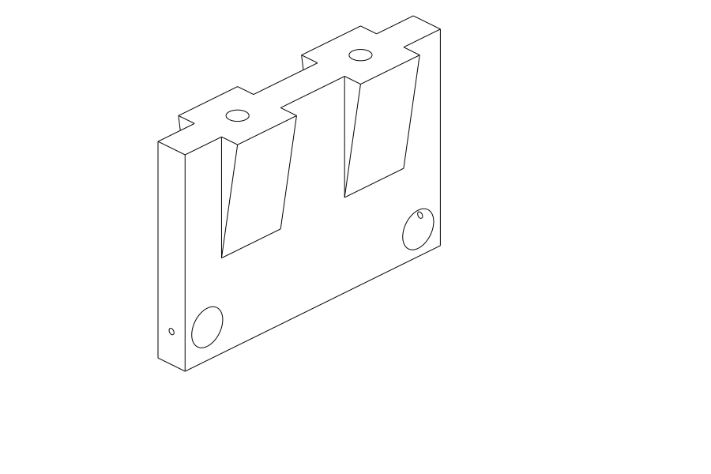
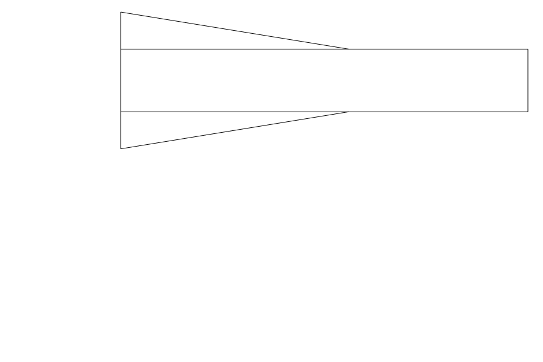
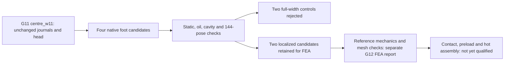

# M64 G12 — localized central-foot reinforcement

**Two localized candidates pass the declared native geometry checks.** This
report preserves the CAD-only stage; the subsequent paid mechanical campaign is
documented separately in the [G12 FEA report](M64_G12_FEA_20260926.md).
The unchanged G7 head is not released for printing or engine operation.

## Tested geometry

The [complete CAD receipt](../../twins/m64-cylinder-head/evidence/g12-local-buttresses-20260926/cad.json)
records four variants, including the two rejected full-width controls. It pins
the producer and unchanged G7/G11 inputs. Each support is checked against the
27 moving G7 components at **144 crank positions, 0°–715° in 5° steps**.

| Candidate | Lower-foot design variables | CAD outcome | Added volume versus centre_w11 |
|---|---|---|---:|
| Full-width control A | 24 mm base, 40 mm taper height | Rejected: spring-envelope interference | 26,969 mm³ |
| Full-width control B | 30 mm base, 50 mm taper height | Rejected: spring-envelope interference | 49,270 mm³ |
| Localized A | Two 24 mm x-spans around the existing mounts; 24 mm base, 40 mm height | Passes declared geometric checks | 12,480 mm³ |
| Localized B | Two 28 mm x-spans around the existing mounts; 30 mm base, 50 mm height | Passes declared geometric checks | 26,600 mm³ |

The dimensions above are explicit design hypotheses, not newly recovered Porsche
dimensions. The mounts stay at x=±25 mm; the reinforcement stops at x=±37/39 mm.
The added material remains respectively **4.5305 / 2.5305 mm** inside the
conservative spring x keep-outs. Both rejected controls interfere with all four
spring envelopes throughout the sampled cycle; maximum overlap is respectively
40.23 / 106.58 mm³. No moving-part volume was subtracted to force a pass.

The localized supports are valid single solids, with no detected enclosed cavity,
blocked existing oil path, static interference or sampled moving-part interference.
Upper journal bands stay **11 mm** wide; their axes, bores, existing fastener
holes, oil passages and the head are unchanged. The nominal exhaust rocker axial
gap remains **0.59375 mm**, not a qualified hot operating clearance.

## Native views — support only, not the complete head





These are rasterized native CAD exports, not generated product illustrations.
The section is at x=0, between the localized buttresses; the retained half also
shows geometry behind the cutting plane. Editable STEP files remain private.

## What this proves, and what it does not

The geometric footprint check projects a 0.05 mm foot slice onto the unchanged
head. Localized A/B project **1,695.56 / 2,135.42 mm²** onto existing head solid,
versus 1,071.95 mm² for centre_w11. A residual 0.625 mm² unsupported projection
is inherited from the baseline. This is not a contact-pressure, flatness,
fastener-preload or structural-bearing-area qualification.

Sampling is not continuous swept-volume proof, a fresh full mobile-to-mobile
audit, assembly-tool access proof, dynamic valve operation or physical fitment.
Added volume is not an established stiffness benefit. No new material selection,
thermal, fatigue, LPBF or Omniverse result is claimed. **0.040 mm remains
undemonstrated**, and the G11 finest-mesh results remain unavailable as documented
in the [delivery incident](M64_G11_SUPPORT_STIFFNESS_20260926.md).

The subsequent FEA compares these two accepted STEP solids using the unchanged
G9 forces, material and displacement definition. Its explicitly G12-bound job
and independent collection supervisor are described in the linked report; the
frozen G11 input gate still correctly rejects new variant identifiers.
Full contact/preload/hot assembly modelling remains a separate gate.



## Reproduction

```sh
uv run --python 3.12 --no-project --with cadquery==2.6.1 python \
  twins/m64-cylinder-head/source/fourvalve/g12_cad.py --output NEW_PRIVATE_DIRECTORY
uv run --python 3.12 --no-project --with cadquery==2.6.1 python \
  -m unittest discover -s tests -p test_m64_g12_cad.py -v
```

Outputs are written to a new directory. Source changes require a new receipt;
existing evidence must not be rewritten to match a changed implementation.

Verification: three focused tests pass with native CadQuery 2.6.1. The repository
`make check` passes (3,084 tests in its main suite, 135 optional skips, plus the
repository checks); all 516 Markdown files have zero broken local links. These
are software/evidence checks, not physical validation.
