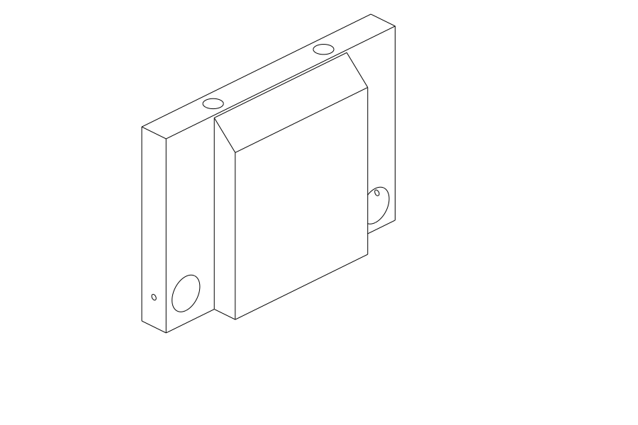
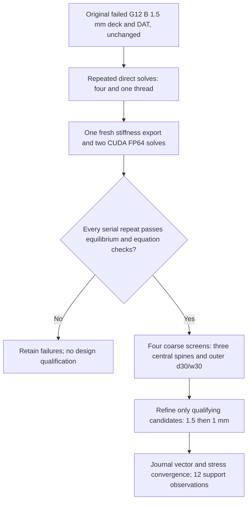

# M64 G13 — reference repair and unchanged-foot upper spines

The target remains **0.040 mm**, not a relaxed convergence threshold. It applies
here to the force-weighted journal displacement of isolated supports under the
two existing generic cold loads, **not** to scan accuracy, print tolerance, hot
assembled head deflection, or a manufacturing release.

## Geometry completed locally

Three native central-support candidates add a 60 mm-wide inner spine with
18, 24 or 30 mm axial thickness. The journal bands remain 11 mm. The first
1 mm of the foot retains the G11 geometry; a 9 mm transition introduces the
upper spine without enlarging the ideal fixed land. This is a deliberate
comparison with G11, not with the widened G12 feet. The transition's stress
and compliance still require FEA.

All three candidates passed the native solid, oil-path, enclosed-void,
assembly-envelope and interference screens, including 144 sampled positions
against the 27 existing moving components. Sampling does not establish
continuous dynamic clearance. The head, axes and interfaces are unchanged.

| Spine thickness | Solid volume, mm³ | Native CAD screen |
|---|---:|---|
| 18 mm | 101,609 | Passed |
| 24 mm | 125,358 | Passed |
| 30 mm | 149,106 | Passed |

The unchanged G11 central baseline is approximately 73,903 mm³. Added material
is a stiffness hypothesis, not an established optimum. Native preview and
section images show **only the central support**, not the complete cylinder head.

The [native CAD receipt](../../twins/m64-cylinder-head/evidence/g13-support-reference-20260926/cad.json)
has SHA-256 `15a3423be214ece6914e395742b73cb5b203b7e0dff7a4ee87007d2d8e714b95`.
The [archived STEP equivalence sidecar](../../twins/m64-cylinder-head/evidence/g13-support-reference-20260926/outer-original-step-equivalence.json)
has SHA-256 `35df6394c6576b00436392fbad300df7e788b62a49ad9daa60d9c07c2fbd1186`.

For the outer d30/w30 support, an independently constructed negative-y body
was compared with the reflected positive-y body, including fixed-land and
journal masks. Bidirectional boolean differences are zero at OCCT tolerances.
A separate STEP reimport also links this equivalence to the archived G11 STEP.
Independent volume integrations differ by about 0.0003002 mm³; that numerical
detail is retained rather than relabelled exact physical metrology.

The [local coarse-mesh preflight](../../twins/m64-cylinder-head/evidence/g13-support-reference-20260926/local-mesh.json)
passed all four 2 mm meshes on the Mac with Gmsh 4.12.1. Node counts are
89,540 /107,017 /122,502 for the three central spines and 177,846 for the outer
support. All sampled Gauss-point Jacobians are positive, journal weights sum
to one and no load/support overlap was found. These local meshes are not
substituted for the Linux campaign and contain no displacement solution.

## Numerical sequence

The reference replay preserves every outcome. A successful serial repeat is
not, by itself, proof of a SPOOLES race. All CalculiX thread selectors are
explicit, because specialized selectors override the general thread count.
See the [official CalculiX 2.21 manual, section 2](https://www.dhondt.de/ccx_2.21.pdf).
The frozen G8–G12 sources and their original results are not edited.

The scoped criteria are unchanged: force and moment equilibrium errors ≤1e−4;
CUDA FP64 residual ≤1e−8; direct/CUDA displacement agreement ≤1e−4;
1.5→1 mm journal-vector change ≤1% and p95 stress change ≤5%; final journal
motion ≤0.040 mm. The 0.035 mm coarse selection margin is a design preference,
not a substitute acceptance criterion. Material remains generic E=70 GPa,
ν=0.33; no hot allowable, fatigue life or 700 hp performance is inferred.

The complete scope is central + positive outer + negative outer, two journals
and two load directions: 12 displacement observations. A negative-y result can
only be transferred through the documented reflection under identical
isotropic material, reflected traction/fixed masks and the unchanged +x/−z
loads. This does not cover asymmetric hot or contact conditions.

## Execution limits

This continuation reserves at most USD 4 within the existing USD 15 plan:
8.66 historical conservative reservation +1.26 G12 reservation +4.00 G13
=13.92, leaving USD 1.08. These are conservative bounds, not provider invoices.
An independent ownership-checked guard must be running before rental.
Collection must finish and verify its archive before deletion; stopping a
container alone is not accepted as proof that billing ended.

No completed G13 FEA or 0.040 mm achievement is claimed by this preparation
record. The [G12 results and rejected reference fields](M64_G12_FEA_20260926.md)
remain the preceding measured numerical evidence. Engine start, manufacturing,
hot resistance, fatigue and complete assembled stiffness remain unauthorized.
