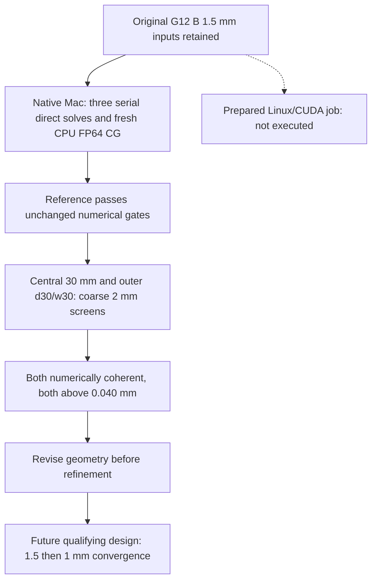

# M64 G13 — reference repair and unchanged-foot upper spines

The target remains **0.040 mm**, not a relaxed convergence threshold. It applies
here to the force-weighted journal displacement of isolated supports under the
two existing generic cold loads, **not** to scan accuracy, print tolerance, hot
assembled head deflection, or a manufacturing release.

## Geometry completed locally

Three native central-support candidates add a 60 mm-wide inner spine with
18, 24 or 30 mm axial thickness. The journal bands remain 11 mm. The first
1 mm of the foot retains the G11 geometry; a 9 mm transition introduces the
upper spine without enlarging the ideal fixed land. This is a deliberate
comparison with G11, not with the widened G12 feet. Only the 30 mm spine has
undergone the coarse native CPU FEA recorded below; the 18/24 mm spines remain
CAD-only candidates.

All three candidates passed the native solid, oil-path, enclosed-void,
assembly-envelope and interference screens, including 144 sampled positions
against the 27 existing moving components. Sampling does not establish
continuous dynamic clearance. The head, axes and interfaces are unchanged.

| Spine thickness | Solid volume, mm³ | Native CAD screen |
|---|---:|---|
| 18 mm | 101,609 | Passed |
| 24 mm | 125,358 | Passed |
| 30 mm | 149,106 | Passed |

The unchanged G11 central baseline is approximately 73,903 mm³. Added material
is a stiffness hypothesis, not an established optimum. Native preview and
section images show **only the central support**, not the complete cylinder head.

The [native CAD receipt](../../twins/m64-cylinder-head/evidence/g13-support-reference-20260926/cad.json)
has SHA-256 `15a3423be214ece6914e395742b73cb5b203b7e0dff7a4ee87007d2d8e714b95`.
The [archived STEP equivalence sidecar](../../twins/m64-cylinder-head/evidence/g13-support-reference-20260926/outer-original-step-equivalence.json)
has SHA-256 `35df6394c6576b00436392fbad300df7e788b62a49ad9daa60d9c07c2fbd1186`.

For the outer d30/w30 support, an independently constructed negative-y body
was compared with the reflected positive-y body, including fixed-land and
journal masks. Bidirectional boolean differences are zero at OCCT tolerances.
A separate STEP reimport also links this equivalence to the archived G11 STEP.
Independent volume integrations differ by about 0.0003002 mm³; that numerical
detail is retained rather than relabelled exact physical metrology.

The [local coarse-mesh preflight](../../twins/m64-cylinder-head/evidence/g13-support-reference-20260926/local-mesh.json)
passed all four 2 mm meshes on the Mac with Gmsh 4.12.1. Node counts are
89,540 /107,017 /122,502 for the three central spines and 177,846 for the outer
support. All sampled Gauss-point Jacobians are positive, journal weights sum
to one and no load/support overlap was found. These local meshes are not
substituted for the Linux campaign and contain no displacement solution.

## Numerical sequence

The reference replay preserves every outcome. A successful serial repeat is
not, by itself, proof of a SPOOLES race. All CalculiX thread selectors are
explicit, because specialized selectors override the general thread count.
See the [official CalculiX 2.21 manual, section 2](https://www.dhondt.de/ccx_2.21.pdf).
The frozen G8–G12 sources and their original results are not edited.

The scoped criteria are unchanged: force and moment equilibrium errors ≤1e−4;
CUDA FP64 residual ≤1e−8; direct/CUDA displacement agreement ≤1e−4;
1.5→1 mm journal-vector change ≤1% and p95 stress change ≤5%; final journal
motion ≤0.040 mm. The 0.035 mm coarse selection margin is a design preference,
not a substitute acceptance criterion. Material remains generic E=70 GPa,
ν=0.33; no hot allowable, fatigue life or 700 hp performance is inferred.

The complete scope is central + positive outer + negative outer, two journals
and two load directions: 12 displacement observations. A negative-y result can
only be transferred through the documented reflection under identical
isotropic material, reflected traction/fixed masks and the unchanged +x/−z
loads. This does not cover asymmetric hot or contact conditions.

## Execution limits

This continuation reserves at most USD 4 within the existing USD 15 plan:
8.66 historical conservative reservation +1.26 G12 reservation +4.00 G13
=13.92, leaving USD 1.08. These are conservative bounds, not provider invoices.
An independent ownership-checked guard must be running before rental.
Collection must finish and verify its archive before deletion; stopping a
container alone is not accepted as proof that billing ended.

At 16:16 UTC the [first Vast attempt remained unresolved](../../twins/m64-cylinder-head/evidence/g13-support-reference-20260926/vast-attempt-snapshot-1616.json).
The wrapper returned no contract ID and both launch and reconciliation failed
closed. Repeated inventories found no instance; that does not establish a
terminal rejection of the provider's creation request. No workload was uploaded
and no Vast calculation started. The USD 4 reservation remains intact; there
was no paid retry. A separate narrowly scoped watcher continues through the
manifest deadline plus five minutes, using the existing exact-ownership cleanup
helper if the late contract appears. It cannot rent or release the reservation.

Local software verification passed `make check`: 3,106 tests, 136 optional skips,
followed by the repository's other catalogue/document checks. The focused
numerical tests (five reference, six campaign) and two native CAD tests also
passed. Unit tests exercise control logic and do not manufacture FEA evidence.

A [bounded local x86-emulated fallback](../../twins/m64-cylinder-head/evidence/g13-support-reference-20260926/local-emulation-timeout.json)
then tried the 18 mm spine at 2 mm mesh size on the Mac. Its +x solve reached
the 480-second limit with an empty DAT; −z and the independent matrix check
were not started. The owned container was killed, waited for and removed;
`OOMKilled=false`. No displacement or strength result can be inferred from
that failed attempt, and Docker's memory settings were not changed.

A separate native macOS arm64 CalculiX 2.21 build passed a
[small analytical CPU witness](../../twins/m64-cylinder-head/evidence/g13-support-reference-20260926/native-smoke.json).
Its direct displacement error is approximately 3e−7 relative to the analytic
answer; the independent CPU CG residual is 1.14e−16. ARPACK's six tests passed.
This different binary and its libraries require their own project-reference
replay; neither this tiny nu=0 witness nor the successful compilation qualifies
the nu=0.33 support model or the prepared Linux/CUDA campaign. No system
dependency was installed or upgraded, and no frozen solver source was edited.

The exact [native replay source snapshot](../../twins/m64-cylinder-head/evidence/g13-support-reference-20260926/native-replay/reference.py)
and its [three guard tests](../../twins/m64-cylinder-head/evidence/g13-support-reference-20260926/native-replay/test_reference.py)
are retained without changing the executed source. To replay, copy both to
`work/m64-g13/native-fea/`; they depend on the separately fingerprinted private
input decks and native build inventory. This is an auditable evidence package,
not a self-contained public reproduction. The CPU runtime uses the same
numerical acceptance thresholds, with separately declared time limits; it
does not impersonate the frozen Linux/CUDA recipe.

The [native project-reference replay](../../twins/m64-cylinder-head/evidence/g13-support-reference-20260926/native-reference.json)
then completed in 822 seconds: both repeated −z solves and the +x control pass
the unchanged equilibrium, direct/CG agreement and DAT-rounding gates. The two
−z DAT files have identical hashes. Maximum relative force/moment imbalance
is 2.62e−9; direct/CG field disagreement is at most 1.73e−7. The two fresh CPU
CG residuals are approximately 1e−10. All six non-system dynamic libraries and
the executed binary were checked again after the run. Peak child RSS was
8.72 GiB; the separate controller peak was 2.70 GiB, not a simultaneous sum.

The **unchanged G12 B1.5 geometry still fails the displacement target**:
maximum force-weighted journal motion is 0.0564168 mm under +x, compared with
0.0240082 mm under −z. This replay repairs numerical trust, not the design.
The original rejected −z field remains rejected, with relative field error
0.0020572; the cause of that earlier failure is not established. Neither a
thread-race explanation nor a qualification of the different Linux/GPU runtime
is inferred from this native CPU success.

The separately reviewed [native candidate runner](../../twins/m64-cylinder-head/evidence/g13-support-reference-20260926/native-replay/candidate.py),
[two trust-boundary tests](../../twins/m64-cylinder-head/evidence/g13-support-reference-20260926/native-replay/test_candidate.py)
and [serial wrapper](../../twins/m64-cylinder-head/evidence/g13-support-reference-20260926/native-replay/serial-bin/ccx)
reuse the frozen CAD, meshing, direct-solve and matrix-audit helpers. Copy these
snapshots into the same private `native-fea/` directory, preserving the
`serial-bin/ccx` executable bit. The runner requires the successful native
reference and its retained artifacts; it does not accept a summary flag alone.
Each candidate has its own 1,800-second process-group deadline. A completed
process is not a numerical pass, and a single mesh cannot establish convergence.

## Completed native coarse screens

| Isolated support | Worst journal under +x, mm | Worst journal under −z, mm | Algebra/equilibrium | 0.040 mm screen |
|---|---:|---:|---|---|
| [Central spine 30](../../twins/m64-cylinder-head/evidence/g13-support-reference-20260926/central-t30-coarse.json) | 0.0472381 | 0.0224998 | Passed, both loads | Failed |
| [Outer d30/w30](../../twins/m64-cylinder-head/evidence/g13-support-reference-20260926/outer-d30-w30-coarse.json) | 0.0714206 | 0.0765097 | Passed, both loads | Failed |

These two independent case directories retain 64 checked artifacts. Both
direct solves per case agree with their separately solved fresh stiffness
matrix; CPU CG residuals are below 1.3e−10. Central and outer executions took
444 and 709 seconds respectively, running concurrently. The sampled aggregate
Python/CCX RSS peaked at 11.38 GiB (20-second samples, not a continuous peak).
All owned calculation process groups were absent after completion.

The outer −z load produces substantial transverse y displacement. Its intake
journal vector is [0.007504, −0.065878, −0.038177] mm, so inspecting +x alone
would miss the limiting response. Node-band observations suggest both upper
rib/frame linkage and out-of-plane compliance need attention; they are not an
energy decomposition or a causal proof. These failed coarse designs were not
promoted to a costly fine-mesh qualification. No G13 design reaches the target,
and no 1.5→1 mm convergence result is claimed.

The [original G12 results and rejected fields](M64_G12_FEA_20260926.md) remain
unchanged. Engine start, manufacturing, hot resistance, fatigue and complete
assembled stiffness remain unauthorized.
