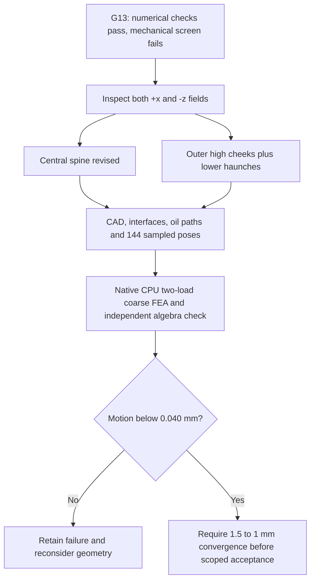
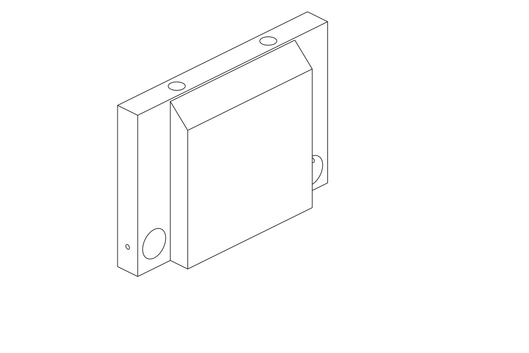
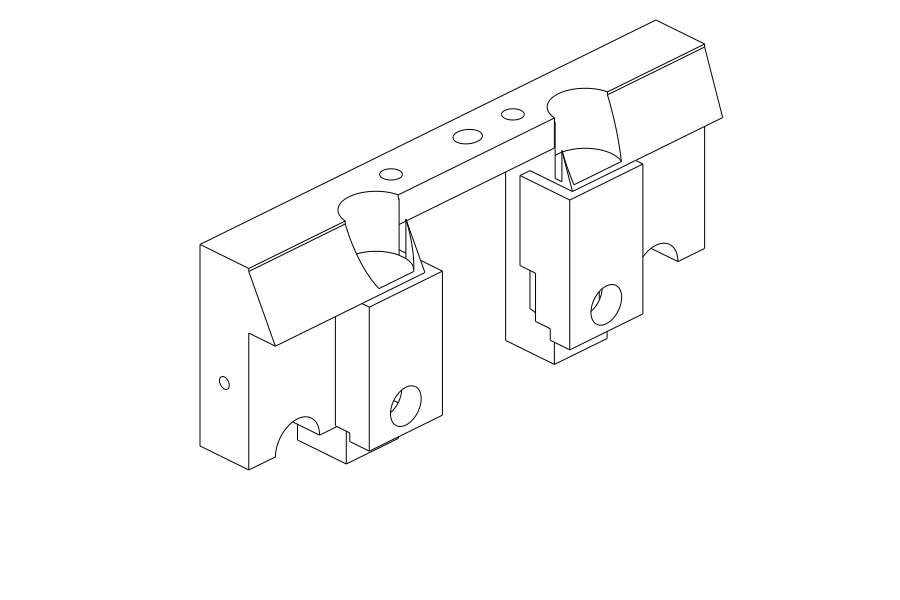
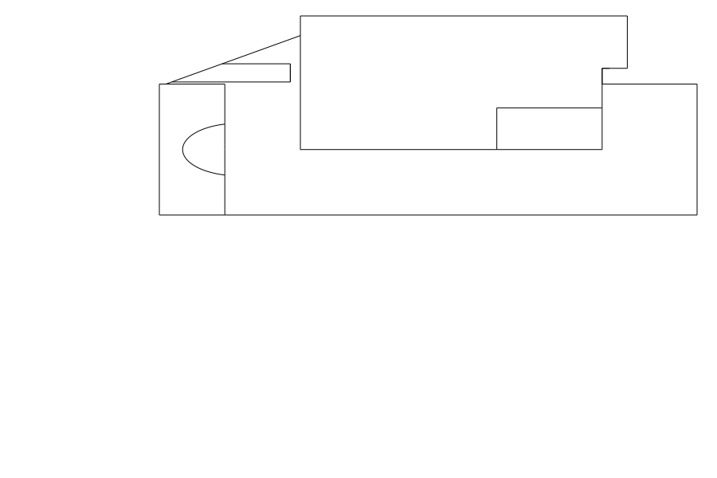
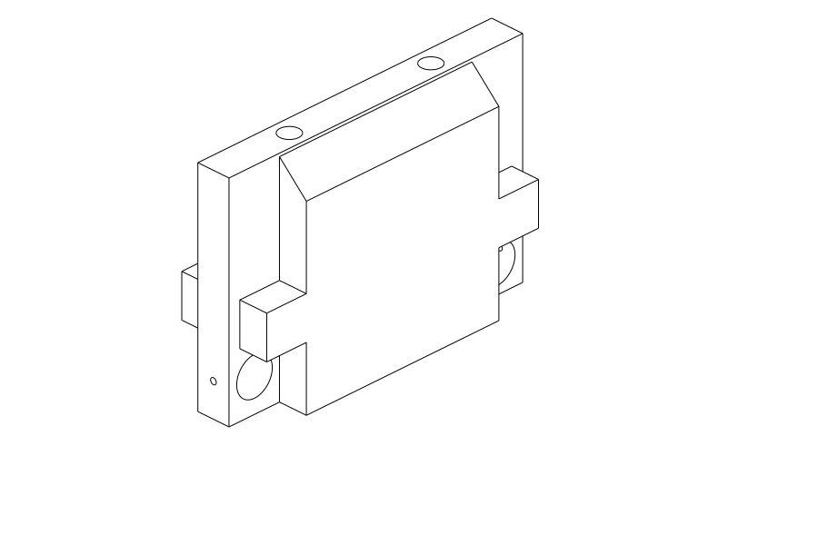
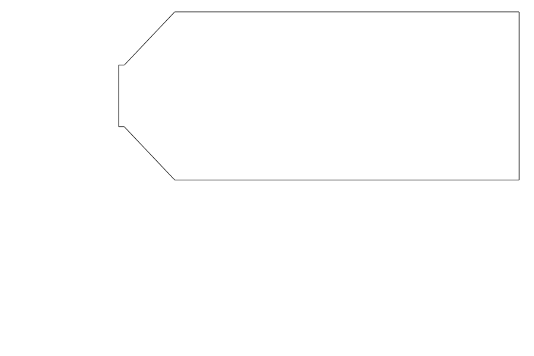

# M64 G14 — targeted support stiffening

The unchanged target is **0.040 mm force-weighted journal displacement** for
the isolated, generic cold-load screen. It is not a dimensional tolerance or
an authorization to print, assemble or start an engine.

## Why change the G13 design

The [verified G13 coarse calculations](M64_G13_SUPPORT_REFERENCE_20260926.md)
gave 0.047238 mm for the central support and 0.076510 mm for the outer support.
Both passed the direct/CPU-CG equation and equilibrium checks, but neither
passed the mechanical target. They were not refined or relabelled successful.

Node-band observations of the retained fields guide these hypotheses:

- Central: displacement grows through the height and near the terminal journal
  connections. Extend the inner spine towards these connections.
- Outer, +x: the upper rib moves substantially more than the adjacent frame.
  Add high cheeks between them, leaving the shaft neighbourhood clear.
- Outer, −z: much of the transverse y displacement is shared by the frame.
  Add lower haunches as well, rather than presuming the high cheeks solve it.

These are observations of nodal displacement, not an energy decomposition or
proof of a unique cause. Only subsequent FE calculations can establish gains.

## Native geometry evidence

| Candidate | Volume, mm³ | Geometric screen |
|---|---:|---|
| Central 70 mm full height | 161,640 | Rejected: four rocker-boss collisions |
| Central 68 mm full height | 159,133 | Passed, 144 poses |
| Central 70 mm with upper shoulder | 158,518 | Passed, 144 poses |
| Central 68 mm + local under-journal links | 166,581 | Passed, 144 poses; 2 mm stiffness target fails |
| Central 68 mm, spine width 40 mm | 203,991 | Passed, 144 poses; 2 mm stiffness target fails |
| Central width 40 mm, root transition 2 mm | 210,893 | Passed, 144 poses; FEA pending |
| Outer high cheeks, positive side | 204,787 | Passed, 144 poses |
| Outer high cheeks + lower haunches, positive side | 212,906 | Passed, 144 poses |
| Outer high cheeks + haunches extended to z137 | 231,816 | Passed, 144 poses; FEA pending |

All outer designs were independently constructed and checked on the negative
side too. Their whole-body reflected Boolean differences are zero at the
model's OCCT tolerance. This is not physical metrology.

The full-height 70 mm spine intersects the actual exhaust rocker boss by
3.606218 mm³ and the intake boss by 0.817849 mm³ per side. The failure is kept;
moving-component envelopes were not subtracted to disguise it. A separate
native regression check reproduces the collision and the accepted central
variants' unchanged first millimetre and journal neighbourhoods.

The complete first millimetre above the base, the fixed footprint, Ø12.58 mm
bores and 11/8 mm central/outer journal bands are preserved. Oil-tool paths and
the enclosed-void screens pass. All accepted shapes remain one native BRep
solid within the existing assembly envelope. The 144 rigid poses do not prove
continuous, deformable or hot running clearance.

Exact receipts: [initial CAD](../../twins/m64-cylinder-head/evidence/g14-targeted-supports-20260926/cad-v1.json),
[independent interface replay](../../twins/m64-cylinder-head/evidence/g14-targeted-supports-20260926/interface-v1.json),
[combined outer CAD](../../twins/m64-cylinder-head/evidence/g14-targeted-supports-20260926/cad-lower-v1.json).
The [two subsequent central hypotheses](../../twins/m64-cylinder-head/evidence/g14-targeted-supports-20260926/cad-central-v2.json)
add respectively 7,448 mm³ (4.68%) and 44,858 mm³ (28.19%) to the 68 mm spine.
Both preserve the full first millimetre, journal neighbourhoods and oil paths.
The two existing central-mount pilot tools have zero intersection with either
the baseline or the new material; complete tool approach remains unqualified.
Source and native test snapshots accompany them under `native-replay/`.
Restore these snapshots to `work/m64-g14/` to use their original relative paths;
the fingerprinted private inputs are still required. This is not a standalone
public reproduction package, and raw STEP/scan files are not published.

The next pair of hypotheses is a [shorter central root transition](../../twins/m64-cylinder-head/evidence/g14-targeted-supports-20260926/cad-central-root-v1.json)
and [outer haunches extended from z108 to z137](../../twins/m64-cylinder-head/evidence/g14-targeted-supports-20260926/cad-extended-v1.json).
They add respectively 6,902 mm³ and 18,910 mm³ to their immediate predecessors,
without altering the first millimetre, fixed land, journals or oil paths.
The central transition shortens from 9 to 2 mm; its steeper connection still
requires stress and convergence assessment. No gain is predicted from CAD alone.

The [three candidate support-support intersections](../../twins/m64-cylinder-head/evidence/g14-targeted-supports-20260926/combined-candidate-clearance-v1.json)
are zero. Identical individual 144-pose screens cover the unchanged moving
parts; the new check covers the three stationary support pairs. This is not a
minimum-clearance measurement, deformable/hot clearance or assembled FEA.

## Actual CAD views — isolated supports only

These are native CAD line views, not generated product concepts or stress maps.
The SVG exports are fingerprinted in the CAD receipts; PNGs were rendered with
`rsvg-convert 2.63.0`, white background. They do not show the complete head.

## Central 68 mm: completed coarse calculation

The [verified native CPU result](../../twins/m64-cylinder-head/evidence/g14-targeted-supports-20260926/central68-coarse.json)
uses 128,926 nodes and 84,755 quadratic tetrahedra at 2 mm. Both load cases pass
force/moment equilibrium and the independent FP64 CPU-CG equation check.
Both solvers use the same discretized elasticity problem; this is an algebraic
cross-check, not an independent physical model or experimental correlation.
The maximum force-weighted journal motion is **0.0439716 mm** under +x;
under −z it is 0.0209578 mm. Thus the unchanged **0.040 mm target fails**.
The roughly 7% decrease from G13 central t30 is not sufficient.

CG residuals are 1.012e-10 and 9.697e-11; maximum nodal disagreement divided by
maximum reference displacement is 1.163e-7 and 1.914e-7. The complete run took
483 seconds, and all 37 retained artifact fingerprints were checked. The
corresponding immutable native runner and guard tests are in `native-replay/fea/`.
The existing [G13 native runtime qualification](M64_G13_SUPPORT_REFERENCE_20260926.md)
is reused; no CUDA execution or material qualification is implied.

The combined outer 2 mm run [stopped at the 300-second CG limit](../../twins/m64-cylinder-head/evidence/g14-targeted-supports-20260926/outer-combined-cg-timeout.json).
Both direct load cases were executed and equilibrated, but their maximum
0.0589815 mm is **provisional**, not a numerically qualified result. All 36
retained artifact fingerprints match; the worker group is absent. The original
failure remains immutable. A separate retained-matrix audit with a 900-second
limit per RHS has started, keeping all numerical tolerances unchanged.

The [local under-journal links](../../twins/m64-cylinder-head/evidence/g14-targeted-supports-20260926/central-local-coarse.json)
also completed both numerical cross-checks: maximum motion **0.0433335 mm**,
only a 1.45% reduction from central68 for 4.68% added volume. The target still
fails. All 37 artifacts were verified; this run took 493 seconds.
The [width-40 comparator](../../twins/m64-cylinder-head/evidence/g14-targeted-supports-20260926/central40-coarse.json)
also passes both equation checks, but its **0.0412720 mm** maximum still exceeds
the target by 3.18%. Its 37 artifact fingerprints match; the run took 813 seconds.
No failed coarse candidate is promoted to convergence.

The next two candidates use a separately fingerprinted coarse-only CPU recipe:
900 seconds per CG RHS and a 3,600-second process-group deadline. Direct CCX
and matrix-export limits stay at 600 and 900 seconds. Loads, supports,
constitutive parameters, solver algorithm and acceptance tolerances are
unchanged. Four focused recipe tests and both real input checks pass; none of
these preparation checks is a candidate stiffness result.

Repository checkpoint: `make check` passed (3,107 main-suite tests, 136 optional
skips, plus the separate repository checks); 519 Markdown files have no broken
local links. These are software/provenance checks, not physical validation.

## Remaining gates

G14 target stiffness and 1.5→1 mm convergence are not established.
The fixed-land model remains idealized; generic E=70 GPa and nu=0.33 are not a
qualified hot material card. Thermal response, fatigue, contact/preload,
machining allowances, printing qualification and engine correlation remain
separate requirements.

The combined outer introduces no material inside the existing finite tool
reservations. However, the inherited base already intersects the two mount-tool
volumes by approximately 562 and 579 mm³. Those obstructions are explicitly
retained, not declared accessible or silently removed. Full machining and
assembly access therefore remains unresolved, independently of stiffness.
