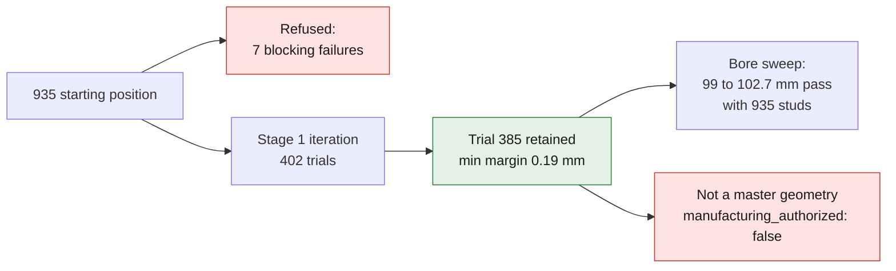

# M64 — G1, 4-valve / twin-spark twins, assembly and iteration

September 14, 2026. Code: [`fourvalve/`](../../twins/m64-cylinder-head/source/fourvalve/run.py);
parameters per component: [`params/`](../../twins/m64-cylinder-head/source/fourvalve/params/design_space.json);
evidence: [`evidence/g1-four-valve-20260914/`](../../twins/m64-cylinder-head/evidence/g1-four-valve-20260914/manifest.json);
tests: [`test_m64_g1_four_valve_twins.py`](../../tests/test_m64_g1_four_valve_twins.py).

**This is neither a master geometry nor a manufacturing authorization**
(`master_geometry: false`, `manufacturing_authorized: false`). The geometry is
synthetic: no scan mesh is imported. The 935 dimensions are numbers from the
interfaces JSON (level C, uncalibrated units ≈ mm). The previous G1 skeleton
(`parametric/`) stays in place, unchanged. This work extends it without
replacing it.

*XZ section generated from the G1 CAD of the retained configuration; a synthetic model, not a fitted M64 cylinder head or a printable part.*

## What is built

There are ten component twins. Each has its typed parameter file, its CAD
module (`cad/<component>.py`) and its STEP:

- cylinder head;
- intake valves ×2 and exhaust valves ×2;
- guides, inserted seats, retainers and collets;
- GSC5092 spring (envelope);
- camshafts and actuation;
- liner;
- piston with bowl and 4 pockets;
- gasket;
- studs.

The common frame is the sealing plane: Z toward the shafts, X intake < 0.
It is linked to the scan frame by x = −y_scan, y = −x_scan, z = −z_scan. Side 1
of the scan (axis 26.6°, high flange, throat 45.7) is **assigned** to intake:
this is a modeling choice.

The computation (`provenance`, `layout`, `kinematics`, `checks`, `iterate`)
depends only on numpy and runs in CI. The CAD and the BRep counter-check require
CadQuery.

## Provenance (fails closed)

Each value is rechecked against its source on every run:

- `sourced_m64`: path in the contract;
- `candidate_935_scan_C`: JSON path, explicit reduction and sign change, status C;
- `stock_993_2v_manual`: `page_checked` record;
- `supplier_swindon`: quotation present in the record and containing the value;
- `supplier_gsc5092`: field of `spring_candidates.json`.

A modified value or a removed source causes a refusal. An `unsourced` value
must carry a hypothesis and may cite no source. A `derived` value carries a
formula and its inputs, but no value. Only the iteration can produce
`derived_by_iteration`, with the trial number.

| Provenance | Count | Parameters |
|---|---:|---|
| `sourced_m64` | 2 | bore 100; stroke 76.4 (P3) |
| `candidate_935_scan_C` | 21 | spigot Ø113.423 × 2.21; studs 85.824 × 86.581, hole Ø10.879 (max); 935 angles 26.576 / 29.162; cam carrier face 86.461; flanges x −107.217 / +82.533, heights 47.53 / 35.54, exhaust port Ø39.99; spark plugs: angles 61.68 / 60.26 and axis vectors |
| `stock_993_2v_manual` | 9 | guides (head bore 13.0, OD 13.06, bore 8, protrusion 16.5, lengths E 55.4 / I 56.4); valve lengths 110.1 / 109; 45° seat — **2V witnesses** |
| `supplier_swindon` | 4 | heads 40 / 33; lifts 11.5 / 9.6 |
| `supplier_gsc5092` | 3 | installed height 40; max published lift 14.25; coil-bound length 24.18 |
| `derived` | 8 | y spacing of the pairs, roof ridge height, throats (0.85·Ø), spring pocket Ø, spring seats on the axis |
| `derived_by_iteration` | 17 | see "Retained configuration" |
| `unsourced` | 38 | design margins (bridge 3, wall 3, recess 1, piston clearances 1.5 / 2, coil reserve 1), spring OD 30, connecting rod 127 (V1), spark plug well Ø14, head thickness 6, block, cam, piston, gasket, stud shank Ø10 |

The Ø14 of the spark plug wells is a plain bore. It assumes M14 × 1.25, a
partial fact of the contract for the 993 Carrera. The apparent bore of the 935
(11.2–11.4) is smaller than the M14 minor diameter.

## Spigot and liner

With the 935 spigot (Ø113.42) and the M64 bore (100), a shoulder wall of
6.71 mm remains. The 935 stud holes encroach 1.2 mm on the spigot: the usable Ø
drops to 111.03. A wall of 5.42 mm then remains, 0.1 clearance deducted, above
the 4 mm hypothesis. It is **compatible under hypothesis**. The real OD of an
M64 liner is not sourced. The 935 counterbore (edge Ø94.3) corresponds to a
bore of about 95. With 100, its inner seat no longer exists in this model.

## Checks

There are 36 checks, 34 of them blocking. The piston and valve–valve distances
are computed over 720°: 2° step during the search, 1° for the result.
Each failure is reported as is: the 935 starting position is evaluated without
touch-up. The stud, port, pocket, guide and well recesses are capsules, which is
conservative for finite cylinders. The bridges are computed in projection on
the sealing plane. The piston–valve clearance is vertical and takes bowl and
pockets into account. The lift law is the V1 model's `CamLaw`, with the Swindon
lift and the assumed V1 centers (105° / 612°).

| Check | Threshold | 935 start | Retained | Margin |
|---|---|---:|---:|---:|
| heads within the bore (recess) | ≥ 1.0 | 1.90 | 1.66 | 0.66 |
| bridge int/int · exh/exh | ≥ 3.0 | 3.00 · 3.00 | 3.19 · 3.19 | **0.19** |
| bridge int/exh | ≥ 3.0 | 3.14 | 15.93 | 12.9 |
| head on its side of the ridge | ≥ 0 | 1.50 | 3.42 | 3.4 |
| spark plug well within the bore | ≥ 1.0 | 16.59 | 8.51 | 7.5 |
| bridge plug 1 / seats | ≥ 3.0 | **−3.67 fail** | 4.14 | 1.14 |
| bridge plug 2 / seats | ≥ 3.0 | **−7.36 fail** | 4.14 | 1.14 |
| bridge plug / plug · well wall | ≥ 3.0 | 33.7 · 35.5 | 53.9 · 53.9 | 50.9 |
| wells / ports | ≥ 3.0 | **−7.10 fail** | 8.50 | 5.5 |
| wells / studs | ≥ 3.0 | **−8.24 fail** | 18.49 | 15.5 |
| wells / spring pockets | ≥ 3.0 | **2.38 fail** | 25.09 | 22.1 |
| wells / guides | ≥ 3.0 | 5.94 | 22.11 | 19.1 |
| stud / bore | ≥ 3.0 | 5.52 | 5.52 | 2.5 |
| stud / ports | ≥ 3.0 | 3.61 | 3.20 | **0.20** |
| stud / spring pockets | ≥ 3.0 | **0.61 fail** | 4.58 | 1.58 |
| pockets exh/exh · int/int · int/exh | ≥ 3.0 | 4.0 · 11.0 · 59.0 | 4.19 · 11.19 · 80.5 | 1.19 |
| pocket floor / ports | ≥ 3.0 | 4.79 | 5.93 | 2.9 |
| spring seat below the cam carrier face | ≤ 86.46 | 65.9 | 75.3 | 11.2 |
| lift ≤ GSC5092 published lift | ≤ 14.25 | 11.5 | 11.5 | 2.75 |
| coil-bound reserve (40 − 11.5 − 24.18) | ≥ 1.0 | 4.32 | 4.32 | 3.3 |
| liner shoulder · usable Ø at studs | ≥ 4.0 | 6.71 · 5.42 | same | 1.42 |
| pockets in the crown · depth ≤ 5 | ≥ 3.0 | not applicable | 4.01 · 3.92 | 1.01 |
| cams: gap between lobes · above the face | ≥ 3 · ≥ 86.46 | 121 · 116 | 146 · 117 | 30 |
| valve–valve over the cycle | ≥ 1.0 | 2.68 | 11.48 (φ = 111°) | 10.5 |
| intake valve–piston | ≥ 1.5 | **1.48 fail** | 1.76 (φ = 2°) | **0.26** |
| exhaust valve–piston | ≥ 2.0 | 3.51 | 6.62 | 4.6 |
| head / top of liner at full lift | ≥ 1.0 | 3.42 | 4.04 | 3.0 |
| *indicative*: 11.5 and 9.6 simultaneous | ≥ 1.0 | 0 (contact) | 6.23 | — |
| *indicative*: contact in a bucket tappet | radius ≥ 18.8 | 15 fail | 15 fail | −3.8 |

**935 start: refused**, with 7 blocking failures. The 935 spark plugs come from
a 2-valve cylinder head: they land on the seats of a 4-valve layout (bridge down
to −7.4 mm) and cut through ports and studs. The intake spring pocket passes
0.6 mm from the stud. The intake piston clearance is 1.48 mm.

**BRep counter-check** (`BRepExtrema_DistShapeShape`) at the worst angles, on
the retained configuration:

- intake valve–piston: 1.755 / 1.757 / 1.765 / 1.770, identical to the analytic calculation;
- exhaust valve–piston: 6.616 to 6.629, identical;
- valve–valve at φ = 111°: BRep 11.424 against 11.478 analytic.

The sampling therefore overestimates the distance by about 0.05 mm; the BRep is
authoritative and remains blocking. `BRepCheck_Analyzer` validates the 31
parts. The cylinder head is a single solid of 1,651,403 mm³, with no physical
meaning since the block is not sourced.

## Iteration

The search is deterministic. The 935 seed fixes 160 draws within the bounds,
then 240 coordinate-search evaluations with the step halved. The 402 trials are
logged in `iteration-history.json`. Two runs give the same history.

Stage 1 uses only unsourced variables: valve angles and spacings, position and
tilt of the spark plugs (mirrored in y), pocket depth, cam timing ±10°, valve
length. **Stage 1 was enough**: 104 trials accepted, the first at trial 260.
The bore (stage 2) and the valve diameters (stage 3) were not opened. No M64,
manual or supplier value was modified.

The most frequent limiting constraints among the refused trials are:

- plug–seats bridge (64);
- wells–ports (48);
- wall between wells (26);
- stud–ports (26);
- spark plugs or heads outside the bore (23 each).

### Retained configuration (trial 385, minimum margin 0.19 mm)

| Variable | Start | Retained |
|---|---:|---:|
| intake axis angle | 26.58° (935) | 33.38° |
| exhaust axis angle | 29.16° (935) | 24.62° |
| x of intake / exhaust head center | −19.39 / +15.91 | −20.12 / +27.40 |
| additional spacing within a pair | 0 | 0.19 |
| spark plugs at the plane (x, ±y) | (15.94; 20.27) and (−8.66; −20.38) | (2.88; ±32.49) |
| spark plug tilt / azimuth | 28.3° / 154.5° and 29.7° / −23.6° | 6.9° / ±30.1° |
| piston pocket depth | 0 | 3.92 |
| intake / exhaust cam advance | 0 / 0 | −5.71° (retard) / +0.73° |
| valve length difference vs 993 | 0 | +7.44 |

The two spark plugs are almost vertical, near the roof ridge, between the heads
of each pair, at y = ±32.5. The exhaust was moved outward.

## Bore sweep ("a larger bore is needed")

[`bore_sweep.py`](../../twins/m64-cylinder-head/source/fourvalve/bore_sweep.py) →
[`bore-sweep.json`](../../twins/m64-cylinder-head/evidence/g1-four-valve-20260914/bore-sweep.json).
The sweep covers 13 bores from 95 to 106 mm, with 5,535 trials logged.

For each bore, the stage 1 search is rerun: 80 draws and 200 local
evaluations, bore fixed, warm start from the accepted neighbor.
The 935 stud pattern is tried first. If the bore fails, the stud spacing is
freed (`derived_by_iteration`). Reported consequence: **case and cylinders not
M64-compatible**.

The 95–102.7 band is the documented range of the Swindon kit. Beyond it, up to
106, each trial is marked `exploratory_beyond_sources`. The displacement is
computed over 6 cylinders with the stroke of 76.4 (P3).

New checks become limiting with a large bore:

- **Spigot Ø vs required liner OD**: spigot Ø 113.42 (935 candidate)
  ≥ bore + 2 × 4 (assumed wall) + 2 × 0.1.
- **Required liner OD vs stud holes**: the free Ø between the stud holes is
  2 × (60.95 − 5.44) = 111.03 with the 935 pattern.
- **Bridge between neighboring cylinders**: `not_computable`. No M64 cylinder
  spacing is sourced; the only spacing in the repository is 917/Type 912 at
  118 mm, level C, not transferable.

| Bore | Band | Displacement cm³ | 935 studs | Margin / limiting constraint | Free studs (not M64) |
|---:|---|---:|---|---|---|
| 95 | doc. | 3,249 | refused | −0.35 heads outside bore | refused −0.52 heads outside bore |
| 96 | doc. | 3,318 | refused | −0.20 exhaust valve–piston clearance | refused −0.38 |
| 97 | doc. | 3,388 | refused | −0.13 exhaust valve–piston clearance | refused −0.14 |
| 98 | doc. | 3,458 | refused | −0.13 exhaust valve–piston clearance | refused −0.13 |
| **99** | doc. | 3,529 | **passes** | +0.19 int/int bridge | — |
| 100 | doc. (M64) | 3,600 | passes | +0.19 int/int bridge | — |
| 101 | doc. | 3,673 | passes | +0.19 int/int bridge | — |
| 102 | doc. | 3,746 | passes | +0.19 int/int bridge | — |
| **102.7** | doc. | 3,797 | **passes** | +0.13 liner / stud holes | — |
| 103 | **exploratory** | 3,820 | refused | −0.17 liner / stud holes | passes +0.32 (studs 85.8 × 94.1) |
| 104 | **exploratory** | 3,894 | refused | −1.17 liner / stud holes | passes +0.32 (93.3 × 94.1) |
| **105** | **exploratory** | 3,969 | refused | −2.17 liner / stud holes | **passes** +0.22 (93.3 × 94.1) |
| 106 | **exploratory** | 4,045 | refused | −3.17 liner / stud holes | refused −0.78 spigot Ø < required liner Ø |

**Bore ranges that pass:**

- **935 stud pattern**: from **99 to 102.7 mm**, i.e. 3,529 to 3,797 cm³.
  - Low side: first refusal at 98 mm, limited by the exhaust valve–piston
    clearance (−0.13). At 95 mm, it is the heads outside the bore.
  - High side: first refusal at 103 mm, limited by the liner wall toward the
    stud holes (−0.17). Analytic limit: bore ≤ 111.03 − 8.2 = 102.83.
- **Spread studs** (outside M64, exploratory): up to **105 mm**, i.e. 3,969 cm³.
  - At 106 mm, the Ø113.42 935 spigot becomes smaller than the required liner
    (114.2).
  - Going beyond also requires abandoning the 935 candidate spigot.

The smallest bore that passes is **99 mm**. The largest that stays within the
documented band and the 935 pattern is **102.7 mm**, i.e. 3,797 cm³ (+5.5% over
100). The 0.13 mm margin there rests on the hypotheses of a 4 mm wall and a
0.1 clearance. The bridge between cylinders remains not computable for lack of
a sourced M64 spacing; it is **the check that is missing to validate a large
bore on a real block**.

## What is blocking or remains hypothetical

1. **The retained margins are thin and rest on hypotheses.** Bridge of 3.0
   between seats (margin 0.19), stud–port wall 3.0 (margin 0.20), piston
   clearance 1.5 (margin 0.26): all `unsourced`. Reassessed without a new
   iteration, the configuration still passes with a 3.25 mm bridge (margin
   0.10). At 3.5 mm, it fails on the stud–port wall (−0.007), because the pairs
   move apart.
2. The OD of the GSC5092 is not published (30 assumed). It sets the Ø of the
   pockets, hence the stud/pocket (1.58) and exh/exh (1.19) walls.
3. The actuation is a **rocker** reduced to an axial stack. A bucket tappet
   would require Ø ≥ 39.7 for the V1 law (a value consistent with the Ø39.2 of
   the 935). It cannot be fitted here between the studs and within the exhaust
   pair.
4. The V1 law and timing are assumed (durations, centers, ramps). The retained
   timing retards the intake by 5.7° to gain piston clearance.
5. Several dimensions are only C candidates from a 2-valve 935, not
   transferable to an M64: studs, spigot, cam carrier face, flanges. Cylinder
   spacing, block, oil passages, lateral exit of the spark plug wells and
   cooling are not modeled.
6. The bridges are projected and the ports are straight cylinders. The
   compression ratio, the loads and the thermal behavior are not computed.

## Outputs

STEPs under 1 MB committed to the repository: cylinder head (640 KB), valves,
guides, seats and retainers, springs, liner, piston, gasket, studs. Added to
these are an XZ section as SVG, the resolved parameters, the checks, the
history and the manifest with SHA-256 digests (inputs, sources, generators,
outputs).

Two files exceed 1 MB and stay **outside the repository**, in
`/home/maxime/m64-local-artifacts/g1-four-valve-20260914/`: camshafts (1.01 MB)
and assembly at φ = 0 (2.0 MB). Their digests are in the manifest. The STEP
headers are timestamped, so the STEP digests change on every regeneration.

Reproduction:
`uv run --no-project --with cadquery --with numpy python twins/m64-cylinder-head/source/fourvalve/run.py twins/m64-cylinder-head/evidence/g1-four-valve-20260914 --external-dir <outside-repository>`
(exit code 2 if the configuration is refused; `--no-cad` for the computation only).
