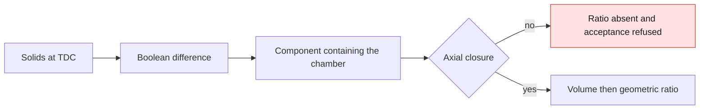

# M64 G2 — fixing the clearance volume calculation

Resumed from `main` at `139200b41d01ec0c594a30b3446d0ea395d88f4e` (PR #71).
**No geometry modified, no Vast spending. The compression ratio remains undetermined.**

## Verified result

The calculation published on September 16 did not measure only the gas enclosed in the chamber.
It subtracted the sum of the intersections of the parts with an artificial cylinder. It thus
counted port voids separate from the chamber and subtracted the seat/valve overlaps twice.
In addition, the spark plugs are not present among the closing parts.

On **the same parameters and the same solids**, only the height of the measuring cylinder varies:

| Margin above the roof | Old announced clearance volume | Old announced ratio |
|---|---:|---:|
| 2 mm | 133.068 cm³ | 5.509 |
| 5 mm | 147.004 cm³ | 5.082 |
| 10 mm | 168.677 cm³ | 4.557 |

These ratios are results of the erroneous calculation, not performance figures. An arbitrary
window cannot determine the engine's ratio. The previous conclusion "8–9 out of reach" must be
reassessed after closing and a new measurement. A failed local search is not proof of
impossibility over the whole design domain either.

## Fix

`assembly.chamber_volume` subtracts the solids by boolean operation, then selects only the
component containing a chamber point above the crown. It checks BRep validity, the uniqueness of
this component and the absence of contact with the artificial axial limits.
The probe goes down below the deepest of the pockets or the bowl, instead of truncating deep pockets.
The radial piston/liner crevice below the crown is explicitly excluded, its geometry not being
defined. This choice will have to be replaced by the real rings and volumes when they are designed.

Result on the published G2:

- cylinder head still valid, **1 solid, 399 faces**;
- **38.085 cm³** of disconnected voids excluded;
- component containing the chamber: **95.715 cm³**, a diagnostic volume **still open**, hence
  unusable to announce a ratio;
- `status = blocked_unsealed_chamber`, contact with the upper limit;
- `clearance_volume_cc = null`, `compression_ratio = null` and acceptance refused.

The acceptance check now handles this result without crashing or accepting the part.
A G2 `--no-cad` run cannot bypass the compression measurement.
The calibration of the historical proxy remains a ranking heuristic; it must be recalibrated
only after a closed chamber is obtained. The 8–9 bounds remain design hypotheses.



## Evidence and reproduction

[Measurements and SHA-256 digests](../../twins/m64-cylinder-head/evidence/g2-compression-audit-20260924/audit.json).
The following section comes from the G2 CAD kernel, without modifying the part:


*CAD section of the G2 head used for the audit; it does not prove a sealed chamber or a qualified part.*

```sh
uv run --python 3.12 --no-project --with cadquery==2.6.1 python \
  twins/m64-cylinder-head/source/fourvalve/audit_compression.py \
  twins/m64-cylinder-head/evidence/g2-head-features-20260916/parameters-resolved.json \
  work/m64-g2-compression-audit-replay
uv run --python 3.12 --no-project --with cadquery==2.6.1 python \
  tests/test_m64_g2_head_features.py -v
make check
```

The script refuses an existing output directory. The audit also publishes the boolean validity
of each trial; no window-dependent historical value is accepted.
The tests confront the calculation with a closed 16 mm³ cavity, a separate 1 mm³ void, overlapping
occupying solids and an artificial leak, then with the repository's real G2.
API used: [CadQuery boolean operations and solid classification](https://cadquery.readthedocs.io/en/latest/classreference.html).

Checks run: **13 G2 tests and 21 G1 tests passed with CadQuery 2.6.1**, report digests
verified. `make check` was run and stops on the stale F46 preparation report
(`917-f46-vast-controller-check`). This failure is already present on `main` before this change:
[CI of the starting commit](https://github.com/cluster2600/porscheparts/actions/runs/35085578047).
The present fix modifies neither this historical report nor its contract.

## Technical follow-up

Follow-up done: [candidate spark plugs, stepped wells and new chamber measurement](M64_G2_SPARK_PLUG_PACKAGING_20260924.md).
The results of this first fix above remain those of commit `f4cfddb`, without spark plugs.

1. Model the spark plugs and their seats, then verify the closure of the valve seats with the valves
   closed. Do not add digital plugs to make the check pass.
2. Define the volume below the rings and verify that the connected volume is independent of the
   measurement window; then recompute the ratio and recalibrate the proxy.
3. Resume the chamber optimization and the flow/thermal calculations on this geometry.

This axial closure check is a local prerequisite: it validates neither the M64 interfaces,
nor physical sealing, nor thermal behavior, nor the 700 hp, nor metal printing.
